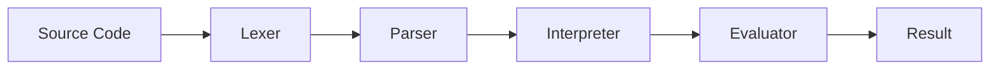

# GocciaScript


A drop of JavaScript — A subset of ECMAScript 2020 implemented in FreePascal.

GocciaScript includes the parts of JavaScript that lead to clear, predictable, and secure code. Features that are error-prone, redundant, or security risks are intentionally excluded. See [Language Restrictions](docs/language-restrictions.md) for the full rationale.

## Features

### Language Features

- **Variables**: `let` and `const` declarations (no `var`)
- **Functions**: Arrow functions only (no `function` keyword)
- **Classes**: Full class support with private fields (`#field`), static methods, getters/setters, and inheritance
- **Equality**: Strict equality only (`===` / `!==`)
- **Strict Mode**: Implicit — all code runs in strict mode
- **Template Literals**: String interpolation with `${expression}`
- **Destructuring**: Array and object destructuring patterns
- **Spread/Rest**: `...` operator for arrays, objects, and function parameters
- **Modules**: ES6-style `import`/`export`
- **No `eval`**: Excluded for security
- **No `arguments`**: Use rest parameters (`...args`) instead

### ES6+ Features

- Template strings with interpolation
- Object shorthand properties and methods
- Computed property names
- Nullish coalescing (`??`)
- Optional chaining (`?.`)
- Arrow function expressions
- Rest parameters (`...args`)
- Unicode escape sequences (`\uXXXX`, `\u{XXXXX}`, `\xHH`)
- Function `length` and `name` properties
- `Object.freeze`, `Object.isFrozen`
- `Array.from`, `Array.of`, `Number.MAX_SAFE_INTEGER`, `Number.EPSILON`, `Number.isSafeInteger`

### ECMAScript 2020+ Implementations

- `Math.clamp` (TC39 proposal)
- Private fields, methods, getters, and setters in classes
- `Object.hasOwn`, `Object.fromEntries`
- `Array.prototype.at`, `Array.prototype.sort`, `Array.prototype.splice`, `Array.prototype.fill`

### Built-in Objects

`console`, `Math`, `JSON`, `Object`, `Array`, `Number`, `String`, `Symbol`, `Set`, `Map`, plus error constructors (`Error`, `TypeError`, `ReferenceError`, `RangeError`).

See [Built-in Objects](docs/built-ins.md) for the complete API reference.

## Example

```javascript
class CoffeeShop {
  #name = "Goccia Coffee";
  #beans = ["Arabica", "Robusta", "Ethiopian"];
  #prices = { espresso: 2.5, latte: 4.0, cappuccino: 3.75 };

  getMenu() {
    return this.#beans.map((bean) => `${bean} blend`);
  }

  calculateTotal(order) {
    return order.reduce((total, item) => total + (this.#prices[item] ?? 0), 0);
  }

  get name() {
    return this.#name;
  }
}

const shop = new CoffeeShop();
const order = ["espresso", "latte"];
const total = shop.calculateTotal(order);

console.log(`Welcome to ${shop.name}!`);
console.log(`Your order total: $${total.toFixed(2)}`);
```

## Getting Started

### Prerequisites

- [FreePascal](https://www.freepascal.org/) compiler (`fpc`)
  - macOS: `brew install fpc`
  - Ubuntu/Debian: `sudo apt-get install fpc`
  - Windows: `choco install freepascal`

### Build

```bash
# Build everything
./build.pas

# Build specific components
./build.pas loader           # Script executor
./build.pas repl             # Interactive REPL
./build.pas testrunner       # Test runner
./build.pas benchmarkrunner  # Benchmark runner
```

### Run a Script

```bash
./build.pas loader && ./build/ScriptLoader example.js
```

### Start the REPL

```bash
./build.pas repl && ./build/REPL
```

### Run Tests

```bash
# Run all tests (GocciaScript TestRunner)
./build.pas testrunner && ./build/TestRunner tests

# Run a specific test
./build.pas testrunner && ./build/TestRunner tests/language/expressions/addition/basic-addition.js

# Run tests in standard JavaScript (Vitest) for cross-compatibility
npx vitest run
```

### Run Benchmarks

```bash
# Run all benchmarks
./build.pas benchmarkrunner && ./build/BenchmarkRunner benchmarks

# Run a specific benchmark
./build/BenchmarkRunner benchmarks/fibonacci.js
```

The benchmark runner auto-calibrates iterations per benchmark (targeting ~1 second of execution), reports ops/sec with engine-level timing breakdown (lex/parse/execute), and covers fibonacci, arrays, objects, and strings.

## Architecture

GocciaScript follows a classic interpreter pipeline:



| Component | File | Role |
|-----------|------|------|
| Engine | `Goccia.Engine.pas` | Top-level orchestration, built-in registration |
| Lexer | `Goccia.Lexer.pas` | Tokenization |
| Parser | `Goccia.Parser.pas` | Recursive descent AST construction |
| Interpreter | `Goccia.Interpreter.pas` | Execution orchestration, module loading |
| Evaluator | `Goccia.Evaluator.pas` | Pure-function AST evaluation |
| GC | `Goccia.GarbageCollector.pas` | Mark-and-sweep garbage collection |

See [Architecture](docs/architecture.md) for the full deep-dive.

## Design Principles

- **Explicitness**: Modules, classes, methods, and properties use explicit, descriptive names even at the cost of verbosity. Shortcuts are avoided.
- **OOP over everything**: Rely on type safety of specialized classes rather than generic data structures.
- **Define vs Assign**: `Define` creates a new variable binding; `Assign` changes an existing one. These are distinct operations throughout the codebase.
- **Pure evaluation**: The evaluator is composed of pure functions with no side effects.
- **No global mutable state**: All runtime state flows through explicit parameters — the evaluation context, the scope chain, and value objects.
- **Virtual dispatch**: Property access is unified through virtual `GetProperty`/`SetProperty` methods on the base value class, enabling polymorphic property access without interface queries.

See [Design Decisions](docs/design-decisions.md) for the complete rationale.

## Documentation

| Document | Description |
|----------|-------------|
| [Architecture](docs/architecture.md) | Pipeline overview, component responsibilities, data flow |
| [Design Decisions](docs/design-decisions.md) | Rationale behind key technical choices |
| [Code Style](docs/code-style.md) | Naming conventions, patterns, file organization |
| [Value System](docs/value-system.md) | Type hierarchy, virtual property access, primitives, objects |
| [Built-in Objects](docs/built-ins.md) | Available built-ins, API reference, adding new ones |
| [Testing](docs/testing.md) | Test organization, writing tests, running tests, benchmarks |
| [Build System](docs/build-system.md) | Build commands, compiler configuration, CI/CD |
| [Language Restrictions](docs/language-restrictions.md) | Supported and excluded features with rationale |
| [AGENTS.md](AGENTS.md) | Instructions for AI coding assistants |

## Roadmap

- [ ] Async/await and Promises
- [ ] Regular expressions
- [ ] Generators and iterators
- [ ] Pre-compiled binary releases

## License

See [LICENSE](LICENSE) for details.
