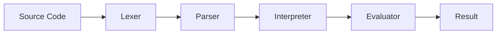

# GocciaScript


A drop of JavaScript — A subset of ECMAScript 2026+ implemented in FreePascal

It's based on the thought "What if we implement ECMAScript today, but without the quirks of early ECMAScript implementations". Features that are error-prone, redundant, or security risks are intentionally excluded. See [Language Restrictions](docs/language-restrictions.md) for the full rationale.

## Features

### Language Features

- **Variables**: `let` and `const` declarations (no `var`)
- **Functions**: Arrow functions only (no `function` keyword)
- **Classes**: Full class support with private fields (`#field`), static methods, getters/setters, and inheritance
- **Equality**: Strict equality only (`===` / `!==`)
- **Strict Mode**: Implicit — all code runs in strict mode
- **Template Literals**: String interpolation with `${expression}`
- **Destructuring**: Array and object destructuring patterns
- **Spread/Rest**: `...` operator for arrays, objects, and function parameters
- **Modules**: ES6-style `import`/`export`
- **No `eval`**: Excluded for security
- **No `arguments`**: Use rest parameters (`...args`) instead

### ES6+ Features

| Feature | Example |
|---------|---------|
| Template strings | `` `Hello, ${name}!` `` |
| Object shorthand properties and methods | `{ x, y, method() {} }` |
| Computed property names | `{ [expr]: value }` |
| Nullish coalescing | `a ?? b` |
| Optional chaining | `obj?.prop?.method?.()` |
| Arrow functions | `(x) => x + 1` |
| Rest parameters | `(...args) => args` |
| Destructuring | `const { a, b } = obj` |
| Spread operator | `[...arr]`, `{ ...obj }` |
| Unicode escapes | `\uXXXX`, `\u{XXXXX}`, `\xHH` |
| Function `length` and `name` | `fn.length`, `fn.name` |
| `Symbol` | `Symbol("desc")`, `Symbol.iterator` |
| `Promise` | Constructor, `.then`/`.catch`/`.finally`, `all`/`allSettled`/`race`/`any` |
| `Object.freeze`, `Object.isFrozen` | Immutable objects |
| `Array.from`, `Array.of` | Array construction |

### ECMAScript 2022–2025 Features

| Feature | Spec |
|---------|------|
| Private fields, methods, getters, setters | ES2022 |
| `Array.prototype.at` | ES2022 |
| `Object.hasOwn` | ES2022 |
| `structuredClone` | ES2022 |
| `Array.prototype.findLast`, `findLastIndex` | ES2023 |
| `Array.prototype.toReversed`, `toSorted`, `toSpliced`, `with` | ES2023 |
| `Object.groupBy`, `Map.groupBy` | ES2024 |
| `Promise.withResolvers` | ES2024 |
| `String.prototype.isWellFormed`, `toWellFormed` | ES2024 |
| Set methods: `union`, `intersection`, `difference`, `symmetricDifference`, `isSubsetOf`, `isSupersetOf`, `isDisjointFrom` | ES2025 |
| `Promise.try` | ES2025 |
| Iterator Helpers: `map`, `filter`, `take`, `drop`, `flatMap`, `forEach`, `reduce`, `toArray`, `some`, `every`, `find` | ES2025 |

### TC39 Proposals

GocciaScript implements several active TC39 proposals:

| Proposal | Stage | Description |
|----------|-------|-------------|
| [Types as Comments](https://tc39.es/proposal-type-annotations/) | 1 | TypeScript-style type annotations parsed and ignored at runtime |
| [Enum Declarations](https://github.com/tc39/proposal-enum) | 0 | Frozen, null-prototype enum objects with `Symbol.iterator` |
| [Temporal](https://tc39.es/proposal-temporal/) | 3 | Modern date/time API (`Temporal.PlainDate`, `Temporal.Duration`, `Temporal.Instant`, etc.) |
| [`Math.clamp`](https://github.com/tc39/proposal-math-clamp) | 3 | Clamp a value to a range |
| [`Math.sumPrecise`](https://github.com/tc39/proposal-math-sum) | 3 | Precise summation of iterables using compensated algorithm |
| [`Map.prototype.getOrInsert`](https://github.com/tc39/proposal-upsert) | 3 | Get existing value or insert a default / computed value |
| [`Error.isError`](https://github.com/tc39/proposal-is-error) | 4 | Reliable brand check for error objects via `[[ErrorData]]` |

See [Language Restrictions](docs/language-restrictions.md) for details on supported syntax.

### Built-in Objects

`console`, `Math`, `JSON`, `Object`, `Array`, `Number`, `String`, `Symbol`, `Set`, `Map`, `Promise`, `Temporal`, `Iterator`, plus error constructors (`Error`, `TypeError`, `ReferenceError`, `RangeError`, `DOMException`).

See [Built-in Objects](docs/built-ins.md) for the complete API reference.

## Example

```javascript
class CoffeeShop {
  #name = "Goccia Coffee";
  #beans = ["Arabica", "Robusta", "Ethiopian"];
  #prices = { espresso: 2.5, latte: 4.0, cappuccino: 3.75 };

  getMenu() {
    return this.#beans.map((bean) => `${bean} blend`);
  }

  calculateTotal(order) {
    return order.reduce((total, item) => total + (this.#prices[item] ?? 0), 0);
  }

  get name() {
    return this.#name;
  }
}

const shop = new CoffeeShop();
const order = ["espresso", "latte"];
const total = shop.calculateTotal(order);

console.log(`Welcome to ${shop.name}!`);
console.log(`Your order total: $${total.toFixed(2)}`);
```

## Getting Started

### Prerequisites

- [FreePascal](https://www.freepascal.org/) compiler (`fpc`)
  - macOS: `brew install fpc`
  - Ubuntu/Debian: `sudo apt-get install fpc`
  - Windows: `choco install freepascal`

### Build

```bash
# Dev build of everything (default — debug info, heap trace, checks)
./build.pas

# Production build (O4, stripped, smart-linked)
./build.pas --prod

# Build specific components
./build.pas loader           # Dev build of script executor
./build.pas --prod loader    # Production build of script executor
./build.pas repl             # Interactive REPL
./build.pas testrunner       # Test runner
./build.pas benchmarkrunner  # Benchmark runner
```

### Run a Script

```bash
./build.pas loader && ./build/ScriptLoader example.js
```

### Start the REPL

```bash
./build.pas repl && ./build/REPL
```

### Run Tests

GocciaScript has 2400+ JavaScript unit tests covering language features, built-in objects, and edge cases.

```bash
# Run all tests (GocciaScript TestRunner)
./build.pas testrunner && ./build/TestRunner tests

# Run a specific test
./build.pas testrunner && ./build/TestRunner tests/language/expressions/addition/basic-addition.js

# Run tests in standard JavaScript (Vitest) for cross-compatibility
npx vitest run
```

### Run Benchmarks

```bash
# Run all benchmarks
./build.pas benchmarkrunner && ./build/BenchmarkRunner benchmarks

# Run a specific benchmark
./build/BenchmarkRunner benchmarks/fibonacci.js

# Export as JSON or CSV
./build/BenchmarkRunner benchmarks --format=json --output=results.json
./build/BenchmarkRunner benchmarks --format=csv --output=results.csv
```

The benchmark runner auto-calibrates iterations per benchmark, reports ops/sec with variance (CV%) and engine-level timing breakdown (lex/parse/execute). Output formats: `console` (default), `text`, `csv`, `json`. Calibration and measurement parameters are configurable via environment variables — see [Benchmarks](docs/benchmarks.md) for details.

## Architecture

GocciaScript follows a classic interpreter pipeline:



| Component | File | Role |
|-----------|------|------|
| Engine | `Goccia.Engine.pas` | Top-level orchestration, built-in registration |
| Lexer | `Goccia.Lexer.pas` | Tokenization |
| Parser | `Goccia.Parser.pas` | Recursive descent AST construction |
| Interpreter | `Goccia.Interpreter.pas` | Execution orchestration, module loading |
| Evaluator | `Goccia.Evaluator.pas` | Pure-function AST evaluation |
| GC | `Goccia.GarbageCollector.pas` | Mark-and-sweep garbage collection |

See [Architecture](docs/architecture.md) for the full deep-dive.

## Design Principles

- **Explicitness**: Modules, classes, methods, and properties use explicit, descriptive names even at the cost of verbosity. Shortcuts are avoided.
- **OOP over everything**: Rely on type safety of specialized classes rather than generic data structures.
- **Define vs Assign**: `Define` creates a new variable binding; `Assign` changes an existing one. These are distinct operations throughout the codebase.
- **Pure evaluation**: The evaluator is composed of pure functions with no side effects.
- **No global mutable state**: All runtime state flows through explicit parameters — the evaluation context, the scope chain, and value objects.
- **Virtual dispatch**: Property access (`GetProperty`/`SetProperty`), type discrimination (`IsPrimitive`/`IsCallable`), and scope chain resolution (`GetThisValue`/`GetOwningClass`/`GetSuperClass`) all use virtual methods, replacing type checks with single VMT calls.

See [Design Decisions](docs/design-decisions.md) for the complete rationale.

## Documentation

| Document | Description |
|----------|-------------|
| [Architecture](docs/architecture.md) | Pipeline overview, component responsibilities, data flow |
| [Design Decisions](docs/design-decisions.md) | Rationale behind key technical choices |
| [Code Style](docs/code-style.md) | Naming conventions, patterns, file organization |
| [Value System](docs/value-system.md) | Type hierarchy, virtual property access, primitives, objects |
| [Built-in Objects](docs/built-ins.md) | Available built-ins, API reference, adding new ones |
| [Testing](docs/testing.md) | Test organization, writing tests, running tests |
| [Benchmarks](docs/benchmarks.md) | Benchmark runner, output formats, writing benchmarks |
| [Build System](docs/build-system.md) | Build commands, compiler configuration, CI/CD |
| [Language Restrictions](docs/language-restrictions.md) | Supported and excluded features with rationale |
| [AGENTS.md](AGENTS.md) | Instructions for AI coding assistants |

## Contributing

### Editor Setup

Open the project in **VSCode** or **Cursor** and accept the prompt to install recommended extensions. This gives you:

- Pascal syntax highlighting and code navigation
- Auto-formatting on save via `./format.pas`
- EditorConfig support for consistent whitespace

No manual configuration needed — `.vscode/settings.json` and `.vscode/extensions.json` are included in the repository.

### Pre-commit Hook

Install [Lefthook](https://github.com/evilmartians/lefthook) to enable the pre-commit auto-formatter:

```bash
brew install lefthook   # macOS — see docs/code-style.md for other platforms
lefthook install
```

See [Code Style](docs/code-style.md) for conventions, editor configuration, and [AGENTS.md](AGENTS.md) for the full development workflow.

## License

See [LICENSE](LICENSE) for details.
