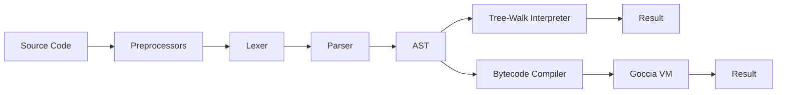

# GocciaScript


A drop of JavaScript — sandboxed by default

GocciaScript is a sandbox-first ECMAScript runtime and toolchain for AI agents.
Hosts define the available capabilities, runtime surface, and execution limits.
It uses modern recommended defaults while tracking ECMAScript compatibility
through generated test262 reports.

GocciaScript is implemented in FreePascal, supports Delphi, and can also be
embedded in native applications. Native embedding is an important secondary
goal; the primary product goal is AI-agent execution under an explicit
host-defined capability model. It is not trying to become Node.js or a browser
host.

## Start with an agent sandbox

`GocciaSandboxRunner` seeds an in-memory virtual filesystem from explicit host
paths, runs an entry script with host-owned limits, and reports sandbox changes
as a diff. Seed entries are snapshots, not live mounts, and scripts receive no
ambient host filesystem access.

```javascript
// agent-workspace/main.js
import fs from "fs";

const input = fs.readFileSync("/task.txt", "utf8");
fs.mkdirSync("/out", { recursive: true });
fs.writeFileSync("/out/result.txt", input.toUpperCase());
```

```bash
./build.pas sandboxrunner
./build/GocciaSandboxRunner /main.js \
  --seed=./agent-workspace=/ \
  --timeout=5000 \
  --diff
```

The host can also define globals, virtual modules, allowed network hosts,
instruction and memory limits, deterministic time/randomness, and
application-specific APIs. See [Build System — Sandbox Runner](docs/build-system.md#gocciasandboxrunner-virtual-filesystem-sandbox)
and [Built-ins — Sandbox Modules](docs/built-ins.md#sandbox-modules-gocciaruntimeextensionssandboxpas).

## ECMAScript implementation and recommended profile

GocciaScript implements core ECMAScript and runs the official test262 corpus on
every PR and main commit. The exact current result is rendered from published
main-branch data on the live
[ECMAScript compatibility dashboard](https://www.gocciascript.dev/compatibility);
canonical prose does not freeze a historical percentage.

The recommended language profile is product policy, not the implementation
ceiling. Standard core forms disabled by default all have explicit compatibility
paths:

| Form | Default | Enablement / exposure |
|------|---------|-----------------------|
| `var` | Disabled | `--compat-var` |
| traditional `function` syntax | Disabled | `--compat-function` |
| `==` / `!=` | Disabled | `--compat-loose-equality` |
| ASI | Disabled | `--compat-asi` |
| labels | Disabled | `--compat-label` |
| traditional `for(;;)` | Disabled | `--compat-traditional-for-loop` |
| `for...in` | Disabled | `--compat-for-in-loop` |
| `while` / `do...while` | Disabled | `--compat-while-loops` |
| `arguments` | Disabled | `--compat-arguments-object` |
| non-strict Script semantics and `with` | Strict / disabled | `--compat-non-strict-mode` |
| `eval` | Not installed by normal hosts | private `GocciaScriptLoaderBare --test262-host` |
| `Function()` | Disabled | `--unsafe-function-constructor` |

Annex B's browser-only legacy surface is not a general pre-1.0 target; see
[ADR 0085](docs/adr/0085-defer-annex-b-before-1-0.md). See
[Language](docs/language.md) and [Language Tables](docs/language-tables.md) for
the detailed semantics and feature matrix.

## TC39 Type Annotations and `--strict-types`

GocciaScript implements the official
[TC39 Type Annotations proposal](https://tc39.es/proposal-type-annotations/) and
its types-as-comments runtime model. Supported annotations have no runtime
effect by default. GocciaScript additionally provides the optional
`--strict-types` extension, which enforces supported annotations and relevant
inferred primitive contracts at runtime in interpreter and bytecode modes.

`--strict-types` is a runtime contract extension, not a replacement for a static
structural type checker such as `tsc`.

## Node host compatibility and sandbox `fs`

GocciaScript is not a complete Node.js host: it does not provide CommonJS, npm
package resolution, `process`, `Buffer`, or the general `node:` module set.
`GocciaSandboxRunner` does provide a Node-compatible `fs` API over its virtual
filesystem:

- synchronous forms such as `readFileSync`, `writeFileSync`, `mkdirSync`,
  `readdirSync`, `statSync`, `rmSync`, `renameSync`, and `copyFileSync`;
- Node-shaped callback forms for the same operation families;
- `fs.promises` forms, `Stats` objects, and Node-shaped filesystem errors.

The documented method set never reaches the ambient host filesystem. See
[Sandbox Modules](docs/built-ins.md#sandbox-modules-gocciaruntimeextensionssandboxpas)
for supported options, return types, error shapes, and method-level deviations.

## Runtime and toolchain features

The default profile includes modern ECMAScript forms such as `let`/`const`,
arrow functions, classes with private fields, `for...of`, async/await, ES
modules, decorators, and proposal-compatible type syntax.

### Built-in Objects

`console`, `Math`, `JSON`, `Object`, `Array`, `Number`, `String`, `RegExp`, `Symbol`, `Set`, `Map`, `WeakSet`, `WeakMap`, `Promise`, `Temporal`, `Iterator`, `Proxy`, `Reflect`, `ArrayBuffer`, `SharedArrayBuffer`, TypedArrays (`Int8Array`, `Uint8Array`, `Uint8ClampedArray`, `Int16Array`, `Uint16Array`, `Int32Array`, `Uint32Array`, `Float16Array`, `Float32Array`, `Float64Array`, `BigInt64Array`, `BigUint64Array`) with ArrayBuffer and SharedArrayBuffer backing, `fetch`, `Headers`, `Response` ([WHATWG Fetch](https://fetch.spec.whatwg.org/) — GET/HEAD only), `URL`, `URLSearchParams`, `TextEncoder`, `TextDecoder`, plus error constructors (`Error`, `TypeError`, `ReferenceError`, `RangeError`, `DOMException`).

Non-standard data-format APIs and SemVer are import-only Goccia runtime modules, not auto-installed globals: `goccia:csv`, `goccia:json5`, `goccia:jsonl`, `goccia:toml`, `goccia:tsv`, `goccia:yaml`, and `goccia:semver`. They expose named exports only; use `import * as CSV from "goccia:csv"` when you want the namespace-object shape. There is no default export.

Native FFI is an explicit unsafe runtime opt-in (`--unsafe-ffi` or the matching configuration key). It provides native-layout structures, unions, fixed-length arrays, callbacks, and guarded library lifetimes through GocciaScript's custom bidirectional ABI machinery. See the [FFI reference](docs/built-ins-ffi.md) and [ADR 0095](docs/adr/0095-custom-bidirectional-ffi-abi-engine.md).

See [Built-in Objects](docs/built-ins.md) for the complete API reference.

## Example

```javascript
class CoffeeShop {
  #name = "Goccia Coffee";
  #beans = ["Arabica", "Robusta", "Ethiopian"];
  #prices = { espresso: 2.5, latte: 4.0, cappuccino: 3.75 };

  getMenu() {
    return this.#beans.map((bean) => `${bean} blend`);
  }

  calculateTotal(order) {
    return order.reduce((total, item) => total + (this.#prices[item] ?? 0), 0);
  }

  get name() {
    return this.#name;
  }
}

const shop = new CoffeeShop();
const order = ["espresso", "latte"];
const total = shop.calculateTotal(order);

console.log(`Welcome to ${shop.name}!`);
console.log(`Your order total: $${total.toFixed(2)}`);
```

## Getting Started

### Prerequisites

- [FreePascal](https://www.freepascal.org/) compiler (`fpc`)
  - macOS: `brew install fpc`
  - Ubuntu/Debian: `sudo apt-get install fpc`
  - Windows: `choco install freepascal`

### Build

```bash
# Dev build of everything
./build.pas

# Production build
./build.pas --prod

# Build the script loader only
./build.pas loader
```

See [Build System](docs/build-system.md#build-commands) for build modes,
targets, clean builds, and troubleshooting.

### Run a Script

```bash
./build.pas loader && ./build/GocciaScriptLoader example.js
printf "const x = 2 + 2; x;" | ./build/GocciaScriptLoader --print
```

By default, both loaders are silent about the script's last evaluated value.
Pass `--print` to emit it; use `--output=json` for programmatic consumers. See
[Build System](docs/build-system.md#compile-and-run) for loader options,
bytecode mode, JSON output, sandbox execution, import maps, config files, and
resource limits.

### Run via Bytecode

GocciaScript includes bytecode execution, and `GocciaBundler` compiles source to
the public `.gbc` artifact.

```bash
./build/GocciaScriptLoader example.js --mode=bytecode
./build/GocciaBundler example.js
./build/GocciaScriptLoader example.gbc
```

See [Bytecode VM](docs/bytecode-vm.md) for the current bytecode executor architecture.

### Reproduce An Execution

Use one fixed JavaScript-visible clock, UTC time zone, and portable random stream in either execution mode:

```bash
./build/GocciaScriptLoader example.js --deterministic
```

Timeouts and profiling still use the real monotonic clock. The equivalent config key is `"deterministic": true`; embedders can inject their own clock and RNG providers through the engine host environment.

For custom providers, pass a JavaScript module to `--host-environment` or implement the Pascal host interfaces. See [Host Environment](docs/host-environment.md) for both examples and the provider contract.

### Start the REPL

```bash
./build.pas repl && ./build/GocciaREPL
```

### Run Tests

GocciaScript has 11,000+ JavaScript unit tests covering language features, built-in objects, and edge cases.

```bash
./build.pas testrunner
./build/GocciaTestRunner tests
./build/GocciaTestRunner tests --mode=bytecode
```

The test runner supports Vitest-compatible external and inline snapshots,
property shapes, asymmetric matchers, custom serializers, and `-u` updates.
See [Testing](docs/testing.md) for test organization and [Build System](docs/build-system.md#compile-and-test) for runner options.

### Run Benchmarks

```bash
./build.pas benchmarkrunner && ./build/GocciaBenchmarkRunner benchmarks
./build/GocciaBenchmarkRunner benchmarks/fibonacci.js
```

The benchmark runner auto-calibrates iterations per benchmark, reports ops/sec with variance (CV%) and engine-level timing breakdown (lex/parse/execute). Output formats: `console` (default), `text`, `csv`, `json`, `compact-json` (the same envelope as `json` without `build`, `memory`, `stdout`, or `stderr`). Calibration and measurement parameters are configurable via [environment variables](docs/benchmarks.md#configuring-benchmark-parameters). Retained AWFY and JetStream reference measurements are published through the [Performance Barometer](https://gocciascript.dev/performance).

## Recommended-profile quick tour

The recommended profile favors modern, explicit forms. The corresponding core
ECMAScript forms remain implemented through the compatibility paths listed
above:

- **Arrow functions and methods by default** —
  ``const greet = (name) => `Hello, ${name}!`;``; traditional `function`
  syntax uses `--compat-function`.
- **Iterator-oriented loops by default** — use array methods, iterators, or
  `for...of`; traditional `for(;;)`, `for...in`, `while`, and `do...while`
  each have targeted compatibility flags.
- **Classes** with private fields — `class Account { #balance = 0; ... }`
- **ES modules** — default, named, and namespace imports/exports are supported; project code prefers named exports for clarity.
- **Strict equality by default** — `===` and `!==` (`==`/`!=` require `--compat-loose-equality`)

The CLI tools share WHATWG-style import map support with `--import-map=<file.json>`, `--alias key=value`, and automatic `goccia.json` discovery for project-level module aliases. Host-supplied dependencies should normally be configured as virtual ES modules with `--module`, `--modules`, or a config `modules` object; they participate in the same import pipeline as filesystem modules. Global injection remains supported for compatibility.

Structured data files and text assets can also be imported directly:

```javascript
import { name, version } from "./package.json";
import { name as packageName } from "./config.toml";
import { name as appName } from "./config.yaml";
import { content, metadata } from "./README.md";
```

Runtime parsers are available through named Goccia modules for JSON5, TOML, YAML, JSONL, CSV, and TSV. See [Built-in Objects](docs/built-ins.md) and [Language](docs/language.md) for the full data format reference.

```javascript
import * as TOML from "goccia:toml";
import * as YAML from "goccia:yaml";

TOML.parse(sourceText); // TOML 1.1.0 configuration data
YAML.parse(sourceText); // block scalars, anchors/aliases, merge keys, YAML 1.2 tags
```

See [Language](docs/language.md#modules) and [Architecture Decision Records](docs/adr/) for the full conformance details.

JSONL parsing is also available from `goccia:jsonl` via `parse(text)` and `parseChunk(text)`, and `.jsonl` files can still be imported as structured-data modules.

**Async/await** with full Promise support, including top-level `await`:

```javascript
const fetchData = async () => {
  const result = await Promise.resolve({ status: "ok" });
  return result;
};

// Top-level await (ES2022+)
const data = await fetchData();
```

**Strict equality by default** — `===` and `!==`; `==` and `!=` are available only with `--compat-loose-equality`.

For a full guided walkthrough, see the [Tutorial](docs/tutorial.md). For the
complete implementation, default-profile, and compatibility-path detail, see
[Language](docs/language.md).

## FreePascal, Delphi, and native embedding

FreePascal is the cross-platform toolchain used for normal builds, releases, and
the documented embedding API. The repository also includes
[`GocciaScript.Delphi.groupproj`](source/app/GocciaScript.Delphi.groupproj) and
Delphi projects for the REPL, both script loaders, Sandbox Runner, Test Runner,
Benchmark Runner, and Bundler on Win32 and Win64.

The Delphi support contract requires the complete application matrix and all
applicable Pascal and JavaScript tests to pass with the same runtime semantics
as the FreePascal build. Delphi 12 Community Edition contributors validate that
contract through the IDE; see [Delphi Validation](docs/contributing/delphi.md)
and [Build System](docs/build-system.md#prerequisites).

Native hosts can embed GocciaScript to run portable JavaScript with
application-specific globals, modules, capabilities, and limits. See
[Embedding the Engine](docs/embedding.md).

## Architecture

GocciaScript supports two execution modes that share the same source pipeline (preprocessors, lexer, parser, AST):


```mermaid
flowchart LR
    Source["Source Code"] --> Preprocessors["Preprocessors"] --> Lexer --> Parser --> AST
    AST --> Interpreter["Tree-Walk Interpreter"] --> Result1["Result"]
    AST --> Compiler["Bytecode Compiler"] --> VM["Goccia VM"] --> Result2["Result"]
```

Both execution modes share the same value types, built-ins, scope chain, and mark-and-sweep GC. The bytecode executor uses a Goccia-owned VM with tagged `TGocciaRegister` values (unboxed scalars) that fall back to `TGocciaValue` for heap objects, not a generic VM layer.

See [Architecture](docs/architecture.md) for pipelines and layers, [Interpreter](docs/interpreter.md) for tree-walk execution, [Bytecode VM](docs/bytecode-vm.md) for bytecode execution, [Core patterns](docs/core-patterns.md) for implementation patterns, and [GocciaScript Context](CONTEXT.md) for canonical terminology.

## Design Principles

- **Explicitness**: Modules, classes, methods, and properties use explicit, descriptive names even at the cost of verbosity. Shortcuts are avoided.
- **OOP over everything**: Rely on type safety of specialized classes rather than generic data structures.
- **Define vs Assign**: `Define` creates a new variable binding; `Assign` changes an existing one. These are distinct operations throughout the codebase (see [Core patterns](docs/core-patterns.md#define-vs-assign)).
- **Pure evaluation**: The evaluator is composed of pure functions with no side effects.
- **No global mutable state**: All runtime state flows through explicit parameters — the evaluation context, the scope chain, and value objects.
- **Virtual dispatch**: Property access (`GetProperty`/`SetProperty`), type discrimination (`IsPrimitive`/`IsCallable`), and scope chain resolution (`GetThisValue`/`GetOwningClass`/`GetSuperClass`) all use virtual methods, replacing type checks with single VMT calls.

See [Core patterns](docs/core-patterns.md) and [Interpreter](docs/interpreter.md) for the design rationale.

## Documentation

| Document | Description |
|----------|-------------|
| [Vision](VISION.md) | Why GocciaScript exists: sandboxed AI agent runtime and embeddable desktop platform |
| [Tutorial](docs/tutorial.md) | Your first GocciaScript program — a guided walkthrough for newcomers |
| [Language](docs/language.md) | ECMAScript support, recommended defaults, compatibility flags, and rationale |
| [Language Tables](docs/language-tables.md) | Quick-reference: ECMAScript feature matrix and TC39 proposal status |
| [Built-in Objects](docs/built-ins.md) | Available built-ins and API reference |
| [FFI Built-ins](docs/built-ins-ffi.md) | Native libraries, aggregate types, callbacks, lifetimes, and safety limits |
| [Temporal Built-ins](docs/built-ins-temporal.md) | Temporal API: dates, times, durations, time zones |
| [Binary Data Built-ins](docs/built-ins-binary-data.md) | ArrayBuffer, SharedArrayBuffer, TypedArray API |
| [Errors](docs/errors.md) | Error types, parser/runtime display, JSON output, `Error.cause`, `try`/`catch`/`finally` |
| [Architecture](docs/architecture.md) | Pipelines, main layers, design direction, duplication boundaries |
| [Interpreter](docs/interpreter.md) · [Bytecode VM](docs/bytecode-vm.md) | Tree-walk and bytecode execution modes |
| [Core patterns](docs/core-patterns.md) | Recurring implementation patterns |
| [GocciaScript Context](CONTEXT.md) | Canonical project terminology and glossary |
| [Value System](docs/value-system.md) | Type hierarchy, virtual property access, primitives, objects |
| [Garbage Collector](docs/garbage-collector.md) | Mark-and-sweep GC: architecture, contributor rules, design rationale |
| [Adding Built-in Types](docs/adding-built-in-types.md) | Step-by-step guide for adding new built-in types |
| [Embedding the Engine](docs/embedding.md) | Embedding GocciaScript in FreePascal applications |
| [Virtual Module Configuration](docs/virtual-modules.md) | CLI, config-file, and embedding reference for host-supplied modules |
| [Host Environment](docs/host-environment.md) | Injecting JavaScript-visible clock, time-zone, and random providers |
| [Capability Audit Events](docs/capability-audit.md) | Structured host capability decisions, embedding sink, and CLI JSONL output |
| [Testing](docs/testing.md) | Test organization, running tests, coverage, CI |
| [Test Framework API](docs/testing-api.md) | Assertions, mocks, lifecycle hooks, async patterns |
| [Benchmarks](docs/benchmarks.md) | Benchmark runner, output formats, writing benchmarks |
| [Build System](docs/build-system.md) | Build commands, compiler configuration, CI/CD |
| [Profiling](docs/profiling.md) | Bytecode VM profiling: opcodes, functions, output formats |
| [Architecture Decision Records](docs/adr/) | Durable architectural decisions and trade-offs |
| [Contributing](CONTRIBUTING.md) | Single contribution standard: workflow, mandatory rules, testing, FreePascal style |
| [AGENTS.md](AGENTS.md) | Agent operating manual for coding assistants; [CONTRIBUTING.md](CONTRIBUTING.md) is the contributing guide for everyone |

## Contributing

**[CONTRIBUTING.md](CONTRIBUTING.md)** is the **contributing guide for all contributors** (humans and AI): workflow, mandatory rules, testing, FreePascal code style, `./format.pas`, editor setup, build/run quick reference, and the documentation index.

**[AGENTS.md](AGENTS.md)** (and **CLAUDE.md**, which points to it) is **only for AI assistants**—how to use the repo and defer to CONTRIBUTING. It is not a second contributing guide and should stay short.

## License

See [LICENSE](LICENSE) for details.
