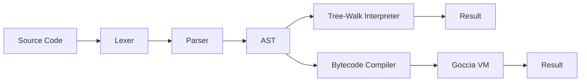

# GocciaScript


A drop of JavaScript — A subset of ECMAScript 2027+ implemented in FreePascal

It's based on the thought "What if we implement ECMAScript today, but without the quirks of early ECMAScript implementations". Features that are error-prone, redundant, or security risks are intentionally excluded. See [Language](docs/language.md) for the full rationale.

## Features

GocciaScript implements a modern subset of ECMAScript: `let`/`const`, arrow functions, classes with private fields, `for...of`, async/await, ES modules (named only), decorators, and TypeScript-style type annotations. Features that are error-prone, redundant, or security risks (`var`, `function` keyword, `==`/`!=`, `eval`, traditional loops) are intentionally excluded.

See [Language](docs/language.md) for the complete specification of supported features, TC39 proposals, and exclusions.

### Built-in Objects

`console`, `Math`, `JSON`, `JSON5`, `TOML`, `YAML`, `CSV`, `TSV`, `Object`, `Array`, `Number`, `String`, `RegExp`, `Symbol`, `Set`, `Map`, `Promise`, `Temporal`, `Iterator`, `Proxy`, `Reflect`, `ArrayBuffer`, `SharedArrayBuffer`, TypedArrays (`Int8Array`, `Uint8Array`, `Uint8ClampedArray`, `Int16Array`, `Uint16Array`, `Int32Array`, `Uint32Array`, `Float32Array`, `Float64Array`) with ArrayBuffer and SharedArrayBuffer backing, plus error constructors (`Error`, `TypeError`, `ReferenceError`, `RangeError`, `DOMException`).

See [Built-in Objects](docs/built-ins.md) for the complete API reference.

## Example

```javascript
class CoffeeShop {
  #name = "Goccia Coffee";
  #beans = ["Arabica", "Robusta", "Ethiopian"];
  #prices = { espresso: 2.5, latte: 4.0, cappuccino: 3.75 };

  getMenu() {
    return this.#beans.map((bean) => `${bean} blend`);
  }

  calculateTotal(order) {
    return order.reduce((total, item) => total + (this.#prices[item] ?? 0), 0);
  }

  get name() {
    return this.#name;
  }
}

const shop = new CoffeeShop();
const order = ["espresso", "latte"];
const total = shop.calculateTotal(order);

console.log(`Welcome to ${shop.name}!`);
console.log(`Your order total: $${total.toFixed(2)}`);
```

## Getting Started

### Prerequisites

- [FreePascal](https://www.freepascal.org/) compiler (`fpc`)
  - macOS: `brew install fpc`
  - Ubuntu/Debian: `sudo apt-get install fpc`
  - Windows: `choco install freepascal`

### Build

```bash
# Dev build of everything (default — debug info, heap trace, checks)
./build.pas

# Production build (O4, stripped, smart-linked)
./build.pas --prod

# Build specific components
./build.pas loader           # Dev build of script executor
./build.pas --prod loader    # Production build of script executor
./build.pas repl             # Interactive REPL
./build.pas testrunner       # Test runner
./build.pas benchmarkrunner  # Benchmark runner
```

### Run a Script

```bash
./build.pas loader && ./build/GocciaScriptLoader example.js
printf "const x = 2 + 2; x;" | ./build/GocciaScriptLoader
```

Script files may start with a Unix shebang line like `#!/usr/bin/env goccia`; GocciaScript ignores that first line during lexing.

### Run via Bytecode

GocciaScript includes a bytecode execution backend. The public bytecode artifact is `.gbc`.

```bash
# Compile and execute via bytecode
./build/GocciaScriptLoader example.js --mode=bytecode
printf "const x = 2 + 2; x;" | ./build/GocciaScriptLoader --mode=bytecode

# Compile to .gbc bytecode file (no execution) — use GocciaBundler
./build/GocciaBundler example.js
./build/GocciaBundler example.js --output=out.gbc

# Load and execute a pre-compiled .gbc file
./build/GocciaScriptLoader example.gbc

# Emit structured JSON for programmatic consumers
printf "console.log('hi'); 2 + 2;" | ./build/GocciaScriptLoader --output=json

# Inject globals from the CLI
printf "x + y;" | ./build/GocciaScriptLoader --global x=10 --global y=20
printf "name;" | ./build/GocciaScriptLoader --globals=context.json --output=json
printf "name;" | ./build/GocciaScriptLoader --globals=context.json5 --output=json
printf "name;" | ./build/GocciaScriptLoader --globals=context.toml --output=json
printf "name;" | ./build/GocciaScriptLoader --globals=context.yaml --output=json
# `--global name=value` parses inline values as JSON only; `--globals=file` accepts JSON, JSON5, TOML, or YAML by file extension.
# Injected globals can override earlier injected values, but not built-in globals like console

# Abort long-running scripts
printf "const f = () => f(); f();" | ./build/GocciaScriptLoader --timeout=100
```

See [Bytecode VM](docs/bytecode-vm.md) for the current bytecode backend architecture.

### Start the REPL

```bash
./build.pas repl && ./build/GocciaREPL
```

### Run Tests

GocciaScript has 3400+ JavaScript unit tests covering language features, built-in objects, and edge cases.

```bash
# Run all tests (GocciaScript TestRunner)
./build.pas testrunner && ./build/GocciaTestRunner tests

# Run a specific test
./build.pas testrunner && ./build/GocciaTestRunner tests/language/expressions/addition/basic-addition.js

# Run tests with 4 parallel workers
./build.pas testrunner && ./build/GocciaTestRunner tests --jobs=4

# Run tests in standard JavaScript (Vitest) for cross-compatibility
npx vitest run
```

### Run Benchmarks

```bash
# Run all benchmarks
./build.pas benchmarkrunner && ./build/GocciaBenchmarkRunner benchmarks

# Run a specific benchmark
./build/GocciaBenchmarkRunner benchmarks/fibonacci.js

# Run a benchmark from stdin
printf 'suite("stdin", () => { bench("sum", { run: () => 1 + 1 }); });\n' | ./build/GocciaBenchmarkRunner

# Run benchmarks sequentially (single worker)
./build/GocciaBenchmarkRunner benchmarks --jobs=1

# Export as JSON or CSV
./build/GocciaBenchmarkRunner benchmarks --format=json --output=results.json
./build/GocciaBenchmarkRunner benchmarks --format=csv --output=results.csv
```

The benchmark runner auto-calibrates iterations per benchmark, reports ops/sec with variance (CV%) and engine-level timing breakdown (lex/parse/execute). Output formats: `console` (default), `text`, `csv`, `json`. Calibration and measurement parameters are configurable via [environment variables](docs/benchmarks.md#configuring-benchmark-parameters).

## Quick Tour

GocciaScript looks like modern JavaScript — with a few intentional differences:

- **Arrow functions only** — `const greet = (name) => \`Hello, ${name}!\`;` (no `function` keyword)
- **No traditional loops** — `numbers.map((n) => n * 2)` or `for (const n of numbers) { ... }`
- **Classes** with private fields — `class Account { #balance = 0; ... }`
- **Named imports/exports only** — `import { add } from "./math.js";` (no default exports)
- **Strict equality only** — `===` and `!==` (no `==` or `!=`)

The CLI tools share WHATWG-style import map support with `--import-map=<file.json>`, `--alias key=value`, and automatic `goccia.json` discovery for project-level module aliases.

Structured data files and text assets can also be imported directly:

```javascript
import { name, version } from "./package.json";
import { name as packageName } from "./config.toml";
import { name as appName } from "./config.yaml";
import { content, metadata } from "./README.md";
```

Runtime parsers are available for JSON5, TOML, YAML, JSONL, CSV, and TSV. See [Built-in Objects](docs/built-ins.md) and [Language](docs/language.md) for the full data format reference.

`TOML.parse(sourceText)` parses TOML 1.1.0 configuration data. `YAML.parse(sourceText)` handles common configuration files including block scalars, anchors/aliases, merge keys, and YAML 1.2 tag resolution. See [Language](docs/language.md#modules) and [Decision Log](docs/decision-log.md) for the full conformance details.

JSONL parsing is also available via `JSONL.parse(text)` and `JSONL.parseChunk(text)`, and `.jsonl` files can be imported as structured-data modules.

**Async/await** with full Promise support, including top-level `await`:

```javascript
const fetchData = async () => {
  const result = await Promise.resolve({ status: "ok" });
  return result;
};

// Top-level await (ES2022+)
const data = await fetchData();
```

**Strict equality only** — `===` and `!==` (no `==` or `!=`).

For a full guided walkthrough, see the [Tutorial](docs/tutorial.md). For the complete list of what's supported and excluded, see [Language](docs/language.md).

## Architecture

GocciaScript supports two execution backends that share the same frontend (lexer, parser, AST):


```mermaid
flowchart LR
    Source["Source Code"] --> Lexer --> Parser --> AST
    AST --> Interpreter["Tree-Walk Interpreter"] --> Result1["Result"]
    AST --> Compiler["Bytecode Compiler"] --> VM["Goccia VM"] --> Result2["Result"]
```

Both backends share the same value types, built-ins, scope chain, and mark-and-sweep GC. The bytecode backend is a Goccia-owned VM with tagged `TGocciaRegister` values (unboxed scalars) that fall back to `TGocciaValue` for heap objects, not a generic VM layer.

See [Architecture](docs/architecture.md) for pipelines and layers, [Interpreter](docs/interpreter.md) for the tree-walk backend, [Bytecode VM](docs/bytecode-vm.md) for the bytecode backend, and [Core patterns](docs/core-patterns.md) for implementation patterns and internal terminology.

## Design Principles

- **Explicitness**: Modules, classes, methods, and properties use explicit, descriptive names even at the cost of verbosity. Shortcuts are avoided.
- **OOP over everything**: Rely on type safety of specialized classes rather than generic data structures.
- **Define vs Assign**: `Define` creates a new variable binding; `Assign` changes an existing one. These are distinct operations throughout the codebase (see [Core patterns](docs/core-patterns.md#define-vs-assign)).
- **Pure evaluation**: The evaluator is composed of pure functions with no side effects.
- **No global mutable state**: All runtime state flows through explicit parameters — the evaluation context, the scope chain, and value objects.
- **Virtual dispatch**: Property access (`GetProperty`/`SetProperty`), type discrimination (`IsPrimitive`/`IsCallable`), and scope chain resolution (`GetThisValue`/`GetOwningClass`/`GetSuperClass`) all use virtual methods, replacing type checks with single VMT calls.

See [Core patterns](docs/core-patterns.md) and [Interpreter](docs/interpreter.md) for the design rationale.

## Documentation

| Document | Description |
|----------|-------------|
| [Project Goals](docs/goals.md) | Why GocciaScript exists: sandboxed AI agent runtime and embeddable desktop platform |
| [Tutorial](docs/tutorial.md) | Your first GocciaScript program — a guided walkthrough for newcomers |
| [Language](docs/language.md) | ECMAScript subset, excluded features, and rationale |
| [Language Tables](docs/language-tables.md) | Quick-reference: ECMAScript feature matrix and TC39 proposal status |
| [Built-in Objects](docs/built-ins.md) | Available built-ins and API reference |
| [Temporal Built-ins](docs/built-ins-temporal.md) | Temporal API: dates, times, durations, time zones |
| [Binary Data Built-ins](docs/built-ins-binary-data.md) | ArrayBuffer, SharedArrayBuffer, TypedArray API |
| [Errors](docs/errors.md) | Error types, parser/runtime display, JSON output, `Error.cause`, `try`/`catch`/`finally` |
| [Architecture](docs/architecture.md) | Pipelines, main layers, design direction, duplication boundaries |
| [Interpreter](docs/interpreter.md) · [Bytecode VM](docs/bytecode-vm.md) | Tree-walk and bytecode execution backends |
| [Core patterns](docs/core-patterns.md) | Recurring implementation patterns, internal terminology |
| [Value System](docs/value-system.md) | Type hierarchy, virtual property access, primitives, objects |
| [Garbage Collector](docs/garbage-collector.md) | Mark-and-sweep GC: architecture, contributor rules, design rationale |
| [Adding Built-in Types](docs/adding-built-in-types.md) | Step-by-step guide for adding new built-in types |
| [Embedding the Engine](docs/embedding.md) | Embedding GocciaScript in FreePascal applications |
| [Testing](docs/testing.md) | Test organization, running tests, coverage, CI |
| [Test Framework API](docs/testing-api.md) | Assertions, mocks, lifecycle hooks, async patterns |
| [Benchmarks](docs/benchmarks.md) | Benchmark runner, output formats, writing benchmarks |
| [Build System](docs/build-system.md) | Build commands, compiler configuration, CI/CD |
| [Profiling](docs/profiling.md) | Bytecode VM profiling: opcodes, functions, output formats |
| [Decision Log](docs/decision-log.md) | Chronological record of key architectural decisions |
| [Contributing](CONTRIBUTING.md) | Single contribution standard: workflow, mandatory rules, testing, FreePascal style |
| [AGENTS.md](AGENTS.md) | Agent operating manual for coding assistants; [CONTRIBUTING.md](CONTRIBUTING.md) is the contributing guide for everyone |

## Contributing

**[CONTRIBUTING.md](CONTRIBUTING.md)** is the **contributing guide for all contributors** (humans and AI): workflow, mandatory rules, testing, FreePascal code style, `./format.pas`, editor setup, build/run quick reference, and the documentation index.

**[AGENTS.md](AGENTS.md)** (and **CLAUDE.md**, which points to it) is **only for AI assistants**—how to use the repo and defer to CONTRIBUTING. It is not a second contributing guide and should stay short.

## License

See [LICENSE](LICENSE) for details.
