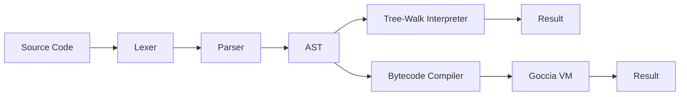

# GocciaScript


A drop of JavaScript — A subset of ECMAScript 2026+ implemented in FreePascal

It's based on the thought "What if we implement ECMAScript today, but without the quirks of early ECMAScript implementations". Features that are error-prone, redundant, or security risks are intentionally excluded. See [Language Restrictions](docs/language-restrictions.md) for the full rationale.

## Features

### Language Features

- **Variables**: `let` and `const` declarations (no `var`)
- **Functions**: Arrow functions only (no `function` keyword)
- **Classes**: Full class support with private fields (`#field`), static methods, getters/setters, inheritance, and decorators
- **Equality**: Strict equality only (`===` / `!==`)
- **Strict Mode**: Implicit — all code runs in strict mode
- **Template Literals**: String interpolation with `${expression}`
- **Destructuring**: Array and object destructuring patterns
- **Spread/Rest**: `...` operator for arrays, objects, and function parameters
- **Async/Await**: `async` arrow functions and methods, `await` expressions
- **Iteration**: `for...of` loops over iterables (arrays, strings, Sets, Maps, custom iterables)
- **Async Iteration**: `for await...of` loops over async iterables
- **Regular Expressions**: `RegExp`, regex literals, and string integration via `match`, `matchAll`, `replace`, `replaceAll`, `search`, and `split`
- **Modules**: ES6-style `import`/`export`
- **No `eval`**: Excluded for security
- **No `arguments`**: Use rest parameters (`...args`) instead

### ES6+ Features

| Feature | Example |
|---------|---------|
| Template strings | `` `Hello, ${name}!` `` |
| Object shorthand properties and methods | `{ x, y, method() {} }` |
| Computed property names | `{ [expr]: value }` |
| Nullish coalescing | `a ?? b` |
| Nullish coalescing assignment | `a ??= b` |
| Optional chaining | `obj?.prop?.method?.()` |
| Arrow functions | `(x) => x + 1` |
| Rest parameters | `(...args) => args` |
| Destructuring | `const { a, b } = obj` |
| Spread operator | `[...arr]`, `{ ...obj }` |
| Unicode escapes | `\uXXXX`, `\u{XXXXX}`, `\xHH` |
| Function `length` and `name` | `fn.length`, `fn.name` |
| `Symbol` | `Symbol("desc")`, `Symbol.iterator` |
| `Promise` | Constructor, `.then`/`.catch`/`.finally`, `all`/`allSettled`/`race`/`any` |
| `Object.freeze`, `Object.isFrozen` | Immutable objects |
| `Array.from`, `Array.of`, `Array.fromAsync` | Array construction (sync and async) |
| `async`/`await` | `async () => { await promise; }` |
| `for...of` | `for (const x of iterable) { ... }` |

### ECMAScript 2022–2025 Features

| Feature | Spec |
|---------|------|
| Private fields, methods, getters, setters | ES2022 |
| `Array.prototype.at` | ES2022 |
| `Object.hasOwn` | ES2022 |
| `structuredClone` | ES2022 |
| `Array.prototype.findLast`, `findLastIndex` | ES2023 |
| `Array.prototype.toReversed`, `toSorted`, `toSpliced`, `with` | ES2023 |
| `Object.groupBy`, `Map.groupBy` | ES2024 |
| `Promise.withResolvers` | ES2024 |
| `String.prototype.isWellFormed`, `toWellFormed` | ES2024 |
| Set methods: `union`, `intersection`, `difference`, `symmetricDifference`, `isSubsetOf`, `isSupersetOf`, `isDisjointFrom` | ES2025 |
| `Promise.try` | ES2025 |
| Iterator Helpers: `map`, `filter`, `take`, `drop`, `flatMap`, `forEach`, `reduce`, `toArray`, `some`, `every`, `find` | ES2025 |

### TC39 Proposals

GocciaScript implements several active TC39 proposals:

| Proposal | Stage | Description |
|----------|-------|-------------|
| [Decorators](https://github.com/tc39/proposal-decorators) | 3 | Class, method, field, getter/setter, auto-accessor decorators with `addInitializer` |
| [Decorator Metadata](https://github.com/tc39/proposal-decorator-metadata) | 3 | `Symbol.metadata` for decorator-attached class metadata with inheritance |
| [Types as Comments](https://tc39.es/proposal-type-annotations/) | 1 | TypeScript-style type annotations parsed by the frontend; in bytecode mode, annotations and inferred types provide runtime enforcement (reassignment to incompatible types throws `TypeError`) |
| [Enum Declarations](https://github.com/tc39/proposal-enum) | 0 | Frozen, null-prototype enum objects with `Symbol.iterator` |
| [Temporal](https://tc39.es/proposal-temporal/) | 3 | Modern date/time API (`Temporal.PlainDate`, `Temporal.Duration`, `Temporal.Instant`, etc.) |
| [`Math.clamp`](https://github.com/tc39/proposal-math-clamp) | 3 | Clamp a value to a range |
| [`Math.sumPrecise`](https://github.com/tc39/proposal-math-sum) | 3 | Precise summation of iterables using compensated algorithm |
| [`Map.prototype.getOrInsert`](https://github.com/tc39/proposal-upsert) | 3 | Get existing value or insert a default / computed value |
| [`Error.isError`](https://github.com/tc39/proposal-is-error) | 4 | Reliable brand check for error objects via `[[ErrorData]]` |

See [Language Restrictions](docs/language-restrictions.md) for details on supported syntax.

### Built-in Objects

`console`, `Math`, `JSON`, `JSON5`, `TOML`, `YAML`, `Object`, `Array`, `Number`, `String`, `RegExp`, `Symbol`, `Set`, `Map`, `Promise`, `Temporal`, `Iterator`, `ArrayBuffer`, `SharedArrayBuffer`, TypedArrays (`Int8Array`, `Uint8Array`, `Uint8ClampedArray`, `Int16Array`, `Uint16Array`, `Int32Array`, `Uint32Array`, `Float32Array`, `Float64Array`) with ArrayBuffer and SharedArrayBuffer backing, plus error constructors (`Error`, `TypeError`, `ReferenceError`, `RangeError`, `DOMException`).

See [Built-in Objects](docs/built-ins.md) for the complete API reference.

## Example

```javascript
class CoffeeShop {
  #name = "Goccia Coffee";
  #beans = ["Arabica", "Robusta", "Ethiopian"];
  #prices = { espresso: 2.5, latte: 4.0, cappuccino: 3.75 };

  getMenu() {
    return this.#beans.map((bean) => `${bean} blend`);
  }

  calculateTotal(order) {
    return order.reduce((total, item) => total + (this.#prices[item] ?? 0), 0);
  }

  get name() {
    return this.#name;
  }
}

const shop = new CoffeeShop();
const order = ["espresso", "latte"];
const total = shop.calculateTotal(order);

console.log(`Welcome to ${shop.name}!`);
console.log(`Your order total: $${total.toFixed(2)}`);
```

## Getting Started

### Prerequisites

- [FreePascal](https://www.freepascal.org/) compiler (`fpc`)
  - macOS: `brew install fpc`
  - Ubuntu/Debian: `sudo apt-get install fpc`
  - Windows: `choco install freepascal`

### Build

```bash
# Dev build of everything (default — debug info, heap trace, checks)
./build.pas

# Production build (O4, stripped, smart-linked)
./build.pas --prod

# Build specific components
./build.pas loader           # Dev build of script executor
./build.pas --prod loader    # Production build of script executor
./build.pas repl             # Interactive REPL
./build.pas testrunner       # Test runner
./build.pas benchmarkrunner  # Benchmark runner
```

### Run a Script

```bash
./build.pas loader && ./build/ScriptLoader example.js
printf "const x = 2 + 2; x;" | ./build/ScriptLoader
```

Script files may start with a Unix shebang line like `#!/usr/bin/env goccia`; GocciaScript ignores that first line during lexing.

### Run via Bytecode

GocciaScript includes a bytecode execution backend. The public bytecode artifact is `.gbc`, and WASM emission is not supported.

```bash
# Compile and execute via bytecode
./build/ScriptLoader example.js --mode=bytecode
printf "const x = 2 + 2; x;" | ./build/ScriptLoader --mode=bytecode

# Compile to .gbc bytecode file (no execution)
./build/ScriptLoader example.js --emit

# Custom output path
./build/ScriptLoader example.js --emit --output=out.gbc
printf "const x = 2 + 2; x;" | ./build/ScriptLoader --emit --output=out.gbc

# Load and execute a pre-compiled .gbc file
./build/ScriptLoader example.gbc

# Emit structured JSON for programmatic consumers
printf "console.log('hi'); 2 + 2;" | ./build/ScriptLoader --output=json

# Inject globals from the CLI
printf "x + y;" | ./build/ScriptLoader --global x=10 --global y=20
printf "name;" | ./build/ScriptLoader --globals=context.json --output=json
printf "name;" | ./build/ScriptLoader --globals=context.json5 --output=json
printf "name;" | ./build/ScriptLoader --globals=context.toml --output=json
printf "name;" | ./build/ScriptLoader --globals=context.yaml --output=json
# `--global name=value` parses inline values as JSON only; `--globals=file` accepts JSON, JSON5, TOML, or YAML by file extension.
# Injected globals can override earlier injected values, but not built-in globals like console

# Abort long-running scripts
printf "const f = () => f(); f();" | ./build/ScriptLoader --timeout=100
```

See [Bytecode VM](docs/bytecode-vm.md) for the current bytecode backend architecture.

### Start the REPL

```bash
./build.pas repl && ./build/REPL
```

### Run Tests

GocciaScript has 3400+ JavaScript unit tests covering language features, built-in objects, and edge cases.

```bash
# Run all tests (GocciaScript TestRunner)
./build.pas testrunner && ./build/TestRunner tests

# Run a specific test
./build.pas testrunner && ./build/TestRunner tests/language/expressions/addition/basic-addition.js

# Run tests in standard JavaScript (Vitest) for cross-compatibility
npx vitest run
```

### Run Benchmarks

```bash
# Run all benchmarks
./build.pas benchmarkrunner && ./build/BenchmarkRunner benchmarks

# Run a specific benchmark
./build/BenchmarkRunner benchmarks/fibonacci.js

# Run a benchmark from stdin
printf 'suite("stdin", () => { bench("sum", { run: () => 1 + 1 }); });\n' | ./build/BenchmarkRunner

# Export as JSON or CSV
./build/BenchmarkRunner benchmarks --format=json --output=results.json
./build/BenchmarkRunner benchmarks --format=csv --output=results.csv
```

The benchmark runner auto-calibrates iterations per benchmark, reports ops/sec with variance (CV%) and engine-level timing breakdown (lex/parse/execute). Output formats: `console` (default), `text`, `csv`, `json`. Calibration and measurement parameters are configurable via environment variables — see [Benchmarks](docs/benchmarks.md) for details.

## Quick Tour

GocciaScript looks like modern JavaScript — with a few intentional differences. Here's a taste of the language.

**Arrow functions only** — no `function` keyword:

```javascript
const greet = (name) => `Hello, ${name}!`;
const add = (a, b) => a + b;
```

**No traditional loops** — use array methods and `for...of`:

```javascript
const numbers = [1, 2, 3, 4, 5];
const doubled = numbers.map((n) => n * 2);
const sum = numbers.reduce((total, n) => total + n, 0);

for (const n of numbers) {
  console.log(n);
}
```

**Classes** with private fields, getters, and inheritance:

```javascript
class Account {
  #balance = 0;

  deposit(amount) {
    this.#balance = this.#balance + amount;
  }

  get balance() {
    return this.#balance;
  }
}
```

**Modules** with named imports/exports (no default exports):

```javascript
// math.js
export const add = (a, b) => a + b;

// app.js
import { add } from "./math.js";
```

The CLI tools share WHATWG-style import map support with `--import-map=<file.json>`, `--alias key=value`, and automatic `goccia.json` discovery for project-level module aliases.

Structured data files can also be consumed directly:

```javascript
import { name, version } from "./package.json";
import { name as packageName, debug } from "./config.toml";
import { name as appName, debug } from "./config.yaml";
import { "0" as firstDoc, "1" as secondDoc } from "./multi.yaml";
import { "0" as firstRecord, "1" as secondRecord } from "./events.jsonl";
```

For JSON5 in runtime code, use the built-in parser:

```javascript
const config = JSON5.parse(sourceText);
const formatted = JSON5.stringify(
  { host: "localhost", retries: Infinity, enabled: true },
  { space: 2, quote: '"' },
);
```

For TOML in runtime code, use the built-in parser:

```javascript
const config = TOML.parse(sourceText);
```

If you want a YAML stream as an array in runtime code instead of module exports, use the explicit document parser:

```javascript
const docs = YAML.parseDocuments(sourceText);
```

`YAML.parse(sourceText)` also returns an array when the input uses explicit `---` document markers, matching Bun's YAML runtime behavior.

`TOML.parse(sourceText)` parses TOML 1.1.0 configuration data into normal Goccia values. TOML date/time values currently map to validated string scalars in runtime code and module imports, which keeps the v1 surface stable while leaving room for future Temporal interop.

The TOML surface is also checked against the official `toml-test` corpus in CI across the supported platform matrix. You can rerun the official suite locally with `python3 scripts/run_toml_test_suite.py`, or reuse a prebuilt decoder with `python3 scripts/run_toml_test_suite.py --harness=./build/GocciaTOMLCheck`.

JSONL is also available both as a runtime parser and as a structured-data module format:

```javascript
const records = JSONL.parse('{"id":1}\n{"id":2}\n');
const chunk = JSONL.parseChunk('{"id":1}\n{"id":');
```

`.jsonl` module imports expose each non-empty line as a zero-based string export (`"0"`, `"1"`, ...), keeping the import surface consistent with string-literal named imports and multi-document structured-data modules.

The current YAML surface already handles common configuration files, including mappings, sequences, block and multiline flow collections (including single-pair mapping items like `[foo: bar]`, empty implicit keys, trailing commas, and stricter rejection of malformed empty interior entries), anchors, aliases, merge keys, self-referential alias graphs for mappings and sequences, block scalars (`|`, `>`, chomping modifiers, and indentation indicators), multiline plain and quoted scalar folding, YAML 1.2 numeric scalar resolution (including base-prefixed integers, exponent forms, and validated digit separators), YAML double-quoted escapes (`\x`, `\u`, `\U`, line continuations, and YAML-specific escapes), and document directives/tags such as `%YAML`, `%TAG`, `!!str`, `!!int`, `!!float`, `!!bool`, `!!null`, `!!seq`, `!!map`, `!!timestamp`, and `!!binary`. Directives are still validated as document-preamble syntax, so they are rejected if they appear after document content without an intervening document boundary.

Tagged values now preserve runtime metadata through `.tagName` and `.value`. Custom tags wrap the parsed underlying value instead of being discarded, while `!!timestamp` validates ISO date/date-time input and `!!binary` validates and decodes base64 payloads.

Explicit keys (`? key`) are also supported, including omitted explicit values and zero-indented sequence values. Non-scalar YAML keys are canonicalized into stable JSON-like strings at parse time so mappings remain representable as Goccia objects, and anchored mapping keys now parse instead of being rejected outright.

YAML support is being built with two explicit compatibility goals:
- Full YAML 1.2 compatibility
- Bun-compatible runtime/module semantics where they make sense in GocciaScript

The current implementation is still incremental and does not yet cover the full YAML 1.2 surface. The detailed conformance snapshot and remaining gap clusters live in [docs/design-decisions.md](docs/design-decisions.md). The official `yaml-test-suite` parse-validity check can be rerun locally with `python3 scripts/run_yaml_test_suite.py`.

JSON5 parsing is checked against the official `json5/json5` parser test corpus, and the same compliance command also runs the upstream-aligned JSON5 stringify suite. You can rerun that combined check locally with `python3 scripts/run_json5_test_suite.py`, or reuse a prebuilt parser decoder with `python3 scripts/run_json5_test_suite.py --harness=./build/GocciaJSON5Check`. The stringify half covers special numeric values (`Infinity`, `-Infinity`, `NaN`), trailing-comma pretty printing, replacers, boxed primitives, and JSON5 quote selection/overrides.

**Async/await** with full Promise support:

```javascript
const fetchData = async () => {
  const result = await Promise.resolve({ status: "ok" });
  return result;
};
```

**Strict equality only** — `===` and `!==` (no `==` or `!=`).

For a full guided walkthrough, see the [Tutorial](docs/tutorial.md). For the complete list of what's supported and excluded, see [Language Restrictions](docs/language-restrictions.md).

## Architecture

GocciaScript supports two execution backends that share the same frontend (lexer, parser, AST):


```mermaid
flowchart LR
    Source["Source Code"] --> Lexer --> Parser --> AST
    AST --> Interpreter["Tree-Walk Interpreter"] --> Result1["Result"]
    AST --> Compiler["Bytecode Compiler"] --> VM["Goccia VM"] --> Result2["Result"]
```

### Tree-Walk Interpreter (default)

| Component | File | Role |
|-----------|------|------|
| Engine | `Goccia.Engine.pas` | Top-level orchestration, built-in registration |
| JSX Transformer | `Goccia.JSX.Transformer.pas` | Optional pre-pass converting JSX to `createElement` calls |
| Lexer | `Goccia.Lexer.pas` | Tokenization |
| Parser | `Goccia.Parser.pas` | Recursive descent AST construction |
| Interpreter | `Goccia.Interpreter.pas` | Execution orchestration, module loading |
| Evaluator | `Goccia.Evaluator.pas` | Pure-function AST evaluation |
| GC | `GarbageCollector.Generic.pas` | Mark-and-sweep garbage collection (`TGarbageCollector`) |

### Goccia VM (`--mode=bytecode`)

| Component | File | Role |
|-----------|------|------|
| Compiler | `Goccia.Compiler.pas` | AST → Goccia bytecode |
| VM | `Goccia.VM.pas` | Register-based bytecode execution on `TGocciaValue` |
| Bytecode Units | `Goccia.Bytecode*.pas` | Opcode definitions, templates, modules, debug info, binary I/O |
| VM | `Goccia.VM*.pas` | Register-based execution on `TGocciaValue` |
| Backend | `Goccia.Engine.Backend.pas` | Bytecode backend orchestration |
| Binary I/O | `Goccia.Bytecode.Binary.pas` | `.gbc` file serialization/deserialization |

The bytecode backend is a Goccia-owned VM surface with shared runtime objects across interpreter and bytecode mode.

See [Architecture](docs/architecture.md) for the interpreter deep-dive and [Bytecode VM](docs/bytecode-vm.md) for the bytecode VM architecture.

## Design Principles

- **Explicitness**: Modules, classes, methods, and properties use explicit, descriptive names even at the cost of verbosity. Shortcuts are avoided.
- **OOP over everything**: Rely on type safety of specialized classes rather than generic data structures.
- **Define vs Assign**: `Define` creates a new variable binding; `Assign` changes an existing one. These are distinct operations throughout the codebase.
- **Pure evaluation**: The evaluator is composed of pure functions with no side effects.
- **No global mutable state**: All runtime state flows through explicit parameters — the evaluation context, the scope chain, and value objects.
- **Virtual dispatch**: Property access (`GetProperty`/`SetProperty`), type discrimination (`IsPrimitive`/`IsCallable`), and scope chain resolution (`GetThisValue`/`GetOwningClass`/`GetSuperClass`) all use virtual methods, replacing type checks with single VMT calls.

See [Design Decisions](docs/design-decisions.md) for the complete rationale.

## Documentation

| Document | Description |
|----------|-------------|
| [Tutorial](docs/tutorial.md) | Your first GocciaScript program — a guided walkthrough for newcomers |
| [Language Restrictions](docs/language-restrictions.md) | Supported and excluded features with rationale |
| [Built-in Objects](docs/built-ins.md) | Available built-ins, API reference, adding new ones |
| [Architecture](docs/architecture.md) | Pipeline overview, component responsibilities, data flow |
| [Bytecode VM](docs/bytecode-vm.md) | Bytecode VM architecture, binary format, and core runtime model |
| [Design Decisions](docs/design-decisions.md) | Rationale behind key technical choices |
| [Code Style](docs/code-style.md) | Naming conventions, patterns, file organization |
| [Value System](docs/value-system.md) | Type hierarchy, virtual property access, primitives, objects |
| [Adding Built-in Types](docs/adding-built-in-types.md) | Step-by-step guide for adding new built-in types |
| [Embedding the Engine](docs/embedding.md) | Embedding GocciaScript in FreePascal applications |
| [Testing](docs/testing.md) | Test organization, writing tests, running tests |
| [Benchmarks](docs/benchmarks.md) | Benchmark runner, output formats, writing benchmarks |
| [Build System](docs/build-system.md) | Build commands, compiler configuration, CI/CD |
| [AGENTS.md](AGENTS.md) | Instructions for AI coding assistants |

## Contributing

### Editor Setup

Open the project in **VSCode** or **Cursor** and accept the prompt to install recommended extensions. This gives you:

- Pascal syntax highlighting and code navigation
- Auto-formatting on save via `./format.pas`
- EditorConfig support for consistent whitespace

No manual configuration needed — `.vscode/settings.json` and `.vscode/extensions.json` are included in the repository.

### Pre-commit Hook

Install [Lefthook](https://github.com/evilmartians/lefthook) to enable the pre-commit auto-formatter:

```bash
brew install lefthook   # macOS — see docs/code-style.md for other platforms
lefthook install
```

See [Code Style](docs/code-style.md) for conventions, editor configuration, and [AGENTS.md](AGENTS.md) for the full development workflow.

## License

See [LICENSE](LICENSE) for details.
