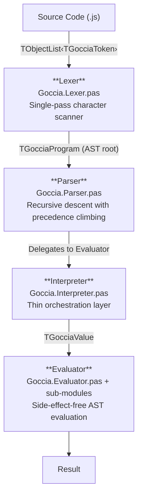
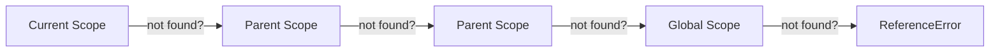
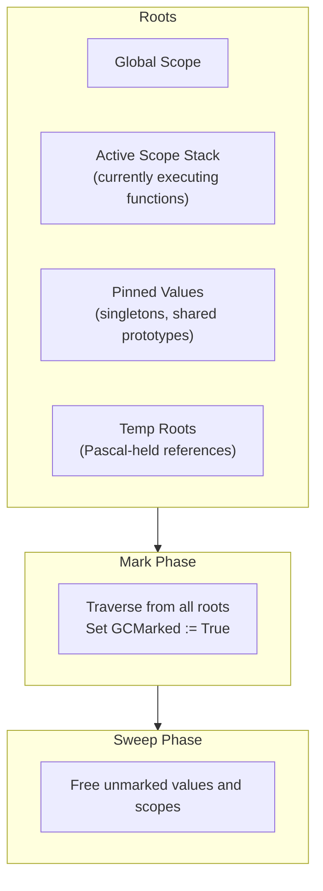

# Architecture

GocciaScript follows a classic interpreter pipeline: source code flows through lexing, parsing, and evaluation stages before producing a result. The system is implemented in FreePascal using object-oriented design with virtual method dispatch.

## Pipeline Overview



The **Engine** (`Goccia.Engine.pas`) sits above this pipeline and orchestrates the entire process: it creates the interpreter, registers built-in globals, initializes the garbage collector, invokes the lexer/parser, and hands the AST to the interpreter for execution.

## Component Responsibilities

### Engine (`Goccia.Engine.pas`)

The top-level entry point. Provides static convenience methods (`RunScript`, `RunScriptFromFile`, `RunScriptFromStringList`) and manages:

- **Garbage collector initialization** — Calls `TGocciaGC.Initialize`, registers the global scope as a GC root, and pins singleton values (`UndefinedValue`, `TrueValue`, `NaNValue`, `SmallInt` cache, etc.).
- **Built-in registration** — Selectively registers globals (`console`, `Math`, `JSON`, `Object`, `Array`, `Number`, `String`, `Symbol`, `Set`, `Map`, error constructors) based on a `TGocciaGlobalBuiltins` flag set.
- **Interpreter lifecycle** — Creates and owns the `TGocciaInterpreter` instance.
- **Prototype chain setup** — Calls `RegisterBuiltinConstructors` to wire up the `Object → Array → Number → String` prototype chain.

The configurable built-in system allows different execution contexts (e.g., the TestRunner enables `ggTestAssertions` to inject `describe`, `test`, and `expect`).

### Lexer (`Goccia.Lexer.pas`)

A single-pass tokenizer that converts source text into a flat list of `TGocciaToken` objects. Key features:

- **Keyword lookup** — Uses a shared `TDictionary<string, TGocciaTokenType>` (initialized once as a class variable) for O(1) keyword identification instead of a linear if-else chain.
- **String scanning** — Uses `TStringBuilder` for O(n) string literal and template literal assembly, avoiding O(n^2) repeated string concatenation.
- **Number formats** — Decimal, hexadecimal (`0x`), binary (`0b`), octal (`0o`), scientific notation.
- **Template literals** — Special handling for backtick strings with `${...}` interpolation.
- **Unicode identifiers** — Supports Unicode characters (including emoji) in identifier names.
- **Unicode/hex escape sequences** — `\uXXXX` (4-digit), `\u{XXXXX}` (variable-length), and `\xHH` (hex byte) escape sequences in strings and template literals, with full UTF-8 encoding for code points up to U+10FFFF.
- **Comments** — Skips single-line (`//`) and block (`/* */`) comments.
- **Error reporting** — Produces `TGocciaLexerError` with line and column information.

### Parser (`Goccia.Parser.pas`)

A recursive descent parser that builds an AST from the token stream. Implements:

- **Operator precedence** via precedence climbing (assignment → conditional → logical → comparison → addition → multiplication → exponentiation → unary → call → primary).
- **ES6+ syntax** — Arrow functions, template literals, destructuring patterns (array and object), spread/rest operators, rest parameters (`...args`), optional chaining (`?.`), computed property names, shorthand properties, classes with private fields, private/public getters/setters, and static members. Reserved words are accepted as property names in object literals and member expressions. The parser tracks instance property declaration order for correct initialization semantics.
- **Shared parameter parsing** — A single `ParseParameterList` method handles parameter parsing for arrow functions, class methods, and object method shorthand, supporting rest parameters, destructuring patterns, and default values uniformly.
- **Error recovery** — Throws `TGocciaSyntaxError` with source location for diagnostics.
- **Arrow function detection** — Uses lookahead (`IsArrowFunction`) to disambiguate parenthesized expressions from arrow function parameters.

### AST (`Goccia.AST.Node.pas`, `Goccia.AST.Expressions.pas`, `Goccia.AST.Statements.pas`)

The Abstract Syntax Tree is structured into three layers:

- **Node** — Base `TGocciaNode` with location tracking.
- **Expressions** — Literals, binary/unary operations, member access, calls, arrow functions, template literals, class expressions, destructuring patterns, spread elements, etc.
- **Statements** — Variable declarations, blocks, if/else, switch/case/break, return, throw, try-catch-finally, import/export, class declarations.

### Interpreter (`Goccia.Interpreter.pas`)

A thin orchestration layer that:

- Owns the **global scope** (`TGocciaScope`).
- Delegates AST evaluation to the Evaluator.
- Manages **module loading** and caching (ES6-style imports). Each module executes in its own isolated child scope (`skModule`) of the global scope, preventing module-internal variables from leaking.
- Supports **hot module reloading** for development (`CheckForModuleReload`).

### Evaluator (`Goccia.Evaluator.pas` + sub-modules)

The largest component. Implements the actual semantics of the language as **pure functions** — given an AST node and an evaluation context, it returns a `TGocciaValue` without side effects. The evaluator is split into focused sub-modules:

| Module | Responsibility |
|--------|---------------|
| `Goccia.Evaluator.pas` | Core dispatch, expressions, statements, classes, function name inference |
| `Goccia.Evaluator.Arithmetic.pas` | `+` (uses `ToPrimitive`), `-`, `*`, `/`, `%` (float), `**`, compound assignment dispatch |
| `Goccia.Evaluator.Bitwise.pas` | `&`, `\|`, `^`, `<<`, `>>`, `>>>` |
| `Goccia.Evaluator.Comparison.pas` | `===`, `!==`, `<`, `>`, `<=`, `>=` |
| `Goccia.Evaluator.Assignment.pas` | `=`, `+=`, `-=`, property assignment, compound property assignment, `DefinePropertyOnValue` |
| `Goccia.Evaluator.TypeOperations.pas` | `typeof`, `instanceof`, `in`, `delete` |
| `Goccia.Values.ToPrimitive.pas` | ECMAScript `ToPrimitive` abstract operation |
| `Goccia.Values.ErrorHelper.pas` | `ThrowTypeError`, `ThrowRangeError`, etc. — centralized error construction |

Shared helper functions reduce duplication across the evaluator:

- **`CopyStatementList`** — Creates a non-owning copy of an AST statement list (used by getters, setters, arrow functions, and class methods to avoid ownership conflicts).
- **`DefinePropertyOnValue`** — Defines a property with a full descriptor on objects, falling back to `SetProperty` for non-objects.

Evaluation state is threaded through a `TGocciaEvaluationContext` record that carries the current scope, error handler callback, and module loader reference. The `OnError` callback is also propagated onto `TGocciaScope`, so closures inherit error handling from their defining scope without needing global mutable state.

## Data Flow

### Script Execution

```mermaid
flowchart TD
    Run["TGocciaEngine.RunScript(Code)"]
    Run --> Create["Create TGocciaInterpreter"]
    Run --> Register["RegisterBuiltIns(GlobalScope)"]
    Register --> Console["RegisterConsole → console.log, etc."]
    Register --> Math["RegisterMath → Math.PI, Math.floor, etc."]
    Register --> JSON["RegisterJSON → JSON.parse, JSON.stringify"]
    Register --> Globals["RegisterGlobals → undefined, NaN, Infinity, Error, ..."]
    Register --> GArray["RegisterGlobalArray → Array.isArray, Array.from, Array.of"]
    Register --> GNumber["RegisterGlobalNumber → Number.parseInt, constants, ..."]
    Register --> GSymbol["RegisterSymbol → Symbol, Symbol.for, Symbol.iterator"]
    Register --> GSet["RegisterSet → Set constructor"]
    Register --> GMap["RegisterMap → Map constructor"]
    Register --> Constructors["RegisterBuiltinConstructors → prototype chains"]
    Run --> Lex["TGocciaLexer.Create(Code).ScanTokens → Tokens"]
    Run --> Parse["TGocciaParser.Create(Tokens).Parse → AST"]
    Run --> Exec["TGocciaInterpreter.Execute(AST) → Result"]
    Exec --> Eval["Evaluate(AST.Body, Context) → TGocciaValue"]
```



### Variable Lookup

Variable resolution follows the scope chain — a chain-of-responsibility pattern:



Each scope maintains a dictionary of `TGocciaLexicalBinding` entries that track:
- The value itself
- Declaration type (`let`, `const`, or parameter)
- Whether the binding has been initialized (for Temporal Dead Zone enforcement)

Special scope bindings used internally:
- **`__super__`** — Set in method call scopes when a superclass exists, enabling `super` calls.
- **`__owning_class__`** — Set in method call scopes and instance initialization scopes, identifying which class declared the current method. Used to resolve private fields to the correct class when inheritance shadowing is involved.

## Module System

The interpreter supports ES6-style `import`/`export` with module caching and scope isolation:

1. `import { x } from './module.js'` triggers `LoadModule`.
2. The module is lexed, parsed, and executed in an isolated child scope (`skModule`) of the global scope. This prevents module-internal variables from leaking into the global scope or other modules.
3. Exported bindings are extracted from the module scope (not the global scope) and bound in the importing scope.
4. Modules are cached by resolved path to avoid re-evaluation.
5. `CheckForModuleReload` supports development-time hot reloading.

Scope hierarchy for a module import:

```
GlobalScope (built-ins, main script variables)
├── ModuleScope:./lib.js (module-internal variables, isolated)
└── (main script continues with imported bindings)
```

## Error Handling

Errors are handled through three mechanisms:

1. **Pascal exceptions** — `TGocciaLexerError`, `TGocciaSyntaxError` for compile-time errors.
2. **Error callback pattern** — The evaluator uses an `OnError` callback (via `TGocciaEvaluationContext`) for runtime errors, keeping evaluator functions pure.
3. **JavaScript-level errors** — `TGocciaError` values (`Error`, `TypeError`, `ReferenceError`, `RangeError`) implement the JavaScript error semantics, propagated via `TGocciaThrowValue`. Error construction is centralized in `Goccia.Values.ErrorHelper.pas` which provides `ThrowTypeError`, `ThrowRangeError`, `ThrowReferenceError`, and `CreateErrorObject` helpers used across the codebase.

## Memory Management

GocciaScript uses a **mark-and-sweep garbage collector** (`Goccia.GarbageCollector.pas`) to manage the lifecycle of runtime values. FreePascal provides manual memory management, but GocciaScript values have complex ownership patterns (closures, shared prototypes, aliased references across scopes) that make manual `Free` calls impractical.

### GC Architecture



### Value Categories

| Category | Lifetime | Mechanism |
|----------|----------|-----------|
| **AST literals** | AST-owned (script lifetime) | Unregistered from GC; evaluator calls `RuntimeCopy` to produce GC-managed copies |
| **Singletons** | Permanent (process lifetime) | Pinned via `TGocciaGC.Instance.PinValue` during engine init |
| **Runtime values** | Dynamic (collected when unreachable) | Registered via `AfterConstruction`, freed during sweep |
| **Pascal-held values** | Temporary (explicit protection) | `AddTempRoot` / `RemoveTempRoot` |

### Registration

All `TGocciaValue` instances auto-register with the GC in `AfterConstruction`. All `TGocciaScope` instances register in their constructor. The GC tracks both in separate managed lists.

### Collection Trigger

The GC exposes `Collect` (explicit) and `CollectIfNeeded` (threshold-based, triggered after a configurable number of allocations). The benchmark runner calls `Collect` before each measurement round to normalize heap state and reduce timing variance.
