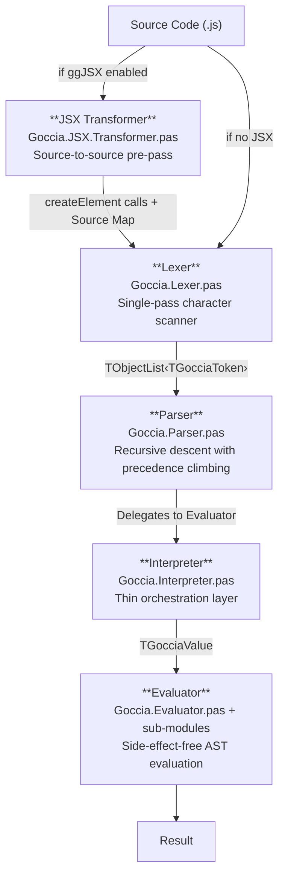
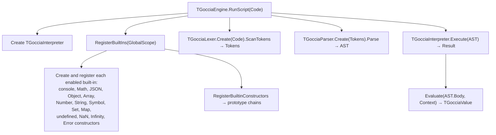
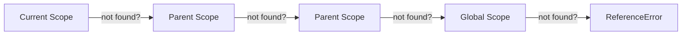
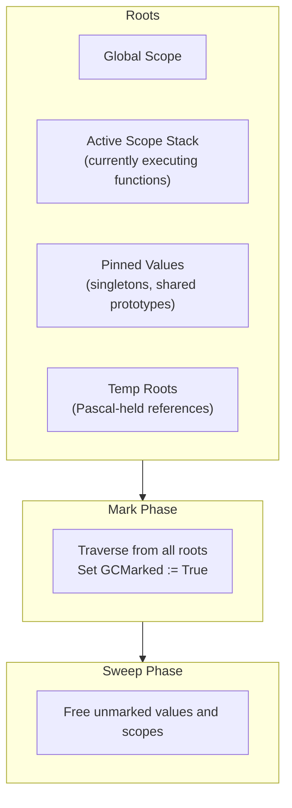

# Architecture

GocciaScript follows a classic interpreter pipeline: source code flows through lexing, parsing, and evaluation stages before producing a result. The system is implemented in FreePascal using object-oriented design with virtual method dispatch.

## Pipeline Overview



The **Engine** (`Goccia.Engine.pas`) sits above this pipeline and orchestrates the entire process: it creates the interpreter, registers built-in globals, initializes the garbage collector, invokes the lexer/parser, and hands the AST to the interpreter for execution.

## Component Responsibilities

### Engine (`Goccia.Engine.pas`)

The top-level entry point. Provides static convenience methods (`RunScript`, `RunScriptFromFile`, `RunScriptFromStringList`) and manages:

- **Garbage collector initialization** — Calls `TGocciaGarbageCollector.Initialize`, registers the global scope as a GC root, and pins singleton values via `PinSingletons` (`UndefinedValue`, `TrueValue`, `NaNValue`, `SmallInt` cache, etc.).
- **Built-in registration** — A single `RegisterBuiltIns` method selectively creates and registers globals (`console`, `Math`, `JSON`, `Object`, `Array`, `Number`, `String`, `Symbol`, `Set`, `Map`, error constructors) based on a `TGocciaGlobalBuiltins` flag set. All built-in constructors share the same `(name, scope, ThrowError)` signature.
- **Interpreter lifecycle** — Creates and owns the `TGocciaInterpreter` instance.
- **Module resolver** — Creates a default `TGocciaModuleResolver` (base directory = entry script directory) and passes it to the interpreter. Accepts an optional custom resolver via a constructor overload; when injected, the engine does not own it. Exposes `AddAlias` and `RegisterGlobalModule` convenience methods.
- **Prototype chain setup** — Calls `RegisterBuiltinConstructors` to wire up the `Object → Array → Number → String` prototype chain.
- **`globalThis` registration** — After all built-ins are registered, `RegisterGlobalThis` creates a `TGocciaObjectValue` populated with all current global scope bindings, adds a self-referential `globalThis` property, and binds it as `const` in the global scope.
- **`GocciaScript` global** — `RegisterGocciaScriptGlobal` creates a `const` object with `version` (from `Goccia.Version`), `commit` (short git hash), and `builtIns` (array of enabled `TGocciaGlobalBuiltin` flag names, derived via RTTI).

The configurable built-in system allows different execution contexts (e.g., the TestRunner enables `ggTestAssertions` to inject `describe`, `test`, and `expect`).

### JSX Transformer (`Goccia.JSX.Transformer.pas` + `Goccia.JSX.SourceMap.pas`)

An opt-in source-to-source pre-pass that converts JSX syntax into standard `createElement` function calls before the main pipeline. Activated by including `ggJSX` in the engine's globals set. Key design:

- **Standalone** — Does not modify the lexer, parser, AST, or evaluator. Produces standard JavaScript that the existing pipeline processes normally.
- **Mini-scanner** — A character-level scanner copies non-JSX source verbatim (strings, comments, template literals, identifiers, operators). Tracks `FLastTokenKind` (expression-end vs. operator) to disambiguate `<` as JSX vs. comparison.
- **JSX code generation** — Transforms JSX elements into `createElement(tag, props, ...children)` calls. Lowercase tags produce string names; uppercase tags are passed as identifier references. Attributes are emitted as object literals (or `Object.assign` when spreads are present).
- **Shorthand props** — `<div {value} />` is equivalent to `<div value={value} />`, providing concise attribute shorthand for identifiers.
- **Recursive JSX** — Supports JSX nested inside expression children (`{<span />}`), attribute values (`content={<span />}`), and deeply nested element trees.
- **Pragma support** — `@jsxFactory` and `@jsxFragment` pragma comments at the top of a file override the default `createElement`/`Fragment` names (e.g., `/* @jsxFactory h */`).
- **Internal source map** — `TGocciaSourceMap` stores `(outputLine, outputCol) → (sourceLine, sourceCol)` mappings. The engine catches errors and translates positions back to the original source via binary search with column interpolation.
- **Enabled by default** — `ggJSX` is included in `DefaultGlobals`. To disable, exclude it from the globals set.

### Lexer (`Goccia.Lexer.pas`)

A single-pass tokenizer that converts source text into a flat list of `TGocciaToken` objects. Key features:

- **Keyword lookup** — Uses a shared `TDictionary<string, TGocciaTokenType>` (initialized once as a class variable) for O(1) keyword identification instead of a linear if-else chain.
- **String scanning** — Uses `TStringBuilder` for O(n) string literal and template literal assembly, avoiding O(n^2) repeated string concatenation.
- **Shared escape handling** — A `ProcessEscapeSequence` method handles common escape sequences (`\n`, `\t`, `\r`, `\\`, `\0`, `\uXXXX`, `\u{XXXXX}`, `\xHH`) shared between string and template literal scanning. String-specific (`\'`, `\"`) and template-specific (`` \` ``, `\$`) escapes remain in their respective scan methods.
- **Number formats** — Decimal, hexadecimal (`0x`), binary (`0b`), octal (`0o`), scientific notation.
- **Template literals** — Special handling for backtick strings with `${...}` interpolation.
- **Unicode identifiers** — Supports Unicode characters (including emoji) in identifier names.
- **Comments** — Skips single-line (`//`) and block (`/* */`) comments.
- **Error reporting** — Produces `TGocciaLexerError` with line and column information.

### Parser (`Goccia.Parser.pas`)

A recursive descent parser that builds an AST from the token stream. Implements:

- **Operator precedence** via precedence climbing (assignment → conditional → logical → comparison → addition → multiplication → exponentiation → unary → call → primary). A shared `ParseBinaryExpression(NextLevel, Operators)` helper eliminates duplication across all 11 left-associative binary operator parsers — each is a single-line delegation.
- **ES6+ syntax** — Arrow functions, template literals, destructuring patterns (array and object), spread/rest operators, rest parameters (`...args`), optional chaining (`?.`), computed property names, shorthand properties, classes with private fields, private/public getters/setters, and static members. Reserved words are accepted as property names in object literals and member expressions. The parser tracks instance property declaration order for correct initialization semantics.
- **Types as Comments** — Full support for the TC39 Types as Comments proposal. Type annotations on variables, parameters (simple, optional, rest, destructuring), return types, class fields, class generics, `implements` clauses, catch parameters, and `as Type`/`as const` assertions are parsed and collected on AST nodes but ignored at runtime. `type`/`interface` declarations and `import type`/`export type` statements are skipped entirely, producing `TGocciaEmptyStatement` nodes. Access modifiers (`public`, `protected`, `private`, `readonly`, `override`, `abstract`) in class bodies are consumed and discarded. Helper methods `CollectTypeAnnotation` and `CollectGenericParameters` handle balanced-bracket type text collection with configurable terminator tokens.
- **Shared parsing helpers** — `ParseParameterList` handles parameter parsing for arrow functions, class methods, and object method shorthand. `ParseGetterExpression` and `ParseSetterExpression` handle accessor parsing for both object literals and class bodies. `ParseObjectMethodBody` handles method shorthand in object literals.
- **Unsupported feature recovery** — `for`, `while`, `do...while`, `var`, and `with` statements are parsed as no-ops (`TGocciaEmptyStatement`) with a warning. `SkipBalancedParens` tracks parenthesis depth to correctly skip conditions containing nested parentheses (e.g., `for (let i = fn(x); ...)`). `SkipStatementOrBlock` skips the statement body (single statement or `{...}` block).
- **Error recovery** — Throws `TGocciaSyntaxError` with source location for diagnostics.
- **Arrow function detection** — Uses lookahead (`IsArrowFunction`) to disambiguate parenthesized expressions from arrow function parameters. The lookahead understands type annotations (`?`, `:Type`, `:ReturnType`) to correctly identify typed arrow functions.

### Reserved Keywords (`Goccia.Keywords.Reserved.pas`)

A dependency-free unit that centralizes all 33 reserved JavaScript keyword string constants (`KEYWORD_THIS`, `KEYWORD_SUPER`, `KEYWORD_VAR`, `KEYWORD_WITH`, etc.). Reserved keywords always produce a dedicated token type and cannot be used as identifiers. Used by the lexer, evaluator, and scope units. Note: `undefined` is not a keyword — it is a global property registered via `Goccia.Builtins.Globals`.

### Contextual Keywords (`Goccia.Keywords.Contextual.pas`)

A dependency-free unit that centralizes all 12 contextual keyword string constants (`KEYWORD_GET`, `KEYWORD_SET`, `KEYWORD_TYPE`, `KEYWORD_INTERFACE`, `KEYWORD_IMPLEMENTS`, etc.). Contextual keywords have special meaning only in specific syntactic positions but are otherwise valid identifiers. Used by the lexer and parser.

### Microtask Queue (`Goccia.MicrotaskQueue.pas`)

A singleton microtask queue used by Promises and `queueMicrotask()` to defer callbacks per the ECMAScript specification. Key design:

- **Singleton** — `TGocciaMicrotaskQueue.Initialize` / `TGocciaMicrotaskQueue.Instance`, mirroring the `TGocciaGarbageCollector` pattern.
- **Enqueue** — When a Promise settles and has pending reactions (or when `.then()` is called on an already-settled Promise), the reaction is enqueued as a microtask rather than executed immediately. The global `queueMicrotask(callback)` function also enqueues directly into this queue.
- **DrainQueue** — Called by the engine after `Interpreter.Execute` completes. Processes microtasks in FIFO order, looping until the queue is empty. New microtasks enqueued during processing (e.g., chained `.then()` handlers or nested `queueMicrotask` calls) are processed in the same drain cycle.
- **ClearQueue** — Discards all pending microtasks without executing them. Called in `finally` blocks by `Execute` and `ExecuteProgram` to prevent stale callbacks from leaking across executions if a script throws.
- **GC safety** — Each microtask's handler, value, and result promise are temp-rooted during processing to prevent collection mid-callback.
- **Error handling** — Promise reaction errors reject the downstream promise. `queueMicrotask` callback errors have no associated promise and are silently discarded (matching how unhandled Promise rejections are handled). The queue keeps draining after an error.

#### Execution Model

GocciaScript uses a synchronous execution model. The entire script is one **macrotask**, and the microtask queue drains immediately after it completes. This matches the ECMAScript specification: in any JavaScript engine, microtasks (Promise callbacks) execute after the current macrotask finishes, not interleaved with synchronous code.

```
Script execution (macrotask)     →  Microtask queue drains
├── sync code runs to completion     ├── .then() callbacks fire (FIFO)
├── Promise executors run sync       ├── queueMicrotask callbacks fire (FIFO)
├── .then() handlers are enqueued    ├── new microtasks from callbacks
└── queueMicrotask() enqueues        └── repeat until queue is empty
```

This follows the ECMAScript specification's microtask ordering semantics. Thenable adoption (resolving a Promise with another Promise) is deferred via a microtask rather than resolved synchronously, matching the spec's PromiseResolveThenableJob. The only scenario where interleaving would differ from a full engine is with multiple macrotask sources (`setTimeout`, I/O callbacks), which GocciaScript does not implement. The test framework and benchmark runner also drain the microtask queue after each test callback / measurement round, respectively.

### Timing Utilities (`TimingUtils.pas`)

A cross-platform timing unit providing monotonic clocks, a wall-clock epoch source, and duration formatting:

- **`GetNanoseconds`** — Monotonic timestamp in nanoseconds. Uses `clock_gettime(CLOCK_MONOTONIC)` on Unix/macOS (native ns resolution, declared as external C function with platform-specific constant: 6 on Darwin, 1 on Linux) and `QueryPerformanceCounter`/`QueryPerformanceFrequency` on Windows (sub-μs hardware counter, converted to ns). Falls back to `GetTickCount64 * 1000000` on other platforms.
- **`GetMilliseconds`** — Monotonic timestamp in milliseconds. Convenience wrapper: `GetNanoseconds div 1000000`.
- **`GetEpochNanoseconds`** — Wall-clock epoch nanoseconds since Unix epoch (1970-01-01T00:00:00Z). Uses `clock_gettime(CLOCK_REALTIME)` on Unix/macOS, `GetSystemTimeAsFileTime` on Windows (100-ns FILETIME intervals converted to ns), and `DateTimeToUnix(Now)` as fallback. Used by `Temporal.Now.instant()` for nanosecond-precision epoch timestamps.
- **`FormatDuration(Nanoseconds)`** — Auto-formats a duration: values below 0.5μs display as `ns` (e.g., `450ns`), values below 0.5ms as `μs` (e.g., `287.50μs`), values up to 10s as `ms` (e.g., `1.39ms`), and larger values as `s` (e.g., `12.34s`).

Used by the engine (lex/parse/execute phase timing in `TGocciaScriptResult`), the test assertions framework (test execution duration), the benchmark runner (calibration and measurement), and `Temporal.Now` (wall-clock epoch time). Has no Goccia-specific dependencies, making it reusable outside the engine.

### Version (`Goccia.Version.pas`)

Provides the engine's version and commit hash, resolved once at startup via `git`:

- **`GetVersion`** — Returns a semver string (e.g., `"0.2.0"` for a tagged release, `"0.2.0-dev"` for commits after a tag). Falls back to `"0.0.0-dev"` when tags are unavailable.
- **`GetCommit`** — Returns the short commit hash.

Uses `RunCommand` from the `Process` unit to execute `git describe --tags --always` and `git rev-parse --short HEAD`. Results are cached in unit-level variables so the git commands run only once per process. CI workflows use `fetch-depth: 0` to ensure full tag history is available.

### AST (`Goccia.AST.Node.pas`, `Goccia.AST.Expressions.pas`, `Goccia.AST.Statements.pas`)

The Abstract Syntax Tree is structured into three layers:

- **Node** — Base `TGocciaNode` with location tracking.
- **Expressions** — Literals, binary/unary operations, member access, calls, arrow functions, template literals, class expressions, destructuring patterns, spread elements, etc.
- **Statements** — Variable declarations, blocks, if/else, switch/case/break, return, throw, try-catch-finally, import/export, class declarations.

### File Extensions (`Goccia.FileExtensions.pas`)

A dependency-free constants unit (same pattern as `Goccia.Keywords.Reserved.pas`) that centralizes all file extension definitions:

- **Individual constants** — `EXT_JS` (`.js`), `EXT_JSX` (`.jsx`), `EXT_TS` (`.ts`), `EXT_TSX` (`.tsx`), `EXT_MJS` (`.mjs`), `EXT_JSON` (`.json`).
- **`ScriptExtensions`** — Canonical ordered array of script extensions, used by the file scanner (`FileUtils.pas`) and the module resolver for extension probing.
- **`JSXNativeExtensions`** — Extensions where JSX syntax is expected (`.jsx`, `.tsx`), used by the JSX transformer to determine whether to emit a warning.
- **`IsScriptExtension` / `IsJSXNativeExtension`** — Case-insensitive convenience helpers.

Adding a new extension requires a single change in this unit — all consumers pick it up automatically.

### Interpreter (`Goccia.Interpreter.pas`)

A thin orchestration layer that:

- Owns the **global scope** (`TGocciaScope`).
- Delegates AST evaluation to the Evaluator.
- Manages **module loading** and caching (ES6-style imports). Uses `TGocciaModuleResolver` (received from the engine) for path resolution, with a `GlobalModules` dictionary checked before file resolution for bare-specifier imports. Each module executes in its own isolated child scope (`skModule`) of the global scope, preventing module-internal variables from leaking. All exceptions from the resolver are wrapped into `TGocciaRuntimeError` for consistent error handling.
- Supports **hot module reloading** for development (`CheckForModuleReload`).

### Evaluator (`Goccia.Evaluator.pas` + sub-modules)

The largest component. Implements the actual semantics of the language as **pure functions** — given an AST node and an evaluation context, it returns a `TGocciaValue` without side effects. The evaluator is split into focused sub-modules:

| Module | Responsibility |
|--------|---------------|
| `Goccia.Evaluator.pas` | Core dispatch, expressions, statements, classes, function name inference, `EvaluateStatementsSafe`, spread helpers |
| `Goccia.Evaluator.Arithmetic.pas` | `+` (uses `ToPrimitive`), `-`, `*`, `**`, `/`, `%` (float), compound assignment dispatch. Division and exponentiation use `IsActualZero` and special-value enum checks for IEEE-754 correctness with `NaN`/`±Infinity`/`-0` |
| `Goccia.Evaluator.Bitwise.pas` | `&`, `\|`, `^`, `<<`, `>>`, `>>>` |
| `Goccia.Evaluator.Comparison.pas` | `===`, `!==`, `<`, `>`, `<=`, `>=` |
| `Goccia.Evaluator.Assignment.pas` | `=`, `+=`, `-=`, property assignment, compound property assignment, `DefinePropertyOnValue` |
| `Goccia.Evaluator.TypeOperations.pas` | `typeof`, `instanceof`, `in`, `delete` |
| `Goccia.Values.ToPrimitive.pas` | ECMAScript `ToPrimitive` abstract operation |
| `Goccia.Values.ErrorHelper.pas` | `ThrowTypeError`, `ThrowRangeError`, etc. — centralized error construction |

Shared helper functions reduce duplication across the evaluator:

- **`EvaluateStatementsSafe`** — Executes a list of AST nodes with standardized exception handling: re-raises GocciaScript signals (`TGocciaReturnValue`, `TGocciaThrowValue`, `TGocciaBreakSignal`, type/reference/runtime errors) and wraps unexpected Pascal exceptions. Used by `EvaluateBlock`, `EvaluateTry` (try/catch/finally blocks), and other statement-list contexts.
- **`SpreadIterableInto` / `SpreadIterableIntoArgs`** — Shared spread expansion logic for array, string, Set, and Map values. Used by `EvaluateCall`, `EvaluateArray`, and `EvaluateObject` to handle `...spread` expressions uniformly.
- **`CopyStatementList`** — Creates a non-owning copy of an AST statement list (used by getters, setters, arrow functions, and class methods to avoid ownership conflicts).
- **`DefinePropertyOnValue`** — Defines a property with a full descriptor on objects, falling back to `SetProperty` for non-objects.
- **`ExecuteCatchBlock`** — Handles catch block execution with optional catch parameter scoping.
- **`PascalExceptionToErrorObject`** — Converts Pascal exceptions (`TGocciaTypeError`, `TGocciaReferenceError`, etc.) into JavaScript error objects.

Evaluation state is threaded through a `TGocciaEvaluationContext` record that carries the current scope, error handler callback, and module loader reference. The `OnError` callback is also propagated onto `TGocciaScope`, so closures inherit error handling from their defining scope without needing global mutable state.

## Data Flow

### Script Execution



### Variable Lookup

Variable resolution follows the scope chain — a chain-of-responsibility pattern:



Each scope maintains a dictionary of `TGocciaLexicalBinding` entries that track:
- The value itself
- Declaration type (`let`, `const`, or parameter)
- Whether the binding has been initialized (for Temporal Dead Zone enforcement)

### Scope Hierarchy

The scope system uses a class hierarchy for specialised scope types:

- **`TGocciaGlobalScope`** — Root scope with no parent, used by the interpreter/engine.
- **`TGocciaCallScope`** — Marker class for function call scopes (`skFunction`). Overrides `GetThisValue` to return the scope's `ThisValue` directly, terminating the chain walk.
- **`TGocciaMethodCallScope`** — Extends `TGocciaCallScope` with typed `SuperClass` and `OwningClass` fields, enabling `super` resolution and private field access without string-keyed lookups. Overrides `GetOwningClass` and `GetSuperClass`.
- **`TGocciaClassInitScope`** — Used during instance property initialization, carries a typed `OwningClass` field for private field resolution. Overrides `GetThisValue` and `GetOwningClass`.
- **`TGocciaCatchScope`** — Handles catch parameter scoping with proper assignment propagation.

The evaluator resolves `this`, owning class, and super class via `FindThisValue`, `FindOwningClass`, and `FindSuperClass` on the scope. These walk the parent chain calling the corresponding virtual `Get*` method on each scope, stopping at the first non-`nil` result. This VMT-based chain-walking pattern eliminates `is` type checks and centralizes the resolution logic.

Additionally, `ResolveIdentifier(Name)` on `TGocciaScope` provides a unified identifier lookup that handles `this` (via `FindThisValue`) and keyword constants (via `Goccia.Keywords.Reserved`) before falling back to the standard scope chain walk. This avoids scattering special-case checks across the evaluator.

## Module System

The interpreter supports ES module-style `import`/`export` (named exports only) with module caching, scope isolation, and pluggable path resolution.

### Module Resolver (`Goccia.Modules.Resolver.pas`)

`TGocciaModuleResolver` handles all path resolution with a three-stage pipeline:

1. **Alias expansion** — If the import path matches a registered alias prefix (e.g., `@/`), it is replaced with the alias target resolved against the base directory. When multiple aliases match, the longest prefix wins (see [Alias Configuration](#alias-configuration)).
2. **Path resolution** — Relative (`./`, `../`) and absolute (`/`) paths are resolved against the importing file's directory.
3. **Extension resolution** — If the exact path does not exist, the resolver tries appending each extension in order: `.js`, `.jsx`, `.ts`, `.tsx`, `.mjs`. It also tries `index` files within directories (e.g., `./utils` → `./utils/index.js`).

The resolver's `Resolve` method is `virtual`, so embedders can subclass `TGocciaModuleResolver` to implement custom resolution logic (e.g., `node_modules`-style lookup, URL imports, or in-memory modules).

The engine creates a default resolver whose base directory is the entry script's directory. Custom resolvers can be injected via the `TGocciaEngine.Create` overload that accepts a `TGocciaModuleResolver` parameter.

### Global Modules

The interpreter maintains a `GlobalModules` dictionary for bare-specifier imports (paths without `./`, `../`, or `/` prefixes). When a module is loaded, global modules are checked first. Embedders register global modules via `TGocciaEngine.RegisterGlobalModule(Name, Module)`.

### Loading Pipeline

1. `import { x } from './module'` triggers `LoadModule(modulePath, importingFilePath)`.
2. Global modules are checked first (bare specifiers).
3. The module path is resolved by `TGocciaModuleResolver.Resolve` — aliases applied, path resolved, extensions tried.
4. For script files (`.js`, `.jsx`, `.ts`, `.tsx`, `.mjs`): the module is lexed, parsed, and executed in an isolated child scope (`skModule`) of the global scope.
5. For `.json` files: the file is parsed via `TGocciaJSONParser.Parse` (`Goccia.JSON` unit) and each top-level key becomes a named export. JSON modules skip the lexer/parser/evaluator pipeline entirely.
6. Exported bindings are extracted from the module scope (JS) or the parsed object (JSON) and bound in the importing scope.
7. Modules are cached by resolved absolute path to avoid re-evaluation and prevent loading the same file via different relative paths.
8. `CheckForModuleReload` supports development-time hot reloading.
9. Circular dependencies are detected via `FLoadingModules` tracking. A module that is still being loaded returns its partially-populated exports table.

### Alias Configuration

Aliases are prefix-based replacements configured on the resolver (or via `Engine.AddAlias`):

```pascal
Engine.AddAlias('@/', 'src/');              // @/utils → <baseDir>/src/utils
Engine.AddAlias('@/components/', 'ui/lib/'); // @/components/Button → <baseDir>/ui/lib/Button
```

The alias value is resolved relative to the resolver's base directory (the entry script's directory by default).

**Longest-prefix matching:** When multiple alias patterns match an import path, the resolver always picks the one with the longest `Pair.Key`. For example, with both `@/` and `@/components/` registered, `@/components/Button` matches `@/components/` (not `@/`). This makes alias resolution deterministic regardless of `TDictionary` iteration order.

**Export forms:**

| Syntax | AST Node | Processing |
|--------|----------|------------|
| `export { x, y as z };` | `TGocciaExportDeclaration` | Post-execution: values read from module scope |
| `export const x = 5;` | `TGocciaExportVariableDeclaration` | Post-execution: declared names read from module scope |
| `export { x } from './m.js';` | `TGocciaReExportDeclaration` | Post-execution: source module loaded, values copied |

**Import forms:**

| Syntax | AST Node | Processing |
|--------|----------|------------|
| `import { x } from './m.js';` | `TGocciaImportDeclaration` | `LoadModule`: lex, parse, execute, bind exports |
| `import { x } from './m';` | `TGocciaImportDeclaration` | Extension-less: resolver tries `.js`, `.jsx`, `.ts`, `.tsx`, `.mjs` |
| `import { x } from './f.json';` | `TGocciaImportDeclaration` | `LoadJsonModule`: parsed JSON, top-level keys as exports |
| `import { x } from '@/lib';` | `TGocciaImportDeclaration` | Alias resolved, then loaded normally |

**Not supported:** `export default`, namespace imports (`import * as`), side-effect imports (`import "module"`), dynamic `import()`.

Scope hierarchy for a module import:

```
GlobalScope (built-ins, main script variables)
├── ModuleScope:/abs/path/lib.js (module-internal variables, isolated)
└── (main script continues with imported bindings)
```

## Error Handling

Errors are handled through three mechanisms:

1. **Pascal exceptions** — `TGocciaLexerError`, `TGocciaSyntaxError` for compile-time errors.
2. **Error callback pattern** — The evaluator uses an `OnError` callback (via `TGocciaEvaluationContext`) for runtime errors, keeping evaluator functions pure.
3. **JavaScript-level errors** — `TGocciaError` values (`Error`, `TypeError`, `ReferenceError`, `RangeError`) implement the JavaScript error semantics, propagated via `TGocciaThrowValue`. Error construction is centralized in `Goccia.Values.ErrorHelper.pas` which provides `ThrowTypeError`, `ThrowRangeError`, `ThrowReferenceError`, and `CreateErrorObject` helpers used across the codebase.

## Memory Management

GocciaScript uses a **mark-and-sweep garbage collector** (`Goccia.GarbageCollector.pas`) to manage the lifecycle of runtime values. FreePascal provides manual memory management, but GocciaScript values have complex ownership patterns (closures, shared prototypes, aliased references across scopes) that make manual `Free` calls impractical.

### GC Architecture



### Value Categories

| Category | Lifetime | Mechanism |
|----------|----------|-----------|
| **AST literals** | AST-owned (script lifetime) | Unregistered from GC; evaluator calls `RuntimeCopy` to produce GC-managed copies |
| **Singletons** | Permanent (process lifetime) | Pinned via `TGocciaGarbageCollector.Instance.PinValue` during engine init |
| **Interned strings** | Permanent (process lifetime) | `TGocciaStringLiteralValue.Intern` — class-level dictionary; pinned on first intern. Strings ≤64 chars are interned; longer strings are allocated fresh |
| **Shared prototypes** | Permanent (process lifetime) | Class-level singletons (String, Array, Set, Map, Function); pinned via `PinValue` in each type's `InitializePrototype` |
| **Runtime values** | Dynamic (collected when unreachable) | Registered via `AfterConstruction`, freed during sweep |
| **Pascal-held values** | Temporary (explicit protection) | `AddTempRoot` / `RemoveTempRoot` |

### Registration

All `TGocciaValue` instances auto-register with the GC in `AfterConstruction`. All `TGocciaScope` instances register in their constructor. The GC tracks both in separate managed lists.

Pinned values, temp roots, and root scopes are stored in `TDictionary<T, Boolean>` (used as hash sets) for O(1) `PinValue`, `AddRoot`, `AddTempRoot`, and `RemoveTempRoot` operations.

### Collection Trigger

The GC exposes `Collect` (explicit) and `CollectIfNeeded` (threshold-based, triggered after a configurable number of allocations). The benchmark runner calls `Collect` before each measurement round to normalize heap state and reduce timing variance.
