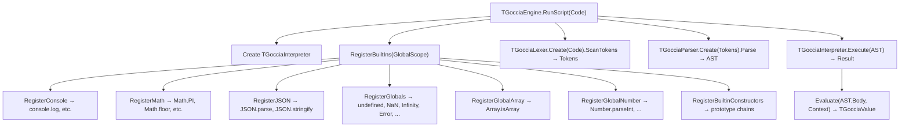

# Architecture

GocciaScript follows a classic interpreter pipeline: source code flows through lexing, parsing, and evaluation stages before producing a result. The system is implemented in FreePascal using object-oriented design with interface-based polymorphism.

## Pipeline Overview

The **Engine** (`Goccia.Engine.pas`) sits above this pipeline and orchestrates the entire process: it creates the interpreter, registers built-in globals, invokes the lexer/parser, and hands the AST to the interpreter for execution.

## Component Responsibilities

### Engine (`Goccia.Engine.pas`)

The top-level entry point. Provides static convenience methods (`RunScript`, `RunScriptFromFile`, `RunScriptFromStringList`) and manages:

- **Built-in registration** — Selectively registers globals (`console`, `Math`, `JSON`, `Object`, `Array`, `Number`, `String`, error constructors) based on a `TGocciaGlobalBuiltins` flag set.
- **Interpreter lifecycle** — Creates and owns the `TGocciaInterpreter` instance.
- **Prototype chain setup** — Calls `RegisterBuiltinConstructors` to wire up the `Object → Array → Number → String` prototype chain.

The configurable built-in system allows different execution contexts (e.g., the TestRunner enables `ggTestAssertions` to inject `describe`, `test`, and `expect`).

### Lexer (`Goccia.Lexer.pas`)

A single-pass tokenizer that converts source text into a flat list of `TGocciaToken` objects. Key features:

- **Number formats** — Decimal, hexadecimal (`0x`), binary (`0b`), octal (`0o`), scientific notation.
- **Template literals** — Special handling for backtick strings with `${...}` interpolation.
- **Unicode identifiers** — Supports Unicode characters (including emoji) in identifier names.
- **Unicode escape sequences** — `\uXXXX` (4-digit) and `\u{XXXXX}` (variable-length) escape sequences in strings and template literals, with full UTF-8 encoding for code points up to U+10FFFF.
- **Comments** — Skips single-line (`//`) and block (`/* */`) comments.
- **Error reporting** — Produces `TGocciaLexerError` with line and column information.

### Parser (`Goccia.Parser.pas`)

A recursive descent parser that builds an AST from the token stream. Implements:

- **Operator precedence** via precedence climbing (assignment → conditional → logical → comparison → addition → multiplication → exponentiation → unary → call → primary).
- **ES6+ syntax** — Arrow functions, template literals, destructuring patterns (array and object), spread/rest operators, computed property names, shorthand properties, classes with private fields, private/public getters/setters, and static members. Reserved words are accepted as property names in object literals and member expressions. The parser tracks instance property declaration order for correct initialization semantics.
- **Error recovery** — Throws `TGocciaSyntaxError` with source location for diagnostics.
- **Arrow function detection** — Uses lookahead (`IsArrowFunction`) to disambiguate parenthesized expressions from arrow function parameters.

### AST (`Goccia.AST.Node.pas`, `Goccia.AST.Expressions.pas`, `Goccia.AST.Statements.pas`)

The Abstract Syntax Tree is structured into three layers:

- **Node** — Base `TGocciaNode` with location tracking.
- **Expressions** — Literals, binary/unary operations, member access, calls, arrow functions, template literals, class expressions, destructuring patterns, spread elements, etc.
- **Statements** — Variable declarations, blocks, if/else, for/while/do-while, return, throw, try-catch-finally, switch, break/continue, import/export, class declarations.

### Interpreter (`Goccia.Interpreter.pas`)

A thin orchestration layer that:

- Owns the **global scope** (`TGocciaScope`).
- Delegates AST evaluation to the Evaluator.
- Manages **module loading** and caching (ES6-style imports).
- Supports **hot module reloading** for development (`CheckForModuleReload`).

### Evaluator (`Goccia.Evaluator.pas` + sub-modules)

The largest component. Implements the actual semantics of the language as **pure functions** — given an AST node and an evaluation context, it returns a `TGocciaValue` without side effects. The evaluator is split into focused sub-modules:

| Module | Responsibility |
|--------|---------------|
| `Goccia.Evaluator.pas` | Core dispatch, expressions, statements, classes |
| `Goccia.Evaluator.Arithmetic.pas` | `+`, `-`, `*`, `/`, `%`, `**` |
| `Goccia.Evaluator.Bitwise.pas` | `&`, `\|`, `^`, `<<`, `>>`, `>>>` |
| `Goccia.Evaluator.Comparison.pas` | `===`, `!==`, `<`, `>`, `<=`, `>=` |
| `Goccia.Evaluator.Assignment.pas` | `=`, `+=`, `-=`, etc. |
| `Goccia.Evaluator.TypeOperations.pas` | `typeof`, `instanceof`, `in`, `delete` |

Evaluation state is threaded through a `TGocciaEvaluationContext` record that carries the current scope, error handler callback, and module loader reference.

## Data Flow

### Script Execution

### Variable Lookup

Variable resolution follows the scope chain — a chain-of-responsibility pattern:

Each scope maintains a dictionary of `TGocciaLexicalBinding` entries that track:
- The value itself
- Declaration type (`let`, `const`, or parameter)
- Whether the binding has been initialized (for Temporal Dead Zone enforcement)

Special scope bindings used internally:
- **`__super__`** — Set in method call scopes when a superclass exists, enabling `super` calls.
- **`__owning_class__`** — Set in method call scopes and instance initialization scopes, identifying which class declared the current method. Used to resolve private fields to the correct class when inheritance shadowing is involved.

## Module System

The interpreter supports ES6-style `import`/`export` with module caching:

1. `import { x } from './module.js'` triggers `LoadModule`.
2. The module is lexed, parsed, and evaluated in its own scope.
3. Exported bindings are extracted and bound in the importing scope.
4. Modules are cached by resolved path to avoid re-evaluation.
5. `CheckForModuleReload` supports development-time hot reloading.

## Error Handling

Errors are handled through two mechanisms:

1. **Pascal exceptions** — `TGocciaLexerError`, `TGocciaSyntaxError` for compile-time errors.
2. **Error callback pattern** — The evaluator uses an `OnError` callback (via `TGocciaEvaluationContext`) for runtime errors, keeping evaluator functions pure.
3. **JavaScript-level errors** — `TGocciaError` values (`Error`, `TypeError`, `ReferenceError`, `RangeError`) implement the JavaScript error semantics, propagated via `TGocciaThrowValue`.
