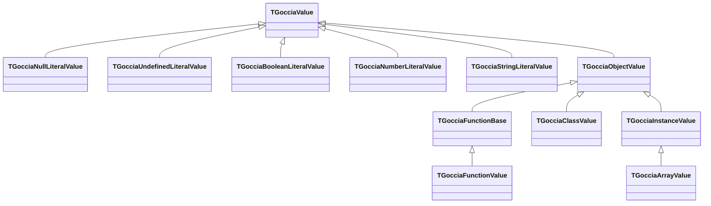

# Core patterns

*Recurring implementation conventions in the Pascal codebase (scopes, parser, prototypes, built-ins) and implementation detail for shared vocabulary such as Define vs Assign.*

## Executive Summary

- **Singleton pattern** — Primitive singletons (`undefined`, `null`, `true`, `false`, `NaN`) use class-var + class-function, pinned by the GC
- **Factory method** — Plain scopes are created via `CreateChild`; specialized scopes (call, catch, class-init, …) are constructed with their parent; never `TGocciaScope.Create`
- **Builder pattern** — Built-in objects declare their members in a `TGocciaMemberCollection` and install them with `RegisterMemberDefinitions`
- **Shared prototype singleton** — Each built-in type shares one prototype per realm, stored in a realm slot (often through a `TGocciaSharedPrototype` helper)
- **Define vs Assign** — `Define` creates a new binding; `Assign` changes an existing one — distinct operations throughout the codebase

For **canonical terminology**, see [GocciaScript Context](../CONTEXT.md). For **pipelines and layers**, see [Architecture](architecture.md). For the **execution modes**, see [Interpreter](interpreter.md) (tree-walk) and [Bytecode VM](bytecode-vm.md) (register VM, `.gbc`).

## Recurring implementation patterns

These patterns show up across layers (values, scope, parser, built-ins). They are implementation conventions, not separate subsystems.

### Singleton pattern (special values)

Primitive singletons use a **class var** plus a **class function** that creates on first use (see `Goccia.Values.Primitives.pas`). They are **pinned** during engine startup via `PinPrimitiveSingletons` so the GC does not collect them.

```pascal
TGocciaUndefinedLiteralValue = class(TGocciaValue)
private
  class var FUndefinedValue: TGocciaUndefinedLiteralValue;
public
  class function UndefinedValue: TGocciaUndefinedLiteralValue;
end;

class function TGocciaUndefinedLiteralValue.UndefinedValue: TGocciaUndefinedLiteralValue;
begin
  if not Assigned(FUndefinedValue) then
    FUndefinedValue := TGocciaUndefinedLiteralValue.Create;
  Result := FUndefinedValue;
end;
```

The same pattern applies to `TGocciaNullLiteralValue.NullValue`, `TGocciaBooleanLiteralValue.TrueValue` / `FalseValue`, and the shared number literals (`NaNValue`, `ZeroValue`, …).

### Factory method (scope creation)

Plain scopes are created via `CreateChild(AScopeKind, ACustomLabel, ACapacity)`. Scopes that carry extra state — call, arrow-call and method-call scopes, catch, class-init, function-name and `with` scopes — are `TGocciaScope` subclasses, constructed directly with their parent as the first argument. Either way the parent's callbacks and mode flags are copied by the `TGocciaScope` constructor. Never build a bare `TGocciaScope` by hand:

```pascal
// Correct — plain block scope
ChildScope := AContext.Scope.CreateChild(skBlock);

// Correct — specialized scope, parent first (TGocciaFunctionValue.CreateCallScope)
Result := TGocciaCallScope.Create(FClosure, FName, Length(FParameters) + 2);

// WRONG — never do this
ChildScope := TGocciaScope.Create(ParentScope, skBlock);
```

### Builder pattern (built-in registration)

Built-in objects declare their members in a `TGocciaMemberCollection` and install them in one pass with `RegisterMemberDefinitions` (`Goccia.ObjectModel.pas`). Abbreviated from `TGocciaMath.Create`:

```pascal
FBuiltinObject.RegisterConstant('PI', TGocciaNumberLiteralValue.Create(MATH_PI));

Members := TGocciaMemberCollection.Create;
try
  Members.AddMethod(MathFloor, 1, gmkStaticMethod);
  // ... more AddMethod / AddSymbolDataProperty ...
  RegisterMemberDefinitions(FBuiltinObject, Members.ToDefinitions);
finally
  Members.Free;
end;

AScope.DefineLexicalBinding(AName, FBuiltinObject, dtLet, True);
```

### Ordered own property keys

`TGocciaObjectValue.GetOwnPropertyKeys` owns string-key enumeration order. Ordinary objects return array indices in ascending numeric order followed by other strings in creation order; exotic values retain their own ordering. `OwnPropertyKeyValues` includes symbols and preserves a proxy trap's mixed string/symbol order. Both executors consume these existing value-layer operations for object spread, rest, and `for...in`, without sorting the returned keys again. Classes include their synthesized `length`, `name`, and `prototype` keys through their override, just as other exotic values include their virtual properties.

### Binary expression levels (parser)

Each left-associative precedence level in `Goccia.Parser.pas` is its own short loop: parse the next-tighter level, then fold operators of this level into a `TGocciaBinaryExpression` while they appear:

```pascal
function TGocciaParser.Addition: TGocciaExpression;
var
  Op: TGocciaToken;
begin
  Result := Multiplication;
  while PeekWithLexicalGoal(glgInputElementDiv).TokenType in [gttPlus, gttMinus] do
  begin
    Op := Advance;
    Result := TGocciaBinaryExpression.Create(Result, Op.TokenType,
      Multiplication, Op.Span);
  end;
end;
```

Levels that need extra checks keep them inline. `Equality`, for example, accepts `gttEqual`/`gttNotEqual` and only builds a node for `gttLooseEqual`/`gttLooseNotEqual` when loose equality is enabled (`--compat-loose-equality`); otherwise it records an unsupported-feature warning.

### Shared prototype singleton pattern

GocciaScript uses a **shared prototype object** for each built-in type so every instance has the same `[[Prototype]]` as in ECMA-262 (for example all `Set` instances share the one `Set.prototype` object from the spec). **That layout matches the standard**; it is not an extra semantic on top of ECMAScript. In Pascal we realize it with `TGocciaSharedPrototype`, `TGocciaMemberCollection`, and `RegisterMemberDefinitions` (pinning, method tables, wiring the constructor’s `prototype` property).

The following matches **`TGocciaSetValue`** in `Goccia.Values.SetValue.pas` (abbreviated). There are no class vars: the helper lives in a realm-owned slot (see [Realm Ownership & Slot Registration](#realm-ownership--slot-registration)), and the member definitions are rebuilt for each realm:

```pascal
procedure TGocciaSetValue.InitializePrototype;
var
  Members: TGocciaMemberCollection;
  Shared: TGocciaSharedPrototype;
  PrototypeMembers: TArray<TGocciaMemberDefinition>;
begin
  if (CurrentRealm = nil) then Exit;
  if (GetSetShared <> nil) then Exit;

  Shared := TGocciaSharedPrototype.Create(Self);
  CurrentRealm.SetOwnedSlot(GSetSharedSlot, Shared);
  Members := TGocciaMemberCollection.Create;
  try
    Members.AddNamedMethod('has', SetHas, 1, gmkPrototypeMethod, [gmfNoFunctionPrototype]);
    // ... more AddNamedMethod / AddAccessor ...
    Members.AddNamedMethod('values', SetValues, 0, gmkPrototypeMethod, [gmfNoFunctionPrototype]);
    Members.AddPropertyAlias(PROP_KEYS, PROP_VALUES,
      [pfConfigurable, pfWritable]);
    Members.AddSymbolAlias(
      TGocciaSymbolValue.WellKnownIterator,
      PROP_VALUES,
      [pfConfigurable, pfWritable]);
    PrototypeMembers := Members.ToDefinitions;
  finally
    Members.Free;
  end;
  RegisterMemberDefinitions(Shared.Prototype, PrototypeMembers);
end;

constructor TGocciaSetValue.Create(const AClass: TGocciaClassValue = nil);
var
  Shared: TGocciaSharedPrototype;
begin
  inherited Create(AClass);
  FStore := TGocciaOrderedValueMap.Create;
  InitializePrototype;
  Shared := GetSetShared;
  if not Assigned(AClass) and Assigned(Shared) then
    FPrototype := Shared.Prototype;
end;

class procedure TGocciaSetValue.ExposePrototype(const AConstructor: TGocciaValue);
var
  Shared: TGocciaSharedPrototype;
begin
  Shared := GetSetShared;
  if not Assigned(Shared) then
  begin
    TGocciaSetValue.Create;
    Shared := GetSetShared;
  end;
  if Assigned(Shared) then
    ExposeSharedPrototypeOnConstructor(Shared, AConstructor);
end;
```

**Variant:** `TGocciaStringObjectValue` keeps `String.prototype` in a plain realm slot (`GStringPrototypeSlot`, set with `CurrentRealm.SetSlot`), and the prototype instance is its own method host — same idea (one prototype for all string objects in a realm), no `TGocciaSharedPrototype` helper.

Prototype **methods** take `(AArgs, AThisValue)`; use **`AThisValue`** for the real instance — **`Self`** is the realm's method host instance. For chaining (`Set.add`, `Map.set`), return **`AThisValue`**, not `Self`.

When two standard properties must contain the **same function object**, declare the first method normally and register the later name with `AddPropertyAlias` or `AddSymbolAlias`. Aliases resolve an earlier data-property definition during `RegisterMemberDefinitions` and install its existing value with the requested descriptor flags. Do not register a second native callback: equivalent behavior is not enough for identity requirements such as `Set.prototype.keys === Set.prototype.values` or `Map.prototype[Symbol.iterator] === Map.prototype.entries`.

### Realm Ownership & Slot Registration

Built-in prototypes are not module-level singletons; they live in a per-engine **realm** (`Goccia.Realm.pas`, `TGocciaRealm`). Each `TGocciaEngine` constructs its initial ECMA-262 Realm Record and frees it in `Destroy`, which unpins every prototype and cached template object the realm owns. The next engine on the same worker thread starts from pristine intrinsics — userland mutations of `Array.prototype`, including non-configurable property additions, do not leak across engine boundaries.

`CurrentRealm` is set by `TGocciaExecutionContextStack` (`Goccia.ExecutionContext.pas`) as interpreter and bytecode code enters script, module, and function execution. Treat it as a lookup facade for realm-scoped state, not as process-global ownership.

Two slot kinds are registered at unit `initialization` time:

| API | Stores | Lifecycle |
|-----|--------|-----------|
| `RegisterRealmSlot('Name')` → `TGocciaRealmSlotId` | A `TGCManagedObject` (typically a prototype object) | `SetSlot` pins via the GC; realm tear-down unpins everything ever stored in this slot. |
| `RegisterRealmOwnedSlot('Name')` → `TGocciaRealmOwnedSlotId` | A plain `TObject` helper (e.g. `TGocciaSharedPrototype`) | Realm calls `.Free` at tear-down, before the pinned-slot release pass, so the helper's destructor can still unpin the GC objects it owns. |

#### Raw-slot pattern (a single `TGocciaObjectValue` prototype)

This is what `TGocciaIteratorValue` does — see `Goccia.Values.IteratorValue.pas`:

```pascal
var
  GIteratorPrototypeSlot: TGocciaRealmSlotId;

function GetSharedIteratorPrototype: TGocciaObjectValue; inline;
begin
  if (CurrentRealm <> nil) then
    Result := TGocciaObjectValue(CurrentRealm.GetSlot(GIteratorPrototypeSlot))
  else
    Result := nil;
end;

procedure TGocciaIteratorValue.InitializePrototype;
var
  SharedPrototype: TGocciaObjectValue;
begin
  if (CurrentRealm = nil) then Exit;
  if (GetSharedIteratorPrototype <> nil) then Exit;

  SharedPrototype := TGocciaObjectValue.Create(
    TGocciaObjectValue.SharedObjectPrototype);
  CurrentRealm.SetSlot(GIteratorPrototypeSlot, SharedPrototype);
  CurrentRealm.SetSlot(GIteratorMethodHostSlot, Self);
  // ... register members on SharedPrototype ...
end;

initialization
  GIteratorPrototypeSlot := RegisterRealmSlot('Iterator.prototype');
```

Read live every time — never cache the prototype pointer in a Pascal variable that outlives a single call site, because the cached pointer becomes a dangling reference the moment the engine that owns it is freed.

#### Owned-slot pattern (a `TGocciaSharedPrototype` helper)

This is what `Goccia.Values.MapValue.pas` and the other ~40 `TGocciaSharedPrototype` users do:

```pascal
var
  GMapSharedSlot: TGocciaRealmOwnedSlotId;

function GetMapShared: TGocciaSharedPrototype; inline;
begin
  if (CurrentRealm <> nil) then
    Result := TGocciaSharedPrototype(CurrentRealm.GetOwnedSlot(GMapSharedSlot))
  else
    Result := nil;
end;

procedure TGocciaMapValue.InitializePrototype;
var
  Shared: TGocciaSharedPrototype;
begin
  if (CurrentRealm = nil) then Exit;
  if (GetMapShared <> nil) then Exit;

  Shared := TGocciaSharedPrototype.Create(Self);
  CurrentRealm.SetOwnedSlot(GMapSharedSlot, Shared);
  // ... register members on Shared.Prototype ...
end;

initialization
  GMapSharedSlot := RegisterRealmOwnedSlot('Map.shared');
```

`SetOwnedSlot` does not pin anything: `TGocciaSharedPrototype.Create` pins both `FPrototype` and `FMethodHost`, and `TGocciaSharedPrototype.Destroy` unpins them, so realm tear-down freeing the helper releases everything atomically — even before the next GC pass runs.

Native classes whose default instance prototype lives in an owned realm slot opt in through `TGocciaClassValue.SupportsRealmIntrinsicPrototypeFallback` and override `IntrinsicPrototypeForRealm`. Their value unit exposes a matching `GetSharedPrototypeForRealm` lookup. `GetNativePrototypeFromConstructor` reads `newTarget.prototype` first, then uses this virtual resolver when the result is not an object, so `GetPrototypeFromConstructor` falls back to the intrinsic from the **constructor's realm**, not whichever realm happens to be current. Keep this resolution in the native-class abstraction instead of adding constructor-name branches.

#### Stale-cache antipattern (do not do this)

`TGocciaClassValue` previously cached `Function.prototype` in a `threadvar FDefaultPrototype` and reused it on every `new`-able class. After engine recreation that threadvar still pointed at the dead `Function.prototype` from the previous realm, so `Object.getPrototypeOf(NewConstructor) === Function.prototype` started returning `false` on the first construct of every fresh engine. The fix was to read the prototype live each call via `TGocciaFunctionBase.GetSharedPrototype`. **Do not cache realm-scoped objects in `threadvar`s, class vars, or static singletons.** If you need a prototype, look it up through the realm every time.

## Terminology

The canonical project glossary lives in [GocciaScript Context](../CONTEXT.md). This section expands implementation details for the Define vs Assign distinction.

### Define vs Assign

This distinction is critical in the codebase:

- `DefineLexicalBinding` — Creates a **new** variable in the current scope. Used for `let`/`const` declarations, function parameters, and built-in registration. Built-ins are registered using `DefineLexicalBinding(..., dtLet)` — there is no separate `DefineBuiltin` method.
- `CreateImportBinding` — Creates an immutable **indirect** binding in a module scope. Reads resolve the target module's current exported binding value instead of copying a value into the importing scope.
- `AssignBinding` — Changes the value of an **existing** variable, walking up the scope chain. Throws `ReferenceError` if not found (with `ANonStrictMode`, an unbound name becomes a property of the global object instead), `TypeError` if `const`.

## Design Rationale

### Virtual Dispatch Value System

Values follow a small class hierarchy rooted at `TGocciaValue`, with property access unified through virtual methods on the base class:


```mermaid
classDiagram
    TGocciaValue <|-- TGocciaNullLiteralValue
    TGocciaValue <|-- TGocciaUndefinedLiteralValue
    TGocciaValue <|-- TGocciaBooleanLiteralValue
    TGocciaValue <|-- TGocciaNumberLiteralValue
    TGocciaValue <|-- TGocciaStringLiteralValue
    TGocciaValue <|-- TGocciaObjectValue

    TGocciaObjectValue <|-- TGocciaFunctionBase
    TGocciaFunctionBase <|-- TGocciaFunctionValue
    TGocciaObjectValue <|-- TGocciaClassValue
    TGocciaObjectValue <|-- TGocciaInstanceValue
    TGocciaInstanceValue <|-- TGocciaArrayValue
```

`TGocciaError` is not part of this hierarchy: it is a Pascal `Exception` subclass for internal engine errors (see [Value System](value-system.md#error-values)).

The base `TGocciaValue` declares virtual `GetProperty` and `SetProperty` methods with safe defaults (`nil` / no-op). Each value type overrides these to implement its property semantics — objects walk the prototype chain, arrays handle numeric indices, instances invoke getters/setters, etc.

Beyond property access, the base class provides two additional virtual methods for type discrimination:

- **`IsPrimitive`** — Returns `False` by default; overridden to return `True` by all primitive types (`Null`, `Undefined`, `Boolean`, `Number`, `String`, `Symbol`, `BigInt`). Replaces one-`is`-per-type check chains at call sites like `ToPrimitive`.
- **`IsCallable`** — Returns `False` by default; overridden to return `True` by `TGocciaFunctionBase` (all function types) and `TGocciaClassValue` (callable via `new`); `TGocciaProxyValue` forwards to its target. Replaces 2-way `is` check chains at call sites like `Function.prototype.call/apply/bind` and array callback validation.

**Why virtual dispatch?**

- **Single hierarchy** — Every type that supports property access is in the `TGocciaValue` hierarchy. Virtual methods leverage this directly without extra interface indirection.
- **Simple call sites** — `Value.GetProperty(Name)` is a single virtual call. `Value.IsPrimitive` and `Value.IsCallable` are likewise single VMT calls. No capability queries, no casting.
- **Safe defaults** — The base class returns `nil` for `GetProperty`, no-ops for `SetProperty`, `False` for `IsPrimitive`, and `False` for `IsCallable`, so the evaluator can call these on any value without type-checking first.
- **Extensible** — New value types added to the hierarchy automatically participate by overriding the virtual methods.
- **Dispatch shape** — A single VMT call replaces multi-`is` type check chains. For `IsPrimitive`, this replaces one sequential `is` check per primitive type; for `IsCallable`, two. See [spikes/fpc-dispatch-performance.md](spikes/fpc-dispatch-performance.md) for the underlying comparison of virtual, interface, and manual VMT dispatch mechanics.

### Centralized Keyword Constants

JavaScript keyword literals are defined as named constants in two units — `Goccia.Keywords.Reserved.pas` for reserved keywords and `Goccia.Keywords.Contextual.pas` for contextual keywords:

```pascal
// Goccia.Keywords.Reserved.pas
const
  KEYWORD_THIS      = 'this';
  KEYWORD_SUPER     = 'super';
  KEYWORD_NULL      = 'null';
  // ... more reserved keywords

// Goccia.Keywords.Contextual.pas
const
  KEYWORD_GET       = 'get';
  KEYWORD_SET       = 'set';
  KEYWORD_TYPE      = 'type';
  KEYWORD_INTERFACE = 'interface';
  // ... more contextual keywords
```

**Why dedicated units?**

- **No magic strings** — The evaluator, scope, parser, and other units reference `KEYWORD_THIS` or `KEYWORD_GET` instead of `'this'` or `'get'`, preventing typos and enabling compiler-checked usage.
- **Reserved vs contextual** — Reserved keywords always produce a dedicated token type and cannot be used as identifiers. Contextual keywords have special meaning only in specific syntactic positions (e.g., `get`/`set` in object literals, `type`/`interface` in declaration position) but are otherwise valid identifiers.
- **Minimal dependencies** — Neither unit has `uses` clause dependencies, so any unit can import them without introducing circular references.
- **Single source of truth** — All keyword strings are defined once. The lexer's token mapping, the parser's contextual checks, and the evaluator's identifier handling all reference the same constants.

### Inlining Hot-Path Methods

Small, frequently-called non-virtual methods are marked `inline` to eliminate call overhead:

| Method | Unit | Rationale |
|--------|------|-----------|
| `ContainsOwnLexicalBinding(Name)` | `Goccia.Scope` | Own-scope dictionary lookup wrapper |
| `TryGetLexicalValueAt(EntryIndex, Version, Value)` | `Goccia.Scope` | Inline-cache re-read of an own lexical binding by entry index |
| `GetIsNegativeZero` (the `IsNegativeZero` property) | `Goccia.Values.Primitives` | Wraps `NumberBits.IsNegativeZero`, a sign-bit pattern compare |

The identifier lookups themselves — `GetValue`, `ResolveIdentifier` and `Contains` — are `virtual` on `TGocciaScope`, so they are not inlined.

**Why selective inlining?**

- **Virtual methods cannot be inlined** — `GetProperty`, `IsPrimitive`, `IsCallable`, and scope chain walkers (`GetThisValue`, `GetOwningClass`, `GetSuperClass`) rely on VMT dispatch and are never candidates for inlining.
- **Only non-virtual wrappers** — Inlined methods are thin wrappers (dictionary lookups, bit-pattern compares) where the call overhead is significant relative to the method body.
- **Measurable on hot paths** — Scope lookups happen on every identifier reference. Eliminating function call overhead here compounds across deeply nested expressions.

### Managed Locals on Hot Paths

A procedure that declares a managed local — a `string`, a dynamic array, or a record holding one, such as `TGocciaPropertyKey` — pays for it on every call, whether or not the path taken uses it. FPC initializes the local on entry, installs an implicit exception frame (`fpc_pushexceptaddr`, `fpc_setjmp`, two thread-variable lookups), and finalizes it on exit.

On x86-64 that came to about 700 of the 1,280 machine instructions of one typed-array element read through `ExecGetComputedProperty`, although the read itself never touched the property key.

Keep such a fast path in a procedure with no managed locals, and call the procedure that owns them only on a miss:

| Fast path, no managed locals | Core holding the managed locals |
|------------------------------|----------------------------------|
| `ExecGetComputedProperty` | `ExecGetComputedPropertyGeneric` |
| `ExecSetComputedProperty` | `ExecSetComputedPropertyGeneric` |
| `GetArrayIteratorElement` | `GetArrayIteratorElementByName` |

The same cost applies to a managed temporary the compiler creates for an expression such as `IntToStr(AIndex)`, and to a function that returns a managed record by value.

### Singleton Special Values

Special values like `undefined`, `null`, `true`, `false`, `NaN`, `Infinity`, and `-Infinity` are singletons:

```pascal
TGocciaUndefinedLiteralValue.UndefinedValue  // Always returns the same instance
TGocciaNullLiteralValue.NullValue            // Always returns the same instance
TGocciaNumberLiteralValue.InfinityValue      // also NaNValue, NegativeInfinityValue, ...
```

**Why singletons?**

- **Identity comparison** — `Value = TGocciaUndefinedLiteralValue.UndefinedValue` is a fast pointer comparison instead of type checking.
- **Memory efficiency** — These values are created once and shared.
- **Semantic correctness** — There's only one `undefined` in JavaScript; the implementation reflects this.

### No Global Mutable State

The codebase enforces a strict rule: **no global mutable state**. All runtime state flows through explicit parameters — the `TGocciaEvaluationContext` record, the scope chain, and value objects.

- **`OnError` propagation** — The error handler callback is stored on `TGocciaScope` (`FOnError` field) and copied to every child scope by the `TGocciaScope` constructor, whether the child comes from `CreateChild` or a specialized scope subclass. Functions retrieve it from their closure scope, which is always the scope where they were defined.
- **`LoadModule` propagation** — The module loading callback is stored on `TGocciaScope` (`FLoadModule` field) and copied to child scopes the same way as `OnError`. Functions retrieve it from their closure scope. This enables dynamic `import()` expressions (ES2026 §13.3.10) to work inside functions, conditionals, and callbacks — not just at the top level.
- **`CurrentFilePath` propagation** — Each `TGocciaEvaluationContext` carries the path of the file being evaluated. The interpreter sets this to `FFileName` for the main script and to the resolved module path for each module. The evaluator passes it to `LoadModule` so import paths are resolved relative to the importing file, not the working directory.

This keeps the evaluator fully reentrant — all dependencies are explicit, making the code safe for concurrent execution and trivial to reason about.

### Configurable Built-ins

`TGocciaEngine` always registers core language built-ins such as Math, Array, Number, Promise, JSON, Symbol, Set, Map, Temporal, ArrayBuffer, and related constructors. Runtime globals are installed through class-based runtime extensions on `TGocciaRuntimeCore`; small hosts install only the extensions they need.

**Why configurable for runtime globals?**

- **Loader runtime profile** — `ApplyLoaderRuntimeProfile` installs the ordinary CLI runtime surface: console, structured data modules, text assets, performance, text encoding, URL/fetch, SemVer, and other runtime globals.
- **Testing** — The GocciaTestRunner installs `TGocciaTestingLibraryRuntimeExtension` to inject `describe`, `test`, and `expect` without polluting the loader runtime.
- **Benchmarking** — The GocciaBenchmarkRunner installs `TGocciaBenchmarkRuntimeExtension`, which provides the `goccia:microbench` module (`bench`, `group`, `run`, `summary`, `boxplot`).
- **FFI** — `TGocciaFFIRuntimeExtension` enables the Foreign Function Interface for calling native shared libraries. It attaches only to an engine whose capability set grants `ffi`; hosts call `InstallFFIIfGranted`, which CLI tools reach through `--allow-ffi` or `"allow-ffi"` in a trusted config file's `permissions` block (`-P` for one run, or `--trust`; see [Config trust](permissions.md#config-trust)).

### Capability Checks

Anything that reaches outside the process asks the owning engine's immutable `TGocciaCapabilities` ([Permissions](permissions.md)), fixed at engine construction. Read it from the engine that owns the operation; never cache a decision or a policy in thread-global state. Engines nest on one thread — a sandbox `runScript` child runs inside its parent's call — so per-thread state is shared by engines with different sets. The fetch manager is per thread for exactly that reason and holds no policy: each request carries its engine's `TGocciaFetchPolicy` (capability set, response ceiling, audit emitter) to the worker that performs it. A denial throws `ThrowPermissionDenied` with the guest-visible scope and a host-only suggestion, and emits an audit event named after the capability.

### Shimmed Legacy Globals

Legacy ECMAScript globals such as `parseInt`, `parseFloat`, `isNaN`, and `isFinite` live in the shim layer rather than the primary built-in registration path. `parseInt` and `parseFloat` delegate to their `Number.*` counterparts; global `isNaN` and `isFinite` preserve standard coercion behavior by wrapping `Number.isNaN(Number(value))` and `Number.isFinite(Number(value))`.

Use the same shim pattern for future legacy names: if the modern implementation already exists (`Number.*`, `Object.*`, Temporal-backed date behavior, etc.), expose the old spelling through the Goccia.shims registry and list it there instead of duplicating the core built-in implementation. Do not generalize this into broad Annex B support: browser-only Annex B semantics are deferred before 1.0, and parser/runtime/object-model compatibility work needs a separate design decision tied to a future Web API or browser-compatibility profile.

### Standardized Argument Validation

Built-in functions use `TGocciaArgumentValidator` (`Goccia.Arguments.Validator.pas`) for consistent argument count and type checking:

```pascal
TGocciaArgumentValidator.RequireAtLeast(AArgs, 2, 'Reflect.get', ThrowError);
```

Benefits:

- **Consistent error messages** — All argument errors follow the same format: `"<name> expects [at least | at most] N arguments but got M"` (for example `Reflect.get expects at least 2 arguments but got 1`). `RequireExactly`, `RequireAtMost`, `RequireBetween` and `RequireNone` take the same `(AArgs, …, AFunctionName, AThrowError)` shape.
- **Single point of change** — Validation logic and error formatting live in one place.
- **Reduced boilerplate** — Each call site is a single line instead of a multi-line if/then/throw pattern.

### String Interning — Attempted and Rejected

String interning (caching `TGocciaStringLiteralValue` instances in a `TDictionary<string, TGocciaStringLiteralValue>` keyed by content, returning cached instances from `RuntimeCopy` and `ToStringLiteral`) was implemented and benchmarked. The results showed a **net -4% regression** across 172 benchmarks, with 49 regressions, only 3 improvements, and 120 unchanged.

**Why it doesn't help:**

- **Dictionary lookup cost exceeds allocation cost.** FreePascal's allocator is fast. A `TDictionary.TryGetValue` call involves hashing the string (O(n) in string length) plus a hash-table probe, which is more expensive than simply allocating a short-lived `TGocciaStringLiteralValue` and letting the GC reclaim it later.
- **Low hit rate on hot paths.** `ToStringLiteral` on numbers produces mostly unique strings (`"42"`, `"3.14"`, etc.) that never hit the cache, paying the hash cost with zero benefit. This path is called frequently in arithmetic-heavy benchmarks.
- **`RuntimeCopy` is the wrong interception point.** Every string literal evaluation goes through `RuntimeCopy`. Adding a dictionary lookup to this universal hot path penalizes all string operations, including those that create one-off strings (concatenation results, method return values).
- **GC pressure is not the bottleneck.** The number special-value singletons work because the check is a single equality against a fixed set. String equality requires content comparison, so the lookup cost scales with string length rather than being O(1).

**The number special-value singletons work because:** they are a tiny fixed set (`0`, `1`, `NaN`, `±Infinity`, `-0`) matched by direct comparison in `RuntimeCopy` — no hashing, no array, no range — with a high hit rate in typical code. There is **no** general small-integer (e.g. 0–255) range cache: earlier revisions of this doc and `garbage-collector.md` described one, but it was never implemented, and a spike that added it (plus `±Infinity`/`NaN` reuse on the VM boxing path) measured **no runtime gain** — see the boxed-numbers note below. None of the singletons' properties hold for arbitrary strings.

**Do not re-attempt** dictionary-based string interning. If string allocation becomes a measurable bottleneck in future profiling, consider instead: (a) pre-allocated singletons for a small fixed set of ultra-common strings (like the number special-value singletons but for `"length"`, `"undefined"`, etc.), or (b) arena/pool allocation for `TGocciaStringLiteralValue` objects to reduce per-object GC overhead without per-string hashing.

The same result holds for **boxed numbers**: adding a small-integer range cache and reusing `±Infinity`/`NaN` singletons in the bytecode VM's `RegisterToValue` boxing path cut allocations ~25% on an allocation-heavy typed-array test but produced **no runtime improvement** (interleaved median +2.2%). Reducing allocation *count* is not, by itself, a runtime lever in this codebase — see [ADR 0081](adr/0081-reject-value-caches-for-allocation-reduction.md) for the data, the narrow exceptions that do pay off, and the interleaved-measurement guardrail.

## Related documents

- [Architecture](architecture.md) — Pipelines, main layers, design direction, duplication boundaries
- [Interpreter](interpreter.md) — Tree-walk pipeline and evaluator model
- [Bytecode VM](bytecode-vm.md) — Register VM and bytecode format
- [Value system](value-system.md) — `TGocciaValue` hierarchy and property access
- [Contributing](../CONTRIBUTING.md) — Workflow and Pascal code style when you modify the repository
