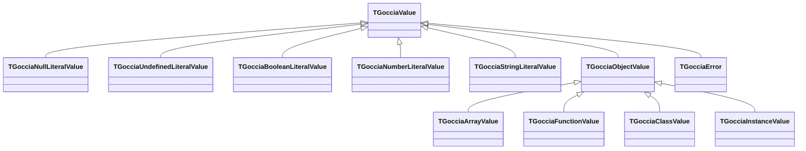

# Design Decisions

This document explains the key design decisions behind GocciaScript — the "why" behind the choices.

## Pure Evaluator Functions

The evaluator (`Goccia.Evaluator.pas`) is designed around pure functions — given the same AST node and evaluation context, the evaluator always produces the same result with no side effects.

**Why this matters:**

- **Testability** — Pure functions are trivially testable in isolation.
- **Reasoning** — No hidden state mutations make the evaluation logic easier to understand and debug.
- **Parallelism potential** — Pure evaluation is inherently safe for concurrent execution.
- **Composability** — Evaluator sub-modules (`Arithmetic`, `Bitwise`, `Comparison`, etc.) compose cleanly because they don't share mutable state.
- **ECMAScript conformance** — `ToPrimitive` (`Goccia.Values.ToPrimitive.pas`) is a standalone abstract operation (trying `valueOf` then `toString` on objects) used by the `+` operator and available to any module. The arithmetic module uses floating-point modulo (not integer) with proper NaN/Infinity propagation. The comparison module implements the Abstract Relational Comparison algorithm with type coercion.

State changes (variable bindings, object mutations) happen through the scope and value objects passed in the `TGocciaEvaluationContext`, not through evaluator-internal state.

**Performance-aware evaluation:** Template literal evaluation and `Array.ToStringLiteral` use `TStringBuilder` for O(n) string assembly instead of O(n^2) repeated concatenation. `Boolean.ToNumberLiteral` returns the existing `ZeroValue`/`OneValue` singletons rather than allocating, avoiding an allocation on every boolean-to-number coercion. `Function.prototype.apply` uses a fast path for `TGocciaArrayValue` arguments (direct `Elements[I]` access) instead of per-element `IntToStr` + `GetProperty`. Numeric binary operations that share a common pattern (subtraction, multiplication, exponentiation) are consolidated through `EvaluateSimpleNumericBinaryOp` to avoid code duplication while maintaining clear semantics.

## Virtual Dispatch Value System

Values follow a small class hierarchy rooted at `TGocciaValue`, with property access unified through virtual methods on the base class:



The base `TGocciaValue` declares virtual `GetProperty` and `SetProperty` methods with safe defaults (`nil` / no-op). Each value type overrides these to implement its property semantics — objects walk the prototype chain, arrays handle numeric indices, instances invoke getters/setters, etc.

Beyond property access, the base class provides two additional virtual methods for type discrimination:

- **`IsPrimitive`** — Returns `False` by default; overridden to return `True` by all primitive types (`Null`, `Undefined`, `Boolean`, `Number`, `String`). Replaces 5-way `is` check chains at call sites like `ToPrimitive`.
- **`IsCallable`** — Returns `False` by default; overridden to return `True` by `TGocciaFunctionBase` (all function types) and `TGocciaClassValue` (callable via `new`). Replaces 2-way `is` check chains at call sites like `Function.prototype.call/apply/bind` and array callback validation.

**Why virtual dispatch?**

- **Single hierarchy** — Every type that supports property access is in the `TGocciaValue` hierarchy. Virtual methods leverage this directly without extra interface indirection.
- **Simple call sites** — `Value.GetProperty(Name)` is a single virtual call. `Value.IsPrimitive` and `Value.IsCallable` are likewise single VMT calls. No capability queries, no casting.
- **Safe defaults** — The base class returns `nil` for `GetProperty`, no-ops for `SetProperty`, `False` for `IsPrimitive`, and `False` for `IsCallable`, so the evaluator can call these on any value without type-checking first.
- **Extensible** — New value types added to the hierarchy automatically participate by overriding the virtual methods.
- **Performance** — A single VMT call replaces multi-`is` type check chains. For `IsPrimitive`, this replaces five sequential `is` checks; for `IsCallable`, two. Benchmarks show 10-20% improvement in class-related operations where these checks are on the hot path.

## Centralized Keyword Constants

JavaScript keyword literals (`this`, `super`, `undefined`, `null`, `true`, `false`, etc.) are defined as named constants in `Goccia.Keywords.pas`:

```pascal
const
  KEYWORD_THIS      = 'this';
  KEYWORD_SUPER     = 'super';
  KEYWORD_UNDEFINED = 'undefined';
  // ... 32 keywords total
```

**Why a dedicated unit?**

- **No magic strings** — The evaluator, scope, and other units reference `KEYWORD_THIS` instead of `'this'`, preventing typos and enabling compiler-checked usage.
- **Minimal dependencies** — `Goccia.Keywords` has no `uses` clause dependencies, so any unit can import it without introducing circular references.
- **Single source of truth** — All keyword strings are defined once. The lexer's token mapping and the evaluator's identifier handling both reference the same constants.

## Inlining Hot-Path Methods

Small, frequently-called non-virtual methods are marked `inline` to eliminate call overhead:

| Method | Unit | Rationale |
|--------|------|-----------|
| `GetValue(Name)` | `Goccia.Scope` | Called on every identifier lookup |
| `ResolveIdentifier(Name)` | `Goccia.Scope` | Unifies `this`/keyword checks with scope lookup |
| `ContainsOwnLexicalBinding(Name)` | `Goccia.Scope` | Dictionary lookup wrapper |
| `Contains(Name)` | `Goccia.Scope` | Scope chain containment check |
| `IsNegativeZero(Value)` | `Goccia.Evaluator.Comparison` | Trivial enum comparison |

**Why selective inlining?**

- **Virtual methods cannot be inlined** — `GetProperty`, `IsPrimitive`, `IsCallable`, and scope chain walkers (`GetThisValue`, `GetOwningClass`, `GetSuperClass`) rely on VMT dispatch and are never candidates for inlining.
- **Only non-virtual wrappers** — Inlined methods are thin wrappers (dictionary lookups, enum comparisons) where the call overhead is significant relative to the method body.
- **Measurable on hot paths** — Scope lookups happen on every identifier reference. Eliminating function call overhead here compounds across deeply nested expressions.

## Singleton Special Values

Special values like `undefined`, `null`, `true`, `false`, `NaN`, `Infinity`, and `-Infinity` are singletons:

```pascal
function UndefinedValue: TGocciaValue;  // Always returns the same instance
function NullValue: TGocciaValue;       // Always returns the same instance
```

**Why singletons?**

- **Identity comparison** — `Value = UndefinedValue` is a fast pointer comparison instead of type checking.
- **Memory efficiency** — These values are created once and shared.
- **Semantic correctness** — There's only one `undefined` in JavaScript; the implementation reflects this.

## Number Representation

Numbers use a dual representation — a `Double` for normal values and a `TGocciaNumberSpecialValue` enum for `NaN`, `+Infinity`, `-Infinity`, and `-0`:

**Why not just `Double`?**

- **NaN identity** — IEEE 754 `NaN ≠ NaN`, but JavaScript needs `NaN` to be identifiable. A dedicated enum avoids floating-point comparison pitfalls.
- **Negative zero** — `-0` and `+0` are equal in IEEE 754 but distinguishable in JavaScript (`Object.is(-0, +0)` is `false`). Explicit tracking prevents this from being lost.
- **Display correctness** — `NaN.toString()` must return `"NaN"`, not some floating-point artifact.

## No Global Mutable State

The codebase enforces a strict rule: **no global mutable state**. All runtime state flows through explicit parameters — the `TGocciaEvaluationContext` record, the scope chain, and value objects.

- **`OnError` propagation** — The error handler callback is stored on `TGocciaScope` (`FOnError` field) and propagated to child scopes via `CreateChild`. Functions retrieve it from their closure scope, which is always the scope where they were defined.
- **`LoadModule` stays at the top level** — Module imports are only valid at the interpreter level, not inside closures. `TGocciaFunctionValue.Call` explicitly sets `Context.LoadModule := nil`.

This keeps the evaluator fully reentrant — all dependencies are explicit, making the code safe for concurrent execution and trivial to reason about.

## Scope Chain Design

Scopes form a tree with parent pointers, implementing lexical scoping:

- **`CreateChild` factory method** — Scopes are never instantiated directly. `CreateChild` ensures proper parent linkage, scope kind propagation, and `OnError` callback inheritance. An optional `ACapacity` parameter allows callers to pre-size the binding dictionary (used by function calls that know their parameter count).
- **`OnError` on scopes** — Each scope carries a reference to the error handler callback, inherited from its parent. This allows closures and callbacks to always find the correct error handler without global state.
- **Temporal Dead Zone** — `let`/`const` bindings are registered before initialization, enforcing TDZ semantics (accessing before `=` throws `ReferenceError`).
- **Module scope isolation** — Modules execute in `skModule` scopes (children of the global scope), preventing module-internal variables from leaking into the global scope.
- **Specialized scope hierarchy** — `TGocciaGlobalScope` (root), `TGocciaCallScope` (function calls), `TGocciaMethodCallScope` (class method calls with `SuperClass`/`OwningClass`), `TGocciaClassInitScope` (instance property initialization), and `TGocciaCatchScope` (catch parameter scoping). Each specialized scope overrides virtual methods (`GetThisValue`, `GetOwningClass`, `GetSuperClass`) to participate in VMT-based chain-walking.
- **VMT-based chain-walking** — `FindThisValue`, `FindOwningClass`, and `FindSuperClass` walk the parent chain calling the corresponding virtual `Get*` method on each scope, stopping at the first non-`nil` result. This eliminates `is` type checks in the evaluator and centralizes resolution logic in the scope hierarchy.
- **Unified identifier resolution** — `ResolveIdentifier(Name)` on `TGocciaScope` handles `this` (via `FindThisValue`) and keyword constants (via `Goccia.Keywords`) before falling back to the standard scope chain walk, avoiding scattered special-case checks in the evaluator.

## `this` Binding: Arrow Functions vs Shorthand Methods

GocciaScript distinguishes two function forms — arrow functions and shorthand methods — with distinct `this` semantics that match ECMAScript strict mode.

**The problem:** GocciaScript has no `function` keyword. Arrow functions and shorthand methods have fundamentally different `this` semantics, but they need distinct representation at both the AST and runtime levels.

**The solution:** Separate AST nodes and runtime types:

| Syntax | AST Node | Runtime Type | `this` binding |
|--------|----------|-------------|---------------|
| `(x) => x + 1` | `TGocciaArrowFunctionExpression` | `TGocciaArrowFunctionValue` | Lexical (closure scope) |
| `method() { ... }` | `TGocciaMethodExpression` | `TGocciaFunctionValue` | Call-site (receiver) |
| `class { method() {} }` | `TGocciaClassMethod` | `TGocciaMethodValue` | Call-site (receiver) |

The runtime uses virtual dispatch — `TGocciaFunctionValue.BindThis` is a virtual method overridden by `TGocciaArrowFunctionValue` — so `this` binding resolution has no branch overhead.

**Why this design?**

- **Type-safe dispatch** — The `this` binding strategy is encoded in the type hierarchy rather than a boolean flag. The vtable resolves the correct `BindThis` at zero cost.
- **Self-documenting** — Reading the code, you know what a `TGocciaArrowFunctionValue` does vs a `TGocciaFunctionValue` without checking a flag.
- **ECMAScript fidelity** — Arrow functions always capture `this` from their defining scope; methods receive `this` from their call site. This matches the spec exactly.
- **Strict mode by default** — Standalone calls to either form receive `undefined` as `this`, matching strict mode. There is no implicit global `this`.
- **Callback correctness** — Array prototype methods (`map`, `filter`, `reduce`) pass `undefined` as `ThisValue` to callbacks. Arrow function callbacks correctly inherit their enclosing method's `this`; extracted method references receive `undefined`, preventing accidental `this` leakage.

## Property Descriptor System

Object properties follow ECMAScript's property descriptor model:

- **Data descriptors** — `{ value, writable, enumerable, configurable }`
- **Accessor descriptors** — `{ get, set, enumerable, configurable }`
- **Insertion order** — Properties maintain their creation order, matching JavaScript's `Object.keys()` ordering guarantee.

This is more complex than a simple key-value map, but it's necessary for `Object.defineProperty`, getters/setters, and non-enumerable properties like prototype methods.

Class getters and setters are stored as accessor descriptors on the class prototype. `TGocciaObjectValue.GetProperty` and `AssignProperty` are `virtual`, and `TGocciaInstanceValue` overrides both to intercept property access — checking the prototype for accessor descriptors and invoking getter/setter functions with the instance as `this` context.

## Private Field Storage

Private fields use **composite keys** (`ClassName:FieldName`) in the instance's private property dictionary. This solves the inheritance shadowing problem where a base class and a derived class both declare a private field with the same name — in JavaScript, `Base.#x` and `Derived.#x` are completely separate slots.

- **Storage** — Private fields are stored on `TGocciaInstanceValue.FPrivateProperties` using keys like `"Base:x"` and `"Derived:x"`.
- **Access resolution** — When a method accesses `this.#x`, the evaluator resolves which class declared the method (via `FindOwningClass`, which walks the scope chain for `TGocciaMethodCallScope` or `TGocciaClassInitScope` using virtual dispatch) and uses that class name to build the composite key.
- **Private getters/setters** — Stored separately from public ones on `TGocciaClassValue` in `FPrivateGetters`/`FPrivateSetters`, because they don't participate in the prototype's property descriptor chain.
- **Declaration order** — Instance property initializers run in source declaration order, enforced via `TStringList` order tracking from the parser through to the class value.

## Error Handling Strategy

GocciaScript uses a layered error approach:

1. **Compile-time errors** (lexer/parser) use Pascal exceptions (`TGocciaLexerError`, `TGocciaSyntaxError`) — these terminate parsing immediately.
2. **Runtime errors** use a callback pattern (`OnError` in `TGocciaEvaluationContext`) — this keeps evaluator functions pure.
3. **JavaScript-level errors** use `TGocciaThrowValue` for `throw` statements and `try/catch` — these flow through the evaluator's return path.
4. **`try-finally` without `catch`** — The evaluator wraps the Pascal `try...except` in a Pascal `try...finally` to guarantee the JS `finally` block runs before exceptions propagate, even when no `catch` clause exists.
5. **`break` in `switch`** — Uses `TGocciaBreakSignal` (a Pascal exception) to exit `switch` cases. The `EvaluateSwitch` function catches this signal to implement JavaScript's fall-through-until-break semantics.

**Centralized error construction** — `Goccia.Values.ErrorHelper.pas` provides `ThrowTypeError`, `ThrowRangeError`, `ThrowReferenceError`, and `CreateErrorObject` helpers. All error throw sites across the codebase use these helpers instead of manually building error objects, reducing duplication and ensuring consistent error formatting.

**Why not exceptions everywhere?** Pascal exceptions disrupt the pure-function model of the evaluator. The callback pattern allows the evaluator to signal errors without unwinding the call stack, making control flow explicit. The exceptions to this rule (`TGocciaThrowValue`, `TGocciaReturnValue`, `TGocciaBreakSignal`) are used only for non-local exits where unwinding is the intended behavior.

## Mark-and-Sweep Garbage Collector

GocciaScript runs inside a FreePascal host with manual memory management, but the interpreter itself has no built-in memory management for the values it creates. In long-running contexts — benchmarking, the REPL, or extended user sessions — the heap grows unboundedly without automatic reclamation. The runtime therefore uses a tracing garbage collector (`Goccia.GarbageCollector.pas`) to manage the lifecycle of interpreter-created values.

**Why not manual memory management?**

- **Aliased references** — A value assigned to multiple variables, captured in a closure, and stored in an array has no single owner. Determining when to free it requires tracking all references.
- **Shared prototype singletons** — String, Array, Set, Map, and Function prototype objects are class-level singletons shared across all instances of their type. Each type's `InitializePrototype` creates the singleton once (guarded by `if Assigned`) and pins it with `TGocciaGC.Instance.PinValue`. Manual lifetime tracking of these shared singletons would be fragile.
- **Closure captures** — Arrow functions capture their enclosing scope, creating non-obvious reference chains between scopes and values.

**Why not reference counting (via `TInterfacedObject`)?**

`TGocciaValue` inherits from `TInterfacedObject`, which provides automatic reference counting. However, values are stored as class references (`TGocciaValue`), not interface references. Switching to interface variables throughout the evaluator would require a large-scale refactor and introduce circular reference issues (objects referencing their prototypes and vice versa).

**Why mark-and-sweep?**

- **Simplicity** — Two phases (mark reachable, sweep unreachable) with straightforward implementation.
- **Handles cycles** — Circular references between objects, closures, and scopes are collected correctly.
- **O(1) membership checks** — Pinned values, temp roots, and root scopes are stored in `TDictionary<T, Boolean>` (used as hash sets) for O(1) `PinValue`, `AddRoot`, `AddTempRoot`, and `RemoveTempRoot` operations, avoiding O(n) linear scans on every allocation.
- **Measurable impact** — Running `GC.Collect` before benchmark measurement rounds reduced ops/sec variance from 20-30% to 1-3%.

**AST literal ownership:**

The parser creates `TGocciaValue` instances (numbers, strings, booleans) and stores them inside `TGocciaLiteralExpression` AST nodes. These values are owned by the AST, not the GC. `TGocciaLiteralExpression.Create` calls `TGocciaGC.Instance.UnregisterValue` to remove the value from GC tracking, and `TGocciaLiteralExpression.Destroy` frees the value (unless it is a singleton like `UndefinedValue`, `TrueValue`, or `FalseValue`).

When the evaluator encounters a literal expression, it calls `Value.RuntimeCopy` to produce a fresh GC-managed runtime value. This cleanly separates compile-time constants (owned by the AST) from runtime values (managed by the GC). The overhead is minimal: integers 0-255 hit the `SmallInt` cache (zero allocation), booleans return singletons, and strings benefit from FreePascal's copy-on-write semantics.

## Synchronous Microtask Queue

GocciaScript implements ECMAScript Promises with a synchronous microtask queue (`Goccia.MicrotaskQueue.pas`) that drains after each top-level script execution.

**The problem:** Promise `.then()` callbacks must be deferred (never synchronous), but GocciaScript is a synchronous engine with no event loop.

**The solution:** A singleton FIFO queue. When a Promise settles or `.then()` is called on an already-settled Promise, the reaction is enqueued rather than executed immediately. The engine drains the queue after `Interpreter.Execute` completes.

**Why drain after script execution (not during)?**

In the ECMAScript specification, the entire script is one macrotask. Microtasks drain after the current macrotask completes, not interleaved with synchronous code. This means:

1. All synchronous code runs to completion first.
2. All `.then()` callbacks fire in FIFO order.
3. New microtasks enqueued during draining (e.g., chained `.then()` handlers) are processed in the same drain cycle.

This follows the ECMAScript specification's microtask ordering semantics. Thenable adoption (resolving a Promise with another Promise) is deferred via a microtask rather than resolved synchronously, matching the spec's PromiseResolveThenableJob — `SubscribeTo` enqueues a microtask for already-settled inner promises instead of calling `Resolve`/`Reject` synchronously. The only scenario where timing would differ from a full engine is with multiple macrotask sources (`setTimeout`, I/O callbacks, event handlers), which GocciaScript does not implement. If these are added in the future, they would require an event loop that repeatedly: (1) dequeues one macrotask, (2) drains the microtask queue, (3) repeats.

**Integration points:**

| Context | When microtasks drain |
|---------|----------------------|
| `TGocciaEngine.Execute` | After `Interpreter.Execute` completes |
| `TGocciaEngine.ExecuteWithTiming` | After interpreter execution, before timing snapshot |
| `TGocciaEngine.ExecuteProgram` | After interpreter execution |
| Test framework | After each test callback |
| Benchmark runner | After warmup, calibration batches, and each measurement round |

**Error safety:** Both `Execute` and `ExecuteProgram` wrap the drain in a `try..finally` that calls `ClearQueue`. If the interpreter throws, stale microtasks are discarded rather than leaking into subsequent executions. After a successful `DrainQueue` the queue is already empty, so `ClearQueue` is a no-op.

**GC safety:** During `DrainQueue`, each microtask's handler, value, and result promise are temp-rooted to prevent collection mid-callback.

## Configurable Built-ins

Built-ins are registered via a `TGocciaGlobalBuiltins` set of flags:

```pascal
TGocciaGlobalBuiltin = (ggConsole, ggMath, ggGlobalObject, ggGlobalArray,
                         ggGlobalNumber, ggPromise, ggJSON, ggSymbol,
                         ggSet, ggMap, ggTestAssertions);
```

**Why configurable?**

- **Security** — Embedding environments can restrict available APIs. A sandboxed script might not get `console`.
- **Testing** — The TestRunner enables `ggTestAssertions` to inject `describe`, `test`, and `expect` without polluting the normal runtime.
- **Minimal footprint** — Only register what's needed.

## Global Function Placement

`parseInt`, `parseFloat`, `isNaN`, and `isFinite` are available **only** as `Number.*` static methods, not as global functions. In ECMAScript, these exist in both places — the global versions are legacy leftovers. `parseInt` and `parseFloat` behave identically to their `Number.*` counterparts, but global `isNaN` and `isFinite` coerce their argument to a number first, while `Number.isNaN` and `Number.isFinite` return `false` for any non-number. GocciaScript keeps these functions on the `Number` object where they belong, avoiding global namespace pollution. See [language-restrictions.md](language-restrictions.md) for the polyfill pattern.

## Standardized Argument Validation

Built-in functions use `TGocciaArgumentValidator` (`Goccia.Arguments.Validator.pas`) for consistent argument count and type checking:

```pascal
TGocciaArgumentValidator.RequireExactly(Args, 1, 'Array.isArray');
TGocciaArgumentValidator.RequireAtLeast(Args, 1, 'Array.from');
```

Benefits:

- **Consistent error messages** — All argument errors follow the same format: `"FunctionName expected N arguments, but got M"`.
- **Single point of change** — Validation logic and error formatting live in one place.
- **Reduced boilerplate** — Each call site is a single line instead of a multi-line if/then/throw pattern.

## Build System

The build script (`build.pas`) is a FreePascal script executed via `instantfpc` — a cross-platform, out-of-the-box solution within the FreePascal ecosystem that requires no external build tools.

## Testing Strategy

JavaScript end-to-end tests are the **primary** testing mechanism. Every new feature or bug fix must include JavaScript tests that validate the behavior through the full pipeline (lexer → parser → evaluator).

- **Specification by example** — Each test file is a runnable specification of expected behavior.
- **End-to-end validation** — Tests exercise the full pipeline, catching integration issues that unit tests would miss.
- **Readable specifications** — JavaScript test files are readable by anyone familiar with Jest/Vitest conventions.
- **Source of truth** — If a behavior isn't covered by a JavaScript test, it isn't guaranteed.

Pascal unit tests (`*.Test.pas`) exist as a secondary layer for internal implementation details not reachable from script code.
