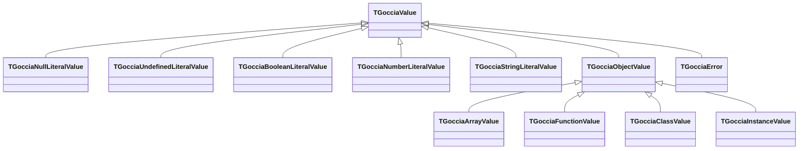

# Design Decisions

*For contributors who want to understand why GocciaScript is built the way it is — the reasoning behind each architectural choice.*

This document explains the key design decisions behind GocciaScript — the "why" behind the choices.

## Pure Evaluator Functions

The evaluator (`Goccia.Evaluator.pas`) is designed around pure functions — given the same AST node and evaluation context, the evaluator always produces the same result with no side effects.

**Why this matters:**

- **Testability** — Pure functions are trivially testable in isolation.
- **Reasoning** — No hidden state mutations make the evaluation logic easier to understand and debug.
- **Parallelism potential** — Pure evaluation is inherently safe for concurrent execution.
- **Composability** — Evaluator sub-modules (`Arithmetic`, `Bitwise`, `Comparison`, etc.) compose cleanly because they don't share mutable state.
- **ECMAScript conformance** — `ToPrimitive` (`Goccia.Values.ToPrimitive.pas`) is a standalone abstract operation (trying `valueOf` then `toString` on objects) used by the `+` operator and available to any module. The arithmetic module uses floating-point modulo (not integer) with proper NaN/Infinity propagation. The comparison module implements the Abstract Relational Comparison algorithm with type coercion.

State changes (variable bindings, object mutations) happen through the scope and value objects passed in the `TGocciaEvaluationContext`, not through evaluator-internal state.

**Performance-aware evaluation:** Template literal evaluation and `Array.ToStringLiteral` use `TStringBuffer` for O(n) string assembly instead of O(n^2) repeated concatenation. `Boolean.ToNumberLiteral` returns the existing `ZeroValue`/`OneValue` singletons rather than allocating, avoiding an allocation on every boolean-to-number coercion. `Function.prototype.apply` uses a fast path for `TGocciaArrayValue` arguments (direct `Elements[I]` access) instead of per-element `IntToStr` + `GetProperty`. Numeric binary operations that share a common pattern (subtraction, multiplication, exponentiation) are consolidated through `EvaluateSimpleNumericBinaryOp` to avoid code duplication while maintaining clear semantics.

**IEEE-754 correctness:** Arithmetic operations handle special number values (`NaN`, `Infinity`, `-Infinity`, `-0`) via the `TGocciaNumberSpecialValue` enum rather than the stored `Double` (which is `0.0` for all special values). Division uses explicit `IsNegativeZero` checks to compute correct signed results (e.g., `1 / -Infinity` → `-0`, `-1 / 0` → `-Infinity`). Exponentiation uses an `IsActualZero` guard to distinguish true zero exponents from special values with `Value = 0.0`, and checks `RightNum.IsInfinite` before `RightNum.Value = 0` to correctly handle infinite exponents. The sort comparator (`CallCompareFunc`) maps infinite comparison results to `±1` to avoid passing `0.0` (the internal value of `Infinity`) to the quicksort partitioning logic. Negative zero detection (`IsNegativeZero`) uses an endian-neutral `Int64 absolute` overlay to check the sign bit (`Bits < 0`) instead of byte-indexed checks (`Bytes[7] and $80`) that assume little-endian layout.

## Virtual Dispatch Value System

Values follow a small class hierarchy rooted at `TGocciaValue`, with property access unified through virtual methods on the base class:


```mermaid
classDiagram
    TGocciaValue <|-- TGocciaNullLiteralValue
    TGocciaValue <|-- TGocciaUndefinedLiteralValue
    TGocciaValue <|-- TGocciaBooleanLiteralValue
    TGocciaValue <|-- TGocciaNumberLiteralValue
    TGocciaValue <|-- TGocciaStringLiteralValue
    TGocciaValue <|-- TGocciaObjectValue
    TGocciaValue <|-- TGocciaError

    TGocciaObjectValue <|-- TGocciaArrayValue
    TGocciaObjectValue <|-- TGocciaFunctionValue
    TGocciaObjectValue <|-- TGocciaClassValue
    TGocciaObjectValue <|-- TGocciaInstanceValue
```

The base `TGocciaValue` declares virtual `GetProperty` and `SetProperty` methods with safe defaults (`nil` / no-op). Each value type overrides these to implement its property semantics — objects walk the prototype chain, arrays handle numeric indices, instances invoke getters/setters, etc.

Beyond property access, the base class provides two additional virtual methods for type discrimination:

- **`IsPrimitive`** — Returns `False` by default; overridden to return `True` by all primitive types (`Null`, `Undefined`, `Boolean`, `Number`, `String`). Replaces 5-way `is` check chains at call sites like `ToPrimitive`.
- **`IsCallable`** — Returns `False` by default; overridden to return `True` by `TGocciaFunctionBase` (all function types) and `TGocciaClassValue` (callable via `new`). Replaces 2-way `is` check chains at call sites like `Function.prototype.call/apply/bind` and array callback validation.

**Why virtual dispatch?**

- **Single hierarchy** — Every type that supports property access is in the `TGocciaValue` hierarchy. Virtual methods leverage this directly without extra interface indirection.
- **Simple call sites** — `Value.GetProperty(Name)` is a single virtual call. `Value.IsPrimitive` and `Value.IsCallable` are likewise single VMT calls. No capability queries, no casting.
- **Safe defaults** — The base class returns `nil` for `GetProperty`, no-ops for `SetProperty`, `False` for `IsPrimitive`, and `False` for `IsCallable`, so the evaluator can call these on any value without type-checking first.
- **Extensible** — New value types added to the hierarchy automatically participate by overriding the virtual methods.
- **Performance** — A single VMT call replaces multi-`is` type check chains. For `IsPrimitive`, this replaces five sequential `is` checks; for `IsCallable`, two. Benchmarks show 10-20% improvement in class-related operations where these checks are on the hot path. See [spikes/fpc-dispatch-performance.md](spikes/fpc-dispatch-performance.md) for the benchmark analysis comparing virtual, interface, and manual VMT dispatch.

## Centralized Keyword Constants

JavaScript keyword literals are defined as named constants in two units — `Goccia.Keywords.Reserved.pas` for reserved keywords and `Goccia.Keywords.Contextual.pas` for contextual keywords:

```pascal
// Goccia.Keywords.Reserved.pas
const
  KEYWORD_THIS      = 'this';
  KEYWORD_SUPER     = 'super';
  KEYWORD_NULL      = 'null';
  // ... 33 reserved keywords total

// Goccia.Keywords.Contextual.pas
const
  KEYWORD_GET       = 'get';
  KEYWORD_SET       = 'set';
  KEYWORD_TYPE      = 'type';
  KEYWORD_INTERFACE = 'interface';
  // ... 12 contextual keywords total
```

**Why dedicated units?**

- **No magic strings** — The evaluator, scope, parser, and other units reference `KEYWORD_THIS` or `KEYWORD_GET` instead of `'this'` or `'get'`, preventing typos and enabling compiler-checked usage.
- **Reserved vs contextual** — Reserved keywords always produce a dedicated token type and cannot be used as identifiers. Contextual keywords have special meaning only in specific syntactic positions (e.g., `get`/`set` in object literals, `type`/`interface` in declaration position) but are otherwise valid identifiers.
- **Minimal dependencies** — Neither unit has `uses` clause dependencies, so any unit can import them without introducing circular references.
- **Single source of truth** — All keyword strings are defined once. The lexer's token mapping, the parser's contextual checks, and the evaluator's identifier handling all reference the same constants.

## Inlining Hot-Path Methods

Small, frequently-called non-virtual methods are marked `inline` to eliminate call overhead:

| Method | Unit | Rationale |
|--------|------|-----------|
| `GetValue(Name)` | `Goccia.Scope` | Called on every identifier lookup |
| `ResolveIdentifier(Name)` | `Goccia.Scope` | Unifies `this`/keyword checks with scope lookup |
| `ContainsOwnLexicalBinding(Name)` | `Goccia.Scope` | Dictionary lookup wrapper |
| `Contains(Name)` | `Goccia.Scope` | Scope chain containment check |
| `IsNegativeZero(Value)` | `Goccia.Evaluator.Comparison` | Trivial enum comparison |

**Why selective inlining?**

- **Virtual methods cannot be inlined** — `GetProperty`, `IsPrimitive`, `IsCallable`, and scope chain walkers (`GetThisValue`, `GetOwningClass`, `GetSuperClass`) rely on VMT dispatch and are never candidates for inlining.
- **Only non-virtual wrappers** — Inlined methods are thin wrappers (dictionary lookups, enum comparisons) where the call overhead is significant relative to the method body.
- **Measurable on hot paths** — Scope lookups happen on every identifier reference. Eliminating function call overhead here compounds across deeply nested expressions.

## Singleton Special Values

Special values like `undefined`, `null`, `true`, `false`, `NaN`, `Infinity`, and `-Infinity` are singletons:

```pascal
function UndefinedValue: TGocciaValue;  // Always returns the same instance
function NullValue: TGocciaValue;       // Always returns the same instance
```

**Why singletons?**

- **Identity comparison** — `Value = UndefinedValue` is a fast pointer comparison instead of type checking.
- **Memory efficiency** — These values are created once and shared.
- **Semantic correctness** — There's only one `undefined` in JavaScript; the implementation reflects this.

## Number Representation

Numbers use a dual representation — a `Double` for normal values and a `TGocciaNumberSpecialValue` enum for `NaN`, `+Infinity`, `-Infinity`, and `-0`:

**Why not just `Double`?**

- **NaN identity** — IEEE 754 `NaN ≠ NaN`, but JavaScript needs `NaN` to be identifiable. A dedicated enum avoids floating-point comparison pitfalls.
- **Negative zero** — `-0` and `+0` are equal in IEEE 754 but distinguishable in JavaScript (`Object.is(-0, +0)` is `false`). Explicit tracking prevents this from being lost.
- **Display correctness** — `NaN.toString()` must return `"NaN"`, not some floating-point artifact.

**Pitfall: `Value = 0` for special numbers.** Since `NaN`, `Infinity`, `-Infinity`, and `-0` all store `FValue = 0.0`, any code checking `Value = 0` must first verify the value isn't one of these special types. The `IsActualZero` helper in the arithmetic evaluator encapsulates this check: `(Value = 0) and not IsNaN and not IsInfinite`. Similarly, the `NumericRank` helper in `Goccia.Values.ArrayValue.pas` maps each special value to a distinct `Double` for correct sort ordering.

## No Global Mutable State

The codebase enforces a strict rule: **no global mutable state**. All runtime state flows through explicit parameters — the `TGocciaEvaluationContext` record, the scope chain, and value objects.

- **`OnError` propagation** — The error handler callback is stored on `TGocciaScope` (`FOnError` field) and propagated to child scopes via `CreateChild`. Functions retrieve it from their closure scope, which is always the scope where they were defined.
- **`LoadModule` stays at the top level** — Module imports are only valid at the interpreter level, not inside closures. `TGocciaFunctionValue.Call` explicitly sets `Context.LoadModule := nil`.
- **`CurrentFilePath` propagation** — Each `TGocciaEvaluationContext` carries the path of the file being evaluated. The interpreter sets this to `FFileName` for the main script and to the resolved module path for each module. The evaluator passes it to `LoadModule` so import paths are resolved relative to the importing file, not the working directory.

This keeps the evaluator fully reentrant — all dependencies are explicit, making the code safe for concurrent execution and trivial to reason about.

## Scope Chain Design

Scopes form a tree with parent pointers, implementing lexical scoping:

- **`CreateChild` factory method** — Scopes are never instantiated directly. `CreateChild` ensures proper parent linkage, scope kind propagation, and `OnError` callback inheritance. An optional `ACapacity` parameter allows callers to pre-size the binding dictionary (used by function calls that know their parameter count).
- **`OnError` on scopes** — Each scope carries a reference to the error handler callback, inherited from its parent. This allows closures and callbacks to always find the correct error handler without global state.
- **Temporal Dead Zone** — `let`/`const` bindings are registered before initialization, enforcing TDZ semantics (accessing before `=` throws `ReferenceError`).
- **Module scope isolation** — Modules execute in `skModule` scopes (children of the global scope), preventing module-internal variables from leaking into the global scope.
- **Module path resolution** — `TGocciaModuleResolver.Resolve` handles alias expansion using import-map semantics (exact match for keys without `/`, prefix match for keys with `/`, longest matching key wins), resolves `./` and `../` paths relative to the importing file's directory, tries the shared module import extensions (`.js`, `.jsx`, `.ts`, `.tsx`, `.mjs`, `.json`, `.json5`, `.jsonl`, `.toml`, `.yaml`, `.yml`, `.txt`, `.md`) and index files for extensionless imports, then expands to an absolute path. `TGocciaModuleResolver.LoadImportMap` resolves import-map values relative to the map file and `DiscoverProjectConfig` walks parent directories looking for `goccia.json`. Absolute paths are used as cache keys to prevent loading the same file via different relative paths. Global modules (bare specifiers registered via `Engine.RegisterGlobalModule`) are checked before the resolver runs. Custom resolvers can be injected by subclassing `TGocciaModuleResolver` and overriding the `Resolve` method.
- **Circular dependency handling** — Modules are added to the cache (`FModules`) before execution and to a loading set (`FLoadingModules`) for the duration. If a circular import is encountered, the partially-populated module is returned from cache. Inline exports (`export const`) that execute before the circular import point are available; `export { x }` declarations processed post-execution are not. This matches the observable behavior of ES module live bindings for the common case.
- **Namespace imports** — `import * as ns from "./module.js"` now materializes a namespace object from `TGocciaModule.ExportsTable` instead of being skipped by the parser. The namespace object is created with a null prototype, populated with enumerable read-only data properties for each export, then frozen before binding. The result is an import-time snapshot rather than a live export mirror, which keeps namespace imports lightweight while matching the expected read-only shape for both script modules and structured-data modules.
- **JSON module imports** — Files ending in `.json` are handled by `LoadJsonModule`, which parses the file via `TGocciaJSONParser` (`Goccia.JSON` unit) and exposes each top-level object key as a named export. JSON modules bypass the lexer/parser/evaluator pipeline entirely, keeping the import path unified (`import { key } from "./file.json"`). Non-object JSON root values (arrays, primitives) produce a module with no exports. JSON modules participate in the same caching and path resolution as JS modules.
- **Standalone JSON utilities** — `Goccia.JSON` provides `TGocciaJSONParser` and `TGocciaJSONStringifier` as dependency-free utility classes that convert between JSON text and `TGocciaValue` types. `Goccia.Builtins.JSON` (the `JSON.parse`/`JSON.stringify` built-in) delegates to these, keeping the built-in a thin adapter. This separation allows the interpreter and any other component to parse JSON without instantiating a built-in.
- **Capability-driven JSON parsing** — `JSONParser.pas` now owns one event-driven parser core plus a `TJSONParserCapabilities` set. Strict JSON uses the empty capability set, while JSON5 opts into comments, trailing commas, single-quoted strings, identifier keys, hexadecimal numbers, signed numbers, `Infinity` / `NaN`, line continuations, and ECMAScript whitespace extensions. This keeps JSON and JSON5 behavior aligned on the shared grammar machinery instead of maintaining two diverging parser implementations.
- **JSON5 parser/stringifier split** — `Goccia.JSON5` provides standalone `TGocciaJSON5Parser` and `TGocciaJSON5Stringifier` utilities. The parser reuses the same core capability-driven parser engine as strict JSON but enables the JSON5 capability preset, while the stringifier reuses the shared JSON serialization engine in JSON5 mode instead of maintaining a second formatter. `Goccia.Builtins.JSON5` exposes these as `JSON5.parse(...)` and `JSON5.stringify(...)`, the module loader reuses the parser for `.json5` imports, and globals injection reuses it for `--globals=file.json5` and embedding helpers.
- **JSON5 compatibility target** — The project goal for JSON5 is full parser compatibility with the reference `json5/json5` implementation plus upstream-aligned stringify behavior. The local rerun command is `python3 scripts/run_json5_test_suite.py`, or `python3 scripts/run_json5_test_suite.py --harness=./build/GocciaJSON5Check` if you already built the parser decoder harness. That command runs both the upstream parser corpus and the local upstream-aligned stringify suite. A rerun on 2026-04-05 matched 84 of 84 extracted upstream parser cases, and the stringify half covers special numeric values, quote handling, replacers, boxed primitives, options objects, and pretty-print trailing commas.
- **JSONL parser split** — `Goccia.JSONL` provides a standalone `TGocciaJSONLParser` utility that builds on `TGocciaJSONParser` one line at a time, preserving JSONL source line numbers in parse errors and supporting Bun-style chunked parsing through `ParseChunk(...)`. `Goccia.Builtins.JSONL` exposes that utility as `JSONL.parse(...)` and `JSONL.parseChunk(...)`, while the module loader reuses the same parser for `.jsonl` imports.
- **JSONL module imports** — `.jsonl` modules intentionally expose each non-empty line as a zero-based string-indexed named export (`"0"`, `"1"`, ...). This keeps the structured-data import surface consistent with the existing string-literal named import/export work and means namespace imports can reuse the same export table without introducing a JSONL-specific synthetic wrapper object just for modules.
- **Text asset module imports** — `.txt` and `.md` modules bypass the script parser and expose a small named-export surface instead: `content` is the UTF-8 file text with source newlines canonicalized to LF (`\n`), and `metadata` is a frozen object containing `kind`, `path`, `fileName`, `extension`, and `byteLength`. This keeps asset imports aligned with the named-export-only module philosophy without inventing a default export wrapper just for plain text files, while also making imported text stable across Windows and non-Windows hosts.
- **TOML parser split** — `Goccia.TOML` provides a standalone `TGocciaTOMLParser` utility that converts TOML 1.1.0 text into `TGocciaValue` trees. `Goccia.Builtins.TOML` exposes that parser as `TOML.parse(...)`, and the module loader reuses the same utility for `.toml` imports and TOML-backed globals injection. TOML module imports expose each root-table key as a named export, and namespace imports project that same export table into a frozen namespace object. TOML date/time values currently map to validated string scalars rather than Temporal values. For compliance work, the parser also exposes `ParseDocument(...)`, which preserves TOML scalar kinds and canonical values in a recursive TOML node tree without changing the public runtime surface.
- **TOML compatibility target** — The project goal for TOML is full TOML 1.1.0 compatibility. The official `toml-test` TOML 1.1.0 suite is part of CI and is rerun across the supported platform matrix. The local rerun command is `python3 scripts/run_toml_test_suite.py`, or `python3 scripts/run_toml_test_suite.py --harness=./build/GocciaTOMLCheck` if you already built the decoder harness.
- **YAML parser split** — `Goccia.YAML` provides a standalone `TGocciaYAMLParser` utility that converts YAML text into `TGocciaValue` trees. `Goccia.Builtins.YAML` exposes that parser as `YAML.parse(...)`, which follows Bun-style stream semantics by returning an array whenever explicit `---` document markers are present, and `YAML.parseDocuments(...)` for callers that always want an array. The module loader reuses the same utility for `.yaml` and `.yml` imports: a single top-level mapping still exports its keys directly, while multi-document streams expose each document as a string-indexed named export (`"0"`, `"1"`, ...). Namespace imports for YAML simply project that same export table into a frozen namespace object.
- **YAML anchor handling** — Anchors are tracked per document during parsing, aliases resolve to the anchored node, and `<<:` merge keys fill only missing keys so explicit mapping entries always win and earlier entries in merge sequences keep precedence over later ones.
- **YAML block scalars** — Literal (`|`) and folded (`>`) block scalars are parsed directly in `Goccia.YAML`, including chomping modifiers and indentation indicators, so common multi-line configuration text works the same through `YAML.parse(...)` and `.yaml`/`.yml` module imports.
- **YAML folded inline scalars** — Multi-line plain, single-quoted, and double-quoted scalars are folded directly in `Goccia.YAML`, with blank continuation lines becoming line breaks and non-blank continuation lines folding to spaces. Single-line scalars still pass through the normal implicit typing path, so booleans, nulls, and numbers are not accidentally stringified just because a blank separator follows them.
- **YAML quoted escapes** — Double-quoted YAML scalars decode the YAML 1.2 escape surface directly in `Goccia.YAML`, including `\x`, `\u`, `\U`, YAML-specific escapes like `\N` / `\_` / `\L` / `\P`, and escaped line continuations. Quote scanning now tracks odd vs. even backslash runs so escaped quotes do not corrupt comment stripping, flow parsing, or multiline quoted scalar termination.
- **YAML numeric resolution** — Implicit and tagged numeric scalars use explicit YAML-oriented validation before numeric coercion. Base-prefixed integers (`0x`, `0o`, `0b`), decimal floats, exponent forms, `.inf`, and `.nan` are supported, while malformed underscore placement falls back to plain strings for implicit scalars and remains a parse error for `!!int` / `!!float`.
- **YAML alias graphs** — Anchored mappings, sequences, and flow collections are registered before their children are fully parsed, so aliases can refer back to the container being constructed. That preserves object identity for repeated aliases and enables self-referential structures like `self: *root` and `- *loop` without introducing a second YAML-specific object model.
- **YAML flow collection validation** — Flow-style parsing accepts common YAML shorthands like `[foo: bar]` and trailing commas, but it now rejects malformed empty interior entries such as `[1,,2]` or `{, a: 1}` instead of silently skipping them. This keeps the parser permissive where YAML allows it and explicit where the input is structurally broken.
- **YAML tags and directives** — `%YAML` and `%TAG` directives are parsed at the document preamble, tag handles are expanded per document (including the primary `!` handle), and the standard tags `!!str`, `!!int`, `!!float`, `!!bool`, `!!null`, `!!seq`, `!!map`, `!!timestamp`, and `!!binary` perform explicit coercion, validation, or shape checks. Tagged values preserve metadata through lightweight wrappers that expose `.tagName` and `.value`, while still delegating normal behavior to the wrapped runtime value. The parser now keeps directives tied to the document preamble instead of silently treating mid-document directives as implicit stream splits.
- **YAML complex keys** — Explicit key syntax (`? key`) is supported, including omitted explicit values and zero-indented sequence values, and non-scalar keys are canonicalized into stable JSON-like strings when inserted into `TGocciaObjectValue`. Anchored mapping keys also parse now instead of being rejected. This is a deliberate runtime adaptation: it preserves the ability to parse complex YAML keys without changing GocciaScript’s core string-keyed object model.
- **YAML compatibility target** — The project goal for YAML is full YAML 1.2 compatibility plus Bun-compatible user-facing parsing semantics where that does not conflict with GocciaScript’s module model. The implementation is intentionally landing in increments rather than claiming full conformance before the parser reaches it. As a concrete snapshot, a parse-validity rerun against the official `yaml-test-suite` `data` branch on 2026-04-02 matched the expected parse/fail result for 336 of 402 cases (83.6%). The latest reruns removed the previously observed parser hangs and improved multiline quoted scalars, flow mappings, document-marker handling, and trailing-content cases materially, but the main remaining gap clusters are still invalid documents that are accepted, remaining tab edge cases, some tag/property composition cases, a small trailing-content cluster, and a small number of remaining flow cases.
- **Specialized scope hierarchy** — `TGocciaGlobalScope` (root), `TGocciaCallScope` (function calls), `TGocciaMethodCallScope` (class method calls with `SuperClass`/`OwningClass`), `TGocciaClassInitScope` (instance property initialization), and `TGocciaCatchScope` (catch parameter scoping). Each specialized scope overrides virtual methods (`GetThisValue`, `GetOwningClass`, `GetSuperClass`) to participate in VMT-based chain-walking.
- **VMT-based chain-walking** — `FindThisValue`, `FindOwningClass`, and `FindSuperClass` walk the parent chain calling the corresponding virtual `Get*` method on each scope, stopping at the first non-`nil` result. This eliminates `is` type checks in the evaluator and centralizes resolution logic in the scope hierarchy.
- **Unified identifier resolution** — `ResolveIdentifier(Name)` on `TGocciaScope` handles `this` (via `FindThisValue`) and keyword constants (via `Goccia.Keywords.Reserved`) before falling back to the standard scope chain walk, avoiding scattered special-case checks in the evaluator.

## `this` Binding: Arrow Functions vs Shorthand Methods

GocciaScript distinguishes two function forms — arrow functions and shorthand methods — with distinct `this` semantics that match ECMAScript strict mode.

**The problem:** GocciaScript has no `function` keyword. Arrow functions and shorthand methods have fundamentally different `this` semantics, but they need distinct representation at both the AST and runtime levels.

**The solution:** Separate AST nodes and runtime types:

| Syntax | AST Node | Runtime Type | `this` binding |
|--------|----------|-------------|---------------|
| `(x) => x + 1` | `TGocciaArrowFunctionExpression` | `TGocciaArrowFunctionValue` | Lexical (closure scope) |
| `method() { ... }` | `TGocciaMethodExpression` | `TGocciaFunctionValue` | Call-site (receiver) |
| `class { method() {} }` | `TGocciaClassMethod` | `TGocciaMethodValue` | Call-site (receiver) |

The runtime uses virtual dispatch — `TGocciaFunctionValue.BindThis` is a virtual method overridden by `TGocciaArrowFunctionValue` — so `this` binding resolution has no branch overhead.

**Why this design?**

- **Type-safe dispatch** — The `this` binding strategy is encoded in the type hierarchy rather than a boolean flag. The vtable resolves the correct `BindThis` at zero cost.
- **Self-documenting** — Reading the code, you know what a `TGocciaArrowFunctionValue` does vs a `TGocciaFunctionValue` without checking a flag.
- **ECMAScript fidelity** — Arrow functions always capture `this` from their defining scope; methods receive `this` from their call site. This matches the spec exactly.
- **Strict mode by default** — Standalone calls to either form receive `undefined` as `this`, matching strict mode. There is no implicit global `this`.
- **Callback correctness** — Array prototype methods (`map`, `filter`, `reduce`) pass `undefined` as `ThisValue` to callbacks. Arrow function callbacks correctly inherit their enclosing method's `this`; extracted method references receive `undefined`, preventing accidental `this` leakage.

## Property Descriptor System

Object properties follow ECMAScript's property descriptor model:

- **Data descriptors** — `{ value, writable, enumerable, configurable }`
- **Accessor descriptors** — `{ get, set, enumerable, configurable }`
- **Insertion order** — Properties maintain their creation order, matching JavaScript's `Object.keys()` ordering guarantee.
- **Descriptor merging** — `Object.defineProperty` merges the new descriptor with the existing one when the property already exists. Unspecified attributes retain their current values rather than resetting to defaults. This matches ECMAScript spec behavior (e.g., `Object.defineProperty(obj, "x", { enumerable: false })` only changes `enumerable`, preserving `writable`, `configurable`, and `value`).
- **Strict mode `delete`** — Deleting a non-configurable property throws `TypeError`, matching ECMAScript strict mode semantics. `DeleteProperty` returns `False` for non-configurable properties, and the evaluator converts this into a `TypeError` at the call site. Deleting a non-existent property returns `true` (no error).

This is more complex than a simple key-value map, but it's necessary for `Object.defineProperty`, getters/setters, and non-enumerable properties like prototype methods.

Class getters and setters are stored as accessor descriptors on the class prototype. `TGocciaObjectValue.GetProperty` and `AssignProperty` are `virtual`, and `TGocciaInstanceValue` overrides both to intercept property access — checking the prototype for accessor descriptors and invoking getter/setter functions with the instance as `this` context.

## Private Field Storage

Private fields use **composite keys** (`ClassName:FieldName`) in the instance's private property dictionary. This solves the inheritance shadowing problem where a base class and a derived class both declare a private field with the same name — in JavaScript, `Base.#x` and `Derived.#x` are completely separate slots.

- **Storage** — Private fields are stored on `TGocciaInstanceValue.FPrivateProperties` using keys like `"Base:x"` and `"Derived:x"`.
- **Access resolution** — When a method accesses `this.#x`, the evaluator resolves which class declared the method (via `FindOwningClass`, which walks the scope chain for `TGocciaMethodCallScope` or `TGocciaClassInitScope` using virtual dispatch) and uses that class name to build the composite key.
- **Private getters/setters** — Stored separately from public ones on `TGocciaClassValue` in `FPrivateGetters`/`FPrivateSetters`, because they don't participate in the prototype's property descriptor chain.
- **Declaration order** — Instance property initializers run in source declaration order, enforced via `TStringList` order tracking from the parser through to the class value.

## Error Handling Strategy

GocciaScript uses a layered error approach:

1. **Compile-time errors** (lexer/parser) use Pascal exceptions (`TGocciaLexerError`, `TGocciaSyntaxError`) — these terminate parsing immediately.
2. **Runtime errors** use a callback pattern (`OnError` in `TGocciaEvaluationContext`) — this keeps evaluator functions pure.
3. **JavaScript-level errors** use `TGocciaThrowValue` for `throw` statements and `try/catch` — these flow through the evaluator's return path.
4. **`try-finally` without `catch`** — The evaluator wraps the Pascal `try...except` in a Pascal `try...finally` to guarantee the JS `finally` block runs before exceptions propagate, even when no `catch` clause exists.
5. **`break` and `return`** — Use `TGocciaControlFlow` result records (`cfkBreak`, `cfkReturn`) instead of Pascal exceptions. Statement-level evaluator functions return `TGocciaControlFlow`, and callers check `Result.Kind` to propagate signals. This eliminates `FPC_SETJMP` overhead from the interpreter's hot path (function calls, loop iterations, switch statements). `EvaluateSwitch` checks `CF.Kind = cfkBreak` after each case statement to implement JavaScript's fall-through-until-break semantics.

**Centralized error construction** — `Goccia.Values.ErrorHelper.pas` provides `ThrowTypeError`, `ThrowRangeError`, `ThrowReferenceError`, and `CreateErrorObject` helpers. All error throw sites across the codebase use these helpers instead of manually building error objects, reducing duplication and ensuring consistent error formatting.

**Why not exceptions everywhere?** Pascal exceptions disrupt the pure-function model of the evaluator. The callback pattern allows the evaluator to signal errors without unwinding the call stack, making control flow explicit. `TGocciaThrowValue` is the only exception used for non-local exits — it propagates naturally through the call stack to `EvaluateTry` (JS `try...catch`) or the top-level handler. `return` and `break` use lightweight `TGocciaControlFlow` records instead of exceptions, avoiding `setjmp`/`longjmp` overhead on every function call and loop iteration.

## Mark-and-Sweep Garbage Collector

GocciaScript runs inside a FreePascal host with manual memory management, but the interpreter itself has no built-in memory management for the values it creates. In long-running contexts — benchmarking, the REPL, or extended user sessions — the heap grows unboundedly without automatic reclamation. The runtime therefore uses a tracing garbage collector (`GarbageCollector.Generic.pas`) to manage the lifecycle of interpreter-created values.

**Why not manual memory management?**

- **Aliased references** — A value assigned to multiple variables, captured in a closure, and stored in an array has no single owner. Determining when to free it requires tracking all references.
- **Shared prototype singletons** — String, Number, Array, Set, Map, Function, and Symbol prototype objects are class-level singletons shared across all instances of their type. Each type's `InitializePrototype` creates the singleton once (guarded by `if Assigned`) and pins it with `TGarbageCollector.Instance.PinObject`. Manual lifetime tracking of these shared singletons would be fragile.
- **Closure captures** — Arrow functions capture their enclosing scope, creating non-obvious reference chains between scopes and values.

**Why not reference counting (via `TInterfacedObject`)?**

`TGocciaValue` inherits from `TInterfacedObject`, which provides automatic reference counting. However, values are stored as class references (`TGocciaValue`), not interface references. Switching to interface variables throughout the evaluator would require a large-scale refactor and introduce circular reference issues (objects referencing their prototypes and vice versa).

**Why mark-and-sweep?**

- **Simplicity** — Two phases (mark reachable, sweep unreachable) with straightforward implementation.
- **Handles cycles** — Circular references between objects, closures, and scopes are collected correctly.
- **O(1) membership checks** — Pinned objects, temp roots, and root objects are stored in `TDictionary<T, Boolean>` (used as hash sets) for O(1) `PinObject`, `AddRootObject`, `AddTempRoot`, and `RemoveTempRoot` operations, avoiding O(n) linear scans on every allocation.
- **Generation-counter mark tracking** — Instead of clearing the `GCMarked` flag on every object at the start of each collection (an O(n) pass), the GC uses a generation counter (`TGCManagedObject.FCurrentMark`). `AdvanceMark` increments the counter in O(1), and an object is considered "marked" when its `FGCMark` matches `FCurrentMark`. This eliminates a full pass over the managed objects list per collection.
- **O(1) `UnregisterObject`** — Each managed object stores its index in the managed objects list (`GCIndex`). Unregistration nils the slot at the known index instead of performing an O(n) linear scan. The sweep phase compacts nil slots during its existing pass.
- **Measurable impact** — Both the BenchmarkRunner and TestRunner call `Collect` after each file to reclaim memory between script executions.

**AST literal ownership:**

The parser creates `TGocciaValue` instances (numbers, strings, booleans) and stores them inside `TGocciaLiteralExpression` AST nodes. These values are owned by the AST, not the GC. `TGocciaLiteralExpression.Create` calls `TGarbageCollector.Instance.UnregisterObject` to remove the value from GC tracking, and `TGocciaLiteralExpression.Destroy` frees the value (unless it is a singleton like `UndefinedValue`, `TrueValue`, or `FalseValue`).

When the evaluator encounters a literal expression, it calls `Value.RuntimeCopy` to produce a fresh GC-managed runtime value. This cleanly separates compile-time constants (owned by the AST) from runtime values (managed by the GC). The overhead is minimal: integers 0-255 hit the `SmallInt` cache (zero allocation), booleans return singletons, and strings benefit from FreePascal's copy-on-write semantics.

## Synchronous Microtask Queue

GocciaScript implements ECMAScript Promises with a synchronous microtask queue (`Goccia.MicrotaskQueue.pas`) that drains after each top-level script execution.

**The problem:** Promise `.then()` callbacks must be deferred (never synchronous), but GocciaScript is a synchronous engine with no event loop.

**The solution:** A singleton FIFO queue. When a Promise settles or `.then()` is called on an already-settled Promise, the reaction is enqueued rather than executed immediately. The engine drains the queue after `Interpreter.Execute` completes.

**Why drain after script execution (not during)?**

In the ECMAScript specification, the entire script is one macrotask. Microtasks drain after the current macrotask completes, not interleaved with synchronous code. This means:

1. All synchronous code runs to completion first.
2. All `.then()` callbacks fire in FIFO order.
3. New microtasks enqueued during draining (e.g., chained `.then()` handlers) are processed in the same drain cycle.

This follows the ECMAScript specification's microtask ordering semantics. Thenable adoption (resolving a Promise with another Promise) is deferred by one microtask tick, matching the spec's PromiseResolveThenableJob. When `Resolve(innerPromise)` is called, instead of synchronously calling `SubscribeTo`, a `prtThenableResolve` microtask is enqueued. When this microtask drains, it calls `SubscribeTo` to adopt the inner Promise's state — resulting in a 2-tick deferral (one for the thenable resolve job, one for the settlement reaction). This ensures correct ordering relative to other microtasks. The only scenario where timing would differ from a full engine is with multiple macrotask sources (`setTimeout`, I/O callbacks, event handlers), which GocciaScript does not implement. If these are added in the future, they would require an event loop that repeatedly: (1) dequeues one macrotask, (2) drains the microtask queue, (3) repeats.

**Integration points:**

| Context | When microtasks drain |
|---------|----------------------|
| `TGocciaEngine.Execute` | After `Interpreter.Execute` completes |
| `TGocciaEngine.ExecuteWithTiming` | After interpreter execution, before timing snapshot |
| `TGocciaEngine.ExecuteProgram` | After interpreter execution |
| Test framework | After each test callback |
| Benchmark runner | After warmup, calibration batches, and each measurement round |

**`queueMicrotask`:** The global `queueMicrotask(callback)` function enqueues a user-provided callback into the same microtask queue used by Promise reactions. This matches the [HTML spec](https://html.spec.whatwg.org/multipage/timers-and-user-prompts.html#microtask-queuing). If a `queueMicrotask` callback throws, the error is silently discarded and the queue keeps draining — remaining microtasks and Promise reactions still run. This matches the observable behavior in Node.js/browsers where uncaught microtask errors don't prevent other microtasks from executing.

**Error safety:** Both `Execute` and `ExecuteProgram` wrap the drain in a `try..finally` that calls `ClearQueue`. If the interpreter throws, stale microtasks are discarded rather than leaking into subsequent executions. After a successful `DrainQueue` the queue is already empty, so `ClearQueue` is a no-op.

**GC safety:** During `DrainQueue`, each microtask's handler, value, and result promise are temp-rooted to prevent collection mid-callback.

## Configurable Built-ins

Built-ins are registered via a `TGocciaGlobalBuiltins` set of flags:

```pascal
TGocciaGlobalBuiltin = (ggConsole, ggMath, ggGlobalObject, ggGlobalArray,
                         ggGlobalNumber, ggPromise, ggJSON, ggTOML, ggYAML,
                         ggSymbol, ggSet, ggMap, ggTestAssertions, ggBenchmark,
                         ggTemporal, ggJSX, ggArrayBuffer);
```

**Why configurable?**

- **Security** — Embedding environments can restrict available APIs. A sandboxed script might not get `console`.
- **Testing** — The TestRunner enables `ggTestAssertions` to inject `describe`, `test`, and `expect` without polluting the normal runtime.
- **Minimal footprint** — Only register what's needed.

## Global Function Placement

`parseInt`, `parseFloat`, `isNaN`, and `isFinite` are available **only** as `Number.*` static methods, not as global functions. In ECMAScript, these exist in both places — the global versions are legacy leftovers. `parseInt` and `parseFloat` behave identically to their `Number.*` counterparts, but global `isNaN` and `isFinite` coerce their argument to a number first, while `Number.isNaN` and `Number.isFinite` return `false` for any non-number. GocciaScript keeps these functions on the `Number` object where they belong, avoiding global namespace pollution. See [language-restrictions.md](language-restrictions.md) for the polyfill pattern.

## Standardized Argument Validation

Built-in functions use `TGocciaArgumentValidator` (`Goccia.Arguments.Validator.pas`) for consistent argument count and type checking:

```pascal
TGocciaArgumentValidator.RequireExactly(Args, 1, 'Array.isArray');
TGocciaArgumentValidator.RequireAtLeast(Args, 1, 'Array.from');
```

Benefits:

- **Consistent error messages** — All argument errors follow the same format: `"FunctionName expected N arguments, but got M"`.
- **Single point of change** — Validation logic and error formatting live in one place.
- **Reduced boilerplate** — Each call site is a single line instead of a multi-line if/then/throw pattern.

## Build System

The build script (`build.pas`) is a FreePascal script executed via `instantfpc` — a cross-platform, out-of-the-box solution within the FreePascal ecosystem that requires no external build tools.

## Types as Comments: Collect, Don't Discard

GocciaScript implements the [TC39 Types as Comments](https://tc39.es/proposal-type-annotations/) proposal with a deliberate design choice: **raw type annotation strings are preserved on AST nodes** rather than being discarded during parsing.

**The problem:** Type annotations have no runtime semantics — they could simply be skipped by the parser. However, the type information may be valuable for future optimization passes (e.g., specializing number operations when a parameter is annotated `: number`).

**The solution:** The parser collects type annotation text into string fields on AST nodes (`TypeAnnotation`, `ReturnType`, `GenericParams`, `ImplementsClause`, `CatchParamType`, `IsOptional`). The evaluator ignores these fields entirely. This gives us:

- **Zero runtime cost** — The evaluator never reads type fields. No branching, no overhead.
- **Forward compatibility** — A future optimization pass can inspect the stored type annotations without re-parsing source code.
- **Minimal parser complexity** — Two helper methods (`CollectTypeAnnotation`, `CollectGenericParameters`) handle all type collection with balanced-bracket tracking and configurable terminator tokens. Integration points in the parser are small (typically 4-5 lines each).

**What gets collected vs skipped:**

| Syntax | Treatment |
|--------|-----------|
| `let x: number = 5;` | Collected on `TGocciaVariableInfo.TypeAnnotation` |
| `(a: number) => ...` | Collected on `TGocciaParameter.TypeAnnotation` |
| `(): string => ...` | Collected on `TGocciaArrowFunctionExpression.ReturnType` |
| `class Box<T>` | Collected on `TGocciaClassDefinition.GenericParams` |
| `implements Foo` | Collected on `TGocciaClassDefinition.ImplementsClause` |
| `catch (e: Error)` | Collected on `TGocciaTryStatement.CatchParamType` |
| `x as Type` | Skipped (expression value unchanged) |
| `type X = ...;` | Skipped → `TGocciaEmptyStatement` |
| `interface X { ... }` | Skipped → `TGocciaEmptyStatement` |
| `import type { ... }` | Skipped → `TGocciaEmptyStatement` |
| `export type { ... }` | Skipped → `TGocciaEmptyStatement` |
| `import { value, type T } from ...` | Value binding kept; type-only binding skipped |
| `export { value, type T }` | Value export kept; type-only binding skipped |
| `export interface X { ... }` | Skipped → `TGocciaEmptyStatement` |

## String Interning — Attempted and Rejected

String interning (caching `TGocciaStringLiteralValue` instances in a `TDictionary<string, TGocciaStringLiteralValue>` keyed by content, returning cached instances from `RuntimeCopy` and `ToStringLiteral`) was implemented and benchmarked. The results showed a **net -4% regression** across 172 benchmarks, with 49 regressions, only 3 improvements, and 120 unchanged.

**Why it doesn't help:**

- **Dictionary lookup cost exceeds allocation cost.** FreePascal's allocator is fast. A `TDictionary.TryGetValue` call involves hashing the string (O(n) in string length) plus a hash-table probe, which is more expensive than simply allocating a short-lived `TGocciaStringLiteralValue` and letting the GC reclaim it later.
- **Low hit rate on hot paths.** `ToStringLiteral` on numbers produces mostly unique strings (`"42"`, `"3.14"`, etc.) that never hit the cache, paying the hash cost with zero benefit. This path is called frequently in arithmetic-heavy benchmarks.
- **`RuntimeCopy` is the wrong interception point.** Every string literal evaluation goes through `RuntimeCopy`. Adding a dictionary lookup to this universal hot path penalizes all string operations, including those that create one-off strings (concatenation results, method return values).
- **GC pressure is not the bottleneck.** The SmallInt cache works for numbers because integer equality is a single comparison. String equality requires content comparison, so the lookup cost scales with string length rather than being O(1).

**The `SmallInt` cache works because:** integer comparison is a single machine instruction, the cache is a fixed-size array (no hashing), and the hit rate for integers 0–255 is very high in typical code. None of these properties hold for arbitrary strings.

**Do not re-attempt** dictionary-based string interning. If string allocation becomes a measurable bottleneck in future profiling, consider instead: (a) pre-allocated singletons for a small fixed set of ultra-common strings (like `SmallInt` but for `"length"`, `"undefined"`, etc.), or (b) arena/pool allocation for `TGocciaStringLiteralValue` objects to reduce per-object GC overhead without per-string hashing.

## Bytecode VM

GocciaScript includes a bytecode execution backend built specifically for GocciaScript. The current VM is not a language-agnostic subsystem: it executes directly on `TGocciaValue`, shares the same runtime objects as the interpreter, and uses a Goccia-owned opcode surface. See [bytecode-vm.md](bytecode-vm.md) for the current architecture.

### Why a Bytecode VM?

The tree-walk interpreter directly evaluates AST nodes via recursive function calls. This is simple and debuggable, but carries overhead from VMT dispatch on every AST node, deep call stacks for nested expressions, and no opportunity for instruction-level optimization. A bytecode VM trades compilation cost for faster execution: flat instruction dispatch, register-based operands, and a compact in-memory representation.

### Why Register-Based?

Stack-based VMs (like the JVM and WASM) are simpler to compile to and have smaller instruction encoding. Register-based VMs (like Lua 5, LuaJIT, and Dalvik) need fewer instructions per operation and avoid redundant stack manipulations. Register-based was chosen for execution performance.

### Why Two Tiers?

The solution is a split opcode space:

- **Core range (0–127):** register, control-flow, closure, literal, and other hot/stable VM operations.
- **Semantic range (128–255):** colder language-level operations that are still explicit bytecode, such as generic arithmetic/comparison, imports/exports, and await.

This split keeps the dispatch surface organized while still allowing the backend to be explicitly Goccia-specific.

### Why Shared Runtime Values?

The current VM uses `TGocciaValue` directly instead of maintaining a second value representation.

That choice removes:

- conversion layers between interpreter values and VM values
- duplicate object models for arrays, objects, classes, and promises
- bridge-only GC root management
- bytecode/runtime disagreement over `undefined`, `null`, and sparse array holes

The trade-off is that arithmetic fast paths need to be built on top of shared Goccia values rather than a separate unboxed record representation.

### Compiler-Side Desugaring

Language features are compiled into compact bytecode instruction sequences rather than expanding the opcode surface unnecessarily:

- **Nullish coalescing (`??`) and nullish coalescing assignment (`??=`)** — The compiler emits `OP_JUMP_IF_NOT_NULLISH` in its nullish-match mode, so `undefined`, `null`, and internal hole values all follow the same short-circuit path without extra comparison instructions.
- **Template literals** — The compiler parses interpolations at compile time, emits string constants and `OP_TO_STRING` for expression parts, then chains `OP_CONCAT` instructions.
- **Object spread** — The compiler emits dedicated Goccia bytecode rather than routing through a generic extension dispatcher.

This keeps the emitted bytecode compact and makes opcode additions deliberate instead of reactive.

### How Opcode Additions Work

New opcodes should be added only when an operation is both common enough and semantically stable enough to justify a dedicated instruction.

Prefer:

- explicit Goccia opcodes for core language/runtime behaviour
- compiler lowering to existing instructions for syntactic sugar
- flags or operands when an operation is a mode of an existing instruction rather than a new concept

### Tier 1 Property Flags vs Tier 2 Visibility

Property **mutability** (writable/configurable) is still a VM concern. Bulk operations like freeze and seal remain derived from the lower-level property-flag operations:

- `SetEntryFlags(key, flags)` — modify flags on a single property
- `PutWithFlags(key, value, flags)` — create a property with specific flags
- `PreventExtensions` — stop new properties from being added
- `Freeze` = iterate all entries, set flags to 0, prevent extensions (a convenience, not a primitive)

Property **visibility** and **accessor semantics** remain part of the higher-level object/class model rather than low-level property-flag storage.

### Spread Calling Consolidation

Spread-based calls use the flags byte on `OP_CALL` and `OP_CALL_METHOD`. Spread is treated as a mode of the call instruction rather than as a separate opcode family.

### Rejected Findings

During code review, the following findings were investigated and determined to be non-issues:

- **`SBIAS_24` (`Goccia.Bytecode.pas`)** — The 24-bit signed bias constant 8388607 is correct. The 24-bit unsigned range 0..16777215 centered at 8388607 gives a signed range of −8388607..+8388608. This is standard Lua-style bias encoding.
- **Token list leak in `Goccia.Compiler.Test.pas`** — `Lexer.ScanTokens` returns the lexer's own `FTokens` list (freed in the lexer's destructor). Adding manual `Tokens.Free` causes a double-free crash.

## Testing Strategy

JavaScript end-to-end tests are the **primary** testing mechanism. Every new feature or bug fix must include tests that validate the behavior through the full pipeline (lexer → parser → evaluator) using the most public surface available.

- **Specification by example** — Each test file is a runnable specification of expected behavior.
- **End-to-end validation** — Tests exercise the full pipeline, catching integration issues that unit tests would miss.
- **Readable specifications** — JavaScript test files are readable by anyone familiar with Jest/Vitest conventions.
- **Source of truth** — If a behavior isn't covered by a JavaScript test, it isn't guaranteed.

Pascal unit tests (`*.Test.pas`) exist as a secondary layer for behavior that cannot be reached through script code or other documented user-facing entry points. Even there, prefer stateless, repeatable input/output checks over tests that are tightly coupled to incidental implementation structure.
