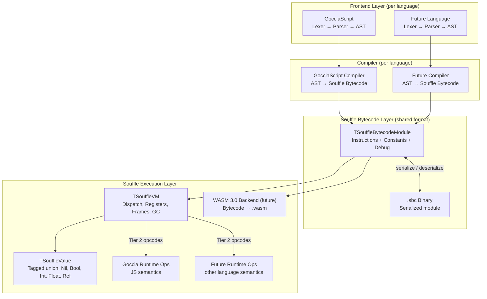

# Souffle VM

Souffle is a general-purpose bytecode virtual machine designed for extensibility, maintainability, and performance. It serves as an alternative execution backend for GocciaScript and is architected to support multiple programming language frontends and future WASM 3.0 output.

## Architecture Overview



The key architectural principle is the **separation of language semantics from VM mechanics**. The VM itself knows nothing about JavaScript, prototype chains, or any language-specific behavior. All language semantics are injected through the pluggable runtime operations interface.

## Execution Pipeline

```text
Source file --[Lexer]--> Tokens --[Parser]--> AST --[Compiler]--> Module --[VM]--> Result
                                                       |
                                              --emit-> .sbc file
                                                       |
.sbc file ----[LoadModuleFromFile]-----------> Module --[VM]--> Result
```

## Two-Tier Instruction Set Architecture

The opcode space is split into two tiers with distinct responsibilities:

### Tier 1 (opcodes 0–127): VM-Intrinsic Operations

Fixed semantics implemented directly in the dispatch loop. These are universal operations that every language needs:

| Category | Opcodes | Description |
|----------|---------|-------------|
| Load/Store | `OP_LOAD_CONST`, `OP_LOAD_NIL`, `OP_LOAD_TRUE`, `OP_LOAD_FALSE`, `OP_LOAD_INT`, `OP_MOVE` | Register manipulation and constant loading |
| Variables | `OP_GET_LOCAL`, `OP_SET_LOCAL`, `OP_GET_UPVALUE`, `OP_SET_UPVALUE`, `OP_CLOSE_UPVALUE` | Local and upvalue access |
| Control Flow | `OP_JUMP`, `OP_JUMP_IF_TRUE`, `OP_JUMP_IF_FALSE`, `OP_JUMP_IF_NIL`, `OP_JUMP_IF_NOT_NIL` | Branching and conditional jumps |
| Closures | `OP_CLOSURE` | Closure creation from function prototypes |
| Exceptions | `OP_PUSH_HANDLER`, `OP_POP_HANDLER`, `OP_THROW` | Handler-table exception model |
| Return | `OP_RETURN`, `OP_RETURN_NIL` | Function return |
| Debug | `OP_NOP`, `OP_LINE` | No-ops and source line annotations |

### Tier 2 (opcodes 128–255): Runtime-Dispatched Operations

Language-specific semantics dispatched through `TSouffleRuntimeOperations`, an abstract class that each language frontend provides:

| Category | Opcodes | Description |
|----------|---------|-------------|
| Arithmetic | `OP_RT_ADD` through `OP_RT_NEG` | Polymorphic arithmetic (addition, subtraction, etc.) |
| Bitwise | `OP_RT_BAND` through `OP_RT_BNOT` | Polymorphic bitwise operations |
| Comparison | `OP_RT_EQ` through `OP_RT_GTE` | Polymorphic comparison |
| Logical/Type | `OP_RT_NOT`, `OP_RT_TYPEOF`, `OP_RT_IS_INSTANCE`, `OP_RT_HAS_PROPERTY`, `OP_RT_TO_BOOLEAN` | Type checks and logical operations |
| Compound | `OP_RT_NEW_COMPOUND`, `OP_RT_INIT_FIELD`, `OP_RT_INIT_INDEX` | Object/array creation |
| Property Access | `OP_RT_GET_PROP`, `OP_RT_SET_PROP`, `OP_RT_GET_INDEX`, `OP_RT_SET_INDEX`, `OP_RT_DEL_PROP` | Property read/write/delete |
| Invocation | `OP_RT_CALL`, `OP_RT_CALL_METHOD`, `OP_RT_CONSTRUCT` | Function calls and construction |
| Iteration | `OP_RT_GET_ITER`, `OP_RT_ITER_NEXT`, `OP_RT_SPREAD` | Iterator protocol |
| Modules | `OP_RT_IMPORT`, `OP_RT_EXPORT` | Module system |
| Async | `OP_RT_AWAIT` | Async/await support |
| Globals | `OP_RT_GET_GLOBAL`, `OP_RT_SET_GLOBAL` | Global variable access |

The VM doesn't know what "get property" means. It calls `RuntimeOps.GetProperty(obj, key)`. GocciaScript's runtime walks prototype chains. A future Python runtime would do MRO + `__getattr__`. A future Lua runtime would check metatables. Same opcodes, completely different semantics — the **compiler** makes those choices, not the VM.

### Why Two Tiers?

Language-specific concepts like property access, arithmetic on polymorphic values, and `instanceof` have fundamentally different semantics across languages:

- **JavaScript/GocciaScript**: Prototype chain walking, `typeof` operator, `===` strict equality
- **Python**: MRO-based attribute lookup, `type()` builtin, `__eq__` dunder method
- **Lua**: Metatable lookups, `type()` function, raw equality

By routing these through an abstract interface, the VM remains language-agnostic. Adding a new language frontend requires implementing `TSouffleRuntimeOperations` — zero VM changes.

### Classes as a Compiler Concern

There is no `CLASS` opcode. Classes are syntactic sugar that the **compiler** desugars into generic operations:

```text
; class Foo extends Bar { constructor(x) { this.x = x; } greet() { return "hi"; } }

CLOSURE          r0, <constructor_proto>     ; constructor function
CLOSURE          r1, <greet_proto>           ; method
RT_NEW_COMPOUND  r2                          ; create prototype object
RT_SET_PROP      r2, "greet", r1             ; prototype.greet = greet
RT_SET_PROP      r0, "prototype", r2         ; Foo.prototype = proto
; Inheritance is handled by the runtime via Invoke/Construct — no dedicated opcode.
; The compiler emits RT_SET_PROP calls to wire prototype chains as appropriate
; for the language (JS: Object.setPrototypeOf, Python: metaclass, etc.).
```

Every language compiles its "class" concept differently, but all use the same generic opcodes. JavaScript does prototype chains, Python does metaclass invocation + MRO, Lua does metatables.

## Instruction Encoding

Fixed 32-bit instructions with an 8-bit opcode and 24-bit operand space. Four encoding formats:

| Format | Layout | Use |
|--------|--------|-----|
| ABC | `[op:8][A:8][B:8][C:8]` | Three 8-bit operands (arithmetic, comparison, property access) |
| ABx | `[op:8][A:8][Bx:16]` | One 8-bit + one 16-bit unsigned (constant/function index) |
| AsBx | `[op:8][A:8][sBx:16]` | One 8-bit + one 16-bit signed via bias (conditional jumps) |
| Ax | `[op:8][Ax:24]` | One 24-bit signed via bias (unconditional jumps) |

Signed operands use bias encoding: `sBx` is stored as `sBx + 32767`, `Ax` is stored as `Ax + 8388607`.

## Register-Based VM

Souffle uses a register-based architecture (like Lua 5, LuaJIT, and Dalvik) rather than a stack-based one.

```text
 Register File (array of TSouffleValue, 16 bytes each):
 ┌──────────────────┬─────────────────┬─────────────────┬─────┐
 │ Frame 0 (global) │ Frame 1 (fn A)  │ Frame 2 (fn B)  │ ... │
 │ R[0]..R[15]      │ R[0]..R[8]      │ R[0]..R[5]      │     │
 └──────────────────┴─────────────────┴─────────────────┴─────┘
   ^                  ^                  ^
   Base=0             Base=16            Base=25
```

- Up to 65,536 registers in a flat array
- Each call frame has a base offset; register operands are relative to the frame base
- Fewer instructions than stack-based VMs (no redundant push/pop)
- Cache-friendly flat array of 16-byte values with no indirection for primitives

### Call Frames

Each function call pushes a `TSouffleVMCallFrame` onto the call stack:

- `Closure` — the executing closure (provides code, constants, upvalues)
- `IP` — instruction pointer (index into the closure's code array)
- `Base` — absolute register offset for this frame
- `ReturnRegister` — absolute register index where the return value should be stored

The VM supports re-entrant execution: when a runtime operation (e.g., a closure bridge) needs to call back into the VM, `ExecuteFunction` saves and restores `FBaseFrameCount` to correctly handle nested dispatch loops.

## Tagged Union Value System

The VM has its own value system, completely independent of `TGocciaValue`:

```text
TSouffleValue (16 bytes):
┌──────────────────┬────────────────────────────────┐
│ Kind: UInt8 (1B) │ padding (7B)                   │
├──────────────────┴────────────────────────────────┤
│ Data (8B): Int64 / Double / Pointer               │
└───────────────────────────────────────────────────┘
```

### Five Value Kinds

| Kind | In-Value Data | Heap? | Description |
|------|--------------|-------|-------------|
| `svkNil` | — | No | Absence of value |
| `svkBoolean` | `AsBoolean: Boolean` | No | True or false |
| `svkInteger` | `AsInteger: Int64` | No | 64-bit integer |
| `svkFloat` | `AsFloat: Double` | No | 64-bit float |
| `svkReference` | `AsReference: TSouffleHeapObject` | Yes | Pointer to heap object |

Primitives are inline — zero heap allocation, zero GC pressure. All complex types (strings, objects, closures) are `svkReference` pointing to `TSouffleHeapObject` subclasses. The VM never inspects what kind of reference it is — that's the runtime's job.

### Why Only 5 Kinds?

The VM does **not** distinguish between strings, objects, arrays, closures, classes, etc. Those are all `svkReference` — a pointer to a heap object. The heap object carries its own type tag (`HeapKind: UInt8`) that the **runtime** interprets.

This means:

- The VM is truly language-agnostic — it doesn't know what "a string" or "an object" is
- Adding new heap types requires zero VM changes
- The register file is a flat array of 16-byte values — cache-friendly, no indirection for primitives

### Truthiness Semantics

`IsTrue` is the one Tier 1 operation that touches value kinds. It has universal behavior: Nil is falsy, Boolean checks the flag, Integer 0 is falsy, Float 0.0/NaN is falsy, all References are truthy. Languages that need different truthiness (e.g., Python where empty list is falsy) can use `RT_TO_BOOLEAN` instead of `JUMP_IF_TRUE`.

### Heap Objects

All heap-allocated values inherit from `TSouffleHeapObject`:

| Heap Kind | Constant | Class | Description |
|-----------|----------|-------|-------------|
| 0 | `SOUFFLE_HEAP_STRING` | `TSouffleString` | Immutable string value |
| 1 | `SOUFFLE_HEAP_CLOSURE` | `TSouffleClosure` | Function prototype + captured upvalues |
| 2 | `SOUFFLE_HEAP_UPVALUE` | `TSouffleUpvalue` | Open or closed upvalue |
| 128 | `SOUFFLE_HEAP_RUNTIME` | `TGocciaWrappedValue` | Language-specific wrapped value |

Kind 128+ is reserved for runtime-specific heap types. GocciaScript uses `TGocciaWrappedValue` to wrap `TGocciaValue` instances as Souffle heap objects, enabling GocciaScript's rich type system (arrays, objects, classes, promises, etc.) to be referenced from VM registers.

## Closures and Upvalues

Souffle uses a Lua-style upvalue model for lexical closures:

- **`TSouffleClosure`** — Pairs a `TSouffleFunctionPrototype` (code + constants) with an array of `TSouffleUpvalue` references
- **`TSouffleUpvalue`** — Either *open* (pointing to a live register) or *closed* (holding a captured value)
- **`OP_CLOSURE`** — Creates a closure from a nested function prototype, capturing upvalues as described by the prototype's `UpvalueDescriptors`
- **`OP_GET_UPVALUE` / `OP_SET_UPVALUE`** — Read/write through upvalue indirection
- **`OP_CLOSE_UPVALUE`** — Migrates an open upvalue's register value into the upvalue's `Closed` field

Open upvalues are linked in a sorted list (`FOpenUpvalues`) for efficient closing when a scope exits. When a function returns, all upvalues pointing to registers at or above the frame's base are closed.

## Exception Handling

Souffle uses a handler-table approach (not try/catch blocks in bytecode):

Each function prototype contains an array of `TSouffleExceptionHandler` records:

```text
TSouffleExceptionHandler:
  TryStart: UInt32     — first PC of the try range
  TryEnd: UInt32       — last PC of the try range
  CatchTarget: UInt32  — PC to jump to on exception
  FinallyTarget: UInt32 — PC for finally block ($FFFFFFFF if none)
  CatchRegister: UInt8 — register to store the caught value
```

At runtime, `OP_PUSH_HANDLER` pushes a handler entry; `OP_POP_HANDLER` removes it. When `OP_THROW` fires, the VM searches the handler stack for a matching handler and jumps to `CatchTarget`, storing the thrown value in `CatchRegister`.

## Garbage Collection

Souffle has its own mark-and-sweep garbage collector (`Souffle.GarbageCollector.pas`), independent of GocciaScript's GC:

- **Singleton** — `TSouffleGarbageCollector.Initialize` / `TSouffleGarbageCollector.Instance`
- **Managed objects** — All `TSouffleHeapObject` instances registered via `AllocateObject`
- **Pinned objects** — Long-lived objects protected from collection via `PinObject` / `UnpinObject`
- **Temp roots** — Short-lived references protected during operations via `AddTempRoot` / `RemoveTempRoot`
- **External root marker** — The VM registers `MarkVMRoots` to mark all values in the register file and call stack during collection
- **Threshold-based collection** — `CollectIfNeeded` triggers after a configurable number of allocations (default: 10,000)
- **O(1) membership** — Pinned objects and temp roots use `TDictionary<TSouffleHeapObject, Boolean>` for hash-set semantics

## Bytecode Module Structure

```text
TSouffleBytecodeModule
  ├── FormatVersion: UInt16
  ├── RuntimeTag: string                              (e.g., "goccia-js", "goccia-py")
  ├── TopLevel: TSouffleFunctionPrototype
  ├── SourcePath: string
  ├── Imports: array of TSouffleModuleImport
  │     ├── ModulePath: string
  │     └── Bindings: array of (ExportName, LocalSlot)
  └── Exports: array of TSouffleModuleExport
        ├── Name: string
        └── LocalSlot: UInt16
```

### Function Prototype

```text
TSouffleFunctionPrototype
  ├── Name: string
  ├── Code: array of UInt32                         (instruction words)
  ├── Constants: array of TSouffleBytecodeConstant   (typed constant pool)
  ├── Functions: array of TSouffleFunctionPrototype   (nested closures)
  ├── MaxRegisters: UInt8                            (register window size)
  ├── ParameterCount: UInt8
  ├── UpvalueCount: UInt8
  ├── UpvalueDescriptors: array of TSouffleUpvalueDescriptor
  │     ├── IsLocal: Boolean
  │     └── Index: UInt8
  ├── ExceptionHandlers: array of TSouffleExceptionHandler
  │     ├── TryStart, TryEnd: UInt32
  │     ├── CatchTarget: UInt32
  │     ├── FinallyTarget: UInt32 ($FFFFFFFF if none)
  │     └── CatchRegister: UInt8
  └── DebugInfo: TSouffleDebugInfo (optional)
        ├── SourceFile: string
        ├── LineMap: array of (PC, Line, Column)
        └── LocalNames: array of (Slot, Name, StartPC, EndPC)
```

### Constant Pool

Six constant kinds are supported:

| Kind | Tag | Data |
|------|-----|------|
| `bckNil` | 0 | — |
| `bckTrue` | 1 | — |
| `bckFalse` | 2 | — |
| `bckInteger` | 3 | `Int64` |
| `bckFloat` | 4 | `Double` |
| `bckString` | 5 | Length-prefixed UTF-8 |

Constants are deduplicated within each prototype — adding a duplicate returns the existing index.

## Binary Format (`.sbc`)

The `.sbc` (Souffle ByteCode) binary format enables ahead-of-time compilation and module distribution:

```text
.sbc Binary:
┌──────────────────────────────────────┐
│ Header                               │
│   Magic: "SBC\x00" (4 bytes)        │
│   FormatVersion: UInt16              │
├──────────────────────────────────────┤
│ Metadata                             │
│   RuntimeTag: len-prefixed UTF-8     │
│   SourcePath: len-prefixed UTF-8     │
│   HasDebugInfo: UInt8 (boolean)      │
├──────────────────────────────────────┤
│ Import Table                         │
│   Count: UInt16                      │
│   Per import:                        │
│     ModulePath: len-prefixed UTF-8   │
│     BindingCount: UInt16             │
│     Per binding:                     │
│       ExportName: len-prefixed UTF-8 │
│       LocalSlot: UInt16              │
├──────────────────────────────────────┤
│ Export Table                         │
│   Count: UInt16                      │
│   Per export:                        │
│     Name: len-prefixed UTF-8         │
│     LocalSlot: UInt16                │
├──────────────────────────────────────┤
│ Function Prototype (recursive)       │
│   Name: len-prefixed UTF-8           │
│   MaxRegisters: UInt8                │
│   ParameterCount: UInt8              │
│   UpvalueCount: UInt8                │
│   CodeLength: UInt32                 │
│   Code: CodeLength × UInt32          │
│   ConstantCount: UInt16              │
│   Per constant:                      │
│     Tag: UInt8 (0=nil..5=string)     │
│     Data varies by tag               │
│   Per upvalue:                       │
│     IsLocal: UInt8                   │
│     Index: UInt8                     │
│   HandlerCount: UInt16               │
│   Per handler:                       │
│     TryStart/End: UInt32             │
│     CatchTarget: UInt32              │
│     FinallyTarget: UInt32            │
│     CatchRegister: UInt8             │
│   SubFunctionCount: UInt16           │
│   Per sub: (recursive prototype)     │
│   HasDebug: UInt8 (boolean)          │
│   [if debug:]                        │
│     DebugInfo block                  │
└──────────────────────────────────────┘
```

The `RuntimeTag` field (e.g., `"goccia-js"`) identifies which runtime operations implementation is needed to execute the module. A loader can reject modules compiled for an incompatible runtime.

## CLI Integration

The `ScriptLoader`, `TestRunner`, and `BenchmarkRunner` all support switching between execution modes:

```bash
# Interpreted mode (default)
./build/ScriptLoader example.js
./build/ScriptLoader example.js --mode=interpreted

# Bytecode mode (compile and execute via Souffle VM)
./build/ScriptLoader example.js --mode=bytecode

# Emit bytecode to .sbc file (no execution)
./build/ScriptLoader example.js --emit
./build/ScriptLoader example.js --emit=output.sbc

# Load and execute a pre-compiled .sbc file
./build/ScriptLoader output.sbc
```

When `--emit` is used without a path, the output filename is derived from the input (e.g., `example.js` → `example.sbc`).

## GocciaScript Runtime Bridge

`TGocciaSouffleBackend` (`Goccia.Engine.Backend.pas`) bridges GocciaScript to the Souffle VM:

1. **`RegisterBuiltIns`** — Creates a `TGocciaEngine` instance to bootstrap all GocciaScript globals (`console`, `Math`, `JSON`, `Object`, `Array`, etc.), then registers each global scope binding with the Souffle runtime operations as a wrapped `TSouffleValue`.

2. **`CompileToModule`** — Compiles a `TGocciaProgram` AST to a `TSouffleBytecodeModule`, then evaluates any pending class definitions using the GocciaScript evaluator to produce proper `TGocciaClassValue` objects registered as globals.

3. **`RunModule`** — Executes a module on the VM and unwraps the result back to a `TGocciaValue`.

`TGocciaRuntimeOperations` (`Goccia.Runtime.Operations.pas`) implements `TSouffleRuntimeOperations` with GocciaScript semantics. It bridges between `TSouffleValue` and `TGocciaValue` at the runtime boundary:

- **`ToSouffleValue`** / **`UnwrapToGocciaValue`** — Convert between value systems
- **`TGocciaWrappedValue`** — Wraps a `TGocciaValue` as a `TSouffleHeapObject` for VM register storage
- **`TGocciaSouffleClosureBridge`** — Wraps a `TSouffleClosure` as a `TGocciaFunctionBase`, enabling Souffle closures to be called by GocciaScript built-in methods (e.g., `Array.prototype.map` callbacks)
- **Auto-boxing** — `GetProperty` performs primitive boxing when a direct property lookup returns `nil`, enabling prototype methods on primitives (e.g., `(42).toFixed(2)`)

## File Organization

All Souffle VM source files live in the `souffle/` directory with `Souffle.` prefix naming:

| File | Description |
|------|-------------|
| `Souffle.Value.pas` | `TSouffleValue` tagged union, constructors, type checks, truthiness |
| `Souffle.Heap.pas` | `TSouffleHeapObject` base class, `TSouffleString` |
| `Souffle.Bytecode.pas` | Opcode definitions, instruction encoding/decoding helpers |
| `Souffle.Bytecode.Chunk.pas` | `TSouffleFunctionPrototype`, constant pool, upvalue descriptors |
| `Souffle.Bytecode.Module.pas` | `TSouffleBytecodeModule`, import/export tables |
| `Souffle.Bytecode.Binary.pas` | `.sbc` serialization/deserialization |
| `Souffle.Bytecode.Debug.pas` | `TSouffleDebugInfo`, source line mapping, local variable info |
| `Souffle.VM.pas` | Core VM: dispatch loop, register file, execution |
| `Souffle.VM.CallFrame.pas` | `TSouffleVMCallFrame`, `TSouffleCallStack` |
| `Souffle.VM.Closure.pas` | `TSouffleClosure` (prototype + upvalue array) |
| `Souffle.VM.Upvalue.pas` | `TSouffleUpvalue` (open/closed variable capture) |
| `Souffle.VM.Exception.pas` | `TSouffleHandlerStack`, `ESouffleThrow` |
| `Souffle.VM.RuntimeOperations.pas` | `TSouffleRuntimeOperations` abstract interface |
| `Souffle.GarbageCollector.pas` | Mark-and-sweep GC for `TSouffleHeapObject` |

GocciaScript-specific bridge files in `units/`:

| File | Description |
|------|-------------|
| `Goccia.Engine.Backend.pas` | `TGocciaSouffleBackend` — orchestration, built-in registration |
| `Goccia.Compiler.pas` | `TGocciaCompiler` — AST to Souffle bytecode |
| `Goccia.Runtime.Operations.pas` | `TGocciaRuntimeOperations` — GocciaScript runtime semantics |

## WASM 3.0 Alignment

The architecture is designed to make a future WASM 3.0 backend a natural fit:

| Souffle Concept | WASM 3.0 Feature |
|-----------------|-------------------|
| `TSouffleValue` tagged union | `anyref` hierarchy (`i31ref` for small ints/bools, GC structs for boxed values) |
| `TSouffleHeapObject` | GC struct types with subtyping (`ref.cast`, `ref.test`) |
| `TSouffleClosure` | GC struct with `funcref` field + upvalue array |
| `TSouffleUpvalue` | Mutable GC struct field |
| Handler-table exception model | `try_table` / `throw` / `throw_ref` / `exnref` |
| Register file | WASM locals (lowered via register-to-stack translation) |
| Constant pool | WASM data segments + global constants |
| Module imports/exports | WASM module imports/exports |
| `.sbc` binary format | Infrastructure for emitting `.wasm` binary |

### Value Mapping

| Souffle Value | WASM 3.0 Representation |
|---------------|------------------------|
| `svkNil` | `ref.null none` |
| `svkBoolean` (true/false) | `i31ref` (unboxed: 1 or 0) |
| `svkInteger` (fits 31 bits) | `i31ref` (unboxed, no allocation) |
| `svkInteger` (large) | `(ref $boxed_i64)` GC struct with `i64` field |
| `svkFloat` | `(ref $boxed_f64)` GC struct with `f64` field |
| `svkReference` → String | `(ref $string)` GC array of `i8` |
| `svkReference` → Object | `(ref $object)` GC struct |
| `svkReference` → Closure | `(ref $closure)` GC struct with `funcref` + upvalue array |

Key WASM 3.0 features this leverages:

- **`i31ref`** — Unboxed 31-bit tagged integers: small ints and booleans need zero heap allocation in WASM too
- **GC structs** — `struct.new`, `struct.get`, `struct.set`: our heap objects map directly
- **GC arrays** — `array.new`, `array.get`, `array.set`: strings and array-like values
- **Subtyping** — `ref.cast`, `ref.test`, `br_on_cast`: heap kind dispatch without tables
- **Exception handling** — `try_table`, `throw`, `throw_ref`: direct mapping from our handler-table model

A WASM backend would read `TSouffleBytecodeModule` and emit a `.wasm` binary. The Souffle bytecode layer, VM, and compiler would require zero changes.

## Known Limitations

The Souffle VM bytecode backend is functional for basic scripts but has several areas not yet implemented. These are tracked here to prevent duplicate work and to guide future contributors.

### Not Yet Implemented (Deferred)

These features are stubbed in the runtime operations layer and will need real implementations before the corresponding GocciaScript features work in bytecode mode:

| Feature | Current State | What's Needed |
|---------|---------------|---------------|
| **Iteration** (`for...of`, spread) | `GetIterator` returns the value unchanged; `IteratorNext` always returns done; `SpreadInto` is a no-op | Wire to GocciaScript's `GetIteratorFromValue` / `TGocciaIteratorValue` protocol; handle arrays, strings, maps, sets, and user-defined iterables |
| **Module imports** | `ImportModule` returns `SouffleNil` | Resolve module paths, compile or load `.sbc` modules, return the module namespace object |
| **Async/await** | `AwaitValue` returns its argument unchanged | Integrate with `TGocciaPromiseValue` and the microtask queue |
| **Closure receiver slot** | `CallClosure` accepts `AReceiver` but does not store it into the new frame's register window | Define a receiver register convention in `TSouffleFunctionPrototype` and assign `AReceiver` into that slot when creating the closure call frame |
| **Template literal parsing** | The compiler re-lexes/re-parses each `${...}` interpolation from the raw template string | Enhance the parser to produce a template AST node with pre-parsed static and expression parts; the compiler would then iterate those directly |
| **Binary endianness** | `.sbc` serialization uses native-endian writes | Normalize to little-endian for cross-platform `.sbc` portability |

### Intentionally Not Changed (Rejected Findings)

These were reviewed and determined to be correct or not applicable:

| Finding | Verdict | Rationale |
|---------|---------|-----------|
| **`SBIAS_24` off-by-one** | Correct as-is | 24-bit unsigned range 0..16777215 with bias 8388607 gives signed range −8388607..+8388608 — standard Lua-style bias encoding. The comment and arithmetic are consistent. |
| **Tokens leak in `Goccia.Compiler.Test.pas`** | Not a leak | `Lexer.ScanTokens` returns a reference to the lexer's internal `FTokens` list, which the lexer frees in its destructor. Manually freeing `Tokens` causes a double-free crash. |
| **`Souffle.VM.RuntimeOperations.pas` uses `{$I Souffle.inc}`** | Intentional | This unit is part of the Souffle VM layer and follows Souffle naming conventions. The abstract `TSouffleRuntimeOperations` class is VM-level infrastructure, not a GocciaScript bridge. |
| **`InitScope`/`SuperInitScope` leak in `InstantiateClass`** | Not a leak | `TGocciaClassInitScope` is a `TGocciaScope` subclass that auto-registers with the GC in its constructor. All scopes are GC-managed — they are collected during sweep, not manually freed. This is consistent with every scope creation in the evaluator. |
| **null vs undefined conflation in runtime ops** | Intentional design | `svkNil` maps to `undefined`; `null` is a wrapped `TGocciaNullLiteralValue` reference registered as a global via `OP_RT_GET_GLOBAL('null')`. This keeps language-specific null semantics out of the VM's value system — adding `svkNull` would violate the language-agnostic design principle. |
| **`InitIndex` ignores array index** | Correct for current use | `OP_RT_INIT_INDEX` is emitted by the compiler for array literal initialization, which always emits elements in sequential order. `TGocciaArrayValue.Elements.Add` appends in order, matching the compiler's emission pattern. |
| **`MergeFileResult` string comparison for undefined** | Style preference | The `GetProperty(...).ToStringLiteral.Value = 'undefined'` check works correctly because `TGocciaUndefinedLiteralValue.ToStringLiteral` always returns `'undefined'`. A type check would be marginally more robust but the current code has no known failure mode. |

### Constant Pool Limitation (ABC Encoding)

The ABC instruction format encodes operand B and C as 8-bit values. This limits constant pool indices used in `OP_RT_SET_PROP`, `OP_RT_INIT_FIELD`, `OP_RT_GET_PROP`, and `OP_RT_DEL_PROP` to 255 entries per prototype. The compiler raises a clear error if this limit is exceeded. A future ABx-style wide-operand variant could lift this restriction if needed.

### NaN Handling in the Constant Pool

Float constant deduplication uses a raw IEEE 754 bit-pattern check (`FloatBitsAreNaN`) rather than FPC's `Math.IsNaN`. This avoids introducing language-runtime dependencies into the Souffle layer and works reliably across platforms including AArch64, where FPC's floating-point behavior has known pitfalls (see [code-style.md](code-style.md) § Platform Pitfall).

## Design Principles

1. **Language-agnostic VM** — The VM knows about 5 value kinds and generic operations. All language semantics live in the runtime operations layer.

2. **Compiler-side desugaring** — Language-specific features (classes, nullish coalescing, template literals) are compiled into sequences of generic VM instructions. The compiler makes semantic choices, not the VM.

3. **Self-contained value system** — `TSouffleValue` is independent of `TGocciaValue`. Bridge conversions happen at the runtime operations boundary, keeping the VM free of GocciaScript dependencies.

4. **Minimal opcode surface** — New language features should be expressible using existing Tier 1 + Tier 2 opcodes. Adding a new Tier 2 opcode is acceptable only when no combination of existing operations can express the semantics efficiently.

5. **Zero-overhead abstraction boundary** — The runtime tag on modules ensures type safety (a module compiled for one runtime cannot be loaded by another), but the actual dispatch is a single virtual method call per Tier 2 instruction.

6. **No language-runtime dependencies in the VM** — The `souffle/` directory must not import GocciaScript units (`Goccia.*`). All cross-boundary operations (NaN checks, type coercion, property semantics) use IEEE 754 bit-level operations or are delegated to the runtime operations interface. This ensures the VM layer remains reusable for other language frontends.
