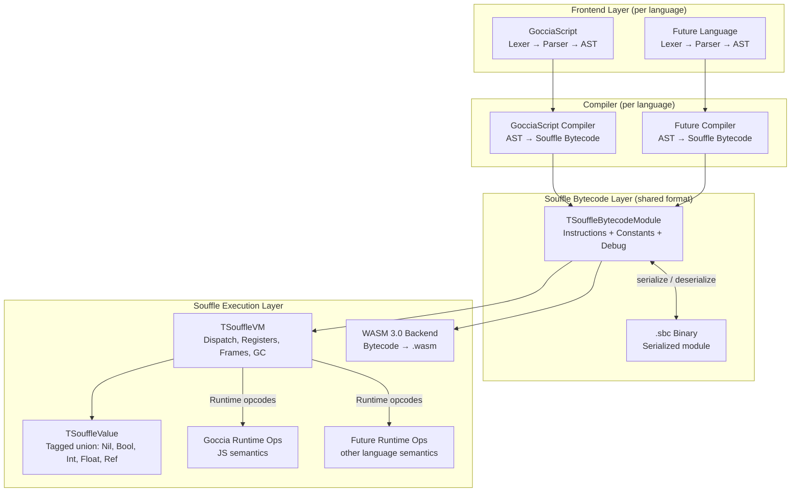

# Souffle VM

*For contributors working on the bytecode backend, or anyone designing a new language frontend targeting the Souffle VM.*

Souffle is a general-purpose, language-agnostic bytecode virtual machine designed for extensibility, maintainability, and performance. It is architected as a **standalone project** that can be extracted from the GocciaScript repository and used independently. While it currently serves as an alternative execution backend for GocciaScript, its architecture supports multiple programming language frontends (JavaScript/GocciaScript, Boo, C#, Ruby-like, or any other language) and WASM 3.0 output via the built-in bytecode-to-WASM translator.

The key design goal: the `souffle/` directory has **zero imports** from `Goccia.*` units. All language-specific behavior is injected through a pluggable abstract runtime interface (`TSouffleRuntimeOperations`). Adding a new language frontend requires implementing this interface — zero VM changes.

## Architecture Overview


```mermaid
graph TD
    subgraph frontends ["Frontend Layer (per language)"]
        GS["GocciaScript<br/>Lexer → Parser → AST"]
        FL["Future Language<br/>Lexer → Parser → AST"]
    end

    subgraph compiler ["Compiler (per language)"]
        GSC["GocciaScript Compiler<br/>AST → Souffle Bytecode"]
        FLC["Future Compiler<br/>AST → Souffle Bytecode"]
    end

    subgraph bytecodeLayer ["Souffle Bytecode Layer (shared format)"]
        BC["TSouffleBytecodeModule<br/>Instructions + Constants + Debug"]
        BIN[".sbc Binary<br/>Serialized module"]
    end

    subgraph execution ["Souffle Execution Layer"]
        VM["TSouffleVM<br/>Dispatch, Registers, Frames, GC"]
        VALS["TSouffleValue<br/>Tagged union: Nil, Bool, Int, Float, Ref"]
        RTJS["Goccia Runtime Ops<br/>JS semantics"]
        RTOTHER["Future Runtime Ops<br/>other language semantics"]
        WASM["WASM 3.0 Backend<br/>Bytecode → .wasm"]
    end

    GS --> GSC
    FL --> FLC
    GSC --> BC
    FLC --> BC
    BC <-->|"serialize / deserialize"| BIN
    BC --> VM
    BC --> WASM
    VM --> VALS
    VM -->|"Runtime opcodes"| RTJS
    VM -->|"Runtime opcodes"| RTOTHER
```

The key architectural principle is the **separation of language semantics from VM mechanics**. The VM itself knows nothing about JavaScript, prototype chains, or any language-specific behavior. All language semantics are injected through the pluggable runtime operations interface.

## Execution Pipeline

```text
Source file --[Lexer]--> Tokens --[Parser]--> AST --[Compiler]--> Module --[VM]--> Result
                                                       |
                                              --emit-> .sbc file
                                                       |
.sbc file ----[LoadModuleFromFile]-----------> Module --[VM]--> Result
```

## Two-Tier Instruction Set Architecture

The opcode space is split into two tiers with distinct responsibilities:

### Tier 1 (opcodes 0–127): VM-Intrinsic Operations

Fixed semantics implemented directly in the dispatch loop. These are universal operations that every language needs:

| Category | Opcodes | Description |
|----------|---------|-------------|
| Load/Store | `OP_LOAD_CONST`, `OP_LOAD_NIL` (AB: R[A]:=nil(flags=B)), `OP_LOAD_TRUE`, `OP_LOAD_FALSE`, `OP_LOAD_INT`, `OP_MOVE` | Register manipulation and constant loading |
| Variables | `OP_GET_LOCAL`, `OP_SET_LOCAL`, `OP_GET_UPVALUE`, `OP_SET_UPVALUE`, `OP_CLOSE_UPVALUE` | Local and upvalue access |
| Control Flow | `OP_JUMP`, `OP_JUMP_IF_TRUE`, `OP_JUMP_IF_FALSE`, `OP_JUMP_IF_NIL`, `OP_JUMP_IF_NOT_NIL` | Branching and conditional jumps |
| Closures | `OP_CLOSURE` | Closure creation from function prototypes |
| Compound Types | `OP_NEW_ARRAY`, `OP_ARRAY_PUSH`, `OP_ARRAY_POP`, `OP_ARRAY_GET`, `OP_ARRAY_SET` | VM-native dense array creation and access |
| Compound Types | `OP_NEW_RECORD`, `OP_RECORD_GET`, `OP_RECORD_SET`, `OP_RECORD_DELETE` | VM-native string-keyed record with per-entry property flags (writable, configurable) |
| Compound Types | `OP_GET_LENGTH` | Length query for arrays, records, and strings |
| Destructuring | `OP_UNPACK` | Extract rest of array from index N into a new array |
| Arguments | `OP_ARG_COUNT`, `OP_PACK_ARGS` | Actual argument count and variadic argument packing |
| Integer Arithmetic | `OP_ADD_INT`, `OP_SUB_INT`, `OP_MUL_INT`, `OP_DIV_INT`, `OP_MOD_INT`, `OP_NEG_INT` | Fast-path integer operations (no runtime dispatch) |
| Float Arithmetic | `OP_ADD_FLOAT`, `OP_SUB_FLOAT`, `OP_MUL_FLOAT`, `OP_DIV_FLOAT`, `OP_MOD_FLOAT`, `OP_NEG_FLOAT` | Fast-path float operations (no runtime dispatch) |
| Integer Comparison | `OP_EQ_INT`, `OP_NEQ_INT`, `OP_LT_INT`, `OP_GT_INT`, `OP_LTE_INT`, `OP_GTE_INT` | Fast-path integer comparison (no runtime dispatch) |
| Float Comparison | `OP_EQ_FLOAT`, `OP_NEQ_FLOAT`, `OP_LT_FLOAT`, `OP_GT_FLOAT`, `OP_LTE_FLOAT`, `OP_GTE_FLOAT` | Fast-path float comparison (no runtime dispatch) |
| String | `OP_CONCAT` | Direct string concatenation |
| Type Coercion | `OP_TO_PRIMITIVE` | Fast-path for primitives (nil/bool/int/float/string pass through), runtime callback for references |
| Type Checking | `OP_CHECK_TYPE` | Runtime type validation for strictly typed locals; coerces integer-to-float for `sltFloat` |
| Blueprint | `OP_NEW_BLUEPRINT`, `OP_INHERIT`, `OP_INSTANTIATE`, `OP_GET_SLOT`, `OP_SET_SLOT` | Wren-inspired blueprint primitives for optimized dispatch |
| Exceptions | `OP_PUSH_HANDLER`, `OP_POP_HANDLER`, `OP_THROW` | Handler-table exception model |
| Return | `OP_RETURN`, `OP_RETURN_NIL` | Function return |
| Debug | `OP_NOP`, `OP_LINE` | No-ops and source line annotations |

### Tier 2 (opcodes 128–255): Runtime-Dispatched Operations

Language-specific semantics dispatched through `TSouffleRuntimeOperations`, an abstract class that each language frontend provides:

| Category | Opcodes | Description |
|----------|---------|-------------|
| Arithmetic (7) | `OP_RT_ADD` through `OP_RT_NEG` | Polymorphic arithmetic with language-specific coercion |
| Bitwise (7) | `OP_RT_BAND` through `OP_RT_BNOT` | Polymorphic bitwise operations |
| Comparison (6) | `OP_RT_EQ` through `OP_RT_GTE` | Polymorphic comparison with language-specific equality/ordering |
| Logic/Type (5) | `OP_RT_NOT`, `OP_RT_TYPEOF`, `OP_RT_IS_INSTANCE`, `OP_RT_HAS_PROPERTY`, `OP_RT_TO_BOOLEAN` | Type checks, truthiness, logical operations |
| Property (6) | `OP_RT_GET_PROP`, `OP_RT_SET_PROP`, `OP_RT_GET_INDEX`, `OP_RT_SET_INDEX`, `OP_RT_DEL_PROP`, `OP_RT_DEL_INDEX` | Property read/write/delete with language-specific dispatch |
| Invocation (3) | `OP_RT_CALL`, `OP_RT_CALL_METHOD`, `OP_RT_CONSTRUCT` | Function calls and construction. `OP_RT_CALL` and `OP_RT_CALL_METHOD` use C as a flags byte (bit 0 = spread, bit 1 = trusted; no separate spread opcodes); `OP_RT_CONSTRUCT` uses C as a plain argument count — do not set flag bits on `OP_RT_CONSTRUCT` |
| Iteration (2) | `OP_RT_GET_ITER`, `OP_RT_ITER_NEXT` | Iterator protocol |
| Modules (2) | `OP_RT_IMPORT`, `OP_RT_EXPORT` | Module system |
| Async (1) | `OP_RT_AWAIT` | Async/await support |
| Globals (3) | `OP_RT_GET_GLOBAL`, `OP_RT_SET_GLOBAL`, `OP_RT_HAS_GLOBAL` | Global variable access and existence check |
| Coercion (1) | `OP_RT_TO_STRING` | Language-specific value-to-string (template literals, interpolation) |
| Extension (1) | `OP_RT_EXT` | Generic dispatch to `ExtendedOperation` for language-specific sub-opcodes |

The VM doesn't know what "get property" means. It calls `RuntimeOps.GetProperty(obj, key)`. GocciaScript's runtime walks prototype chains. A future Python runtime would do MRO + `__getattr__`. A future Lua runtime would check metatables. Same opcodes, completely different semantics — the **compiler** makes those choices, not the VM.

### Why Two Tiers?

Language-specific concepts like property access, arithmetic on polymorphic values, and `instanceof` have fundamentally different semantics across languages:

- **JavaScript/GocciaScript**: Prototype chain walking, `typeof` operator, `===` strict equality
- **Python**: MRO-based attribute lookup, `type()` builtin, `__eq__` dunder method
- **Lua**: Metatable lookups, `type()` function, raw equality

By routing these through an abstract interface, the VM remains language-agnostic. Adding a new language frontend requires implementing `TSouffleRuntimeOperations` — zero VM changes.

### TSouffleRuntimeOperations: The Abstract Interface

The runtime interface defines **47 methods (41 abstract + 6 virtual with defaults, including the `ExtendedOperation` extension entry point)**, all expressed in language-agnostic terms. No method name, parameter, or return type references JavaScript concepts. The full method listing:

| Group | Methods | Count |
|-------|---------|-------|
| Arithmetic | `Add`, `Subtract`, `Multiply`, `Divide`, `Modulo`, `Power`, `Negate` | 7 |
| Bitwise | `BitwiseAnd`, `BitwiseOr`, `BitwiseXor`, `ShiftLeft`, `ShiftRight`, `UnsignedShiftRight`, `BitwiseNot` | 7 |
| Comparison | `Equal`, `NotEqual`, `LessThan`, `GreaterThan`, `LessThanOrEqual`, `GreaterThanOrEqual` | 6 |
| Logic/Type | `LogicalNot`, `TypeOf`, `IsInstance`, `HasProperty`, `ToBoolean`, `ToPrimitive` | 6 |
| Property | `GetProperty`, `SetProperty`, `GetIndex`, `SetIndex`, `DeleteProperty`, `DeleteIndex` | 6 |
| Invocation | `Invoke`, `Construct` | 2 |
| Globals | `GetGlobal`, `SetGlobal`, `HasGlobal` | 3 |
| Iteration | `GetIterator`, `IteratorNext` | 2 |
| Modules | `ImportModule`, `ExportBinding` | 2 |
| Async | `AwaitValue`, `WrapInPromise` | 2 |
| Coercion | `CoerceValueToString` | 1 |
| Type Checking | `CheckLocalType` | 1 |
| Extension | `ExtendedOperation` | 1 |
| GC Coordination | `MarkExternalRoots` | 1 |

All methods operate on `TSouffleValue` — the VM's own tagged union. The runtime never touches registers, the instruction pointer, or the call stack. It receives values, performs language-specific logic, and returns values. The VM handles all register storage, frame management, and dispatch.

**Default implementations**: `DeleteIndex` (delegates to `DeleteProperty` with string coercion), `CoerceValueToString` (returns `SouffleNil`), `WrapInPromise` (returns the value unchanged), `CheckLocalType` (no-op), `ExtendedOperation` (no-op), and `MarkExternalRoots` (no-op) have default implementations in the base class. All other methods are abstract.

**Why these specific groups?** Every practical language needs arithmetic on polymorphic values, some form of property access, a way to call functions, and a way to compare values. The interface was designed by asking: *"What operations would a Boo, C#, Ruby, or fully-compliant ES engine need?"* Operations that only apply to one language (object spread, enum finalization, super method lookup) are routed through `ExtendedOperation` instead.

### OP_RT_EXT: Language Extension Mechanism

`OP_RT_EXT` (opcode 190) is a single generic extension opcode that allows language frontends to define their own sub-opcode IDs for complex, language-specific operations without polluting the VM's opcode space. The instruction encodes `ABC` where `B` is the sub-opcode ID, and `A`/`C` are register operands. The VM dispatches blindly to `RuntimeOps.ExtendedOperation(B, R[A], R[C], R[A+1], Template, C)`.

#### Design Decision: Why One Extension Opcode?

Three alternatives were evaluated during the boundary cleanup:

1. **Per-feature language opcodes** (e.g., `OP_RT_SPREAD_OBJ`, `OP_RT_DEF_GETTER`, `OP_RT_EVAL_CLASS`) — Rejected because each opcode couples the VM to one language. A Python frontend does not need `OP_RT_EVAL_CLASS`; a Ruby frontend does not need `OP_RT_SPREAD_OBJ`. This was the original design and led to 13 JS-specific opcodes accumulating in the VM's opcode table — a pattern explicitly identified as architectural drift.

2. **Multiple generic extension opcodes** (e.g., `OP_RT_EXT1` through `OP_RT_EXT8`) — Rejected as unnecessary complexity. One entry point with a sub-opcode byte provides 256 extension slots per language, which is more than sufficient. Multiple entry points add dispatch overhead without adding expressiveness.

3. **Single `OP_RT_EXT` with sub-opcode dispatch** — Chosen. The VM performs one virtual dispatch to `ExtendedOperation`, passing the sub-opcode ID. The runtime's `case` statement on sub-opcode IDs is compiled to a jump table by FPC — effectively zero overhead beyond the single virtual call. The sub-opcode constants live in the language's compiler unit, invisible to the VM.

#### GocciaScript Sub-opcodes

GocciaScript defines its sub-opcodes in `Goccia.Compiler.ExtOps.pas`:

| Sub-opcode | ID | Description |
|------------|----|-------------|
| `GOCCIA_EXT_SPREAD_OBJ` | 1 | Spread object properties into a target record |
| `GOCCIA_EXT_OBJ_REST` | 2 | Object rest destructuring (collect remaining properties) |
| `GOCCIA_EXT_FINALIZE_ENUM` | 3 | Finalize enum value (freeze, set up iterator) |
| `GOCCIA_EXT_DEF_GETTER` | 4 | Define getter on blueprint |
| `GOCCIA_EXT_DEF_SETTER` | 5 | Define setter on blueprint |
| `GOCCIA_EXT_DEF_STATIC_GETTER` | 6 | Define static getter on class |
| `GOCCIA_EXT_DEF_STATIC_SETTER` | 7 | Define static setter on class |
| `GOCCIA_EXT_REQUIRE_OBJECT` | 8 | Require object-coercible value (throw TypeError on null/undefined) |
| `GOCCIA_EXT_EVAL_CLASS` | 9 | Evaluate complex class definition (temporary bridge, see [Current State](#current-state-and-bridge-architecture)) |
| `GOCCIA_EXT_THROW_TYPE_ERROR` | 10 | Throw TypeError with message from constant pool |
| `GOCCIA_EXT_SUPER_GET` | 11 | Super method lookup in class hierarchy |
| `GOCCIA_EXT_SPREAD` | 12 | Spread iterable into array |
| `GOCCIA_EXT_REQUIRE_ITERABLE` | 13 | Require iterable value (throw TypeError if not iterable) |

A future C# frontend would define its own sub-opcode constants (e.g., `CSHARP_EXT_LINQ_SELECT`, `CSHARP_EXT_ASYNC_STATE_MACHINE`) and its own `ExtendedOperation` handler. The VM itself never interprets the sub-opcode IDs — they are opaque bytes.

### Record Property Flags

`TSouffleRecordEntry` carries a `Flags: Byte` field with per-entry property metadata:

- **Bit 0** (`SOUFFLE_PROP_WRITABLE`): Can this entry be reassigned? Default: 1 (writable)
- **Bit 1** (`SOUFFLE_PROP_CONFIGURABLE`): Can this entry be deleted/redefined? Default: 1 (configurable)

The per-property flag is the fundamental primitive. Bulk operations (freeze, seal) are derived from it.

#### Per-Property Primitives

| Method | Description |
|--------|-------------|
| `PutWithFlags(key, value, flags)` | Create or update a property with explicit flags |
| `SetEntryFlags(key, flags)` | Modify flags on an existing property |
| `GetEntryFlags(key)` | Read flags from an existing property |
| `PutChecked(key, value)` | Write that respects the writable flag (silently no-ops if non-writable) |
| `DeleteChecked(key)` | Delete that respects the configurable flag (silently no-ops if non-configurable) |
| `PreventExtensions` | Stop new properties from being added to the record |

`OP_RECORD_SET` in the VM dispatch uses `PutChecked`. `OP_RECORD_DELETE` uses `DeleteChecked`. These enforce per-property flags without runtime dispatch.

#### Derived Operations

Bulk operations like freeze and seal are built from the per-property primitives:

```text
Freeze            = for each entry: SetEntryFlags(key, 0) + PreventExtensions
Seal              = for each entry: SetEntryFlags(key, flags & ~CONFIGURABLE) + PreventExtensions
PreventExtensions = just set the extensibility flag (no per-property changes)
```

`TSouffleRecord.Freeze` exists as a convenience method that implements the first pattern. Language runtimes call it (or compose their own variant from the primitives) — there is no freeze opcode. JavaScript's `Object.freeze`, `Object.seal`, and `Object.preventExtensions` all reduce to different combinations of `SetEntryFlags` and `PreventExtensions`.

#### Design Decision: Per-Property Flags as Tier 1

Property mutability (writable/configurable) is a **Tier 1 concern** — every language with objects needs per-property control over mutability. The flags live directly on `TSouffleRecordEntry` and are enforced by the VM's `PutChecked`/`DeleteChecked` — no runtime dispatch needed. This is universal: JavaScript's `Object.defineProperty`, Ruby's `.freeze`, C#'s `readonly`, and Python's `__slots__` all reduce to per-property mutability control.

Property **visibility** (public/private/protected) and **accessor semantics** (getter/setter invocation) are **Tier 2 concerns** — these vary fundamentally across languages. JavaScript uses private name mangling with `#field`, C# uses CLR visibility metadata, Ruby uses `attr_reader`/`attr_writer`. These remain in the runtime operations layer.

An earlier design included a dedicated `OP_RECORD_FREEZE` opcode for bulk freezing. This was removed because:
1. The per-property flag primitive (`SetEntryFlags`) is the real building block — freezing is derived
2. Freezing semantics differ across languages (JS freezes shallowly at one level, Ruby freezes differently, some languages don't support freezing)
3. A bulk operation is trivially composed from per-property calls by the runtime — no opcode needed

### Spread Calling

Function call spread (`fn(...args)`) is handled via a **flag bit** on the existing invocation opcodes, not via dedicated spread opcodes:

- `OP_RT_CALL` and `OP_RT_CALL_METHOD` encode flags in the **C byte**:
  - **Bit 0** (spread): When set, register B holds the arguments array (a `TSouffleArray`), and the runtime's `InvokeWithSpread` unpacks and invokes. When clear, B holds the argument count, and arguments are in consecutive registers starting at `R[Base + A + 1]`
  - **Bit 1** (trusted): When set and the callee is a `TSouffleClosure`, `CallClosure` advances `Frame^.IP` past the function's `TypeCheckPreambleSize` to skip parameter preamble type checks. The compiler sets this bit only when the callee is a known immutable (`const`), non-global-backed binding whose parameter type signature exactly matches the argument types at the call site

#### Design Decision: Flags Over Separate Opcodes

An earlier design included `OP_RT_CALL_SPREAD` and `OP_RT_CALL_METHOD_SPREAD` as separate opcodes. These were removed and consolidated into the C flags byte on the existing opcodes. The rationale:

- Spread is a **modifier** on an existing operation (calling), not a fundamentally different operation
- Adding separate opcodes doubles the invocation opcode count (2→4) without adding expressiveness
- The C byte was previously unused in these opcodes, making it free to repurpose
- The same pattern (flag bits for mode selection) is used by other VMs (Lua's `OP_CALL` uses flags for vararg passing)

### Blueprint Compilation

The compiler uses a two-path strategy for class declarations:

**Most classes** (constructor, named methods, getters, setters, static members, private fields/methods, computed property names, and classes extending built-in constructors) are compiled directly to VM blueprint opcodes:

```text
; class Dog extends Animal { constructor(name) { super(name); } bark() { return name + " barks"; } }

NEW_BLUEPRINT    r0, "Dog"                   ; create TSouffleBlueprint
RT_GET_GLOBAL    r1, "Animal"                ; load super blueprint
INHERIT          r0, r1                      ; wire super blueprint chain
CLOSURE          r2, <constructor_proto>     ; compile constructor
RECORD_SET       r0, "constructor", r2       ; attach to blueprint methods
CLOSURE          r3, <bark_proto>            ; compile method
RECORD_SET       r0, "bark", r3             ; attach to blueprint methods
RT_SET_GLOBAL    "Dog", r0                   ; register globally
```

The `IsSimpleClass` function in `Goccia.Compiler.Statements.pas` performs the complexity detection. At runtime, `TGocciaRuntimeOperations.Construct` walks the `TSouffleBlueprint` super blueprint chain to find inherited constructors, and `GetProperty` on blueprint-backed records checks dynamic properties first, then walks the blueprint's method record hierarchy.

**Classes with decorators** are the only remaining category deferred to the interpreter via `FPendingClasses` and evaluated through `GOCCIA_EXT_EVAL_CLASS`. All other class features (getters, setters, statics, private members, computed properties, built-in subclassing) are compiled using a mix of blueprint opcodes and `OP_RT_EXT` sub-opcodes (e.g., `GOCCIA_EXT_DEF_GETTER`, `GOCCIA_EXT_DEF_SETTER`). Classes extending built-in constructors are compiled natively via `FBlueprintSuperValues` (mapping blueprints to their wrapped non-blueprint superclasses) and `TGocciaSuperCallHelper` (bridging `super()` calls to non-blueprint constructors).

## Instruction Encoding

Fixed 32-bit instructions with an 8-bit opcode and 24-bit operand space. Four encoding formats:

| Format | Layout | Use |
|--------|--------|-----|
| ABC | `[op:8][A:8][B:8][C:8]` | Three 8-bit operands (arithmetic, comparison, property access) |
| ABx | `[op:8][A:8][Bx:16]` | One 8-bit + one 16-bit unsigned (constant/function index) |
| AsBx | `[op:8][A:8][sBx:16]` | One 8-bit + one 16-bit signed via bias (conditional jumps) |
| Ax | `[op:8][Ax:24]` | One 24-bit signed via bias (unconditional jumps) |

Signed operands use bias encoding: `sBx` is stored as `sBx + 32767`, `Ax` is stored as `Ax + 8388607`.

## Register-Based VM

Souffle uses a register-based architecture (like Lua 5, LuaJIT, and Dalvik) rather than a stack-based one.

```text
 Register File (array of TSouffleValue, 16 bytes each):
 ┌──────────────────┬─────────────────┬─────────────────┬─────┐
 │ Frame 0 (global) │ Frame 1 (fn A)  │ Frame 2 (fn B)  │ ... │
 │ R[0]..R[15]      │ R[0]..R[8]      │ R[0]..R[5]      │     │
 └──────────────────┴─────────────────┴─────────────────┴─────┘
   ^                  ^                  ^
   Base=0             Base=16            Base=25
```

- Up to 65,536 registers in a flat array
- Each call frame has a base offset; register operands are relative to the frame base
- Fewer instructions than stack-based VMs (no redundant push/pop)
- Cache-friendly flat array of 16-byte values with no indirection for primitives

### Call Frames

Each function call pushes a `TSouffleVMCallFrame` onto the call stack:

- `Closure` — the executing closure (provides code, constants, upvalues)
- `IP` — instruction pointer (index into the closure's code array)
- `Base` — absolute register offset for this frame
- `ReturnRegister` — absolute register index where the return value should be stored

The VM supports re-entrant execution: when a runtime operation (e.g., a closure bridge) needs to call back into the VM, `ExecuteFunction` saves and restores `FBaseFrameCount` to correctly handle nested dispatch loops. If `OP_THROW` fires with an empty handler stack, `ExecuteFunction` cleans up the call stack (closing upvalues) and re-raises `ESouffleThrow` — the VM never swallows unhandled throws. The GocciaScript integration layer (`TGocciaSouffleClosureBridge.Call`, `TGocciaSouffleBackend.RunModule`) catches `ESouffleThrow` and converts it to `TGocciaThrowValue` so exceptions propagate correctly through the interpreter.

### Uniform Receiver Handling

Every function call uses a uniform register layout: **register 0 always holds the receiver**. For non-method calls (top-level functions, arrow functions), the receiver is `SouffleNil`. For method calls, it holds the object the method was called on.

```text
Frame layout:
  R[Base + 0]  = receiver (SouffleNil for non-methods)
  R[Base + 1]  = first argument
  R[Base + 2]  = second argument
  ...
```

`ExecuteFunction` and `CallClosure` always place the receiver in register 0 unconditionally — there is no `AIsMethodCall` flag or side-table lookup. The compiler reserves slot 0 for the receiver in every function by declaring a `__receiver` local (for arrow functions and the top-level module) or `this` (for methods). Arrow functions inherit `this` from their lexical closure scope, so the `SouffleNil` in register 0 is ignored by the language runtime. `TGocciaSouffleClosureBridge.Call` always passes `AThisValue` as `Args[0]`, making the bridge layer equally uniform.

## Tagged Union Value System

The VM has its own value system, completely independent of `TGocciaValue`:

```text
TSouffleValue (packed record, 16 bytes):
┌──────────────────┬──────────────┬──────────────────────────────┐
│ Kind: UInt8 (1B) │ Flags: (1B)  │ Variant Data (14B max)       │
├──────────────────┴──────────────┴──────────────────────────────┤
│ svkNil:       (nothing)                                        │
│ svkBoolean:   AsBoolean: Boolean                               │
│ svkInteger:   AsInteger: Int64                                 │
│ svkFloat:     AsFloat: Double                                  │
│ svkString:    AsInlineString: TSouffleInlineString (string[13]) │
│ svkReference: AsReference: TSouffleHeapObject                  │
└────────────────────────────────────────────────────────────────┘
```

### Six Value Kinds

| Kind | In-Value Data | Heap? | Description |
|------|--------------|-------|-------------|
| `svkNil` | — | No | Absence of value (flags distinguish flavors) |
| `svkBoolean` | `AsBoolean: Boolean` | No | True or false |
| `svkInteger` | `AsInteger: Int64` | No | 64-bit integer |
| `svkFloat` | `AsFloat: Double` | No | 64-bit float |
| `svkString` | `AsInlineString: TSouffleInlineString` | No | Short string (up to 13 bytes, inline) |
| `svkReference` | `AsReference: TSouffleHeapObject` | Yes | Pointer to heap object |

### Flags Byte

Every `TSouffleValue` carries a `Flags: Byte` field alongside `Kind`. This provides per-value metadata without adding new value kinds, keeping the VM general-purpose while allowing language runtimes to attach semantics:

- **`svkNil` flags** — Distinguishes flavors of "nothing". The VM treats all nils identically (falsy, numeric NaN). The runtime interprets flags: GocciaScript maps flags=0 to `undefined` (the default absent value), flags=1 to `null` (explicit null assignment), flags=2 to "the hole" (sparse array gap). `SouffleValuesEqual` compares flags for `svkNil` values — two nils with different flags are not equal.
- **Other kinds** — Flags default to 0. Reserved for future use (e.g., frozen strings, tainted values).

`OP_LOAD_NIL` uses AB encoding: `R[A] := Nil(flags=B)`. The compiler emits the appropriate flag for each language construct.

### Inline Short String Optimization

Strings up to 13 characters are stored inline as `svkString` using `TSouffleInlineString = string[13]`. This avoids heap allocation for the vast majority of strings (property names, short literals, single characters). Strings longer than 13 characters are stored as `svkReference` pointing to a `TSouffleHeapString` heap object.

The `SouffleString(AValue)` constructor auto-selects the representation:
- `Length(AValue) <= 13` → `svkString` with `AsInlineString`
- `Length(AValue) > 13` → `svkReference` to a new `TSouffleHeapString`

The `SouffleGetString(AValue)` accessor handles both representations transparently. `SouffleIsStringValue(AValue)` checks for both `svkString` and `svkReference` to `TSouffleHeapString`.

### Design Rationale

**Packed record (16 bytes)**: Kind (1B) + Flags (1B) + variant (14B max from `string[13]`), totalling 16 bytes. The `packed` directive eliminates alignment padding. On modern hardware, the unaligned access penalty for `Int64`/`Double` is negligible — measured at less than 1% in benchmarks.

**Why not NaN boxing**: NaN boxing (as used by V8/SpiderMonkey/Wren) encodes type tags in the mantissa bits of a 64-bit double, achieving 8 bytes per value. However, FPC's `Double` type does not expose raw bit manipulation as idiomatically as C, making NaN boxing fragile and non-portable across FPC targets (x86, ARM, WASM). The packed record approach is transparent, debuggable, and works identically on all FPC targets.

**Why not a class hierarchy**: A class-based `TSouffleValue` (one subclass per kind) would require heap allocation for every primitive, adding pointer indirection, GC pressure, and ~40 bytes overhead per value (VMT + instance header). The flat variant record keeps primitives inline with zero allocation.

### Why Only 6 Kinds?

The VM does **not** distinguish between objects, arrays, closures, classes, etc. at the value kind level. Those are all `svkReference` — a pointer to a heap object. The heap object carries its own type tag (`HeapKind: UInt8`). Strings are the exception: short strings are inline (`svkString`) for performance, while long strings use `svkReference` to `TSouffleHeapString`.

For performance-critical compound types (arrays and records), the VM provides inline type checks in core opcodes. For example, `OP_ARRAY_GET` checks `HeapKind = SOUFFLE_HEAP_ARRAY` and performs a direct element access; if the check fails, it falls through to the runtime. This gives the best of both worlds: VM-native speed for common operations, full language-specific semantics via runtime dispatch for complex cases.

This means:

- The VM is language-agnostic — it provides generic array/record primitives usable by any language
- Adding new heap types requires zero VM changes (runtime dispatch handles them)
- Core compound opcodes provide fast paths that eliminate wrapping overhead for the most common operations
- The register file is a flat array of 16-byte packed values — cache-friendly, no indirection for primitives or short strings

### Truthiness Semantics

`SouffleIsTrue` is the one Tier 1 operation that touches value kinds. It has universal behavior: Nil is falsy (regardless of flags), Boolean checks the flag, Integer 0 is falsy, Float 0.0/NaN is falsy, empty inline string is falsy, all References are truthy. Languages that need different truthiness (e.g., Python where empty list is falsy) can use `RT_TO_BOOLEAN` instead of `JUMP_IF_TRUE`.

### Heap Objects

All heap-allocated values inherit from `TSouffleHeapObject`:

| Heap Kind | Constant | Class | Description |
|-----------|----------|-------|-------------|
| 1 | `SOUFFLE_HEAP_CLOSURE` | `TSouffleClosure` | Function prototype + captured upvalues |
| 2 | `SOUFFLE_HEAP_UPVALUE` | `TSouffleUpvalue` | Open or closed upvalue |
| 3 | `SOUFFLE_HEAP_ARRAY` | `TSouffleArray` | Dense dynamic array of `TSouffleValue` |
| 4 | `SOUFFLE_HEAP_RECORD` | `TSouffleRecord` | Unified compound type: plain key-value map or blueprint-backed with indexed slots |
| 5 | `SOUFFLE_HEAP_NATIVE_FUNCTION` | `TSouffleNativeFunction` | Pascal callback wrapped as a callable heap object |
| 6 | `SOUFFLE_HEAP_BLUEPRINT` | `TSouffleBlueprint` | Type descriptor with SlotCount, method record (TSouffleRecord), and optional SuperBlueprint |
| 7 | `SOUFFLE_HEAP_STRING` | `TSouffleHeapString` | Heap-allocated string (for strings exceeding 13-byte inline limit) |
| 128 | `SOUFFLE_HEAP_RUNTIME` | `TGocciaWrappedValue` | Language-specific wrapped value |

Kind 128+ is reserved for runtime-specific heap types. GocciaScript uses `TGocciaWrappedValue` to wrap `TGocciaValue` instances as Souffle heap objects, enabling GocciaScript's rich type system (classes, promises, etc.) to be referenced from VM registers.

All heap objects have an optional **delegate** field (`TSouffleHeapObject.Delegate`), which enables prototype-chain-like method dispatch at the VM level without crossing the language boundary. See [Delegates](#delegates) below.

## Native Compound Types

The VM provides two compound types at the heap level, enabling direct operations without runtime dispatch for the most common data structures:

### `TSouffleArray` (heap kind 3)

Dense dynamic array of `TSouffleValue`. Universal across languages (JS arrays, Python lists, Lua array part, Wren lists, WASM GC arrays).

- O(1) indexed get/set
- O(1) amortized push (doubling capacity, minimum 8)
- O(1) pop via `OP_ARRAY_POP` (AB format: R[A] := Array(R[B]).Pop())
- Negative or out-of-range indices return `nil`
- `Put` auto-extends with `nil` fill when the index exceeds the current count

### `TSouffleRecord` (heap kind 4)

Unified compound type for all key-value data. Records without a blueprint are plain string-keyed hash maps (object literals, Python dicts, Lua hash part). Records with a blueprint (created via `CreateFromBlueprint`) have both key-value entries and indexed slots for O(1) field access.

- FNV-1a 32-bit hash with open addressing (linear probing)
- 75% max load factor, doubles capacity on grow
- Insertion-order iteration via `GetOrderedKey`/`GetOrderedValue`
- Tombstone-based deletion preserves probe chains
- Blueprint-backed records: O(1) indexed slot access alongside key-value map

**Why string-keyed only**: String keys cover the vast majority of property access across target languages. Non-string keys (JS Symbols, Python arbitrary-type dict keys) are rare and inherently language-specific — they remain in the runtime layer.

### Core vs Runtime Property Access

The compiler emits core compound opcodes for statically known operations:

- Array literals `[1, 2, 3]` → `OP_NEW_ARRAY` + `OP_ARRAY_PUSH`
- Object literals `{a: 1}` → `OP_NEW_RECORD` + `OP_RECORD_SET`
- Computed index `arr[i]` → `OP_ARRAY_GET` (fast path for native arrays, fallback to runtime)
- Named property `obj.key` → `OP_RECORD_GET` (fast path for native records, fallback to runtime)
- Property assignment `obj.key = val` → `OP_RECORD_SET` (fast path for native records, fallback to runtime)

All core compound opcodes have runtime fallbacks: if the operand is not the expected native type (e.g., a wrapped GocciaScript value instead of a `TSouffleRecord`), the VM delegates to `TSouffleRuntimeOperations.GetProperty` / `SetProperty` / `GetIndex` / `SetIndex`.

The runtime opcodes (`OP_RT_GET_PROP`, `OP_RT_SET_PROP`, etc.) remain for complex cases: prototype chain walking, Symbol-keyed properties, accessor invocation, and `typeof`/`instanceof`/`in`.

### Blueprint Primitives (Wren-inspired)

The VM provides blueprint primitives (`TSouffleBlueprint` heap type) for class-like type descriptors. Blueprints sit alongside the unified `TSouffleRecord` and enable efficient method dispatch and instance creation without runtime dispatch.

#### `TSouffleBlueprint` Fields

| Field | Type | Description |
|-------|------|-------------|
| `FName` | `string` | Type name (e.g., `"Dog"`) — used for debug output and `OP_RT_IS_INSTANCE` |
| `FSlotCount` | `Integer` | Number of indexed instance slots for O(1) field access |
| `FMethods` | `TSouffleRecord` | Key-value record holding method closures (created in constructor) |
| `FSuperBlueprint` | `TSouffleBlueprint` | Optional parent blueprint for inheritance (set by `OP_INHERIT`) |
| `FPrototype` | `TSouffleRecord` | Lazily created: if a super blueprint exists, created via `CreateFromBlueprint(Super)`; otherwise a plain `TSouffleRecord` |

#### Lifecycle

1. **`OP_NEW_BLUEPRINT`** — Creates a `TSouffleBlueprint` with the given name and slot count. The `FMethods` record is created empty.

2. **`OP_INHERIT`** — Sets `Blueprint.SuperBlueprint := SuperBlueprint`. This wires up the inheritance chain but does not copy methods.

3. **`OP_RECORD_SET` on a blueprint** — `OP_RECORD_SET` is overloaded to handle blueprints: when the target register holds a `TSouffleBlueprint`, the operation stores the value in `Blueprint.Methods`. This eliminates the need for a dedicated blueprint-method opcode. Called once per method during class definition.

4. **`OP_INSTANTIATE`** — Creates a new `TSouffleRecord` via `CreateFromBlueprint(Blueprint)`. The instance gets indexed slots (for O(1) field access) and its delegate is set to `Blueprint.Methods`. This means method lookups on instances walk the delegate chain: instance → methods → super methods → ...

5. **Construction** — The runtime's `Construct` operation walks the super blueprint chain to find a `constructor` method, then calls it as a closure with the instance as receiver.

#### Method Dispatch

When accessing a property on a blueprint-backed instance:

```text
obj.bark()
  1. OP_RECORD_GET checks obj's own entries (dynamic properties)
  2. DelegateGet walks: obj.Delegate (= Blueprint.Methods)
     → Blueprint.Methods.Delegate (= SuperBlueprint.Methods)
     → ... until the key is found or the chain ends
  3. Runtime fallback: TSouffleRuntimeOperations.GetProperty
```

This gives O(1) own-property access and O(depth) inherited method lookup — all within the VM, no language boundary crossing.

#### Optimization Properties

- **Blueprint-backed record slot access** uses O(1) integer-indexed slots instead of string-keyed hash lookups
- **Method dispatch** uses the delegate chain directly, enabling efficient inheritance without runtime dispatch
- The runtime opcodes (`OP_RT_CONSTRUCT`, `OP_RT_IS_INSTANCE`, `OP_RT_GET_PROP`, `OP_RT_SET_PROP`) remain as polymorphic fallbacks for cases where the compiler can't statically determine the type

The blueprint opcodes are a fast path — not a replacement for the record-based approach. Languages that don't have classes (or use different class semantics) continue to use plain `TSouffleRecord` for everything.

### WASM GC Mapping

```text
TSouffleArray   →  WASM array type (array.new, array.get, array.set)
TSouffleRecord  →  WASM struct type (struct.new, struct.get, struct.set)
                   For dynamic records: WASM GC hash map (runtime library)
OP_ARRAY_GET    →  array.get
OP_RECORD_GET   →  struct.get (static) or runtime hash lookup (dynamic)
```

### Performance

With native compound types, the hot path for `arr[i]` is:

```text
1. Decode instruction (inline)
2. Check R[B].Kind = svkReference (branch)
3. Check R[B].AsReference is TSouffleArray (HeapKind check)
4. Check R[C].Kind = svkInteger (branch)
5. Bounds check + direct array access (one load)
6. Store into R[A]
```

vs. the previous path via `TGocciaWrappedValue`:

```text
1. Decode instruction → call RuntimeOps.GetIndex (virtual dispatch)
2. Check wrapped value type
3. Unwrap TGocciaWrappedValue → TGocciaValue
4. Type-check TGocciaValue (is TGocciaArrayValue)
5. Convert key to string
6. Call TGocciaArrayValue.GetProperty
7. Wrap result in TGocciaWrappedValue (heap allocation)
8. Store into R[A]
```

### GC Integration

Both compound types participate in mark-and-sweep:

- `TSouffleArray.MarkReferences` — marks all elements that are `svkReference`
- `TSouffleRecord.MarkReferences` — marks all occupied values that are `svkReference`
- Both are registered via `AllocateObject` and tracked by the Souffle GC

## Delegates

Every `TSouffleHeapObject` can have an optional **delegate** — another `TSouffleHeapObject` (typically a `TSouffleRecord`) that the VM consults for key lookups that miss on the primary data. Delegates form a chain: each delegate can itself have a delegate, enabling inheritance-like method dispatch at the VM level without crossing into language-specific runtime code.

### How It Works

When `OP_RECORD_GET` resolves a string-keyed property:

1. **Direct lookup** — If the object is a `TSouffleRecord`, check the record's own entries
2. **Delegate chain walk** — `DelegateGet` walks `Object.Delegate → Delegate.Delegate → ...`, checking each `TSouffleRecord` for the key
3. **Runtime fallback** — Delegate to `TSouffleRuntimeOperations.GetProperty`

For `arr.push(6)` on a `TSouffleArray`:
- Step 1 skips (arrays aren't records)
- Step 2 finds `push` in the array's delegate → returns a `TSouffleNativeFunction`
- `OP_RT_CALL_METHOD` invokes the native function directly with the array as receiver
- **Zero wrapping** — the entire call stays within the Souffle VM

For blueprint-backed instances (e.g., `dog.bark()`):
- Step 1 checks the instance record's own entries (dynamic properties)
- Step 2 walks the delegate chain: instance → `Blueprint.Methods` → `SuperBlueprint.Methods` → ...
- The first record containing `bark` returns the closure
- This enables class inheritance without any runtime dispatch

### `TSouffleNativeFunction`

A heap object (`SOUFFLE_HEAP_NATIVE_FUNCTION`) that wraps a Pascal function pointer:

```pascal
TSouffleNativeCallback = function(
  const AReceiver: TSouffleValue;
  const AArgs: PSouffleValue;
  const AArgCount: Integer): TSouffleValue;
```

The callback receives `TSouffleValue` arguments and returns a `TSouffleValue` result. It operates directly on Souffle's value system — no language boundary crossing.

### VM Integration

The VM holds configurable default delegates per compound type:

- `TSouffleVM.ArrayDelegate` — assigned to every `TSouffleArray` created by `OP_NEW_ARRAY`
- `TSouffleVM.RecordDelegate` — assigned to every `TSouffleRecord` created by `OP_NEW_RECORD`

The language frontend populates these delegates during initialization. Individual instances can override their delegate after creation.

`OP_RT_CALL` and `OP_RT_CALL_METHOD` dispatch `TSouffleNativeFunction` directly (inline invocation), before falling to the runtime operations interface. This gives delegate methods the same call overhead as closures.

### GocciaScript Registration

The GocciaScript bridge layer (`TGocciaRuntimeOperations.RegisterDelegates`) creates a `TSouffleRecord` for each type and populates it with native function implementations:

| Type | Method | Description |
|------|--------|-------------|
| Array | `push(value)` | Appends value, returns new length (syncs to cache) |
| Array | `pop()` | Removes and returns last element (syncs to cache) |
| Array | `shift()` | Removes and returns first element (syncs to cache) |
| Array | `unshift(...values)` | Prepends values, returns new length (syncs to cache) |
| Array | `splice(start, count, ...items)` | Removes/inserts elements (syncs to cache) |
| Array | `reverse()` | Reverses in place (syncs to cache) |
| Array | `sort([comparator])` | Sorts in place (syncs to cache) |
| Array | `fill(value [, start [, end]])` | Fills range with value (syncs to cache) |
| Array | `join(sep)` | Joins elements with separator string |
| Array | `indexOf(value)` | First index of value, or -1 |
| Array | `includes(value)` | Whether array contains value |
| Array | `slice([start [, end]])` | Returns shallow copy of range |
| Array | `concat(...args)` | Returns merged array |
| Array | `at(index)` | Element at index (negative wraps) |
| Array | `forEach(callback)` | Calls callback for each element |
| Array | `map(callback)` | Returns mapped array |
| Array | `filter(callback)` | Returns filtered array |
| Array | `find(callback)` | First element passing test |
| Array | `findIndex(callback)` | Index of first passing element |
| Array | `findLast(callback)` | Last element passing test |
| Array | `findLastIndex(callback)` | Index of last passing element |
| Array | `every(callback)` | Whether all pass test |
| Array | `some(callback)` | Whether any passes test |
| Array | `reduce(callback [, init])` | Left fold |
| Array | `reduceRight(callback [, init])` | Right fold |
| Array | `flat([depth])` | Flattens nested arrays |
| Array | `flatMap(callback)` | Maps then flattens one level |
| Array | `toString()` | String representation |
| Array | `length` | Element count (read-only) |
| Map | `get(key)` | Get value for key (direct `FindEntry` access) |
| Map | `set(key, value)` | Set key-value pair (direct `SetEntry` access) |
| Map | `has(key)` | Check if key exists (direct `FindEntry` access) |
| Map | `delete(key)` | Remove key |
| Map | `clear()` | Remove all entries |
| Map | `forEach(callback)` | Iterate over entries |
| Map | `keys()` | Returns an iterator over keys |
| Map | `values()` | Returns an iterator over values |
| Map | `entries()` | Returns an iterator over entries |
| Set | `has(value)` | Check if value exists |
| Set | `add(value)` | Add a value |
| Set | `delete(value)` | Remove a value |
| Set | `clear()` | Remove all values |
| Set | `forEach(callback)` | Iterate over values |
| Set | `values()` | Returns an iterator over values |
| Set | `entries()` | Returns an iterator of `[value, value]` pairs |

### Language Agnosticism

The delegate mechanism is language-agnostic:
- The VM only performs string-keyed record lookups — it knows nothing about prototypes, `this`, or method binding
- The receiver is passed as a `TSouffleValue` to the native callback — the callback decides how to interpret it
- Different language frontends can register different delegates with different methods for the same compound types

## Closures and Upvalues

Souffle uses a Lua-style upvalue model for lexical closures:

- **`TSouffleClosure`** — Pairs a `TSouffleFunctionTemplate` (code + constants) with an array of `TSouffleUpvalue` references
- **`TSouffleUpvalue`** — Either *open* (pointing to a live register) or *closed* (holding a captured value)
- **`OP_CLOSURE`** — Creates a closure from a nested function prototype, capturing upvalues as described by the prototype's `UpvalueDescriptors`
- **`OP_GET_UPVALUE` / `OP_SET_UPVALUE`** — Read/write through upvalue indirection
- **`OP_CLOSE_UPVALUE`** — Migrates an open upvalue's register value into the upvalue's `Closed` field

Open upvalues are linked in a sorted list (`FOpenUpvalues`) for efficient closing when a scope exits. When a function returns, all upvalues pointing to registers at or above the frame's base are closed.

## Exception Handling

Souffle uses a handler-table approach (not try/catch blocks in bytecode):

Each function prototype contains an array of `TSouffleExceptionHandler` records:

```text
TSouffleExceptionHandler:
  TryStart: UInt32     — first PC of the try range
  TryEnd: UInt32       — last PC of the try range
  CatchTarget: UInt32  — PC to jump to on exception
  FinallyTarget: UInt32 — PC for finally block ($FFFFFFFF if none)
  CatchRegister: UInt8 — register to store the caught value
```

At runtime, `OP_PUSH_HANDLER` pushes a handler entry; `OP_POP_HANDLER` removes it. When `OP_THROW` fires, the VM searches the handler stack for a matching handler and jumps to `CatchTarget`, storing the thrown value in `CatchRegister`.

### Non-Local Exits Through Finally

When `break` or `return` occurs inside a `try...finally` block, the compiler inlines the finally block before the exit instruction. The compiler tracks pending finally blocks via `GPendingFinally` (a stack of `TPendingFinallyEntry` records). `CompileReturnStatement` pops all pending handlers and compiles all finally blocks before emitting `OP_RETURN`. `CompileBreakStatement` uses `GBreakFinallyBase` to process only the finally blocks added since the current loop/switch started — outer finally blocks are left intact. This ensures finally blocks execute on all exit paths without runtime support.

## Garbage Collection

Souffle shares the unified mark-and-sweep garbage collector with the GocciaScript interpreter via `TGarbageCollector.Instance` (from `GarbageCollector.Generic.pas`):

- **Unified singleton** — `TGarbageCollector.Instance` (the single GC used by both the interpreter and the VM)
- **Lifecycle** — Automatic collection is disabled during VM execution (`Enabled := False` around `TSouffleVM.Execute`) to prevent sweeping Souffle objects that are on the Pascal stack but not yet in VM registers. Both the BenchmarkRunner and TestRunner call `Collect` after each file to reclaim memory between script executions.
- **Generation-counter marking** — Uses `TGCManagedObject.AdvanceMark` (O(1)) instead of an O(n) loop to clear marks before each collection. Each object's `FGCMark` is compared to the global `FCurrentMark` generation counter.
- **Managed objects** — All `TSouffleHeapObject` instances registered via `AllocateObject`, which also sets `GCIndex` for O(1) unregistration
- **Pinned objects** — Long-lived objects protected from collection via `PinObject` / `UnpinObject`
- **Temp roots** — Short-lived references protected during operations via `AddTempRoot` / `RemoveTempRoot`
- **External root marker** — The VM registers `MarkVMRoots` to mark all values in the register file and call stack during collection
- **Threshold-based collection** — `CollectIfNeeded` triggers after a configurable number of allocations (default: 10,000). Currently disabled; re-enabling requires completing the root coverage in `MarkExternalRoots` for bridge call paths.
- **O(1) membership** — Pinned objects and temp roots use `TDictionary<TSouffleHeapObject, Boolean>` for hash-set semantics

## Bytecode Module Structure

```text
TSouffleBytecodeModule
  ├── FormatVersion: UInt16
  ├── RuntimeTag: string                              (e.g., "goccia-js", "goccia-py")
  ├── TopLevel: TSouffleFunctionTemplate
  ├── SourcePath: string
  ├── Imports: array of TSouffleModuleImport
  │     ├── ModulePath: string
  │     └── Bindings: array of (ExportName, LocalSlot)
  └── Exports: array of TSouffleModuleExport
        ├── Name: string
        └── LocalSlot: UInt16
```

### Function Prototype

```text
TSouffleFunctionTemplate
  ├── Name: string
  ├── Code: array of UInt32                         (instruction words)
  ├── Constants: array of TSouffleBytecodeConstant   (typed constant pool)
  ├── Functions: array of TSouffleFunctionTemplate   (nested closures)
  ├── MaxRegisters: UInt8                            (register window size)
  ├── ParameterCount: UInt8
  ├── UpvalueCount: UInt8
  ├── UpvalueDescriptors: array of TSouffleUpvalueDescriptor
  │     ├── IsLocal: Boolean
  │     └── Index: UInt8
  ├── ExceptionHandlers: array of TSouffleExceptionHandler
  │     ├── TryStart, TryEnd: UInt32
  │     ├── CatchTarget: UInt32
  │     ├── FinallyTarget: UInt32 ($FFFFFFFF if none)
  │     └── CatchRegister: UInt8
  ├── DebugInfo: TSouffleDebugInfo (optional)
  │     ├── SourceFile: string
  │     ├── LineMap: array of (PC, Line, Column)
  │     └── LocalNames: array of (Slot, Name, StartPC, EndPC)
  ├── LocalTypes: array of TSouffleLocalType   (per-slot type hints)
  │     ├── LocalTypeCount: UInt8
  │     └── Per slot: sltUntyped (0), sltInteger (1), sltFloat (2),
  │                   sltBoolean (3), sltString (4), sltReference (5)
  ├── LocalStrictFlags: array of Boolean       (per-slot strict enforcement)
  │     ├── LocalStrictCount: UInt8
  │     └── Per slot: IsStrict (true = reassignment type-checked)
  └── TypeCheckPreambleSize: UInt8             (instructions to skip for trusted calls)
```

The compiler infers `TSouffleLocalType` hints from literal initializers and type annotations (e.g., `const x = 42` gets `sltFloat`, `let z: number` gets `sltFloat`). All JavaScript numeric values are `sltFloat` (IEEE 754 double); `sltInteger` is reserved for known-integer results like `.length`. These type hints are stored on the template and used to select typed arithmetic opcodes (`OP_ADD_FLOAT`, `OP_LTE_FLOAT`, etc.) instead of generic runtime opcodes (`OP_RT_ADD`). Local variable access always uses `OP_GET_LOCAL`/`OP_SET_LOCAL` regardless of type — the optimization comes from the arithmetic and comparison opcodes, not the load/store. Typed float opcodes are inlined in the VM's main dispatch loop for maximum performance, eliminating procedure call overhead. All typed float opcodes use `SouffleToDouble`, which safely handles both `svkFloat` and `svkInteger` values — so integer values in float-typed slots produce correct results without explicit coercion.

Separately from type hints, each local slot has a per-local `IsStrict` flag (stored in `LocalStrictFlags`) that controls whether reassignment to an incompatible type throws a `TypeError`. A slot with a type hint but without the strict flag set may still benefit from optimized typed opcodes, but will not throw on type-incompatible reassignment. In the current GocciaScript compiler, `IsStrict` is set whenever a non-untyped type hint is inferred — so variables with initializers or type annotations are both type-hinted and strictly typed. The per-function `TypeCheckPreambleSize` records how many `OP_CHECK_TYPE` instructions form the parameter validation preamble, enabling trusted calls to skip them.

#### OP_CHECK_TYPE and Trusted Calls

`OP_CHECK_TYPE` is emitted at function entry (the "preamble") and at assignment sites. It validates that a register holds a value compatible with the expected `TSouffleLocalType`. For `sltFloat`, it coerces `svkInteger` to `svkFloat`; for other mismatches, it delegates to `CheckLocalType` on the runtime interface, which can throw a `TypeError`.

`OP_CHECK_TYPE` always executes — there is no frame-wide bypass. The only optimization is **preamble skipping**: when `CallClosure` receives a trusted call (C flag bit 1), it advances `Frame^.IP` past `TypeCheckPreambleSize` instructions, skipping parameter validation at function entry. Body-level type checks (assignment guards) remain active even in trusted frames.

**Trusted call constraints** — The compiler sets the trusted bit only when all of the following hold:
1. The callee is resolved as a local or upvalue binding
2. The binding is immutable (`IsConst`)
3. The binding is not global-backed (`not IsGlobalBacked`)
4. All parameter types in the callee's `ParamTypeSignature` are known (non-`sltUntyped`)
5. All argument types at the call site match the parameter types via `TypesAreCompatible` (exact match, plus integer→float coercion)

Integer arguments passed to float parameters are considered compatible because all typed float opcodes use `SouffleToDouble`, which handles both `svkInteger` and `svkFloat` — the coercion is implicit in the opcode execution, not dependent on the preamble.

### Constant Pool

Six constant kinds are supported:

| Kind | Tag | Data |
|------|-----|------|
| `bckNil` | 0 | — |
| `bckTrue` | 1 | — |
| `bckFalse` | 2 | — |
| `bckInteger` | 3 | `Int64` |
| `bckFloat` | 4 | `Double` |
| `bckString` | 5 | Length-prefixed UTF-8 |

Constants are deduplicated within each prototype — adding a duplicate returns the existing index.

## Binary Format (`.sbc`)

The `.sbc` (Souffle ByteCode) binary format enables ahead-of-time compilation and module distribution:

```text
.sbc Binary:
┌──────────────────────────────────────┐
│ Header                               │
│   Magic: "SBC\x00" (4 bytes)        │
│   FormatVersion: UInt16              │
├──────────────────────────────────────┤
│ Metadata                             │
│   RuntimeTag: len-prefixed UTF-8     │
│   SourcePath: len-prefixed UTF-8     │
│   HasDebugInfo: UInt8 (boolean)      │
├──────────────────────────────────────┤
│ Import Table                         │
│   Count: UInt16                      │
│   Per import:                        │
│     ModulePath: len-prefixed UTF-8   │
│     BindingCount: UInt16             │
│     Per binding:                     │
│       ExportName: len-prefixed UTF-8 │
│       LocalSlot: UInt16              │
├──────────────────────────────────────┤
│ Export Table                         │
│   Count: UInt16                      │
│   Per export:                        │
│     Name: len-prefixed UTF-8         │
│     LocalSlot: UInt16                │
├──────────────────────────────────────┤
│ Function Prototype (recursive)       │
│   Name: len-prefixed UTF-8           │
│   MaxRegisters: UInt8                │
│   ParameterCount: UInt8              │
│   UpvalueCount: UInt8                │
│   CodeLength: UInt32                 │
│   Code: CodeLength × UInt32          │
│   ConstantCount: UInt16              │
│   Per constant:                      │
│     Tag: UInt8 (0=nil..5=string)     │
│     Data varies by tag               │
│   Per upvalue:                       │
│     IsLocal: UInt8                   │
│     Index: UInt8                     │
│   HandlerCount: UInt16               │
│   Per handler:                       │
│     TryStart/End: UInt32             │
│     CatchTarget: UInt32              │
│     FinallyTarget: UInt32            │
│     CatchRegister: UInt8             │
│   SubFunctionCount: UInt16           │
│   Per sub: (recursive prototype)     │
│   HasDebug: UInt8 (boolean)          │
│   [if debug:]                        │
│     DebugInfo block                  │
│   LocalTypeCount: UInt8              │
│   Per local type:                    │
│     Kind: UInt8 (0=untyped..5=ref)   │
│   LocalStrictCount: UInt8            │
│   Per local strict flag:             │
│     IsStrict: UInt8 (boolean)        │
│   TypeCheckPreambleSize: UInt8       │
└──────────────────────────────────────┘
```

The current format version is `SOUFFLE_FORMAT_VERSION = 3` (defined in `Souffle.Bytecode.pas`). Version 2 added per-local strict flags (`LocalStrictCount` + `IsStrict` per local) and `TypeCheckPreambleSize` to the function prototype layout. Version 3 standardized all multi-byte fields to little-endian byte order for cross-platform portability. The loader rejects modules with a mismatched format version.

The `RuntimeTag` field (e.g., `"goccia-js"`) identifies which runtime operations implementation is needed to execute the module. A loader can reject modules compiled for an incompatible runtime.

## CLI Integration

The `ScriptLoader`, `TestRunner`, and `BenchmarkRunner` all support switching between execution modes:

```bash
# Interpreted mode (default)
./build/ScriptLoader example.js
./build/ScriptLoader example.js --mode=interpreted

# Bytecode mode (compile and execute via Souffle VM)
./build/ScriptLoader example.js --mode=bytecode

# Emit bytecode to .sbc file (no execution)
./build/ScriptLoader example.js --emit
./build/ScriptLoader example.js --emit=output.sbc

# Load and execute a pre-compiled .sbc file
./build/ScriptLoader output.sbc
```

When `--emit` is used without a path, the output filename is derived from the input (e.g., `example.js` → `example.sbc`).

## Current State and Bridge Architecture

### What Works Natively

The following features execute entirely within the Souffle VM without crossing the language boundary:

- **Primitives**: Integer and float arithmetic, string concatenation, boolean logic, nil semantics (with null/undefined distinction via flags)
- **Variables**: `const`/`let` declarations with compile-time const enforcement, proper scoping, closures with upvalue capture/close
- **Compound types**: Array/record literals, property access, indexed access, `delete`, spread, rest destructuring
- **Control flow**: If/else, ternary, logical and/or, nullish coalescing, short-circuit evaluation
- **Functions**: Arrow functions, shorthand methods, default parameters, rest parameters, variadic argument packing
- **Classes**: Constructor, named methods, getters, setters, static members, private fields/methods, computed property names, and classes extending built-in constructors — all compiled to blueprint opcodes plus extension sub-opcodes. Only classes with decorators are deferred
- **Exception handling**: try/catch/finally, throw, handler-table model
- **Delegates**: Array prototype methods (`push`, `pop`, `shift`, `unshift`, `join`, `indexOf`, `includes`, `slice`, `reverse`, `concat`, `fill`, `at`, `forEach`, `map`, `filter`, `find`, `findIndex`, `findLast`, `findLastIndex`, `every`, `some`, `reduce`, `reduceRight`, `sort`, `flat`, `flatMap`, `splice`, `toString`, `length`), Map methods (`get`, `set`, `has`, `delete`, `clear`, `forEach`, `keys`, `values`, `entries`, `size`), and Set methods (`has`, `add`, `delete`, `clear`, `forEach`, `values`, `entries`) dispatch within the VM via delegate chain — zero wrapping. Mutating array methods (`push`, `pop`, `shift`, `unshift`, `splice`, `reverse`, `sort`, `fill`) immediately sync changes to the bridge cache via `SyncSouffleArrayToCache`. Map/Set `get`/`set`/`has` use direct `FindEntry`/`SetEntry` access on the underlying `TGocciaMapValue`/`TGocciaSetValue` for optimal performance
- **Global built-ins**: All interpreter-side built-ins (`console`, `Math`, `JSON`, `Object`, `Array`, etc.) are available as wrapped values

### What Uses Bridge Code

The bridge layer is the set of components in `TGocciaRuntimeOperations` that convert between `TSouffleValue` and `TGocciaValue` to delegate work to the GocciaScript interpreter/evaluator. This layer implements most Tier 2 operations by unwrapping Souffle values, calling the existing evaluator, and wrapping the result back. The bridge includes:

| Component | Role | Size |
|-----------|------|------|
| `UnwrapToGocciaValue` / `ToSouffleValue` | Value conversion between the two type systems | ~200 LOC |
| `TGocciaSouffleProxy` | Wraps Souffle compound types as `TGocciaValue` for interpreter consumption | ~100 LOC |
| `TGocciaWrappedValue` | Wraps `TGocciaValue` as Souffle heap object for VM register storage | ~50 LOC |
| `TGocciaSouffleClosureBridge` | Wraps `TSouffleClosure` as `TGocciaFunctionBase` for interpreter callbacks | ~80 LOC |
| `FClosureBridgeCache` / `FArrayBridgeCache` | Forward caches (`TSouffleHeapObject` → `TGocciaValue`) to avoid re-wrapping | ~30 LOC |
| `FArrayBridgeReverse` | Reverse cache (`TGocciaArrayValue` → `TSouffleArray`) for reference identity preservation | ~10 LOC |
| `SyncCachedGocciaToSouffle` | One-way sync at bridge entry: pushes `TGocciaArrayValue` contents to `TSouffleArray` | ~15 LOC |
| `SyncSouffleArrayToCache` | Immediate sync after native array mutations: pushes `TSouffleArray` contents to `TGocciaArrayValue` | ~15 LOC |
| `CreateBridgedContext` | Maps VM globals to an interpreter scope for evaluator calls | ~80 LOC |
| `FPendingClasses` | Deferred class definitions that require interpreter evaluation | ~50 LOC |

The bridge is currently used by these runtime operations:

- **`Invoke`**: Only 55 calls still bridge to the interpreter (99.7% reduction). 20,565 calls go directly to native functions. Remaining bridge calls are for edge-case wrapped callables
- **`Construct`**: 770 calls bridge for `TGocciaClassValue` (built-in constructors). 389 calls use native `TSouffleBlueprint` construction
- **`GetProperty`** / **`SetProperty`**: For wrapped values (classes, promises, symbols, etc.), unwraps the target, delegates to `TGocciaValue.GetProperty`/`SetProperty`
- **`IsInstance`** / **`TypeOf`**: For wrapped values, delegates to the GocciaScript type system
- **`ExtendedOperation` sub-ops**: All 13 `GOCCIA_EXT_*` sub-opcodes delegate to GocciaScript evaluator methods
- **Decorator class evaluation**: `GOCCIA_EXT_EVAL_CLASS` bootstraps an interpreter scope from VM globals and evaluates classes with decorators (the only remaining deferred class category)

### The Unwrap-Delegate-Wrap Cycle

The current runtime follows this pattern for most Tier 2 operations:

```text
1. VM calls RuntimeOps.SomeOperation(souffleValue)     [Tier 2 dispatch]
2. RuntimeOps converts: gocciaValue := UnwrapToGocciaValue(souffleValue)  [bridge]
3. RuntimeOps delegates: result := gocciaValue.SomeMethod(args)          [evaluator]
4. RuntimeOps converts: souffleResult := ToSouffleValue(result)          [bridge]
5. VM stores souffleResult in register                                   [Tier 1]
```

This cycle has three costs:
- **Allocation**: Each unwrap/wrap may allocate proxy or wrapper objects
- **Cache pollution**: Two parallel value hierarchies active simultaneously
- **Architectural coupling**: The runtime imports `Goccia.Evaluator`, `Goccia.Interpreter`, and `Goccia.Engine` — binding the entire GocciaScript interpreter into the bytecode path

### Bridge Constraints

1. **Two GC systems**: Bridge objects must be tracked by both the Souffle GC (as `TSouffleHeapObject`) and the GocciaScript GC (as `TGocciaValue`), complicating memory management.

2. **Built-in subclassing**: Classes extending built-in constructors (`Array`, `Map`, `Set`, `Promise`, `Object`) are deferred to the interpreter because `OP_INHERIT` requires both class and superclass to be `TSouffleBlueprint`s, while built-in constructors are `TGocciaClassValue`s.

3. **Architectural coupling**: The runtime imports `Goccia.Evaluator`, `Goccia.Interpreter`, and `Goccia.Engine`, binding the interpreter into the bytecode path for bridge operations.

### Target Architecture

The long-term goal is to **eliminate the bridge entirely** by having `TGocciaRuntimeOperations` implement JavaScript semantics directly on Souffle types (`TSouffleValue`, `TSouffleArray`, `TSouffleRecord`, `TSouffleBlueprint`). The target:

```text
1. VM calls RuntimeOps.SomeOperation(souffleValue)     [Tier 2 dispatch]
2. RuntimeOps operates directly on souffleValue         [native Souffle types]
3. VM stores result in register                         [Tier 1]
```

This requires a ground-up rewrite of `TGocciaRuntimeOperations` — not incremental patching of the bridge. The rewrite would:

- Remove all `UnwrapToGocciaValue` / `ToSouffleValue` conversions
- Implement prototype chain walking on `TSouffleRecord` delegate chains
- Implement type coercion (ToPrimitive, ToString, ToNumber) natively on `TSouffleValue`
- Compile all class features (getters, setters, statics, private members, decorators) to Tier 1 + Tier 2 opcodes, eliminating `FPendingClasses`
- Implement all built-in methods as `TSouffleNativeFunction` delegates operating on Souffle types

Until the rewrite, the bridge code is functional and correct — both execution modes pass 100% of the test suite. The bridge adds overhead from value conversion and dual GC tracking, but does not limit language feature coverage.

## GocciaScript Runtime Bridge (Current Implementation)

`TGocciaSouffleBackend` (`Goccia.Engine.Backend.pas`) bridges GocciaScript to the Souffle VM:

1. **`RegisterBuiltIns`** — Creates a `TGocciaEngine` instance to bootstrap all GocciaScript globals (`console`, `Math`, `JSON`, `Object`, `Array`, etc.), then registers each global scope binding with the Souffle runtime operations as a wrapped `TSouffleValue`.

2. **`CompileToModule`** — Compiles a `TGocciaProgram` AST to a `TSouffleBytecodeModule`, then evaluates any pending class definitions using the GocciaScript evaluator to produce proper `TGocciaClassValue` objects registered as globals.

3. **`RunModule`** — Executes a module on the VM and unwraps the result back to a `TGocciaValue`.

`TGocciaRuntimeOperations` (`Goccia.Runtime.Operations.pas`) implements `TSouffleRuntimeOperations` with GocciaScript semantics. It bridges between `TSouffleValue` and `TGocciaValue` at the runtime boundary:

- **`ToSouffleValue`** / **`UnwrapToGocciaValue`** — Convert between value systems. `UnwrapToGocciaValue` creates a `TGocciaArrayValue` bridge for `TSouffleArray` (cached in `FArrayBridgeCache`) and a lazy `TGocciaSouffleProxy` for `TSouffleRecord`. `ToSouffleValue` checks `FArrayBridgeReverse` to recover the original `TSouffleArray` from a bridge `TGocciaArrayValue`, preserving reference identity across round-trips
- **`TGocciaSouffleProxy`** — A single `TGocciaValue` subclass that wraps any Souffle compound type. Property access is delegated to `TGocciaRuntimeOperations.ResolveProxyGet`/`ResolveProxySet`, which dispatch based on the target's type. This is a higher-order function pattern: one proxy class handles all compound types, and the resolution logic lives in the runtime. No per-type subclassing needed
- **`TGocciaWrappedValue`** — Wraps a `TGocciaValue` as a `TSouffleHeapObject` for VM register storage (used for types without native VM representation: classes, promises, symbols, etc.)
- **`TGocciaSouffleClosureBridge`** — Wraps a `TSouffleClosure` as a `TGocciaFunctionBase`, enabling Souffle closures to be called by GocciaScript built-in methods (e.g., `Array.prototype.map` callbacks). At bridge entry, `SyncCachedGocciaToSouffle` pushes GocciaScript-side array changes to their Souffle counterparts. No exit sync is needed — native array mutations sync immediately via `SyncSouffleArrayToCache`
- **Delegate registration** — `RegisterDelegates` creates VM-native delegate records for arrays and records (with all array prototype methods as `TSouffleNativeFunction` callbacks) and assigns them to the VM's default delegate slots. Method calls like `arr.push(6)` are dispatched entirely within the VM without crossing the language boundary. Mutating array methods immediately sync changes to the bridge cache
- **Native compound fast paths** — `GetProperty`, `SetProperty`, `GetIndex`, `SetIndex`, `HasProperty`, `DeleteProperty`, and `TypeOf` all check for `TSouffleArray`/`TSouffleRecord` before falling through to wrapped value unwrapping, avoiding unnecessary materialization
- **Auto-boxing** — `GetProperty` performs primitive boxing when a direct property lookup returns `nil`, enabling prototype methods on primitives (e.g., `(42).toFixed(2)`)
- **Array bridge sync model** — Bridged arrays have dual representation: `TSouffleArray` (read by the VM) and `TGocciaArrayValue` (read by GocciaScript built-ins). `TGocciaArrayValue` is the authoritative source. Two sync paths keep them consistent: (1) `SyncSouffleArrayToCache` — called immediately after native delegate methods mutate a `TSouffleArray`, propagates the change to the cached `TGocciaArrayValue`; (2) `SyncCachedGocciaToSouffle` — called once at bridge entry (when GocciaScript calls back into the Souffle VM), pushes `TGocciaArrayValue` contents to the `TSouffleArray`. `FArrayBridgeReverse` (never cleared at bridge depth 0) preserves reference identity for arrays held by long-lived objects like Promises. Both sides of `FArrayBridgeReverse` are rooted during GC marking: `MarkExternalRoots` marks the `TSouffleArray` values and `MarkWrappedGocciaValues` marks the `TGocciaArrayValue` keys, preventing dangling pointers after collection

## File Organization

All Souffle VM source files live in the `souffle/` directory with `Souffle.` prefix naming:

| File | Description |
|------|-------------|
| `Souffle.Value.pas` | `TSouffleValue` packed record (16B), `TSouffleInlineString`, constructors, `SouffleGetString`/`SouffleIsStringValue`, type checks, truthiness |
| `Souffle.Heap.pas` | `TSouffleHeapObject` base class, `TSouffleHeapString` (long string fallback), heap kind constants |
| `Souffle.Compound.pas` | `TSouffleArray` (dense array), `TSouffleRecord` (unified compound: plain key-value map or blueprint-backed with slots), `TSouffleBlueprint` (type descriptor with method record and optional super blueprint) |
| `Souffle.Bytecode.pas` | Opcode definitions, instruction encoding/decoding helpers |
| `Souffle.Bytecode.Chunk.pas` | `TSouffleFunctionTemplate`, constant pool, upvalue descriptors |
| `Souffle.Bytecode.Module.pas` | `TSouffleBytecodeModule`, import/export tables |
| `Souffle.Bytecode.Binary.pas` | `.sbc` serialization/deserialization |
| `Souffle.Bytecode.Debug.pas` | `TSouffleDebugInfo`, source line mapping, local variable info |
| `Souffle.VM.pas` | Core VM: dispatch loop, register file, execution |
| `Souffle.VM.CallFrame.pas` | `TSouffleVMCallFrame`, `TSouffleCallStack` |
| `Souffle.VM.Closure.pas` | `TSouffleClosure` (prototype + upvalue array) |
| `Souffle.VM.NativeFunction.pas` | `TSouffleNativeFunction` (Pascal callback as callable heap object) |
| `Souffle.VM.Upvalue.pas` | `TSouffleUpvalue` (open/closed variable capture) |
| `Souffle.VM.Exception.pas` | `TSouffleHandlerStack`, `ESouffleThrow` |
| `Souffle.VM.RuntimeOperations.pas` | `TSouffleRuntimeOperations` abstract interface for language-specific semantics |

Shared infrastructure (outside `souffle/`):

| File | Description |
|------|-------------|
| `GarbageCollector.Managed.pas` | `TGCManagedObject` base class for all GC-managed objects |
| `GarbageCollector.Generic.pas` | Unified mark-and-sweep GC (shared with interpreter) |

GocciaScript-specific bridge files in `units/`:

| File | Description |
|------|-------------|
| `Goccia.Engine.Backend.pas` | `TGocciaSouffleBackend` — orchestration, built-in registration |
| `Goccia.Compiler.pas` | `TGocciaCompiler` — AST to Souffle bytecode, top-level compilation dispatch |
| `Goccia.Compiler.Expressions.pas` | Expression compilation: functions, methods, identifiers, typed local load/store |
| `Goccia.Compiler.Statements.pas` | Statement compilation: variables, classes (`IsSimpleClass` + `CompileClassDeclaration`), control flow |
| `Goccia.Compiler.Context.pas` | `TGocciaCompilationContext` — compilation state passed through sub-units |
| `Goccia.Compiler.Scope.pas` | `TGocciaCompilerScope` — lexical scope tracking, local/upvalue resolution, type hints |
| `Goccia.Compiler.ConstantFolding.pas` | Compile-time constant folding for arithmetic and comparison expressions |
| `Goccia.Runtime.Operations.pas` | `TGocciaRuntimeOperations` — GocciaScript runtime semantics |

## WASM 3.0 Backend

The Souffle-to-WASM translator (`Souffle.Wasm.Translator.pas`) converts `TSouffleBytecodeModule` into `.wasm` binary modules. The architecture maps naturally to WASM 3.0 features:

| Souffle Concept | WASM 3.0 Feature |
|-----------------|-------------------|
| `TSouffleValue` tagged union | `anyref` hierarchy (`i31ref` for small ints/bools, GC structs for boxed values) |
| `TSouffleHeapObject` | GC struct types with subtyping (`ref.cast`, `ref.test`) |
| `TSouffleArray` | GC array type (`array.new`, `array.get`, `array.set`) |
| `TSouffleRecord` | GC struct (static fields) or runtime hash map (dynamic keys) |
| `TSouffleClosure` | GC struct with `funcref` field + upvalue array |
| `TSouffleUpvalue` | Mutable GC struct field |
| Handler-table exception model | `try_table` / `throw` / `throw_ref` / `exnref` |
| Register file | WASM locals (lowered via register-to-stack translation) |
| Constant pool | WASM data segments + global constants |
| Module imports/exports | WASM module imports/exports |
| `.sbc` binary format | Infrastructure for emitting `.wasm` binary |

### Value Mapping

| Souffle Value | WASM 3.0 Representation |
|---------------|------------------------|
| `svkNil` | `ref.null none` |
| `svkBoolean` (true/false) | `i31ref` (unboxed: 1 or 0) |
| `svkInteger` (fits 31 bits) | `i31ref` (unboxed, no allocation) |
| `svkInteger` (large) | `(ref $boxed_i64)` GC struct with `i64` field |
| `svkFloat` | `(ref $boxed_f64)` GC struct with `f64` field |
| `svkReference` → String | `(ref $string)` GC array of `i8` |
| `svkReference` → Array | `(ref $array)` GC array of `anyref` (`array.new`, `array.get`, `array.set`) |
| `svkReference` → Record | `(ref $record)` GC struct (static fields) or runtime hash map (dynamic) |
| `svkReference` → Closure | `(ref $closure)` GC struct with `funcref` + upvalue array |

Key WASM 3.0 features this leverages:

- **`i31ref`** — Unboxed 31-bit tagged integers: small ints and booleans need zero heap allocation in WASM too
- **GC structs** — `struct.new`, `struct.get`, `struct.set`: our heap objects map directly
- **GC arrays** — `array.new`, `array.get`, `array.set`: strings and array-like values
- **Subtyping** — `ref.cast`, `ref.test`, `br_on_cast`: heap kind dispatch without tables
- **Exception handling** — `try_table`, `throw`, `throw_ref`: direct mapping from our handler-table model

The WASM translator reads `TSouffleBytecodeModule` and emits a `.wasm` binary via the unified emitter (`Souffle.Wasm.Emitter.pas`). The Souffle bytecode layer, VM, and compiler require zero changes. See [WASM Backend](wasm-backend.md) for the full documentation.

## Known Limitations

The Souffle VM bytecode backend passes 100% of the GocciaScript test suite (3,501 tests across 522 test files). The limitations below are structural constraints, not correctness gaps.

### Intentionally Not Changed (Rejected Findings)

These were reviewed and determined to be correct or not applicable:

| Finding | Verdict | Rationale |
|---------|---------|-----------|
| **`SBIAS_24` off-by-one** | Correct as-is | 24-bit unsigned range 0..16777215 with bias 8388607 gives signed range −8388607..+8388608 — standard Lua-style bias encoding. The comment and arithmetic are consistent. |
| **Tokens leak in `Goccia.Compiler.Test.pas`** | Not a leak | `Lexer.ScanTokens` returns a reference to the lexer's internal `FTokens` list, which the lexer frees in its destructor. Manually freeing `Tokens` causes a double-free crash. |
| **`Souffle.VM.RuntimeOperations.pas` uses `{$I Souffle.inc}`** | Intentional | This unit is part of the Souffle VM layer and follows Souffle naming conventions. The abstract `TSouffleRuntimeOperations` class is VM-level infrastructure, not a GocciaScript bridge. |
| **`InitScope`/`SuperInitScope` leak in `InstantiateClass`** | Not a leak | `TGocciaClassInitScope` is a `TGocciaScope` subclass that auto-registers with the GC in its constructor. All scopes are GC-managed — they are collected during sweep, not manually freed. This is consistent with every scope creation in the evaluator. |
| **null vs undefined via nil flags** | Intentional design | `svkNil` with `Flags=0` (the VM's default) maps to `undefined` in GocciaScript; `Flags=1` maps to `null`. The compiler emits `OP_LOAD_NIL` with B=0 for undefined literals and B=1 for null literals. `SouffleValuesEqual` compares flags for nil values, so `null === null` is true but `null === undefined` is false. All VM-internal absent values (uninitialized registers, missing properties, function-with-no-return) naturally produce flags=0, matching JavaScript's `undefined` semantics. The runtime constants `GOCCIA_NIL_UNDEFINED=0`, `GOCCIA_NIL_NULL=1`, `GOCCIA_NIL_HOLE=2` are defined in `Goccia.Runtime.Operations.pas` — the VM itself only knows about `SOUFFLE_NIL_DEFAULT=0`. |
| **`MergeFileResult` string comparison for undefined** | Style preference | The `GetProperty(...).ToStringLiteral.Value = 'undefined'` check works correctly because `TGocciaUndefinedLiteralValue.ToStringLiteral` always returns `'undefined'`. A type check would be marginally more robust but the current code has no known failure mode. |

### Constant Pool Limitation (ABC Encoding)

The ABC instruction format encodes operand B and C as 8-bit values. This limits constant pool indices used in `OP_RECORD_GET`, `OP_RECORD_SET`, `OP_RT_SET_PROP`, `OP_RT_GET_PROP`, and `OP_RT_DEL_PROP` to 255 entries per prototype. `OP_RECORD_DELETE` uses ABx encoding (16-bit Bx) and does not have this limitation. The compiler raises a clear error if the ABC limit is exceeded. A future ABx-style wide-operand variant could lift this restriction for the remaining opcodes if needed.

### Complex Class Compilation

Only classes with decorators are deferred to the interpreter via `GOCCIA_EXT_EVAL_CLASS`. Computed property names, private fields/methods, and classes extending built-in constructors are all compiled natively. Built-in subclassing uses `FBlueprintSuperValues` (mapping blueprints to wrapped non-blueprint superclasses) and `TGocciaSuperCallHelper` (bridging `super()` calls). `FBlueprintBridgeCache` persists across bridge calls (never cleared at bridge depth 0) to maintain `instanceof` identity for blueprint-backed classes. Instance fields (both public and private) are compiled natively — field initialization is emitted as a `__fields__` closure on the blueprint, called by `Construct` before the constructor (super's fields first via reverse chain walk).

### Accepted Interpreter Bridge Operations

The following operations remain in the bridge as an **architectural boundary** — the complexity of native implementation exceeds the benefit, and they represent less than 0.5% of total operations:

- **AwaitValue** (170 calls) — Async/await requires the microtask queue, Promise resolution, and thenable unwrapping. These are deeply integrated with the GocciaScript Promise implementation.
- **ImportModule** (29 calls) — Module loading involves file I/O, path resolution, and recursive compilation. Inherently interpreter-coupled.
- **Decorator evaluation** — Classes with decorators use `FElements` and require the full interpreter pipeline for three-phase decorator application.
- **Construct** (770 calls) — Construction of wrapped `TGocciaClassValue` instances (built-in constructors). Blueprint construction (389 calls) is fully native.
- **GetIterator/IteratorNext** (146/427 calls) — Iteration over types other than arrays, strings, Maps, and Sets still bridges. Map/Set iteration has dedicated fast paths.
- **TypeOf** (44 calls) — Mostly handled natively; remaining are rare wrapped types.
- **Coercion** (10 calls) — Negligible frequency.

The bridge provides fast paths that bypass `UnwrapToGocciaValue` for the most common types: `TGocciaBridgedFunction` (constructors, built-in functions), `TGocciaWrappedValue` (property access, function calls, `instanceof`), `TSouffleArray` and `TSouffleHeapString` (native iterators).

### NaN Handling in the Constant Pool

Float constant deduplication uses a raw IEEE 754 bit-pattern check (`FloatBitsAreNaN`) rather than FPC's `Math.IsNaN`. This avoids introducing language-runtime dependencies into the Souffle layer and works reliably across platforms including AArch64, where FPC's floating-point behavior has known pitfalls (see [code-style.md](code-style.md) § Platform Pitfall).

## Responsibility Boundaries

The bytecode execution pipeline has four distinct layers with strict boundaries. Mixing responsibilities across layers is an anti-pattern that compromises the VM's generality. These boundaries were established through a systematic audit that removed 13 JS-specific opcodes and 16 JS-specific abstract methods from the Souffle VM.

```text
┌──────────────────────────────────────────────────────────────┐
│ Interpreter (Goccia.Evaluator*.pas)                          │
│   Direct AST execution — also invoked by bridge code         │
│   Owns: scope chain walking, evaluator purity, `this` binding│
│   Note: Invoked from bytecode path for complex class         │
│         evaluation, built-in subclassing, and wrapped value  │
│         operations. Target: elimination from bytecode path.  │
└──────────────────────────────────────────────────────────────┘
┌──────────────────────────────────────────────────────────────┐
│ Compiler (Goccia.Compiler*.pas)                              │
│   AST → Souffle bytecode translation                         │
│   Owns: desugaring, constant folding, OP_LOAD_NIL flags,    │
│         simple-vs-complex class detection, type hint emission,│
│         const enforcement (compile-time), OP_RT_EXT sub-ops  │
│   Boundary: emits only Souffle opcodes; no TGocciaValue refs │
│   Note: Extension sub-opcodes in Goccia.Compiler.ExtOps.pas │
└──────────────────────────────────────────────────────────────┘
┌──────────────────────────────────────────────────────────────┐
│ Runtime (Goccia.Runtime.Operations.pas)                      │
│   Language-specific callbacks for OP_RT_* opcodes            │
│   Owns: null/undefined flag interpretation, prototype chains,│
│         type coercion, property descriptors, Symbol keys,    │
│         const enforcement (runtime, global scope),           │
│         ExtendedOperation dispatch for GOCCIA_EXT_* sub-ops  │
│   Bridges TSouffleValue ↔ TGocciaValue (see above)           │
│   Target: implements JS semantics directly on Souffle types  │
│   Boundary: implements TSouffleRuntimeOperations interface   │
└──────────────────────────────────────────────────────────────┘
┌──────────────────────────────────────────────────────────────┐
│ VM (souffle/*.pas)                                           │
│   Opcode dispatch, register file, call frames, GC            │
│   Owns: delegate chain lookup, upvalue management,           │
│         exception handler stack, native function invocation,  │
│         record property flag enforcement (PutChecked/DeleteChecked) │
│   Boundary: NO language imports (Goccia.* forbidden)         │
│             NO language keywords in opcodes                   │
│             All absent values are svkNil (flags=0)            │
│             ExtendedOperation dispatches opaque sub-op bytes  │
└──────────────────────────────────────────────────────────────┘
```

### What Lives Where

The following table clarifies where specific concerns are handled:

| Concern | Layer | Rationale |
|---------|-------|-----------|
| Property mutability (writable/configurable) | VM (Tier 1) | Per-property flags are the fundamental primitive; enforced by `PutChecked`/`DeleteChecked` |
| Property visibility (public/private) | Runtime (Tier 2) | Language-specific semantics |
| Accessor invocation (getter/setter) | Runtime (Tier 2) | At the VM level, getters, setters, and methods are all functions — the difference is in how they are invoked. The runtime decides whether a property access triggers a getter call. |
| `null` vs `undefined` distinction | Runtime (Tier 2) | The VM only knows `svkNil` with a flags byte. GocciaScript interprets flags=0 as `undefined` and flags=1 as `null`. Other languages may not have this distinction. |
| Prototype chain walking | Runtime (Tier 2), VM delegate chain (Tier 1) | The VM's delegate chain provides O(depth) method lookup for native records. Full prototype semantics (Symbol keys, accessor invocation, `Object.getPrototypeOf`) are in the runtime. |
| `const` enforcement (locals) | Compiler | Emit `OP_RT_EXT(GOCCIA_EXT_THROW_TYPE_ERROR)` at assignment sites for known-const locals/upvalues. Caught at compile time. |
| `const` enforcement (globals) | Runtime | `FConstGlobals` dictionary + `SetGlobal` check. Caught at runtime because globals are shared across modules. |
| Class compilation (simple) | Compiler → VM | Blueprint opcodes: `OP_NEW_BLUEPRINT`, `OP_INHERIT`, `OP_RECORD_SET`, `OP_INSTANTIATE` |
| Class compilation (complex) | Compiler → Runtime → Interpreter | `GOCCIA_EXT_EVAL_CLASS` defers to the interpreter (bridge code, to be eliminated) |
| Built-in methods (native) | VM delegates | `TSouffleNativeFunction` in delegate records — zero language boundary crossing |
| Built-in methods (wrapped) | Runtime → Interpreter | Wrapped `TGocciaValue` methods (bridge code, to be eliminated) |

### Anti-patterns

These anti-patterns were identified during the boundary cleanup and are enforced going forward:

| Anti-pattern | Why it's wrong | Correct approach |
|-------------|---------------|-----------------|
| VM opcode named after a language keyword (e.g., `OP_LOAD_UNDEFINED`) | Couples VM to one language; other frontends don't have "undefined" | Use `OP_LOAD_NIL` with flags; runtime interprets flags |
| VM checking `Flags` to decide `null` vs `undefined` semantics | The VM should not know what the flags mean | Runtime interprets flags in its value handling |
| Compiler importing `TGocciaValue` or `TGocciaScope` | Compiler emits bytecode, not runtime objects | Compiler works with `TGocciaCompilationContext` and `TSouffleFunctionTemplate` |
| Runtime modifying VM internals (register file, IP) | The VM is a black box to the runtime | Runtime returns `TSouffleValue`; VM handles register storage |
| Souffle unit importing `Goccia.*` | Breaks VM independence; prevents extraction to a separate project | All cross-boundary ops go through `TSouffleRuntimeOperations` |
| Adding JS-specific opcodes to Tier 2 (e.g., `OP_RT_SPREAD_OBJ`) | Pollutes the VM's opcode space with one language's concepts | Use `OP_RT_EXT` with language-specific sub-opcode constants |
| Extending bridge code to handle more types | Each fix increases coupling rather than reducing it | Rewrite the runtime to operate directly on Souffle types |
| Adding language-specific methods to `TSouffleRuntimeOperations` abstract class | Forces all language frontends to implement operations they don't need | Use `ExtendedOperation` for language-specific features |

### Boundary Cleanup History

The current boundary was established through a systematic multi-session process:

1. **Audit** — Identified 13 JS-specific Tier 2 opcodes (`OP_RT_SPREAD`, `OP_RT_SPREAD_OBJ`, `OP_RT_OBJ_REST`, `OP_RT_EVAL_CLASS`, `OP_RT_FINALIZE_ENUM`, `OP_RT_SUPER_GET`, `OP_RT_THROW_TYPE_ERROR`, `OP_RT_REQUIRE_OBJECT`, `OP_RT_REQUIRE_ITERABLE`, `OP_RT_DEF_GETTER`, `OP_RT_DEF_SETTER`, `OP_RT_DEF_STATIC_GETTER`, `OP_RT_DEF_STATIC_SETTER`) and 16 JS-specific abstract methods on `TSouffleRuntimeOperations`.

2. **Mechanism selection** — Evaluated three alternatives (per-feature opcodes, multiple extension opcodes, single extension opcode). Chose single `OP_RT_EXT` with sub-opcode dispatch. See [OP_RT_EXT](#design-decision-why-one-extension-opcode) for the rationale.

3. **Removal** — All 13 opcodes and 16 abstract methods were removed from the Souffle VM. The JS-specific functionality was preserved as private methods on `TGocciaRuntimeOperations`, dispatched via `ExtendedOperation`. The VM dispatch loop, compiler, and runtime were updated in a coordinated change.

4. **Consolidation** — Separate spread opcodes (`OP_RT_CALL_SPREAD`, `OP_RT_CALL_METHOD_SPREAD`) were consolidated into the C flags byte of `OP_RT_CALL`/`OP_RT_CALL_METHOD`. `OP_RECORD_FREEZE` was removed (freezing is a `TSouffleRecord` method, not an opcode). `OP_UNPACK` was made fully Tier 1 by inlining the array rest logic.

5. **Verification** — After cleanup: Tier 1 has 79 language-agnostic opcodes (including typed local access, integer/float arithmetic, integer/float comparison, blueprint, and destructuring opcodes added post-cleanup), Tier 2 has 43 runtime-dispatched opcodes + 1 extension opcode. The `souffle/` directory has zero `Goccia.*` imports. The abstract interface has 47 methods (41 abstract + 6 virtual with defaults).

### NaN/Infinity Rationale

IEEE 754 floating-point is enabled at the FreePascal compiler level (`SetExceptionMask` in both `Goccia.Engine.pas` and `Souffle.VM.pas`). Both classes save the previous FPU exception mask in their constructor and restore it in their destructor, so the host application's FPU state is not permanently altered. This means:
- FPC's `Double` type natively produces `NaN` for `0.0/0.0`, `Infinity` for `1.0/0.0`, etc.
- The VM stores these as ordinary `svkFloat` values — no special float flags or singletons
- The interpreter's `TGocciaNumberLiteralValue` stores real IEEE 754 `NaN`/`Infinity` Doubles directly
- Language-specific NaN/Infinity semantics (e.g., `NaN !== NaN`, `typeof NaN === "number"`) are handled by the evaluator/runtime, not the VM

## Souffle VM as a Standalone Project

Souffle is designed to be extracted from the GocciaScript repository as an independent project. This is not hypothetical — it is a core architectural constraint that drives all design decisions.

### Independence Guarantee

The `souffle/` directory contains a self-contained bytecode VM with zero knowledge of any specific programming language:

- **Zero language imports**: No `Goccia.*` units, no `uses` clauses referencing the host language
- **Generic value system**: `TSouffleValue` represents values without language-specific type tags
- **Abstract runtime interface**: `TSouffleRuntimeOperations` is the sole injection point for language semantics
- **Shared GC**: Souffle heap objects are managed by the unified `TGarbageCollector` singleton (no separate Souffle GC)
- **Self-describing binary format**: `.sbc` files include a runtime tag, version, and debug info. All multi-byte fields are serialized in little-endian byte order for cross-platform portability

### Multi-Frontend Vision

The architecture supports compiling multiple languages to the same bytecode:

```text
┌─────────────┐  ┌─────────────┐  ┌─────────────┐  ┌─────────────┐
│ GocciaScript │  │    Boo      │  │    C#       │  │   Ruby-like │
│ (ES subset)  │  │             │  │             │  │             │
└──────┬───────┘  └──────┬──────┘  └──────┬──────┘  └──────┬──────┘
       │                 │                │                │
  Compiler          Compiler         Compiler         Compiler
       │                 │                │                │
       ▼                 ▼                ▼                ▼
┌──────────────────────────────────────────────────────────────┐
│              Souffle Bytecode (.sbc)                          │
│  Same instruction set, same encoding, same module format     │
└────────────────────────────┬─────────────────────────────────┘
                             │
              ┌──────────────┼──────────────┐
              ▼              ▼              ▼
    ┌──────────────┐  ┌──────────┐  ┌──────────────┐
    │  Souffle VM   │  │  WASM    │  │  Native JIT  │
    │  (FreePascal) │  │  Backend │  │  (future)    │
    └──────────────┘  └──────────┘  └──────────────┘
```

Each frontend provides:
1. **A compiler** — Translates its AST to `TSouffleBytecodeModule`
2. **A runtime** — Implements `TSouffleRuntimeOperations` with that language's semantics
3. **Sub-opcodes** — Defines `LANGUAGE_EXT_*` constants for `OP_RT_EXT` dispatch

The VM provides:
1. **Execution** — Dispatch loop, register file, call frames, exception handling
2. **Compound types** — Arrays, records, blueprints (usable by any language)
3. **GC** — Mark-and-sweep for heap objects
4. **Delegates** — Method dispatch via delegate chains (any language can populate)

### What Makes This Possible

The design constraints that enable multi-frontend use:

| Constraint | Enforcement |
|-----------|-------------|
| No language keywords in opcodes | `OP_LOAD_NIL` not `OP_LOAD_UNDEFINED` |
| Flags are opaque bytes | VM stores and compares them; runtime interprets them |
| No language-specific abstract methods | 47 generic methods (41 abstract + 6 virtual with defaults); language extensions via `ExtendedOperation` |
| Record property flags are universal | Writable/configurable — every OOP language needs these |
| Getters, setters, methods are all functions | No accessor-specific opcodes; the runtime decides invocation semantics |
| Blueprint methods are just records | `OP_RECORD_SET` on a blueprint stores to its method record; no visibility opcodes |
| Runtime tag on modules | `"goccia-js"`, `"boo"`, `"csharp"` — loader rejects mismatches |

## Design Principles

These principles emerged from four planning sessions and a systematic boundary cleanup:

1. **Language-agnostic VM** — The VM knows about 6 value kinds and generic operations. All language semantics live in the runtime operations layer. The litmus test: *"Would a Boo, C#, or Ruby frontend need this opcode/method?"* If not, it belongs in `OP_RT_EXT` or the language's runtime, not the VM.

2. **Compiler-side desugaring** — Language-specific features (classes, nullish coalescing, template literals, object spread) are compiled into sequences of generic VM instructions or `OP_RT_EXT` sub-opcodes. The compiler makes semantic choices, not the VM.

3. **Self-contained value system** — `TSouffleValue` is independent of `TGocciaValue`. The current bridge layer converts between them, but the target architecture operates directly on Souffle types. No language-specific value types should leak into the VM layer.

4. **Minimal opcode surface** — New language features should be expressible using existing Tier 1 + Tier 2 opcodes. Adding a new Tier 2 opcode to the abstract interface is acceptable only when no combination of existing operations can express the semantics efficiently and the operation is **universally useful across languages**. Language-specific operations use `OP_RT_EXT` sub-opcodes.

5. **Zero-overhead abstraction boundary** — The runtime tag on modules ensures type safety (a module compiled for one runtime cannot be loaded by another), but the actual dispatch is a single virtual method call per Tier 2 instruction. `OP_RT_EXT` adds one more virtual call for sub-opcode dispatch, but the runtime's `case` statement is compiled to a jump table.

6. **No language-runtime dependencies in the VM** — The `souffle/` directory must not import GocciaScript units (`Goccia.*`). All cross-boundary operations (NaN checks, type coercion, property semantics) use IEEE 754 bit-level operations or are delegated to the runtime operations interface. This ensures the VM layer remains extractable as a standalone project.

7. **Tier 1 is universal, Tier 2 is pluggable** — Tier 1 opcodes have fixed semantics that every language needs (load/store, control flow, closures, arrays, records, blueprints, exceptions). Tier 2 opcodes delegate to an abstract interface that each language implements differently. The boundary between them is: *"Does the operation have one correct implementation, or does it depend on the language?"*

8. **Properties over opcodes for language-specific VM features** — When the VM needs to expose a capability that languages use differently (record freezing, property flags), it provides a method or data field on the compound type rather than a dedicated opcode. This keeps the opcode table small and the API flexible.
