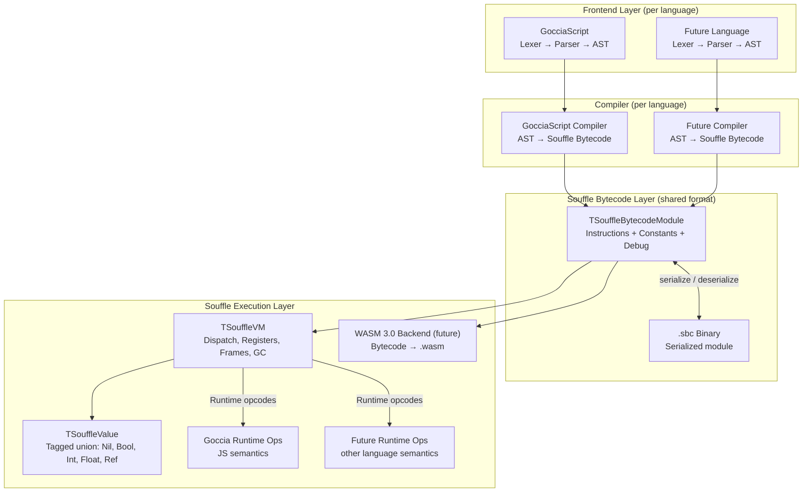

# Souffle VM

Souffle is a general-purpose bytecode virtual machine designed for extensibility, maintainability, and performance. It serves as an alternative execution backend for GocciaScript and is architected to support multiple programming language frontends and future WASM 3.0 output.

## Architecture Overview


```mermaid
graph TD
    subgraph frontends ["Frontend Layer (per language)"]
        GS["GocciaScript<br/>Lexer → Parser → AST"]
        FL["Future Language<br/>Lexer → Parser → AST"]
    end

    subgraph compiler ["Compiler (per language)"]
        GSC["GocciaScript Compiler<br/>AST → Souffle Bytecode"]
        FLC["Future Compiler<br/>AST → Souffle Bytecode"]
    end

    subgraph bytecodeLayer ["Souffle Bytecode Layer (shared format)"]
        BC["TSouffleBytecodeModule<br/>Instructions + Constants + Debug"]
        BIN[".sbc Binary<br/>Serialized module"]
    end

    subgraph execution ["Souffle Execution Layer"]
        VM["TSouffleVM<br/>Dispatch, Registers, Frames, GC"]
        VALS["TSouffleValue<br/>Tagged union: Nil, Bool, Int, Float, Ref"]
        RTJS["Goccia Runtime Ops<br/>JS semantics"]
        RTOTHER["Future Runtime Ops<br/>other language semantics"]
        WASM["WASM 3.0 Backend (future)<br/>Bytecode → .wasm"]
    end

    GS --> GSC
    FL --> FLC
    GSC --> BC
    FLC --> BC
    BC <-->|"serialize / deserialize"| BIN
    BC --> VM
    BC --> WASM
    VM --> VALS
    VM -->|"Runtime opcodes"| RTJS
    VM -->|"Runtime opcodes"| RTOTHER
```

The key architectural principle is the **separation of language semantics from VM mechanics**. The VM itself knows nothing about JavaScript, prototype chains, or any language-specific behavior. All language semantics are injected through the pluggable runtime operations interface.

## Execution Pipeline

```text
Source file --[Lexer]--> Tokens --[Parser]--> AST --[Compiler]--> Module --[VM]--> Result
                                                       |
                                              --emit-> .sbc file
                                                       |
.sbc file ----[LoadModuleFromFile]-----------> Module --[VM]--> Result
```

## Two-Tier Instruction Set Architecture

The opcode space is split into two tiers with distinct responsibilities:

### Tier 1 (opcodes 0–127): VM-Intrinsic Operations

Fixed semantics implemented directly in the dispatch loop. These are universal operations that every language needs:

| Category | Opcodes | Description |
|----------|---------|-------------|
| Load/Store | `OP_LOAD_CONST`, `OP_LOAD_NIL` (AB: R[A]:=nil(flags=B)), `OP_LOAD_TRUE`, `OP_LOAD_FALSE`, `OP_LOAD_INT`, `OP_MOVE` | Register manipulation and constant loading |
| Variables | `OP_GET_LOCAL`, `OP_SET_LOCAL`, `OP_GET_UPVALUE`, `OP_SET_UPVALUE`, `OP_CLOSE_UPVALUE` | Local and upvalue access |
| Typed Variables | `OP_GET_LOCAL_INT`, `OP_SET_LOCAL_INT`, `OP_GET_LOCAL_FLOAT`, `OP_SET_LOCAL_FLOAT`, `OP_GET_LOCAL_BOOL`, `OP_SET_LOCAL_BOOL`, `OP_GET_LOCAL_STRING`, `OP_SET_LOCAL_STRING`, `OP_GET_LOCAL_REF`, `OP_SET_LOCAL_REF` | Type-specialized local access for future WASM/JIT optimization |
| Control Flow | `OP_JUMP`, `OP_JUMP_IF_TRUE`, `OP_JUMP_IF_FALSE`, `OP_JUMP_IF_NIL`, `OP_JUMP_IF_NOT_NIL` | Branching and conditional jumps |
| Closures | `OP_CLOSURE` | Closure creation from function prototypes |
| Compound Types | `OP_NEW_ARRAY`, `OP_ARRAY_PUSH`, `OP_ARRAY_POP`, `OP_ARRAY_GET`, `OP_ARRAY_SET` | VM-native dense array creation and access |
| Compound Types | `OP_NEW_RECORD`, `OP_RECORD_GET`, `OP_RECORD_SET`, `OP_RECORD_DELETE` | VM-native string-keyed record creation and access |
| Compound Types | `OP_GET_LENGTH` | Length query for arrays, records, and strings |
| Arguments | `OP_ARG_COUNT`, `OP_PACK_ARGS` | Actual argument count and variadic argument packing |
| Integer Arithmetic | `OP_ADD_INT`, `OP_SUB_INT`, `OP_MUL_INT`, `OP_DIV_INT`, `OP_MOD_INT`, `OP_NEG_INT` | Fast-path integer operations (no runtime dispatch) |
| Float Arithmetic | `OP_ADD_FLOAT`, `OP_SUB_FLOAT`, `OP_MUL_FLOAT`, `OP_DIV_FLOAT`, `OP_MOD_FLOAT`, `OP_NEG_FLOAT` | Fast-path float operations (no runtime dispatch) |
| Integer Comparison | `OP_EQ_INT`, `OP_NEQ_INT`, `OP_LT_INT`, `OP_GT_INT`, `OP_LTE_INT`, `OP_GTE_INT` | Fast-path integer comparison (no runtime dispatch) |
| String | `OP_CONCAT` | Direct string concatenation |
| Type Coercion | `OP_TO_PRIMITIVE` | Fast-path for primitives (nil/bool/int/float/string pass through), runtime callback for references |
| Blueprint | `OP_NEW_BLUEPRINT`, `OP_INHERIT`, `OP_INSTANTIATE`, `OP_GET_SLOT`, `OP_SET_SLOT` | Wren-inspired blueprint primitives for optimized dispatch |
| Exceptions | `OP_PUSH_HANDLER`, `OP_POP_HANDLER`, `OP_THROW` | Handler-table exception model |
| Return | `OP_RETURN`, `OP_RETURN_NIL` | Function return |
| Debug | `OP_NOP`, `OP_LINE` | No-ops and source line annotations |

### Tier 2 (opcodes 128–255): Runtime-Dispatched Operations

Language-specific semantics dispatched through `TSouffleRuntimeOperations`, an abstract class that each language frontend provides:

| Category | Opcodes | Description |
|----------|---------|-------------|
| Arithmetic | `OP_RT_ADD` through `OP_RT_NEG` | Polymorphic arithmetic (addition, subtraction, etc.) |
| Bitwise | `OP_RT_BAND` through `OP_RT_BNOT` | Polymorphic bitwise operations |
| Comparison | `OP_RT_EQ` through `OP_RT_GTE` | Polymorphic comparison |
| Logical/Type | `OP_RT_NOT`, `OP_RT_TYPEOF`, `OP_RT_IS_INSTANCE`, `OP_RT_HAS_PROPERTY`, `OP_RT_TO_BOOLEAN` | Type checks and logical operations |
| Property Access | `OP_RT_GET_PROP`, `OP_RT_SET_PROP`, `OP_RT_GET_INDEX`, `OP_RT_SET_INDEX`, `OP_RT_DEL_PROP` | Property read/write/delete (prototype chains, symbol keys, descriptors) |
| Invocation | `OP_RT_CALL`, `OP_RT_CALL_METHOD`, `OP_RT_CONSTRUCT` | Function calls and construction |
| Iteration | `OP_RT_GET_ITER`, `OP_RT_ITER_NEXT`, `OP_RT_SPREAD` | Iterator protocol |
| Modules | `OP_RT_IMPORT`, `OP_RT_EXPORT` | Module system |
| Async | `OP_RT_AWAIT` | Async/await support |
| Globals | `OP_RT_GET_GLOBAL`, `OP_RT_SET_GLOBAL`, `OP_RT_HAS_GLOBAL` | Global variable access and existence check |

The VM doesn't know what "get property" means. It calls `RuntimeOps.GetProperty(obj, key)`. GocciaScript's runtime walks prototype chains. A future Python runtime would do MRO + `__getattr__`. A future Lua runtime would check metatables. Same opcodes, completely different semantics — the **compiler** makes those choices, not the VM.

### Why Two Tiers?

Language-specific concepts like property access, arithmetic on polymorphic values, and `instanceof` have fundamentally different semantics across languages:

- **JavaScript/GocciaScript**: Prototype chain walking, `typeof` operator, `===` strict equality
- **Python**: MRO-based attribute lookup, `type()` builtin, `__eq__` dunder method
- **Lua**: Metatable lookups, `type()` function, raw equality

By routing these through an abstract interface, the VM remains language-agnostic. Adding a new language frontend requires implementing `TSouffleRuntimeOperations` — zero VM changes.

### Blueprint Compilation

The compiler uses a two-path strategy for class declarations:

**Simple classes** (constructor + named methods, no getters/setters, statics, private members, decorators, or computed properties) are compiled directly to VM blueprint opcodes:

```text
; class Dog extends Animal { constructor(name) { super(name); } bark() { return name + " barks"; } }

NEW_BLUEPRINT    r0, "Dog"                   ; create TSouffleBlueprint
RT_GET_GLOBAL    r1, "Animal"                ; load super blueprint
INHERIT          r0, r1                      ; wire super blueprint chain
CLOSURE          r2, <constructor_proto>     ; compile constructor
RECORD_SET       r0, "constructor", r2       ; attach to blueprint methods
CLOSURE          r3, <bark_proto>            ; compile method
RECORD_SET       r0, "bark", r3             ; attach to blueprint methods
RT_SET_GLOBAL    "Dog", r0                   ; register globally
```

The `IsSimpleClass` function in `Goccia.Compiler.Statements.pas` performs the complexity detection. At runtime, `TGocciaRuntimeOperations.Construct` walks the `TSouffleBlueprint` super blueprint chain to find inherited constructors, and `GetProperty` on blueprint-backed records checks dynamic properties first, then walks the blueprint's method record hierarchy.

**Complex classes** (with getters, setters, static properties, private members, decorators, or computed properties) are deferred to the interpreter via `FPendingClasses`. The backend evaluates them using the GocciaScript evaluator to produce proper `TGocciaClassValue` objects, which are then registered as wrapped globals. This ensures full language feature support while the VM blueprint opcodes handle the common fast path.

## Instruction Encoding

Fixed 32-bit instructions with an 8-bit opcode and 24-bit operand space. Four encoding formats:

| Format | Layout | Use |
|--------|--------|-----|
| ABC | `[op:8][A:8][B:8][C:8]` | Three 8-bit operands (arithmetic, comparison, property access) |
| ABx | `[op:8][A:8][Bx:16]` | One 8-bit + one 16-bit unsigned (constant/function index) |
| AsBx | `[op:8][A:8][sBx:16]` | One 8-bit + one 16-bit signed via bias (conditional jumps) |
| Ax | `[op:8][Ax:24]` | One 24-bit signed via bias (unconditional jumps) |

Signed operands use bias encoding: `sBx` is stored as `sBx + 32767`, `Ax` is stored as `Ax + 8388607`.

## Register-Based VM

Souffle uses a register-based architecture (like Lua 5, LuaJIT, and Dalvik) rather than a stack-based one.

```text
 Register File (array of TSouffleValue, 26 bytes each):
 ┌──────────────────┬─────────────────┬─────────────────┬─────┐
 │ Frame 0 (global) │ Frame 1 (fn A)  │ Frame 2 (fn B)  │ ... │
 │ R[0]..R[15]      │ R[0]..R[8]      │ R[0]..R[5]      │     │
 └──────────────────┴─────────────────┴─────────────────┴─────┘
   ^                  ^                  ^
   Base=0             Base=16            Base=25
```

- Up to 65,536 registers in a flat array
- Each call frame has a base offset; register operands are relative to the frame base
- Fewer instructions than stack-based VMs (no redundant push/pop)
- Cache-friendly flat array of 16-byte values with no indirection for primitives

### Call Frames

Each function call pushes a `TSouffleVMCallFrame` onto the call stack:

- `Closure` — the executing closure (provides code, constants, upvalues)
- `IP` — instruction pointer (index into the closure's code array)
- `Base` — absolute register offset for this frame
- `ReturnRegister` — absolute register index where the return value should be stored

The VM supports re-entrant execution: when a runtime operation (e.g., a closure bridge) needs to call back into the VM, `ExecuteFunction` saves and restores `FBaseFrameCount` to correctly handle nested dispatch loops. If `OP_THROW` fires with an empty handler stack, `ExecuteFunction` cleans up the call stack (closing upvalues) and re-raises `ESouffleThrow` — the VM never swallows unhandled throws. The GocciaScript integration layer (`TGocciaSouffleClosureBridge.Call`, `TGocciaSouffleBackend.RunModule`) catches `ESouffleThrow` and converts it to `TGocciaThrowValue` so exceptions propagate correctly through the interpreter.

### Uniform Receiver Handling

Every function call uses a uniform register layout: **register 0 always holds the receiver**. For non-method calls (top-level functions, arrow functions), the receiver is `SouffleNil`. For method calls, it holds the object the method was called on.

```text
Frame layout:
  R[Base + 0]  = receiver (SouffleNil for non-methods)
  R[Base + 1]  = first argument
  R[Base + 2]  = second argument
  ...
```

`ExecuteFunction` and `CallClosure` always place the receiver in register 0 unconditionally — there is no `AIsMethodCall` flag or side-table lookup. The compiler reserves slot 0 for the receiver in every function by declaring a `__receiver` local (for arrow functions and the top-level module) or `this` (for methods). Arrow functions inherit `this` from their lexical closure scope, so the `SouffleNil` in register 0 is ignored by the language runtime. `TGocciaSouffleClosureBridge.Call` always passes `AThisValue` as `Args[0]`, making the bridge layer equally uniform.

## Tagged Union Value System

The VM has its own value system, completely independent of `TGocciaValue`:

```text
TSouffleValue (packed record, 26 bytes):
┌──────────────────┬──────────────┬──────────────────────────────┐
│ Kind: UInt8 (1B) │ Flags: (1B)  │ Variant Data (24B)           │
├──────────────────┴──────────────┴──────────────────────────────┤
│ svkNil:       (nothing)                                        │
│ svkBoolean:   AsBoolean: Boolean                               │
│ svkInteger:   AsInteger: Int64                                 │
│ svkFloat:     AsFloat: Double                                  │
│ svkString:    AsInlineString: TSouffleInlineString (string[23]) │
│ svkReference: AsReference: TSouffleHeapObject                  │
└────────────────────────────────────────────────────────────────┘
```

### Six Value Kinds

| Kind | In-Value Data | Heap? | Description |
|------|--------------|-------|-------------|
| `svkNil` | — | No | Absence of value (flags distinguish flavors) |
| `svkBoolean` | `AsBoolean: Boolean` | No | True or false |
| `svkInteger` | `AsInteger: Int64` | No | 64-bit integer |
| `svkFloat` | `AsFloat: Double` | No | 64-bit float |
| `svkString` | `AsInlineString: TSouffleInlineString` | No | Short string (up to 23 bytes, inline) |
| `svkReference` | `AsReference: TSouffleHeapObject` | Yes | Pointer to heap object |

### Flags Byte

Every `TSouffleValue` carries a `Flags: Byte` field alongside `Kind`. This provides per-value metadata without adding new value kinds, keeping the VM general-purpose while allowing language runtimes to attach semantics:

- **`svkNil` flags** — Distinguishes flavors of "nothing". The VM treats all nils identically (falsy, numeric NaN). The runtime interprets flags: GocciaScript maps flags=0 to `undefined` (the default absent value), flags=1 to `null` (explicit null assignment), flags=2 to "the hole" (sparse array gap). `SouffleValuesEqual` compares flags for `svkNil` values — two nils with different flags are not equal.
- **Other kinds** — Flags default to 0. Reserved for future use (e.g., frozen strings, tainted values).

`OP_LOAD_NIL` uses AB encoding: `R[A] := Nil(flags=B)`. The compiler emits the appropriate flag for each language construct.

### Inline Short String Optimization

Strings up to 23 characters are stored inline as `svkString` using `TSouffleInlineString = string[23]`. This avoids heap allocation for the vast majority of strings (property names, short literals, single characters). Strings longer than 23 characters are stored as `svkReference` pointing to a `TSouffleHeapString` heap object.

The `SouffleString(AValue)` constructor auto-selects the representation:
- `Length(AValue) <= 23` → `svkString` with `AsInlineString`
- `Length(AValue) > 23` → `svkReference` to a new `TSouffleHeapString`

The `SouffleGetString(AValue)` accessor handles both representations transparently. `SouffleIsStringValue(AValue)` checks for both `svkString` and `svkReference` to `TSouffleHeapString`.

### Design Rationale

**Packed record (26 bytes)**: The `packed` directive removes alignment padding between `Kind` (1B) and `Flags` (1B), saving 6 bytes per value compared to a non-packed layout (which would pad to 32 bytes). On modern hardware, the unaligned access penalty for `Int64`/`Double` is negligible — measured at less than 1% in benchmarks. With 65,536 registers, this saves ~384 KB of register file memory.

**Why not NaN boxing**: NaN boxing (as used by V8/SpiderMonkey/Wren) encodes type tags in the mantissa bits of a 64-bit double, achieving 8 bytes per value. However, FPC's `Double` type does not expose raw bit manipulation as idiomatically as C, making NaN boxing fragile and non-portable across FPC targets (x86, ARM, WASM). The packed record approach is transparent, debuggable, and works identically on all FPC targets.

**Why not a class hierarchy**: A class-based `TSouffleValue` (one subclass per kind) would require heap allocation for every primitive, adding pointer indirection, GC pressure, and ~40 bytes overhead per value (VMT + instance header). The flat variant record keeps primitives inline with zero allocation.

### Why Only 6 Kinds?

The VM does **not** distinguish between objects, arrays, closures, classes, etc. at the value kind level. Those are all `svkReference` — a pointer to a heap object. The heap object carries its own type tag (`HeapKind: UInt8`). Strings are the exception: short strings are inline (`svkString`) for performance, while long strings use `svkReference` to `TSouffleHeapString`.

For performance-critical compound types (arrays and records), the VM provides inline type checks in core opcodes. For example, `OP_ARRAY_GET` checks `HeapKind = SOUFFLE_HEAP_ARRAY` and performs a direct element access; if the check fails, it falls through to the runtime. This gives the best of both worlds: VM-native speed for common operations, full language-specific semantics via runtime dispatch for complex cases.

This means:

- The VM is language-agnostic — it provides generic array/record primitives usable by any language
- Adding new heap types requires zero VM changes (runtime dispatch handles them)
- Core compound opcodes provide fast paths that eliminate wrapping overhead for the most common operations
- The register file is a flat array of 26-byte packed values — cache-friendly, no indirection for primitives or short strings

### Truthiness Semantics

`SouffleIsTrue` is the one Tier 1 operation that touches value kinds. It has universal behavior: Nil is falsy (regardless of flags), Boolean checks the flag, Integer 0 is falsy, Float 0.0/NaN is falsy, empty inline string is falsy, all References are truthy. Languages that need different truthiness (e.g., Python where empty list is falsy) can use `RT_TO_BOOLEAN` instead of `JUMP_IF_TRUE`.

### Heap Objects

All heap-allocated values inherit from `TSouffleHeapObject`:

| Heap Kind | Constant | Class | Description |
|-----------|----------|-------|-------------|
| 1 | `SOUFFLE_HEAP_CLOSURE` | `TSouffleClosure` | Function prototype + captured upvalues |
| 2 | `SOUFFLE_HEAP_UPVALUE` | `TSouffleUpvalue` | Open or closed upvalue |
| 3 | `SOUFFLE_HEAP_ARRAY` | `TSouffleArray` | Dense dynamic array of `TSouffleValue` |
| 4 | `SOUFFLE_HEAP_RECORD` | `TSouffleRecord` | Unified compound type: plain key-value map or blueprint-backed with indexed slots |
| 5 | `SOUFFLE_HEAP_NATIVE_FUNCTION` | `TSouffleNativeFunction` | Pascal callback wrapped as a callable heap object |
| 6 | `SOUFFLE_HEAP_BLUEPRINT` | `TSouffleBlueprint` | Type descriptor with SlotCount, method record (TSouffleRecord), and optional SuperBlueprint |
| 7 | `SOUFFLE_HEAP_STRING` | `TSouffleHeapString` | Heap-allocated string (for strings exceeding 23-byte inline limit) |
| 128 | `SOUFFLE_HEAP_RUNTIME` | `TGocciaWrappedValue` | Language-specific wrapped value |

Kind 128+ is reserved for runtime-specific heap types. GocciaScript uses `TGocciaWrappedValue` to wrap `TGocciaValue` instances as Souffle heap objects, enabling GocciaScript's rich type system (classes, promises, etc.) to be referenced from VM registers.

All heap objects have an optional **delegate** field (`TSouffleHeapObject.Delegate`), which enables prototype-chain-like method dispatch at the VM level without crossing the language boundary. See [Delegates](#delegates) below.

## Native Compound Types

The VM provides two compound types at the heap level, enabling direct operations without runtime dispatch for the most common data structures:

### `TSouffleArray` (heap kind 3)

Dense dynamic array of `TSouffleValue`. Universal across languages (JS arrays, Python lists, Lua array part, Wren lists, WASM GC arrays).

- O(1) indexed get/set
- O(1) amortized push (doubling capacity, minimum 8)
- O(1) pop via `OP_ARRAY_POP` (AB format: R[A] := Array(R[B]).Pop())
- Negative or out-of-range indices return `nil`
- `Put` auto-extends with `nil` fill when the index exceeds the current count

### `TSouffleRecord` (heap kind 4)

Unified compound type for all key-value data. Records without a blueprint are plain string-keyed hash maps (object literals, Python dicts, Lua hash part). Records with a blueprint (created via `CreateFromBlueprint`) have both key-value entries and indexed slots for O(1) field access.

- FNV-1a 32-bit hash with open addressing (linear probing)
- 75% max load factor, doubles capacity on grow
- Insertion-order iteration via `GetOrderedKey`/`GetOrderedValue`
- Tombstone-based deletion preserves probe chains
- Blueprint-backed records: O(1) indexed slot access alongside key-value map

**Why string-keyed only**: String keys cover the vast majority of property access across target languages. Non-string keys (JS Symbols, Python arbitrary-type dict keys) are rare and inherently language-specific — they remain in the runtime layer.

### Core vs Runtime Property Access

The compiler emits core compound opcodes for statically known operations:

- Array literals `[1, 2, 3]` → `OP_NEW_ARRAY` + `OP_ARRAY_PUSH`
- Object literals `{a: 1}` → `OP_NEW_RECORD` + `OP_RECORD_SET`
- Computed index `arr[i]` → `OP_ARRAY_GET` (fast path for native arrays, fallback to runtime)
- Named property `obj.key` → `OP_RECORD_GET` (fast path for native records, fallback to runtime)
- Property assignment `obj.key = val` → `OP_RECORD_SET` (fast path for native records, fallback to runtime)

All core compound opcodes have runtime fallbacks: if the operand is not the expected native type (e.g., a wrapped GocciaScript value instead of a `TSouffleRecord`), the VM delegates to `TSouffleRuntimeOperations.GetProperty` / `SetProperty` / `GetIndex` / `SetIndex`.

The runtime opcodes (`OP_RT_GET_PROP`, `OP_RT_SET_PROP`, etc.) remain for complex cases: prototype chain walking, Symbol-keyed properties, accessor invocation, and `typeof`/`instanceof`/`in`.

### Blueprint Primitives (Wren-inspired)

The VM provides blueprint primitives (`TSouffleBlueprint` heap type) for class-like type descriptors. Blueprints sit alongside the unified `TSouffleRecord` and enable efficient method dispatch and instance creation without runtime dispatch.

#### `TSouffleBlueprint` Fields

| Field | Type | Description |
|-------|------|-------------|
| `FName` | `string` | Type name (e.g., `"Dog"`) — used for debug output and `OP_RT_IS_INSTANCE` |
| `FSlotCount` | `Integer` | Number of indexed instance slots for O(1) field access |
| `FMethods` | `TSouffleRecord` | Key-value record holding method closures (created in constructor) |
| `FSuperBlueprint` | `TSouffleBlueprint` | Optional parent blueprint for inheritance (set by `OP_INHERIT`) |
| `FPrototype` | `TSouffleRecord` | Lazily created: if a super blueprint exists, created via `CreateFromBlueprint(Super)`; otherwise a plain `TSouffleRecord` |

#### Lifecycle

1. **`OP_NEW_BLUEPRINT`** — Creates a `TSouffleBlueprint` with the given name and slot count. The `FMethods` record is created empty.

2. **`OP_INHERIT`** — Sets `Blueprint.SuperBlueprint := SuperBlueprint`. This wires up the inheritance chain but does not copy methods.

3. **`OP_RECORD_SET` on a blueprint** — `OP_RECORD_SET` is overloaded to handle blueprints: when the target register holds a `TSouffleBlueprint`, the operation stores the value in `Blueprint.Methods`. This eliminates the need for a dedicated blueprint-method opcode. Called once per method during class definition.

4. **`OP_INSTANTIATE`** — Creates a new `TSouffleRecord` via `CreateFromBlueprint(Blueprint)`. The instance gets indexed slots (for O(1) field access) and its delegate is set to `Blueprint.Methods`. This means method lookups on instances walk the delegate chain: instance → methods → super methods → ...

5. **Construction** — The runtime's `Construct` operation walks the super blueprint chain to find a `constructor` method, then calls it as a closure with the instance as receiver.

#### Method Dispatch

When accessing a property on a blueprint-backed instance:

```text
obj.bark()
  1. OP_RECORD_GET checks obj's own entries (dynamic properties)
  2. DelegateGet walks: obj.Delegate (= Blueprint.Methods)
     → Blueprint.Methods.Delegate (= SuperBlueprint.Methods)
     → ... until the key is found or the chain ends
  3. Runtime fallback: TSouffleRuntimeOperations.GetProperty
```

This gives O(1) own-property access and O(depth) inherited method lookup — all within the VM, no language boundary crossing.

#### Optimization Properties

- **Blueprint-backed record slot access** uses O(1) integer-indexed slots instead of string-keyed hash lookups
- **Method dispatch** uses the delegate chain directly, enabling efficient inheritance without runtime dispatch
- The runtime opcodes (`OP_RT_CONSTRUCT`, `OP_RT_IS_INSTANCE`, `OP_RT_GET_PROP`, `OP_RT_SET_PROP`) remain as polymorphic fallbacks for cases where the compiler can't statically determine the type

The blueprint opcodes are a fast path — not a replacement for the record-based approach. Languages that don't have classes (or use different class semantics) continue to use plain `TSouffleRecord` for everything.

### WASM GC Mapping

```
TSouffleArray   →  WASM array type (array.new, array.get, array.set)
TSouffleRecord  →  WASM struct type (struct.new, struct.get, struct.set)
                   For dynamic records: WASM GC hash map (runtime library)
OP_ARRAY_GET    →  array.get
OP_RECORD_GET   →  struct.get (static) or runtime hash lookup (dynamic)
```

### Performance

With native compound types, the hot path for `arr[i]` is:

```text
1. Decode instruction (inline)
2. Check R[B].Kind = svkReference (branch)
3. Check R[B].AsReference is TSouffleArray (HeapKind check)
4. Check R[C].Kind = svkInteger (branch)
5. Bounds check + direct array access (one load)
6. Store into R[A]
```

vs. the previous path via `TGocciaWrappedValue`:

```text
1. Decode instruction → call RuntimeOps.GetIndex (virtual dispatch)
2. Check wrapped value type
3. Unwrap TGocciaWrappedValue → TGocciaValue
4. Type-check TGocciaValue (is TGocciaArrayValue)
5. Convert key to string
6. Call TGocciaArrayValue.GetProperty
7. Wrap result in TGocciaWrappedValue (heap allocation)
8. Store into R[A]
```

### GC Integration

Both compound types participate in mark-and-sweep:

- `TSouffleArray.MarkReferences` — marks all elements that are `svkReference`
- `TSouffleRecord.MarkReferences` — marks all occupied values that are `svkReference`
- Both are registered via `AllocateObject` and tracked by the Souffle GC

## Delegates

Every `TSouffleHeapObject` can have an optional **delegate** — another `TSouffleHeapObject` (typically a `TSouffleRecord`) that the VM consults for key lookups that miss on the primary data. Delegates form a chain: each delegate can itself have a delegate, enabling inheritance-like method dispatch at the VM level without crossing into language-specific runtime code.

### How It Works

When `OP_RECORD_GET` resolves a string-keyed property:

1. **Direct lookup** — If the object is a `TSouffleRecord`, check the record's own entries
2. **Delegate chain walk** — `DelegateGet` walks `Object.Delegate → Delegate.Delegate → ...`, checking each `TSouffleRecord` for the key
3. **Runtime fallback** — Delegate to `TSouffleRuntimeOperations.GetProperty`

For `arr.push(6)` on a `TSouffleArray`:
- Step 1 skips (arrays aren't records)
- Step 2 finds `push` in the array's delegate → returns a `TSouffleNativeFunction`
- `OP_RT_CALL_METHOD` invokes the native function directly with the array as receiver
- **Zero wrapping** — the entire call stays within the Souffle VM

For blueprint-backed instances (e.g., `dog.bark()`):
- Step 1 checks the instance record's own entries (dynamic properties)
- Step 2 walks the delegate chain: instance → `Blueprint.Methods` → `SuperBlueprint.Methods` → ...
- The first record containing `bark` returns the closure
- This enables class inheritance without any runtime dispatch

### `TSouffleNativeFunction`

A heap object (`SOUFFLE_HEAP_NATIVE_FUNCTION`) that wraps a Pascal function pointer:

```pascal
TSouffleNativeCallback = function(
  const AReceiver: TSouffleValue;
  const AArgs: PSouffleValue;
  const AArgCount: Integer): TSouffleValue;
```

The callback receives `TSouffleValue` arguments and returns a `TSouffleValue` result. It operates directly on Souffle's value system — no language boundary crossing.

### VM Integration

The VM holds configurable default delegates per compound type:

- `TSouffleVM.ArrayDelegate` — assigned to every `TSouffleArray` created by `OP_NEW_ARRAY`
- `TSouffleVM.RecordDelegate` — assigned to every `TSouffleRecord` created by `OP_NEW_RECORD`

The language frontend populates these delegates during initialization. Individual instances can override their delegate after creation.

`OP_RT_CALL` and `OP_RT_CALL_METHOD` dispatch `TSouffleNativeFunction` directly (inline invocation), before falling to the runtime operations interface. This gives delegate methods the same call overhead as closures.

### GocciaScript Registration

The GocciaScript bridge layer (`TGocciaRuntimeOperations.RegisterDelegates`) creates a `TSouffleRecord` for each type and populates it with native function implementations:

| Type | Method | Description |
|------|--------|-------------|
| Array | `push(value)` | Appends value, returns new length |
| Array | `pop()` | Removes and returns last element |
| Array | `join(sep)` | Joins elements with separator string |

### Language Agnosticism

The delegate mechanism is language-agnostic:
- The VM only performs string-keyed record lookups — it knows nothing about prototypes, `this`, or method binding
- The receiver is passed as a `TSouffleValue` to the native callback — the callback decides how to interpret it
- Different language frontends can register different delegates with different methods for the same compound types

## Closures and Upvalues

Souffle uses a Lua-style upvalue model for lexical closures:

- **`TSouffleClosure`** — Pairs a `TSouffleFunctionTemplate` (code + constants) with an array of `TSouffleUpvalue` references
- **`TSouffleUpvalue`** — Either *open* (pointing to a live register) or *closed* (holding a captured value)
- **`OP_CLOSURE`** — Creates a closure from a nested function prototype, capturing upvalues as described by the prototype's `UpvalueDescriptors`
- **`OP_GET_UPVALUE` / `OP_SET_UPVALUE`** — Read/write through upvalue indirection
- **`OP_CLOSE_UPVALUE`** — Migrates an open upvalue's register value into the upvalue's `Closed` field

Open upvalues are linked in a sorted list (`FOpenUpvalues`) for efficient closing when a scope exits. When a function returns, all upvalues pointing to registers at or above the frame's base are closed.

## Exception Handling

Souffle uses a handler-table approach (not try/catch blocks in bytecode):

Each function prototype contains an array of `TSouffleExceptionHandler` records:

```text
TSouffleExceptionHandler:
  TryStart: UInt32     — first PC of the try range
  TryEnd: UInt32       — last PC of the try range
  CatchTarget: UInt32  — PC to jump to on exception
  FinallyTarget: UInt32 — PC for finally block ($FFFFFFFF if none)
  CatchRegister: UInt8 — register to store the caught value
```

At runtime, `OP_PUSH_HANDLER` pushes a handler entry; `OP_POP_HANDLER` removes it. When `OP_THROW` fires, the VM searches the handler stack for a matching handler and jumps to `CatchTarget`, storing the thrown value in `CatchRegister`.

## Garbage Collection

Souffle has its own mark-and-sweep garbage collector (`Souffle.GarbageCollector.pas`), independent of GocciaScript's GC:

- **Singleton** — `TSouffleGarbageCollector.Initialize` / `TSouffleGarbageCollector.Instance`
- **Managed objects** — All `TSouffleHeapObject` instances registered via `AllocateObject`
- **Pinned objects** — Long-lived objects protected from collection via `PinObject` / `UnpinObject`
- **Temp roots** — Short-lived references protected during operations via `AddTempRoot` / `RemoveTempRoot`
- **External root marker** — The VM registers `MarkVMRoots` to mark all values in the register file and call stack during collection
- **Threshold-based collection** — `CollectIfNeeded` triggers after a configurable number of allocations (default: 10,000)
- **O(1) membership** — Pinned objects and temp roots use `TDictionary<TSouffleHeapObject, Boolean>` for hash-set semantics

## Bytecode Module Structure

```text
TSouffleBytecodeModule
  ├── FormatVersion: UInt16
  ├── RuntimeTag: string                              (e.g., "goccia-js", "goccia-py")
  ├── TopLevel: TSouffleFunctionTemplate
  ├── SourcePath: string
  ├── Imports: array of TSouffleModuleImport
  │     ├── ModulePath: string
  │     └── Bindings: array of (ExportName, LocalSlot)
  └── Exports: array of TSouffleModuleExport
        ├── Name: string
        └── LocalSlot: UInt16
```

### Function Prototype

```text
TSouffleFunctionTemplate
  ├── Name: string
  ├── Code: array of UInt32                         (instruction words)
  ├── Constants: array of TSouffleBytecodeConstant   (typed constant pool)
  ├── Functions: array of TSouffleFunctionTemplate   (nested closures)
  ├── MaxRegisters: UInt8                            (register window size)
  ├── ParameterCount: UInt8
  ├── UpvalueCount: UInt8
  ├── UpvalueDescriptors: array of TSouffleUpvalueDescriptor
  │     ├── IsLocal: Boolean
  │     └── Index: UInt8
  ├── ExceptionHandlers: array of TSouffleExceptionHandler
  │     ├── TryStart, TryEnd: UInt32
  │     ├── CatchTarget: UInt32
  │     ├── FinallyTarget: UInt32 ($FFFFFFFF if none)
  │     └── CatchRegister: UInt8
  ├── DebugInfo: TSouffleDebugInfo (optional)
  │     ├── SourceFile: string
  │     ├── LineMap: array of (PC, Line, Column)
  │     └── LocalNames: array of (Slot, Name, StartPC, EndPC)
  └── LocalTypes: array of TSouffleLocalType   (per-slot type hints)
        ├── LocalTypeCount: UInt8
        └── Per slot: sltUntyped (0), sltInteger (1), sltFloat (2),
                      sltBoolean (3), sltString (4), sltReference (5)
```

The compiler infers type hints from literal initializers (e.g., `const x = 42` gets `sltInteger`, `const y = 3.14` gets `sltFloat`). These hints are stored on the template and used to emit type-specialized load/store opcodes (`OP_GET_LOCAL_INT`, `OP_SET_LOCAL_FLOAT`, etc.) instead of generic `OP_GET_LOCAL`/`OP_SET_LOCAL`. At runtime the typed opcodes are functionally identical to the generic versions, but they carry type information for future WASM generation and JIT compilation.

### Constant Pool

Six constant kinds are supported:

| Kind | Tag | Data |
|------|-----|------|
| `bckNil` | 0 | — |
| `bckTrue` | 1 | — |
| `bckFalse` | 2 | — |
| `bckInteger` | 3 | `Int64` |
| `bckFloat` | 4 | `Double` |
| `bckString` | 5 | Length-prefixed UTF-8 |

Constants are deduplicated within each prototype — adding a duplicate returns the existing index.

## Binary Format (`.sbc`)

The `.sbc` (Souffle ByteCode) binary format enables ahead-of-time compilation and module distribution:

```text
.sbc Binary:
┌──────────────────────────────────────┐
│ Header                               │
│   Magic: "SBC\x00" (4 bytes)        │
│   FormatVersion: UInt16              │
├──────────────────────────────────────┤
│ Metadata                             │
│   RuntimeTag: len-prefixed UTF-8     │
│   SourcePath: len-prefixed UTF-8     │
│   HasDebugInfo: UInt8 (boolean)      │
├──────────────────────────────────────┤
│ Import Table                         │
│   Count: UInt16                      │
│   Per import:                        │
│     ModulePath: len-prefixed UTF-8   │
│     BindingCount: UInt16             │
│     Per binding:                     │
│       ExportName: len-prefixed UTF-8 │
│       LocalSlot: UInt16              │
├──────────────────────────────────────┤
│ Export Table                         │
│   Count: UInt16                      │
│   Per export:                        │
│     Name: len-prefixed UTF-8         │
│     LocalSlot: UInt16                │
├──────────────────────────────────────┤
│ Function Prototype (recursive)       │
│   Name: len-prefixed UTF-8           │
│   MaxRegisters: UInt8                │
│   ParameterCount: UInt8              │
│   UpvalueCount: UInt8                │
│   CodeLength: UInt32                 │
│   Code: CodeLength × UInt32          │
│   ConstantCount: UInt16              │
│   Per constant:                      │
│     Tag: UInt8 (0=nil..5=string)     │
│     Data varies by tag               │
│   Per upvalue:                       │
│     IsLocal: UInt8                   │
│     Index: UInt8                     │
│   HandlerCount: UInt16               │
│   Per handler:                       │
│     TryStart/End: UInt32             │
│     CatchTarget: UInt32              │
│     FinallyTarget: UInt32            │
│     CatchRegister: UInt8             │
│   SubFunctionCount: UInt16           │
│   Per sub: (recursive prototype)     │
│   HasDebug: UInt8 (boolean)          │
│   [if debug:]                        │
│     DebugInfo block                  │
│   LocalTypeCount: UInt8              │
│   Per local type:                    │
│     Kind: UInt8 (0=untyped..5=ref)   │
└──────────────────────────────────────┘
```

The `RuntimeTag` field (e.g., `"goccia-js"`) identifies which runtime operations implementation is needed to execute the module. A loader can reject modules compiled for an incompatible runtime.

## CLI Integration

The `ScriptLoader`, `TestRunner`, and `BenchmarkRunner` all support switching between execution modes:

```bash
# Interpreted mode (default)
./build/ScriptLoader example.js
./build/ScriptLoader example.js --mode=interpreted

# Bytecode mode (compile and execute via Souffle VM)
./build/ScriptLoader example.js --mode=bytecode

# Emit bytecode to .sbc file (no execution)
./build/ScriptLoader example.js --emit
./build/ScriptLoader example.js --emit=output.sbc

# Load and execute a pre-compiled .sbc file
./build/ScriptLoader output.sbc
```

When `--emit` is used without a path, the output filename is derived from the input (e.g., `example.js` → `example.sbc`).

## GocciaScript Runtime Bridge

`TGocciaSouffleBackend` (`Goccia.Engine.Backend.pas`) bridges GocciaScript to the Souffle VM:

1. **`RegisterBuiltIns`** — Creates a `TGocciaEngine` instance to bootstrap all GocciaScript globals (`console`, `Math`, `JSON`, `Object`, `Array`, etc.), then registers each global scope binding with the Souffle runtime operations as a wrapped `TSouffleValue`.

2. **`CompileToModule`** — Compiles a `TGocciaProgram` AST to a `TSouffleBytecodeModule`, then evaluates any pending class definitions using the GocciaScript evaluator to produce proper `TGocciaClassValue` objects registered as globals.

3. **`RunModule`** — Executes a module on the VM and unwraps the result back to a `TGocciaValue`.

`TGocciaRuntimeOperations` (`Goccia.Runtime.Operations.pas`) implements `TSouffleRuntimeOperations` with GocciaScript semantics. It bridges between `TSouffleValue` and `TGocciaValue` at the runtime boundary:

- **`ToSouffleValue`** / **`UnwrapToGocciaValue`** — Convert between value systems. `UnwrapToGocciaValue` creates a lazy `TGocciaSouffleProxy` for `TSouffleArray`/`TSouffleRecord` instead of deep-copying. `ToSouffleValue` detects proxies and extracts the original Souffle object (zero-copy round-trip)
- **`TGocciaSouffleProxy`** — A single `TGocciaValue` subclass that wraps any Souffle compound type. Property access is delegated to `TGocciaRuntimeOperations.ResolveProxyGet`/`ResolveProxySet`, which dispatch based on the target's type. This is a higher-order function pattern: one proxy class handles all compound types, and the resolution logic lives in the runtime. No per-type subclassing needed
- **`TGocciaWrappedValue`** — Wraps a `TGocciaValue` as a `TSouffleHeapObject` for VM register storage (used for types without native VM representation: classes, promises, symbols, etc.)
- **`TGocciaSouffleClosureBridge`** — Wraps a `TSouffleClosure` as a `TGocciaFunctionBase`, enabling Souffle closures to be called by GocciaScript built-in methods (e.g., `Array.prototype.map` callbacks)
- **Delegate registration** — `RegisterDelegates` creates VM-native delegate records for arrays (with `push`, `pop`, `join` as `TSouffleNativeFunction` callbacks) and assigns them to the VM's default delegate slots. Method calls like `arr.push(6)` are dispatched entirely within the VM without crossing the language boundary
- **Native compound fast paths** — `GetProperty`, `SetProperty`, `GetIndex`, `SetIndex`, `HasProperty`, `DeleteProperty`, and `TypeOf` all check for `TSouffleArray`/`TSouffleRecord` before falling through to wrapped value unwrapping, avoiding unnecessary materialization
- **Auto-boxing** — `GetProperty` performs primitive boxing when a direct property lookup returns `nil`, enabling prototype methods on primitives (e.g., `(42).toFixed(2)`)

## File Organization

All Souffle VM source files live in the `souffle/` directory with `Souffle.` prefix naming:

| File | Description |
|------|-------------|
| `Souffle.Value.pas` | `TSouffleValue` packed record (26B), `TSouffleInlineString`, constructors, `SouffleGetString`/`SouffleIsStringValue`, type checks, truthiness |
| `Souffle.Heap.pas` | `TSouffleHeapObject` base class, `TSouffleHeapString` (long string fallback), heap kind constants |
| `Souffle.Compound.pas` | `TSouffleArray` (dense array), `TSouffleRecord` (unified compound: plain key-value map or blueprint-backed with slots), `TSouffleBlueprint` (type descriptor with method record and optional super blueprint) |
| `Souffle.Bytecode.pas` | Opcode definitions, instruction encoding/decoding helpers |
| `Souffle.Bytecode.Chunk.pas` | `TSouffleFunctionTemplate`, constant pool, upvalue descriptors |
| `Souffle.Bytecode.Module.pas` | `TSouffleBytecodeModule`, import/export tables |
| `Souffle.Bytecode.Binary.pas` | `.sbc` serialization/deserialization |
| `Souffle.Bytecode.Debug.pas` | `TSouffleDebugInfo`, source line mapping, local variable info |
| `Souffle.VM.pas` | Core VM: dispatch loop, register file, execution |
| `Souffle.VM.CallFrame.pas` | `TSouffleVMCallFrame`, `TSouffleCallStack` |
| `Souffle.VM.Closure.pas` | `TSouffleClosure` (prototype + upvalue array) |
| `Souffle.VM.NativeFunction.pas` | `TSouffleNativeFunction` (Pascal callback as callable heap object) |
| `Souffle.VM.Upvalue.pas` | `TSouffleUpvalue` (open/closed variable capture) |
| `Souffle.VM.Exception.pas` | `TSouffleHandlerStack`, `ESouffleThrow` |
| `Souffle.VM.RuntimeOperations.pas` | `TSouffleRuntimeOperations` abstract interface for language-specific semantics |
| `Souffle.GarbageCollector.pas` | Mark-and-sweep GC for `TSouffleHeapObject` |

GocciaScript-specific bridge files in `units/`:

| File | Description |
|------|-------------|
| `Goccia.Engine.Backend.pas` | `TGocciaSouffleBackend` — orchestration, built-in registration |
| `Goccia.Compiler.pas` | `TGocciaCompiler` — AST to Souffle bytecode, top-level compilation dispatch |
| `Goccia.Compiler.Expressions.pas` | Expression compilation: functions, methods, identifiers, typed local load/store |
| `Goccia.Compiler.Statements.pas` | Statement compilation: variables, classes (`IsSimpleClass` + `CompileClassDeclaration`), control flow |
| `Goccia.Compiler.Context.pas` | `TGocciaCompilationContext` — compilation state passed through sub-units |
| `Goccia.Compiler.Scope.pas` | `TGocciaCompilerScope` — lexical scope tracking, local/upvalue resolution, type hints |
| `Goccia.Compiler.ConstantFolding.pas` | Compile-time constant folding for arithmetic and comparison expressions |
| `Goccia.Runtime.Operations.pas` | `TGocciaRuntimeOperations` — GocciaScript runtime semantics |

## WASM 3.0 Alignment

The architecture is designed to make a future WASM 3.0 backend a natural fit:

| Souffle Concept | WASM 3.0 Feature |
|-----------------|-------------------|
| `TSouffleValue` tagged union | `anyref` hierarchy (`i31ref` for small ints/bools, GC structs for boxed values) |
| `TSouffleHeapObject` | GC struct types with subtyping (`ref.cast`, `ref.test`) |
| `TSouffleArray` | GC array type (`array.new`, `array.get`, `array.set`) |
| `TSouffleRecord` | GC struct (static fields) or runtime hash map (dynamic keys) |
| `TSouffleClosure` | GC struct with `funcref` field + upvalue array |
| `TSouffleUpvalue` | Mutable GC struct field |
| Handler-table exception model | `try_table` / `throw` / `throw_ref` / `exnref` |
| Register file | WASM locals (lowered via register-to-stack translation) |
| Constant pool | WASM data segments + global constants |
| Module imports/exports | WASM module imports/exports |
| `.sbc` binary format | Infrastructure for emitting `.wasm` binary |

### Value Mapping

| Souffle Value | WASM 3.0 Representation |
|---------------|------------------------|
| `svkNil` | `ref.null none` |
| `svkBoolean` (true/false) | `i31ref` (unboxed: 1 or 0) |
| `svkInteger` (fits 31 bits) | `i31ref` (unboxed, no allocation) |
| `svkInteger` (large) | `(ref $boxed_i64)` GC struct with `i64` field |
| `svkFloat` | `(ref $boxed_f64)` GC struct with `f64` field |
| `svkReference` → String | `(ref $string)` GC array of `i8` |
| `svkReference` → Array | `(ref $array)` GC array of `anyref` (`array.new`, `array.get`, `array.set`) |
| `svkReference` → Record | `(ref $record)` GC struct (static fields) or runtime hash map (dynamic) |
| `svkReference` → Closure | `(ref $closure)` GC struct with `funcref` + upvalue array |

Key WASM 3.0 features this leverages:

- **`i31ref`** — Unboxed 31-bit tagged integers: small ints and booleans need zero heap allocation in WASM too
- **GC structs** — `struct.new`, `struct.get`, `struct.set`: our heap objects map directly
- **GC arrays** — `array.new`, `array.get`, `array.set`: strings and array-like values
- **Subtyping** — `ref.cast`, `ref.test`, `br_on_cast`: heap kind dispatch without tables
- **Exception handling** — `try_table`, `throw`, `throw_ref`: direct mapping from our handler-table model

A WASM backend would read `TSouffleBytecodeModule` and emit a `.wasm` binary. The Souffle bytecode layer, VM, and compiler would require zero changes.

## Known Limitations

The Souffle VM bytecode backend is functional for basic scripts but has several areas not yet implemented. These are tracked here to prevent duplicate work and to guide future contributors.

### Not Yet Implemented (Deferred)

These features are stubbed in the runtime operations layer and will need real implementations before the corresponding GocciaScript features work in bytecode mode:

| Feature | Current State | What's Needed |
|---------|---------------|---------------|
| **Iteration** (`for...of`, spread) | `GetIterator` returns the value unchanged; `IteratorNext` always returns done; `SpreadInto` is a no-op | Wire to GocciaScript's `GetIteratorFromValue` / `TGocciaIteratorValue` protocol; handle arrays, strings, maps, sets, and user-defined iterables |
| **Module imports** | `ImportModule` returns `SouffleNil` | Resolve module paths, compile or load `.sbc` modules, return the module namespace object |
| **Async/await** | `AwaitValue` returns its argument unchanged | Integrate with `TGocciaPromiseValue` and the microtask queue |
| **Template literal parsing** | The compiler re-lexes/re-parses each `${...}` interpolation from the raw template string | Enhance the parser to produce a template AST node with pre-parsed static and expression parts; the compiler would then iterate those directly |
| **Binary endianness** | `.sbc` serialization uses native-endian writes | Normalize to little-endian for cross-platform `.sbc` portability |

### Intentionally Not Changed (Rejected Findings)

These were reviewed and determined to be correct or not applicable:

| Finding | Verdict | Rationale |
|---------|---------|-----------|
| **`SBIAS_24` off-by-one** | Correct as-is | 24-bit unsigned range 0..16777215 with bias 8388607 gives signed range −8388607..+8388608 — standard Lua-style bias encoding. The comment and arithmetic are consistent. |
| **Tokens leak in `Goccia.Compiler.Test.pas`** | Not a leak | `Lexer.ScanTokens` returns a reference to the lexer's internal `FTokens` list, which the lexer frees in its destructor. Manually freeing `Tokens` causes a double-free crash. |
| **`Souffle.VM.RuntimeOperations.pas` uses `{$I Souffle.inc}`** | Intentional | This unit is part of the Souffle VM layer and follows Souffle naming conventions. The abstract `TSouffleRuntimeOperations` class is VM-level infrastructure, not a GocciaScript bridge. |
| **`InitScope`/`SuperInitScope` leak in `InstantiateClass`** | Not a leak | `TGocciaClassInitScope` is a `TGocciaScope` subclass that auto-registers with the GC in its constructor. All scopes are GC-managed — they are collected during sweep, not manually freed. This is consistent with every scope creation in the evaluator. |
| **null vs undefined via nil flags** | Intentional design | `svkNil` with `Flags=0` (the VM's default) maps to `undefined` in GocciaScript; `Flags=1` maps to `null`. The compiler emits `OP_LOAD_NIL` with B=0 for undefined literals and B=1 for null literals. `SouffleValuesEqual` compares flags for nil values, so `null === null` is true but `null === undefined` is false. All VM-internal absent values (uninitialized registers, missing properties, function-with-no-return) naturally produce flags=0, matching JavaScript's `undefined` semantics. The runtime constants `GOCCIA_NIL_UNDEFINED=0`, `GOCCIA_NIL_NULL=1`, `GOCCIA_NIL_HOLE=2` are defined in `Goccia.Runtime.Operations.pas` — the VM itself only knows about `SOUFFLE_NIL_DEFAULT=0`. |
| **`MergeFileResult` string comparison for undefined** | Style preference | The `GetProperty(...).ToStringLiteral.Value = 'undefined'` check works correctly because `TGocciaUndefinedLiteralValue.ToStringLiteral` always returns `'undefined'`. A type check would be marginally more robust but the current code has no known failure mode. |

### Constant Pool Limitation (ABC Encoding)

The ABC instruction format encodes operand B and C as 8-bit values. This limits constant pool indices used in `OP_RECORD_GET`, `OP_RECORD_SET`, `OP_RT_SET_PROP`, `OP_RT_GET_PROP`, and `OP_RT_DEL_PROP` to 255 entries per prototype. `OP_RECORD_DELETE` uses ABx encoding (16-bit Bx) and does not have this limitation. The compiler raises a clear error if the ABC limit is exceeded. A future ABx-style wide-operand variant could lift this restriction for the remaining opcodes if needed.

### NaN Handling in the Constant Pool

Float constant deduplication uses a raw IEEE 754 bit-pattern check (`FloatBitsAreNaN`) rather than FPC's `Math.IsNaN`. This avoids introducing language-runtime dependencies into the Souffle layer and works reliably across platforms including AArch64, where FPC's floating-point behavior has known pitfalls (see [code-style.md](code-style.md) § Platform Pitfall).

## Responsibility Boundaries

The bytecode execution pipeline has four distinct layers with strict boundaries. Mixing responsibilities across layers is an anti-pattern that compromises the VM's generality.

```text
┌──────────────────────────────────────────────────────────────┐
│ Interpreter (Goccia.Evaluator*.pas)                          │
│   Direct AST execution — not involved in bytecode path       │
│   Owns: scope chain walking, evaluator purity, `this` binding│
└──────────────────────────────────────────────────────────────┘
┌──────────────────────────────────────────────────────────────┐
│ Compiler (Goccia.Compiler*.pas)                              │
│   AST → Souffle bytecode translation                         │
│   Owns: desugaring, constant folding, OP_LOAD_NIL flags,    │
│         simple-vs-complex class detection, type hint emission │
│   Boundary: emits only Souffle opcodes; no TGocciaValue refs │
└──────────────────────────────────────────────────────────────┘
┌──────────────────────────────────────────────────────────────┐
│ Runtime (Goccia.Runtime.Operations.pas)                      │
│   Language-specific callbacks for OP_RT_* opcodes            │
│   Owns: null/undefined flag interpretation, prototype chains,│
│         type coercion, property descriptors, Symbol keys,    │
│         TSouffleValue ↔ TGocciaValue bridging                │
│   Boundary: implements TSouffleRuntimeOperations interface   │
└──────────────────────────────────────────────────────────────┘
┌──────────────────────────────────────────────────────────────┐
│ VM (souffle/*.pas)                                           │
│   Opcode dispatch, register file, call frames, GC            │
│   Owns: delegate chain lookup, upvalue management,           │
│         exception handler stack, native function invocation   │
│   Boundary: NO language imports (Goccia.* forbidden)         │
│             NO language keywords in opcodes                   │
│             All absent values are svkNil (flags=0)            │
└──────────────────────────────────────────────────────────────┘
```

### Anti-patterns

| Anti-pattern | Why it's wrong | Correct approach |
|-------------|---------------|-----------------|
| VM opcode named after a language keyword (e.g., `OP_LOAD_UNDEFINED`) | Couples VM to one language; other frontends don't have "undefined" | Use `OP_LOAD_NIL` with flags; runtime interprets flags |
| VM checking `Flags` to decide `null` vs `undefined` semantics | The VM should not know what the flags mean | Runtime interprets flags in `UnwrapToGocciaValue` |
| Compiler importing `TGocciaValue` or `TGocciaScope` | Compiler emits bytecode, not runtime objects | Compiler works with `TGocciaCompilationContext` and `TSouffleFunctionTemplate` |
| Runtime modifying VM internals (register file, IP) | The VM is a black box to the runtime | Runtime returns `TSouffleValue`; VM handles register storage |
| Souffle unit importing `Goccia.*` | Breaks VM independence; prevents extraction to a separate project | All cross-boundary ops go through `TSouffleRuntimeOperations` |

### NaN/Infinity Rationale

IEEE 754 floating-point is enabled at the FreePascal compiler level (`SetExceptionMask` in both `Goccia.Engine.pas` and `Souffle.VM.pas`). This means:
- FPC's `Double` type natively produces `NaN` for `0.0/0.0`, `Infinity` for `1.0/0.0`, etc.
- The VM stores these as ordinary `svkFloat` values — no special float flags or singletons
- The interpreter's `TGocciaNumberLiteralValue` stores real IEEE 754 `NaN`/`Infinity` Doubles directly
- Language-specific NaN/Infinity semantics (e.g., `NaN !== NaN`, `typeof NaN === "number"`) are handled by the evaluator/runtime, not the VM

## Design Principles

1. **Language-agnostic VM** — The VM knows about 5 value kinds and generic operations. All language semantics live in the runtime operations layer.

2. **Compiler-side desugaring** — Language-specific features (classes, nullish coalescing, template literals) are compiled into sequences of generic VM instructions. The compiler makes semantic choices, not the VM.

3. **Self-contained value system** — `TSouffleValue` is independent of `TGocciaValue`. Bridge conversions happen at the runtime operations boundary, keeping the VM free of GocciaScript dependencies.

4. **Minimal opcode surface** — New language features should be expressible using existing Tier 1 + Tier 2 opcodes. Adding a new Tier 2 opcode is acceptable only when no combination of existing operations can express the semantics efficiently.

5. **Zero-overhead abstraction boundary** — The runtime tag on modules ensures type safety (a module compiled for one runtime cannot be loaded by another), but the actual dispatch is a single virtual method call per Tier 2 instruction.

6. **No language-runtime dependencies in the VM** — The `souffle/` directory must not import GocciaScript units (`Goccia.*`). All cross-boundary operations (NaN checks, type coercion, property semantics) use IEEE 754 bit-level operations or are delegated to the runtime operations interface. This ensures the VM layer remains reusable for other language frontends.
