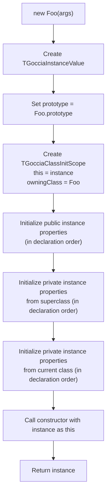

# Value System

The value system is the foundation of GocciaScript's runtime. Every piece of data — numbers, strings, objects, functions — is represented as a `TGocciaValue` or one of its subclasses.

## Type Hierarchy

```mermaid
classDiagram
    TGocciaValue <|-- TGocciaNullLiteralValue
    TGocciaValue <|-- TGocciaUndefinedLiteralValue
    TGocciaValue <|-- TGocciaBooleanLiteralValue
    TGocciaValue <|-- TGocciaNumberLiteralValue
    TGocciaValue <|-- TGocciaStringLiteralValue
    TGocciaValue <|-- TGocciaSymbolValue
    TGocciaValue <|-- TGocciaObjectValue
    TGocciaValue <|-- TGocciaNativeFunction
    TGocciaValue <|-- TGocciaError

    TGocciaObjectValue <|-- TGocciaArrayValue
    TGocciaObjectValue <|-- TGocciaSetValue
    TGocciaObjectValue <|-- TGocciaMapValue
    TGocciaObjectValue <|-- TGocciaPromiseValue
    TGocciaObjectValue <|-- TGocciaFunctionValue
    TGocciaObjectValue <|-- TGocciaClassValue
    TGocciaObjectValue <|-- TGocciaInstanceValue
    TGocciaObjectValue <|-- TGocciaEnumValue
    TGocciaObjectValue <|-- TGocciaIteratorValue
    TGocciaIteratorValue <|-- TGocciaArrayIteratorValue
    TGocciaIteratorValue <|-- TGocciaStringIteratorValue
    TGocciaIteratorValue <|-- TGocciaMapIteratorValue
    TGocciaIteratorValue <|-- TGocciaSetIteratorValue
    TGocciaIteratorValue <|-- TGocciaLazyMapIteratorValue
    TGocciaIteratorValue <|-- TGocciaLazyFilterIteratorValue
    TGocciaIteratorValue <|-- TGocciaLazyTakeIteratorValue
    TGocciaIteratorValue <|-- TGocciaLazyDropIteratorValue
    TGocciaIteratorValue <|-- TGocciaLazyFlatMapIteratorValue
    TGocciaIteratorValue <|-- TGocciaGenericIteratorValue
    TGocciaObjectValue <|-- TGocciaNumberObjectValue
    TGocciaObjectValue <|-- TGocciaStringObjectValue
    TGocciaObjectValue <|-- TGocciaBooleanObjectValue

    TGocciaFunctionValue <|-- TGocciaMethodValue

    class TGocciaValue {
        <<abstract>>
    }
    class TGocciaNullLiteralValue {
        null
    }
    class TGocciaUndefinedLiteralValue {
        undefined
    }
    class TGocciaBooleanLiteralValue {
        true / false
    }
    class TGocciaNumberLiteralValue {
        42, 3.14, NaN, Infinity
    }
    class TGocciaStringLiteralValue {
        "hello"
    }
    class TGocciaObjectValue {
        key: value
    }
    class TGocciaArrayValue {
        [1, 2, 3]
    }
    class TGocciaPromiseValue {
        Promise (pending/fulfilled/rejected)
    }
    class TGocciaFunctionValue {
        (x) => x + 1
    }
    class TGocciaMethodValue {
        class methods (with super)
    }
    class TGocciaClassValue {
        class Foo { }
    }
    class TGocciaInstanceValue {
        new Foo()
    }
    class TGocciaNativeFunction {
        Built-in Pascal functions
    }
    class TGocciaError {
        Error objects
    }
```

## GC Integration

Every `TGocciaValue` participates in the mark-and-sweep garbage collector:

```pascal
TGocciaValue = class(TInterfacedObject)
  FGCMarked: Boolean;      // Set during mark phase if reachable
  procedure AfterConstruction; override;  // Auto-registers with GC
  procedure MarkReferences; virtual;    // Override to mark referenced values
  function RuntimeCopy: TGocciaValue; virtual;  // Create a GC-managed copy
end;
```

- **`AfterConstruction`** — Every value auto-registers with `TGocciaGarbageCollector.Instance` upon creation.
- **`MarkReferences`** — Base implementation sets `GCMarked := True`. Subclasses override this to also mark values they reference (e.g., `TGocciaObjectValue` marks its prototype and property values, `TGocciaFunctionValue` marks its closure scope, `TGocciaArrayValue` marks its elements).
- **`RuntimeCopy`** — Creates a fresh GC-managed copy of the value. Used by the evaluator when evaluating literal expressions: AST-owned literal values are not tracked by the GC, so `RuntimeCopy` produces a runtime value that is. The default implementation returns `Self` (for singletons and complex values). Primitives override this: numbers use the `SmallInt` cache for 0-255, booleans return singletons, strings create new instances (cheap due to copy-on-write).

## Type Discrimination via Virtual Dispatch

The base `TGocciaValue` class provides two virtual methods for runtime type discrimination, replacing multi-`is` type check chains with single VMT calls:

```pascal
TGocciaValue = class(TInterfacedObject)
  function IsPrimitive: Boolean; virtual;  // Returns False by default
  function IsCallable: Boolean; virtual;   // Returns False by default
end;
```

### `IsPrimitive`

Returns `True` for primitive value types. Overridden by:

| Type | Returns |
|------|---------|
| `TGocciaNullLiteralValue` | `True` |
| `TGocciaUndefinedLiteralValue` | `True` |
| `TGocciaBooleanLiteralValue` | `True` |
| `TGocciaNumberLiteralValue` | `True` |
| `TGocciaStringLiteralValue` | `True` |
| All others (objects, arrays, functions, classes) | `False` (inherited default) |

Used by `ToPrimitive` (`Goccia.Values.ToPrimitive.pas`) to skip conversion for values that are already primitive. A standalone `IsPrimitive(Value)` function in `Goccia.Values.Primitives` delegates to `Value.IsPrimitive`.

### `IsCallable`

Returns `True` for values that can be invoked as functions. Overridden by:

| Type | Returns |
|------|---------|
| `TGocciaFunctionBase` (and all subclasses: `TGocciaFunctionValue`, `TGocciaArrowFunctionValue`, `TGocciaMethodValue`, `TGocciaBoundFunctionValue`, `TGocciaNativeFunctionValue`) | `True` |
| `TGocciaClassValue` | `True` (callable via `new`) |
| All others | `False` (inherited default) |

Used by:
- `ToPrimitive` — to check whether `valueOf()` and `toString()` results are callable before invoking them.
- `Function.prototype.call/apply/bind` — to validate that the receiver is callable.
- Array method callbacks (`map`, `filter`, `reduce`, `sort`, etc.) — to validate user-provided callbacks.
- `Set.prototype.forEach` and `Map.prototype.forEach` — to validate the callback argument.

## Virtual Property Access

Property access is unified through virtual methods on the `TGocciaValue` base class:

```pascal
TGocciaValue = class(TInterfacedObject)
  function GetProperty(const Name: string): TGocciaValue; virtual;
  procedure SetProperty(const Name: string; Value: TGocciaValue); virtual;
end;
```

The base `TGocciaValue` provides default implementations: `GetProperty` returns `nil` and `SetProperty` is a no-op. Subclasses override these to implement property semantics:

| Value Type | GetProperty | SetProperty |
|-----------|-------------|-------------|
| `TGocciaObjectValue` | Looks up own properties, walks prototype chain | Creates/updates property descriptor |
| `TGocciaArrayValue` | Handles `length` and numeric indices, delegates to object | Handles numeric index and `length`, delegates to object |
| `TGocciaClassValue` | Checks static properties | Sets static properties |
| `TGocciaInstanceValue` | Checks instance, then prototype (invokes getters) | Checks for setters, then sets directly |
| `TGocciaStringLiteralValue` | Provides `.length`, `.charAt()`, etc. via string prototype | No-op (strings are immutable) |
| Primitives | Returns `nil` | No-op |

The evaluator accesses properties uniformly via `Value.GetProperty(Name)` and `Value.SetProperty(Name, NewValue)` — no type checking or interface querying needed at the call site.

## Primitives

### Null and Undefined

Both are singletons — only one instance exists in the runtime:

```pascal
function NullValue: TGocciaValue;       // Always the same TGocciaNullLiteralValue
function UndefinedValue: TGocciaValue;   // Always the same TGocciaUndefinedLiteralValue
```

This enables fast identity checks: `if Value = UndefinedValue then ...`

### Booleans

`true` and `false` are cached singletons via `TrueValue` and `FalseValue`. Boolean creation goes through a factory:

```pascal
function BooleanValue(B: Boolean): TGocciaBooleanLiteralValue;
// Returns TrueValue or FalseValue
```

`ToNumberLiteral` returns `OneValue` or `ZeroValue` singletons rather than allocating a new `TGocciaNumberLiteralValue`, avoiding an allocation on every boolean-to-number coercion.

### Numbers

Numbers use a dual representation to handle JavaScript's special numeric values correctly:

```pascal
TGocciaNumberSpecialValue = (nsvNone, nsvNaN, nsvPositiveInfinity,
                              nsvNegativeInfinity, nsvNegativeZero);

TGocciaNumberLiteralValue = class(TGocciaValue)
  FValue: Double;
  FSpecialValue: TGocciaNumberSpecialValue;
end;
```

- Normal numbers: `FSpecialValue = nsvNone`, value in `FValue`.
- Special values: `FSpecialValue` set, `FValue` stored as `0` (not the actual special floating-point value).

Special number singletons: `NaNValue`, `PositiveInfinityValue`, `NegativeInfinityValue`, `NegativeZeroValue`.

**Checking for special values:** Always use the property accessors (`IsNaN`, `IsInfinity`, `IsNegativeZero`) rather than inspecting `FValue` directly. Since special values store `0.0` in `FValue`, standard floating-point checks like `Math.IsNaN(FValue)` will return incorrect results. When checking for actual zero (not a special value), use `(Value = 0) and not IsNaN and not IsInfinite` — see `IsActualZero` in `Goccia.Evaluator.Arithmetic.pas` for the canonical helper. Similarly, the sort comparator in `Goccia.Values.ArrayValue.pas` uses `NumericRank` to map each special value to a distinct `Double` for correct ordering.

### Number Prototype (`TGocciaNumberObjectValue`)

When methods are called on number primitives (e.g., `(42).toFixed(2)`), the evaluator auto-boxes the number into a `TGocciaNumberObjectValue`. All number object instances share a single class-level prototype singleton (`FSharedNumberPrototype`), following the same pattern as strings, arrays, sets, and maps.

| Method | Description |
|--------|-------------|
| `toFixed(digits?)` | Format with fixed-point notation. Returns `"NaN"`, `"Infinity"`, `"-Infinity"` for special values. |
| `toString(radix?)` | String representation. Supports radix 10 (default) and 16 (hex). Special values return their default string. |
| `valueOf()` | Return the primitive number value. |
| `toPrecision(precision?)` | Format to specified precision. Special values return their default string. |

### Strings

Simple wrapper around a Pascal `string`:

```pascal
TGocciaStringLiteralValue = class(TGocciaValue)
  FValue: string;
end;
```

String values implement property access for methods like `.length`, `.charAt()`, `.includes()`, etc. through the string prototype system. When strings are boxed into `TGocciaStringObjectValue` (e.g., via `new String()` or implicit boxing), all instances share a single class-level string prototype singleton — methods are registered once and reused across all string object instances. This shared prototype singleton pattern is used consistently across the codebase: `TGocciaStringObjectValue`, `TGocciaNumberObjectValue`, `TGocciaArrayValue`, `TGocciaSetValue`, `TGocciaMapValue`, `TGocciaSymbolValue`, and `TGocciaFunctionBase` all follow it.

### Symbols

Unique, immutable primitive values used as property keys (`Goccia.Values.SymbolValue.pas`):

```pascal
TGocciaSymbolValue = class(TGocciaValue)
  FDescription: string;
  FId: Integer;           // Auto-incrementing unique ID
end;
```

Each symbol has a globally unique `Id` assigned at creation. Type coercion follows ECMAScript strict mode semantics:

| Conversion | Result |
|------------|--------|
| `ToBoolean` | `true` |
| `ToNumber` | Throws `TypeError` ("Cannot convert a Symbol value to a number") |
| `ToString` | `"Symbol(description)"` (used by `String(symbol)` and internal display) |

**Implicit coercion restrictions:** Symbols cannot be implicitly converted to strings or numbers. Any operation that triggers implicit coercion throws a `TypeError`:

- **String coercion** — Template literals (`` `${symbol}` ``), string concatenation (`"" + symbol`), `String.prototype.concat`
- **Number coercion** — Arithmetic operators (`+`, `-`, `*`, `/`, `%`, `**`), bitwise operators (`|`, `&`, `^`, `~`, `<<`, `>>`, `>>>`), relational comparisons (`<`, `>`, `<=`, `>=`)

**Explicit conversions that work:**

- `String(symbol)` — Returns the descriptive string (e.g., `"Symbol(foo)")`. Uses `ToStringLiteral` internally.
- `symbol.toString()` — Same result as `String(symbol)`.
- `Boolean(symbol)` — Returns `true`.
- `typeof symbol` — Returns `"symbol"`.

**Explicit conversions that throw:**

- `Number(symbol)` — Throws `TypeError`. Internally, `ToNumberLiteral` raises the error.
- Unary `+symbol` / `-symbol` — Throws `TypeError` (these trigger `ToNumberLiteral`).

The implicit coercion checks are implemented at the operator level (in `Goccia.Evaluator.Arithmetic.pas`, `Goccia.Evaluator.pas`, and `Goccia.Values.StringObjectValue.pas`) rather than in `ToStringLiteral`, because `ToStringLiteral` is also used internally for property keys and display purposes where conversion must succeed.

**Shared prototype singleton:** Like strings and numbers, symbols use a shared prototype object (`FSharedPrototype`), initialized via `InitializePrototype` and pinned with the GC. The `description` getter and `toString()` method are registered on this shared prototype, and `TGocciaSymbolValue.GetProperty` delegates to the prototype via `GetPropertyWithContext` so that accessor getters receive the correct symbol instance as `this`. `Symbol.prototype` is exposed on the Symbol constructor function, matching ECMAScript semantics. Symbol type checks at the operator level use standard RTTI (`is TGocciaSymbolValue`) rather than VMT methods, since Symbol is an optional built-in that can be toggled via `TGocciaGlobalBuiltins` flags.

Objects store symbol-keyed properties separately from string-keyed properties via `TGocciaObjectValue.FSymbolDescriptors`. The `in` operator handles symbol keys directly via `HasSymbolProperty`, without converting them to strings (see `Goccia.Evaluator.TypeOperations.pas`).

## Type Conversion

### ToPrimitive (`Goccia.Values.ToPrimitive.pas`)

The ECMAScript abstract operation `ToPrimitive` converts any value to a primitive. For primitives, it's a no-op. For objects, it tries `valueOf()` first, then `toString()`, returning the first result that is a primitive. This operation is used by the `+` operator and is available as a standalone function for any module that needs spec-compliant type coercion.

### Coercion Methods

Every value implements three conversion methods, following JavaScript coercion rules:

| Method | Returns | Example (`undefined`) |
|--------|---------|----------------------|
| `ToBooleanLiteral` | `TGocciaBooleanLiteralValue` | `false` |
| `ToNumberLiteral` | `TGocciaNumberLiteralValue` | `NaN` |
| `ToStringLiteral` | `TGocciaStringLiteralValue` | `"undefined"` |

Conversion follows ECMAScript specification semantics:

| Value | ToBoolean | ToNumber | ToString |
|-------|-----------|----------|----------|
| `undefined` | `false` | `NaN` | `"undefined"` |
| `null` | `false` | `0` | `"null"` |
| `true` | `true` | `1` | `"true"` |
| `false` | `false` | `0` | `"false"` |
| `0`, `-0`, `NaN` | `false` | — | `"0"`, `"0"`, `"NaN"` |
| `""` (empty) | `false` | `0` | — |
| Objects | `true` | — | `"[object Object]"` |

## Objects

### Property Descriptors

Objects use ECMAScript-compliant property descriptors:

**Data descriptors:**
```pascal
TGocciaPropertyDescriptorData = class
  Value: TGocciaValue;
  Writable: Boolean;      // Can the value be changed?
  Enumerable: Boolean;    // Visible in for...in / Object.keys()?
  Configurable: Boolean;  // Can the descriptor be modified/deleted?
end;
```

**Accessor descriptors:**
```pascal
TGocciaPropertyDescriptorAccessor = class
  Getter: TGocciaValue;   // Get function
  Setter: TGocciaValue;   // Set function
  Enumerable: Boolean;
  Configurable: Boolean;
end;
```

### Property Deletion

`DeleteProperty` returns `True` for configurable or non-existent properties, `False` for non-configurable properties. The evaluator throws `TypeError` when `DeleteProperty` returns `False`, matching ECMAScript strict mode semantics where deleting a non-configurable property is an error.

### Property Definition Merging

When `Object.defineProperty` is called on an existing property, unspecified descriptor attributes are inherited from the existing descriptor rather than defaulting to `false`. For example, calling `Object.defineProperty(obj, "x", { enumerable: false })` on a property that is `configurable: true, writable: true` preserves those attributes. New properties use `false` as the default for all unspecified attributes, matching ECMAScript spec behavior.

### Property Order

Objects track insertion order via `FPropertyInsertionOrder` (a `TStringList`). This ensures `Object.keys()` returns properties in the order they were defined, matching JavaScript semantics.

### Prototype Chain

Objects can have a prototype via `FPrototype: TGocciaObjectValue`. Property lookup walks the chain:

1. Check own property descriptors (invoking getters if present).
2. If not found, check `FPrototype`.
3. Repeat until `nil` prototype.

`GetProperty(Name)` delegates to `GetPropertyWithContext(Name, Self)`. The `WithContext` variant carries a `this` reference through the prototype chain so that inherited getter functions execute with the correct receiver (the original object, not the prototype where the getter was found).

### Object Freezing

Objects support `Object.freeze()` via an `FFrozen` flag on `TGocciaObjectValue`:

- **Freeze** — Makes all existing properties non-writable and non-configurable, then sets the `FFrozen` flag.
- **Frozen check** — `AssignProperty` checks `FFrozen` before any modification and throws `TypeError` if the object is frozen.
- **`Object.isFrozen(obj)`** — Returns the `FFrozen` flag value. Non-objects are always considered frozen per ECMAScript spec.

### Error Helpers (`Goccia.Values.ErrorHelper.pas`)

A utility unit that centralizes JavaScript error object construction. Instead of manually building error objects at every throw site, code uses:

```pascal
ThrowTypeError('Cannot set property on non-object');
ThrowRangeError('Invalid range in Math.clamp');
ThrowReferenceError('x is not defined');
ThrowError('Something went wrong');
```

Each helper creates a `TGocciaObjectValue` with `name` and `message` properties and raises it as a `TGocciaThrowValue`. The `CreateErrorObject(Name, Message)` function is also available for cases where the error should be returned rather than thrown (e.g., error constructors).

## Arrays

`TGocciaArrayValue` extends `TGocciaObjectValue`.

- **Sparse arrays** — Holes are represented as `nil` in the internal `FElements` list.
- **Numeric property access** — `arr["0"]` and `arr[0]` both resolve to the first element.
- **Shared prototype singleton** — All array instances share a single class-level prototype (`FSharedArrayPrototype`). Methods are registered once on this shared prototype during `InitializePrototype` (guarded by an `if Assigned` check) and pinned with the GC. The constructor assigns `FPrototype := FSharedArrayPrototype` instead of creating a per-instance prototype.
- **Prototype methods** — `map`, `filter`, `reduce`, `forEach`, `some`, `every`, `flat`, `flatMap`, `find`, `findIndex`, `indexOf`, `lastIndexOf`, `join`, `includes`, `concat`, `push`, `pop`, `shift`, `unshift`, `sort`, `splice`, `reverse`, `fill`, `at`, `slice`, `toReversed`, `toSorted`, `toSpliced` — all operate through `ThisValue` (not `Self`) to access instance data, since the method pointers are bound to a single method host instance.
- **`ToStringLiteral`** — Uses `TStringBuilder` for O(n) comma-separated element assembly, avoiding O(n^2) repeated string concatenation.

## Sets

`TGocciaSetValue` extends `TGocciaObjectValue` (`Goccia.Values.SetValue.pas`). A collection of unique values with insertion-order iteration.

- **Uniqueness** — Uses `IsSameValueZero` (same as `===` except `NaN === NaN` is true) to test for duplicates.
- **Shared prototype singleton** — All set instances share a single class-level prototype (`FSharedSetPrototype`). Methods are registered once during `InitializePrototype` and pinned with the GC. Each method operates through `ThisValue` to access instance data.
- **Methods** — `add`, `has`, `delete`, `clear`, `forEach`, `values` — all registered on the shared prototype.
- **`size`** — Returned dynamically via `GetProperty` override.
- **Spreadable** — `ToArray` converts to a `TGocciaArrayValue` for spread syntax support.

## Maps

`TGocciaMapValue` extends `TGocciaObjectValue` (`Goccia.Values.MapValue.pas`). A collection of key-value pairs with insertion-order iteration where any value can be a key.

- **Key equality** — Uses `IsSameValueZero` for key lookup.
- **Internal storage** — `FEntries: TList<TGocciaMapEntry>` where each entry is a `record` with `Key` and `Value` fields.
- **Shared prototype singleton** — All map instances share a single class-level prototype (`FSharedMapPrototype`). Methods are registered once during `InitializePrototype` and pinned with the GC. Each method operates through `ThisValue` to access instance data.
- **Methods** — `get`, `set`, `has`, `delete`, `clear`, `forEach`, `keys`, `values`, `entries` — all registered on the shared prototype.
- **`size`** — Returned dynamically via `GetProperty` override.
- **Spreadable** — `ToArray` converts to a `TGocciaArrayValue` of `[key, value]` pairs for spread syntax support.

## Promises

`TGocciaPromiseValue` extends `TGocciaObjectValue` (`Goccia.Values.PromiseValue.pas`). Represents an ECMAScript Promise with three possible states.

- **State machine** — Each Promise has a `TGocciaPromiseState`: `gpsPending`, `gpsFulfilled`, or `gpsRejected`. Once settled, the state and result are immutable (double-resolve/reject is a no-op).
- **Result** — `PromiseResult: TGocciaValue` holds the fulfillment value or rejection reason after settlement.
- **Reactions** — `FReactions: TList<TGocciaPromiseReaction>` stores pending `.then()` reactions. When the Promise settles, all reactions are enqueued as microtasks. When `.then()` is called on an already-settled Promise, the reaction is enqueued immediately.
- **Thenable adoption** — If a Promise is resolved with another Promise, `SubscribeTo` defers settlement via a microtask (per the spec's PromiseResolveThenableJob) rather than resolving synchronously. For already-settled inner Promises, the settlement is enqueued as a microtask; for pending inner Promises, a reaction is added to the inner's reaction list.
- **Self-rejection** — Resolving a Promise with itself throws a `TypeError` per ECMAScript spec.
- **Shared prototype singleton** — All Promise instances share a single class-level prototype (`FSharedPromisePrototype`). Methods (`then`, `catch`, `finally`) are registered once during `InitializePrototype` and pinned with the GC.
- **GC integration** — `MarkReferences` marks the `PromiseResult`, all pending reaction callbacks, and reaction result Promises.

## Functions

### User Functions (`TGocciaFunctionValue`)

The base runtime type for user-defined functions. Uses call-site `this` binding (like ECMAScript's regular functions).

- **Parameters** — List of parameter nodes (supports destructuring, defaults, and rest parameters).
- **Body** — List of AST statements.
- **Closure** — Reference to the scope where the function was defined.
- **`BindThis` (virtual)** — Determines how `this` is resolved during a call. The base implementation uses call-site `this`.
- **`ExecuteBody` (protected)** — Shared call machinery: binds `this` via `BindThis`, binds parameters, executes body, handles return values. Called by `Call`.
- **`length` property** — Returns the number of formal parameters before the first default/rest parameter (ECMAScript spec).
- **`name` property** — Returns the function name. For anonymous arrow functions assigned to variables (`const add = () => {}`), the evaluator infers the name from the variable declaration.

### Arrow Functions (`TGocciaArrowFunctionValue`)

Extends `TGocciaFunctionValue`. Overrides `BindThis` to walk the closure scope chain for lexical `this`, per ECMAScript spec. Arrow functions never receive their own `this` — they always inherit from their defining scope, regardless of how they are called.

Created from `TGocciaArrowFunctionExpression` AST nodes (arrow function syntax: `(x) => ...`).

### Async Function Values (`Goccia.Values.AsyncFunctionValue.pas`)

Async functions extend their sync counterparts and return Promises:

| Type | Extends | Created from |
|------|---------|--------------|
| `TGocciaAsyncFunctionValue` | `TGocciaFunctionValue` | `async` shorthand methods |
| `TGocciaAsyncArrowFunctionValue` | `TGocciaArrowFunctionValue` | `async` arrow functions |
| `TGocciaAsyncMethodValue` | `TGocciaMethodValue` | `async` class methods |

**Call semantics:** `Call` creates a `TGocciaPromiseValue`, executes the body in a try/except, resolves on success, and rejects on `TGocciaThrowValue`. `this` binding is inherited from the superclass via virtual dispatch (`BindThis`).

### `this` Binding

`this` binding is determined by the runtime type via virtual dispatch on `BindThis`:

| Runtime Type | `this` binding | Created from |
|-------------|---------------|-------------|
| `TGocciaFunctionValue` | Call-site (receiver) | `TGocciaMethodExpression` (shorthand methods) |
| `TGocciaArrowFunctionValue` | Lexical (closure scope walk) | `TGocciaArrowFunctionExpression` (arrow syntax) |
| `TGocciaMethodValue` | Call-site (inherited from base) | `TGocciaClassMethod` (class methods) |
| `TGocciaAsyncFunctionValue` / `TGocciaAsyncArrowFunctionValue` / `TGocciaAsyncMethodValue` | Inherited from superclass via `BindThis` | `async` functions |

Standalone calls to any function type receive `undefined` as `this` (strict mode, no implicit global).

### Array Method Callbacks

When array prototype methods (`map`, `filter`, `reduce`, `forEach`, etc.) invoke user-provided callbacks, they pass `undefined` as `ThisValue`. This means:

- Arrow function callbacks (`TGocciaArrowFunctionValue`) inherit `this` from their lexical scope (e.g., the enclosing class method), which is the correct ECMAScript behavior.
- Shorthand method references passed as callbacks receive `undefined` as `this` (matching strict mode semantics for unbound method extraction).

### Methods (`TGocciaMethodValue`)

Extends `TGocciaFunctionValue` with:
- **`SuperClass`** — Reference for `super` calls.
- **`OwningClass`** — The class that declared this method. When called, `TGocciaMethodValue.CreateCallScope` creates a `TGocciaMethodCallScope` that carries both `SuperClass` and `OwningClass` as typed fields. The evaluator resolves these via `FindSuperClass` and `FindOwningClass` which walk the scope chain using virtual dispatch.

### Function Prototype (`TGocciaFunctionSharedPrototype`)

All functions share a prototype that provides `call`, `apply`, and `bind`:

| Method | Description |
|--------|-------------|
| `fn.call(thisArg, ...args)` | Call with explicit `this` and individual arguments |
| `fn.apply(thisArg, argsArray)` | Call with explicit `this` and argument array. Fast path: when `argsArray` is a `TGocciaArrayValue`, elements are accessed directly via `Elements[I]` instead of `IntToStr(I)` + `GetProperty`, avoiding per-element string allocation and property lookup. Falls back to the generic array-like object path otherwise. |
| `fn.bind(thisArg, ...args)` | Return a new function with bound `this` and pre-filled arguments |

`bind` returns a `TGocciaBoundFunctionValue` that combines bound arguments with call-time arguments. Bound functions compute `length` as `max(0, original.length - boundArgs.length)` and `name` as `"bound " + original.name` per ECMAScript spec.

### Native Functions (`TGocciaNativeFunction`)

Wraps a Pascal callback for built-in operations:

```pascal
TGocciaNativeFunctionCallback = function(
  Args: TGocciaValueArray;
  ThisValue: TGocciaValue
): TGocciaValue;
```

## Classes

### Class Values (`TGocciaClassValue`)

Represent class constructors. Store:
- Constructor method
- Instance methods (on prototype)
- Static methods
- Static symbol-keyed properties (`FStaticSymbolDescriptors`) — supports `static get [Symbol.species]()` and similar computed symbol accessors. Use `DefineSymbolProperty` to register and `GetSymbolPropertyWithReceiver` to look up (preserves receiver for getter `this` context across superclass chain)
- Public getters and setters (on prototype via accessor descriptors)
- Private getters and setters (in `FPrivateGetters`/`FPrivateSetters`, separate from public ones)
- Private instance and static fields/methods
- Instance property declaration order (`InstancePropertyOrder`, `PrivateInstancePropertyOrder`)
- Superclass reference for inheritance

### Instance Values (`TGocciaInstanceValue`)

Created by `new ClassName()`. Extend `TGocciaObjectValue` with:
- **Virtual property dispatch** — `GetProperty` and `AssignProperty` override the base class methods to intercept property access and assignment. This enables getter/setter invocation: reads check the prototype for accessor descriptors and invoke getters with the instance as `this`; writes check for setters before falling back to direct property creation.
- **Private property storage** using **composite keys** (`ClassName:FieldName`) — this enables proper inheritance shadowing where `Base.#x` and `Derived.#x` are distinct fields even when they share the same name.
- **Class reference** for `instanceof` checks

### Instantiation Flow



Field initializers have access to `this` (the instance being constructed) and can reference previously-initialized private fields.

## Enums

### Enum Values (`TGocciaEnumValue`)

Created by `enum` declarations (TC39 proposal-enum). Extend `TGocciaObjectValue` with:
- **Null prototype** — `Object.create(null)` semantics
- **Non-extensible** — `Object.preventExtensions` applied after construction
- **Non-writable, non-configurable members** — defined via `TGocciaPropertyDescriptorData` with `[pfEnumerable]` flags only
- **Ordered entries** (`FEntries: TGocciaArrayValue`) — array of `[key, value]` pair arrays preserving declaration order
- **`Symbol.iterator`** — native function returning an array iterator over `FEntries`
- **`Symbol.toStringTag`** — set to the enum name
- **Value type restriction** — member values must be Number, String, or Symbol; other types throw `TypeError` during evaluation

Self-references in initializers are supported via a child scope that binds each member name as it is evaluated, plus the enum object itself under the enum name.

## Error Values

`TGocciaError` carries JavaScript error information:
- `Name` — Error type (`Error`, `TypeError`, `ReferenceError`, `RangeError`)
- `Message` — Error description

Error constructors are registered as globals, creating `TGocciaError` instances that can be `throw`n and `catch`ed.
