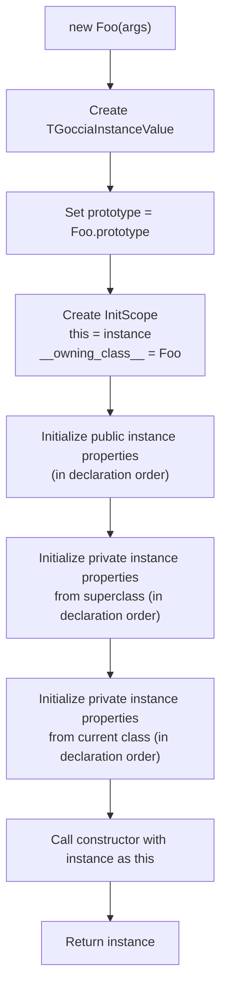

# Value System

The value system is the foundation of GocciaScript's runtime. Every piece of data — numbers, strings, objects, functions — is represented as a `TGocciaValue` or one of its subclasses.

## Type Hierarchy

```mermaid
classDiagram
    TGocciaValue <|-- TGocciaNullLiteralValue
    TGocciaValue <|-- TGocciaUndefinedLiteralValue
    TGocciaValue <|-- TGocciaBooleanLiteralValue
    TGocciaValue <|-- TGocciaNumberLiteralValue
    TGocciaValue <|-- TGocciaStringLiteralValue
    TGocciaValue <|-- TGocciaSymbolValue
    TGocciaValue <|-- TGocciaObjectValue
    TGocciaValue <|-- TGocciaNativeFunction
    TGocciaValue <|-- TGocciaError

    TGocciaObjectValue <|-- TGocciaArrayValue
    TGocciaObjectValue <|-- TGocciaSetValue
    TGocciaObjectValue <|-- TGocciaMapValue
    TGocciaObjectValue <|-- TGocciaFunctionValue
    TGocciaObjectValue <|-- TGocciaClassValue
    TGocciaObjectValue <|-- TGocciaInstanceValue
    TGocciaObjectValue <|-- TGocciaNumberObjectValue
    TGocciaObjectValue <|-- TGocciaStringObjectValue
    TGocciaObjectValue <|-- TGocciaBooleanObjectValue

    TGocciaFunctionValue <|-- TGocciaMethodValue

    class TGocciaValue {
        <<abstract>>
    }
    class TGocciaNullLiteralValue {
        null
    }
    class TGocciaUndefinedLiteralValue {
        undefined
    }
    class TGocciaBooleanLiteralValue {
        true / false
    }
    class TGocciaNumberLiteralValue {
        42, 3.14, NaN, Infinity
    }
    class TGocciaStringLiteralValue {
        "hello"
    }
    class TGocciaObjectValue {
        key: value
    }
    class TGocciaArrayValue {
        [1, 2, 3]
    }
    class TGocciaFunctionValue {
        (x) => x + 1
    }
    class TGocciaMethodValue {
        class methods (with super)
    }
    class TGocciaClassValue {
        class Foo { }
    }
    class TGocciaInstanceValue {
        new Foo()
    }
    class TGocciaNativeFunction {
        Built-in Pascal functions
    }
    class TGocciaError {
        Error objects
    }
```

## GC Integration

Every `TGocciaValue` participates in the mark-and-sweep garbage collector:

```pascal
TGocciaValue = class(TInterfacedObject)
  FGCMarked: Boolean;      // Set during mark phase if reachable
  FGCPermanent: Boolean;   // If true, never collected (AST literals)
  procedure AfterConstruction; override;  // Auto-registers with GC
  procedure GCMarkReferences; virtual;    // Override to mark referenced values
end;
```

- **`AfterConstruction`** — Every value auto-registers with `TGocciaGC.Instance` upon creation.
- **`GCMarkReferences`** — Base implementation sets `GCMarked := True`. Subclasses override this to also mark values they reference (e.g., `TGocciaObjectValue` marks its prototype and property values, `TGocciaFunctionValue` marks its closure scope, `TGocciaArrayValue` marks its elements).
- **`GCPermanent`** — Values embedded in the AST (created by the parser and stored in `TGocciaLiteralExpression`) are marked permanent. The GC skips them during sweep because the AST is not traversed during the mark phase.

## Interfaces

Values expose capabilities through interfaces, enabling the evaluator to work with any value that supports a given operation:

### IPropertyMethods

Implemented by objects, arrays, functions, classes, and instances.

```pascal
IPropertyMethods = interface
  function GetProperty(const Name: string): TGocciaValue;
  function HasProperty(const Name: string): Boolean;
  procedure DefineProperty(const Name: string; Value: TGocciaValue; ...);
  procedure AssignProperty(const Name: string; Value: TGocciaValue);
  procedure DeleteProperty(const Name: string);
  // ... additional methods
end;
```

### IIndexMethods

Implemented by arrays and array-like objects.

```pascal
IIndexMethods = interface
  function GetLength: Integer;
  function GetElement(Index: Integer): TGocciaValue;
  procedure SetElement(Index: Integer; Value: TGocciaValue);
end;
```

### Capability Checking

The evaluator checks capabilities at runtime:

```pascal
if Supports(Value, IPropertyMethods, PropMethods) then
  Result := PropMethods.GetProperty(Name);
```

This pattern means new value types can be added without modifying existing evaluator code — they just need to implement the right interfaces.

## Primitives

### Null and Undefined

Both are singletons — only one instance exists in the runtime:

```pascal
function NullValue: TGocciaValue;       // Always the same TGocciaNullLiteralValue
function UndefinedValue: TGocciaValue;   // Always the same TGocciaUndefinedLiteralValue
```

This enables fast identity checks: `if Value = UndefinedValue then ...`

### Booleans

`true` and `false` are cached singletons via `TrueValue` and `FalseValue`. Boolean creation goes through a factory:

```pascal
function BooleanValue(B: Boolean): TGocciaBooleanLiteralValue;
// Returns TrueValue or FalseValue
```

### Numbers

Numbers use a dual representation to handle JavaScript's special numeric values correctly:

```pascal
TGocciaNumberSpecialValue = (nsvNone, nsvNaN, nsvPositiveInfinity,
                              nsvNegativeInfinity, nsvNegativeZero);

TGocciaNumberLiteralValue = class(TGocciaValue)
  FValue: Double;
  FSpecialValue: TGocciaNumberSpecialValue;
end;
```

- Normal numbers: `FSpecialValue = nsvNone`, value in `FValue`.
- Special values: `FSpecialValue` set, `FValue` stored as `0` (not the actual special floating-point value).

Special number singletons: `NaNValue`, `PositiveInfinityValue`, `NegativeInfinityValue`, `NegativeZeroValue`.

**Checking for special values:** Always use the property accessors (`IsNaN`, `IsInfinity`, `IsNegativeZero`) rather than inspecting `FValue` directly. Since special values store `0.0` in `FValue`, standard floating-point checks like `Math.IsNaN(FValue)` will return incorrect results.

### Strings

Simple wrapper around a Pascal `string`:

```pascal
TGocciaStringLiteralValue = class(TGocciaValue)
  FValue: string;
end;
```

String values implement property access for methods like `.length`, `.charAt()`, `.includes()`, etc. through the string prototype system.

### Symbols

Unique, immutable primitive values used as property keys (`Goccia.Values.SymbolValue.pas`):

```pascal
TGocciaSymbolValue = class(TGocciaValue)
  FDescription: string;
  FId: Integer;           // Auto-incrementing unique ID
end;
```

Each symbol has a globally unique `Id` assigned at creation. Type coercion:

| Conversion | Result |
|------------|--------|
| `ToBoolean` | `true` |
| `ToNumber` | `NaN` |
| `ToString` | `"Symbol(description)"` |

Objects store symbol-keyed properties separately from string-keyed properties via `TGocciaObjectValue.FSymbolDescriptors`.

## Type Conversion

### ToPrimitive (`Goccia.Values.ToPrimitive.pas`)

The ECMAScript abstract operation `ToPrimitive` converts any value to a primitive. For primitives, it's a no-op. For objects, it tries `valueOf()` first, then `toString()`, returning the first result that is a primitive. This operation is used by the `+` operator and is available as a standalone function for any module that needs spec-compliant type coercion.

### Coercion Methods

Every value implements three conversion methods, following JavaScript coercion rules:

| Method | Returns | Example (`undefined`) |
|--------|---------|----------------------|
| `ToBooleanLiteral` | `TGocciaBooleanLiteralValue` | `false` |
| `ToNumberLiteral` | `TGocciaNumberLiteralValue` | `NaN` |
| `ToStringLiteral` | `TGocciaStringLiteralValue` | `"undefined"` |

Conversion follows ECMAScript specification semantics:

| Value | ToBoolean | ToNumber | ToString |
|-------|-----------|----------|----------|
| `undefined` | `false` | `NaN` | `"undefined"` |
| `null` | `false` | `0` | `"null"` |
| `true` | `true` | `1` | `"true"` |
| `false` | `false` | `0` | `"false"` |
| `0`, `-0`, `NaN` | `false` | — | `"0"`, `"0"`, `"NaN"` |
| `""` (empty) | `false` | `0` | — |
| Objects | `true` | — | `"[object Object]"` |

## Objects

### Property Descriptors

Objects use ECMAScript-compliant property descriptors:

**Data descriptors:**
```pascal
TGocciaPropertyDescriptorData = class
  Value: TGocciaValue;
  Writable: Boolean;      // Can the value be changed?
  Enumerable: Boolean;    // Visible in for...in / Object.keys()?
  Configurable: Boolean;  // Can the descriptor be modified/deleted?
end;
```

**Accessor descriptors:**
```pascal
TGocciaPropertyDescriptorAccessor = class
  Getter: TGocciaValue;   // Get function
  Setter: TGocciaValue;   // Set function
  Enumerable: Boolean;
  Configurable: Boolean;
end;
```

### Property Order

Objects track insertion order via `FPropertyInsertionOrder` (a `TStringList`). This ensures `Object.keys()` returns properties in the order they were defined, matching JavaScript semantics.

### Prototype Chain

Objects can have a prototype via `FPrototype: TGocciaObjectValue`. Property lookup walks the chain:

1. Check own property descriptors (invoking getters if present).
2. If not found, check `FPrototype`.
3. Repeat until `nil` prototype.

`GetProperty(Name)` delegates to `GetPropertyWithContext(Name, Self)`. The `WithContext` variant carries a `this` reference through the prototype chain so that inherited getter functions execute with the correct receiver (the original object, not the prototype where the getter was found).

### Object Freezing

Objects support `Object.freeze()` via an `FFrozen` flag on `TGocciaObjectValue`:

- **Freeze** — Makes all existing properties non-writable and non-configurable, then sets the `FFrozen` flag.
- **Frozen check** — `AssignProperty` checks `FFrozen` before any modification and throws `TypeError` if the object is frozen.
- **`Object.isFrozen(obj)`** — Returns the `FFrozen` flag value. Non-objects are always considered frozen per ECMAScript spec.

### Error Helpers (`Goccia.Values.ErrorHelper.pas`)

A utility unit that centralizes JavaScript error object construction. Instead of manually building error objects at every throw site, code uses:

```pascal
ThrowTypeError('Cannot set property on non-object');
ThrowRangeError('Invalid range in Math.clamp');
ThrowReferenceError('x is not defined');
ThrowError('Something went wrong');
```

Each helper creates a `TGocciaObjectValue` with `name` and `message` properties and raises it as a `TGocciaThrowValue`. The `CreateErrorObject(Name, Message)` function is also available for cases where the error should be returned rather than thrown (e.g., error constructors).

## Arrays

`TGocciaArrayValue` extends `TGocciaObjectValue` and implements `IIndexMethods`.

- **Sparse arrays** — Holes are represented as `nil` in the internal `FElements` list.
- **Numeric property access** — `arr["0"]` and `arr[0]` both resolve to the first element.
- **Prototype methods** — `map`, `filter`, `reduce`, `forEach`, `some`, `every`, `flat`, `flatMap`, `find`, `findIndex`, `indexOf`, `lastIndexOf`, `join`, `includes`, `concat`, `push`, `pop`, `shift`, `unshift`, `sort`, `splice`, `reverse`, `fill`, `at`, `slice`, `toReversed`, `toSorted`, `toSpliced` — all implemented directly on the array value.

## Sets

`TGocciaSetValue` extends `TGocciaObjectValue` (`Goccia.Values.SetValue.pas`). A collection of unique values with insertion-order iteration.

- **Uniqueness** — Uses `IsSameValueZero` (same as `===` except `NaN === NaN` is true) to test for duplicates.
- **Methods** — `add`, `has`, `delete`, `clear`, `forEach`, `values` — all registered as native methods on the instance.
- **`size`** — Returned dynamically via `GetProperty` override.
- **Spreadable** — `ToArray` converts to a `TGocciaArrayValue` for spread syntax support.

## Maps

`TGocciaMapValue` extends `TGocciaObjectValue` (`Goccia.Values.MapValue.pas`). A collection of key-value pairs with insertion-order iteration where any value can be a key.

- **Key equality** — Uses `IsSameValueZero` for key lookup.
- **Internal storage** — `FEntries: TList<TGocciaMapEntry>` where each entry is a `record` with `Key` and `Value` fields.
- **Methods** — `get`, `set`, `has`, `delete`, `clear`, `forEach`, `keys`, `values`, `entries` — all registered as native methods on the instance.
- **`size`** — Returned dynamically via `GetProperty` override.
- **Spreadable** — `ToArray` converts to a `TGocciaArrayValue` of `[key, value]` pairs for spread syntax support.

## Functions

### User Functions (`TGocciaFunctionValue`)

Created from arrow function expressions in the AST:

- **Parameters** — List of parameter nodes (supports destructuring, defaults, and rest parameters).
- **Body** — List of AST statements.
- **Closure** — Reference to the scope where the function was defined.
- **`IsArrow` flag** — Marks functions created from arrow expressions. When an arrow function is called standalone (no explicit `this`), it inherits `this` from its closure scope chain. When called as a method (`obj.method()`), it receives the call-site `this` normally.
- **`this` binding** — Captured from the enclosing scope for arrow functions; set by the call site for method calls.
- **`length` property** — Returns the number of formal parameters before the first default/rest parameter (ECMAScript spec).
- **`name` property** — Returns the function name. For anonymous arrow functions assigned to variables (`const add = () => {}`), the evaluator infers the name from the variable declaration.

### Methods (`TGocciaMethodValue`)

Extends `TGocciaFunctionValue` with:
- **`SuperClass`** — Reference for `super` calls.
- **`OwningClass`** — The class that declared this method. Propagated as `__owning_class__` in the call scope, enabling correct private field resolution when inheritance is involved.

### Function Prototype (`TGocciaFunctionSharedPrototype`)

All functions share a prototype that provides `call`, `apply`, and `bind`:

| Method | Description |
|--------|-------------|
| `fn.call(thisArg, ...args)` | Call with explicit `this` and individual arguments |
| `fn.apply(thisArg, argsArray)` | Call with explicit `this` and argument array |
| `fn.bind(thisArg, ...args)` | Return a new function with bound `this` and pre-filled arguments |

`bind` returns a `TGocciaBoundFunctionValue` that combines bound arguments with call-time arguments. Bound functions compute `length` as `max(0, original.length - boundArgs.length)` and `name` as `"bound " + original.name` per ECMAScript spec.

### Native Functions (`TGocciaNativeFunction`)

Wraps a Pascal callback for built-in operations:

```pascal
TGocciaNativeFunctionCallback = function(
  Args: TGocciaValueArray;
  ThisValue: TGocciaValue
): TGocciaValue;
```

## Classes

### Class Values (`TGocciaClassValue`)

Represent class constructors. Store:
- Constructor method
- Instance methods (on prototype)
- Static methods
- Public getters and setters (on prototype via accessor descriptors)
- Private getters and setters (in `FPrivateGetters`/`FPrivateSetters`, separate from public ones)
- Private instance and static fields/methods
- Instance property declaration order (`InstancePropertyOrder`, `PrivateInstancePropertyOrder`)
- Superclass reference for inheritance

### Instance Values (`TGocciaInstanceValue`)

Created by `new ClassName()`. Extend `TGocciaObjectValue` with:
- **Virtual property dispatch** — `GetProperty` and `AssignProperty` override the base class methods to intercept property access and assignment. This enables getter/setter invocation: reads check the prototype for accessor descriptors and invoke getters with the instance as `this`; writes check for setters before falling back to direct property creation.
- **Private property storage** using **composite keys** (`ClassName:FieldName`) — this enables proper inheritance shadowing where `Base.#x` and `Derived.#x` are distinct fields even when they share the same name.
- **Class reference** for `instanceof` checks

### Instantiation Flow



Field initializers have access to `this` (the instance being constructed) and can reference previously-initialized private fields.

## Error Values

`TGocciaError` carries JavaScript error information:
- `Name` — Error type (`Error`, `TypeError`, `ReferenceError`, `RangeError`)
- `Message` — Error description

Error constructors are registered as globals, creating `TGocciaError` instances that can be `throw`n and `catch`ed.
