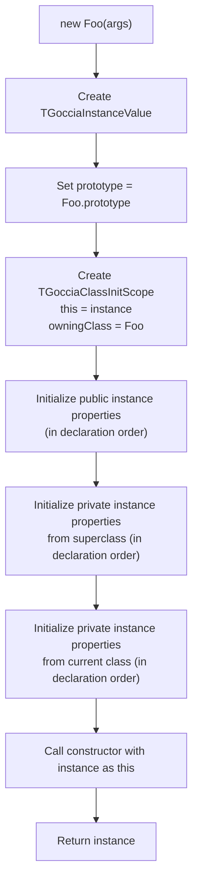

# Value System

*For contributors working on the runtime — type coercion, property access, or adding new value types.*

## Executive Summary

- **`TGocciaValue` hierarchy** — All runtime values inherit from `TGocciaValue`; primitives, objects, arrays, functions, classes, iterators, and typed arrays each have dedicated subclasses
- **Virtual property access** — `GetProperty`/`SetProperty` are virtual methods on the base class, eliminating type checks at call sites
- **GC integration** — Every value auto-registers via `AfterConstruction`; subclasses override `MarkReferences` to mark owned references
- **Shared prototype singletons** — String, Number, Array, Set, Map, WeakSet, WeakMap, Symbol, Function, and TypedArray types share a single prototype instance per engine; the prototype lives in a [realm slot](core-patterns.md#realm-ownership--slot-registration) and is unpinned when the engine is freed

The value system is the foundation of GocciaScript's runtime. Every piece of data — numbers, strings, objects, functions — is represented as a `TGocciaValue` or one of its subclasses.

## Type Hierarchy

```mermaid
classDiagram
    TGocciaValue <|-- TGocciaNullLiteralValue
    TGocciaValue <|-- TGocciaUndefinedLiteralValue
    TGocciaValue <|-- TGocciaBooleanLiteralValue
    TGocciaValue <|-- TGocciaNumberLiteralValue
    TGocciaValue <|-- TGocciaStringLiteralValue
    TGocciaValue <|-- TGocciaSymbolValue
    TGocciaValue <|-- TGocciaObjectValue
    TGocciaValue <|-- TGocciaClassValue

    TGocciaObjectValue <|-- TGocciaFunctionBase
    TGocciaFunctionBase <|-- TGocciaFunctionValue
    TGocciaFunctionBase <|-- TGocciaNativeFunctionValue
    TGocciaFunctionBase <|-- TGocciaBoundFunctionValue
    TGocciaObjectValue <|-- TGocciaArrayValue
    TGocciaObjectValue <|-- TGocciaSetValue
    TGocciaObjectValue <|-- TGocciaMapValue
    TGocciaObjectValue <|-- TGocciaPromiseValue
    TGocciaObjectValue <|-- TGocciaInstanceValue
    TGocciaInstanceValue <|-- TGocciaWeakSetValue
    TGocciaInstanceValue <|-- TGocciaWeakMapValue
    TGocciaObjectValue <|-- TGocciaEnumValue
    TGocciaObjectValue <|-- TGocciaIteratorValue
    TGocciaIteratorValue <|-- TGocciaArrayIteratorValue
    TGocciaIteratorValue <|-- TGocciaStringIteratorValue
    TGocciaIteratorValue <|-- TGocciaMapIteratorValue
    TGocciaIteratorValue <|-- TGocciaSetIteratorValue
    TGocciaIteratorValue <|-- TGocciaLazyMapIteratorValue
    TGocciaIteratorValue <|-- TGocciaLazyFilterIteratorValue
    TGocciaIteratorValue <|-- TGocciaLazyTakeIteratorValue
    TGocciaIteratorValue <|-- TGocciaLazyDropIteratorValue
    TGocciaIteratorValue <|-- TGocciaLazyFlatMapIteratorValue
    TGocciaIteratorValue <|-- TGocciaGenericIteratorValue
    TGocciaObjectValue <|-- TGocciaArrayBufferValue
    TGocciaObjectValue <|-- TGocciaSharedArrayBufferValue
    TGocciaObjectValue <|-- TGocciaTypedArrayValue
    TGocciaObjectValue <|-- TGocciaNumberObjectValue
    TGocciaObjectValue <|-- TGocciaStringObjectValue
    TGocciaObjectValue <|-- TGocciaBooleanObjectValue

    TGocciaFunctionValue <|-- TGocciaMethodValue

    class TGocciaValue {
        <<abstract>>
    }
    class TGocciaNullLiteralValue {
        null
    }
    class TGocciaUndefinedLiteralValue {
        undefined
    }
    class TGocciaBooleanLiteralValue {
        true / false
    }
    class TGocciaNumberLiteralValue {
        42, 3.14, NaN, Infinity
    }
    class TGocciaStringLiteralValue {
        "hello"
    }
    class TGocciaObjectValue {
        key: value
    }
    class TGocciaArrayValue {
        [1, 2, 3]
    }
    class TGocciaPromiseValue {
        Promise (pending/fulfilled/rejected)
    }
    class TGocciaFunctionValue {
        (x) => x + 1
    }
    class TGocciaMethodValue {
        class methods (with super)
    }
    class TGocciaClassValue {
        class Foo { }
    }
    class TGocciaInstanceValue {
        new Foo()
    }
    class TGocciaNativeFunctionValue {
        Built-in Pascal functions
    }
    class TGocciaArrayBufferValue {
        Fixed-length binary data buffer
    }
    class TGocciaSharedArrayBufferValue {
        Shared-memory binary data buffer
    }
    class TGocciaTypedArrayValue {
        Typed view over ArrayBuffer
    }
```

## GC Integration

Every `TGocciaValue` participates in the unified mark-and-sweep garbage collector. Values auto-register via `AfterConstruction`; subclasses override `MarkReferences` to mark owned references. See [Garbage Collector](garbage-collector.md) for the full GC architecture, contributor rules, and design rationale.

## Type Discrimination via Virtual Dispatch

The base `TGocciaValue` class provides two virtual methods for runtime type discrimination, replacing multi-`is` type check chains with single VMT calls:

```pascal
TGocciaValue = class(TGCManagedObject)
  function IsPrimitive: Boolean; virtual;  // Returns False by default
  function IsCallable: Boolean; virtual;   // Returns False by default
  function IsConstructable: Boolean; virtual; // Returns False by default
end;
```

### `IsPrimitive`

Returns `True` for primitive value types. Overridden by:

| Type | Returns |
|------|---------|
| `TGocciaNullLiteralValue` | `True` |
| `TGocciaUndefinedLiteralValue` | `True` |
| `TGocciaBooleanLiteralValue` | `True` |
| `TGocciaNumberLiteralValue` | `True` |
| `TGocciaStringLiteralValue` | `True` |
| All others (objects, arrays, functions, classes) | `False` (inherited default) |

Used by `ToPrimitive` (`Goccia.Values.ToPrimitive.pas`) to skip conversion for values that are already primitive. A standalone `IsPrimitive(Value)` function in `Goccia.Values.Primitives` delegates to `Value.IsPrimitive`.

### `IsCallable`

Returns `True` for values that can be invoked as functions. Overridden by:

| Type | Returns |
|------|---------|
| `TGocciaFunctionBase` (and all subclasses: `TGocciaFunctionValue`, `TGocciaArrowFunctionValue`, `TGocciaMethodValue`, `TGocciaBoundFunctionValue`, `TGocciaNativeFunctionValue`) | `True` |
| `TGocciaClassValue` | `True` (callable via `new`) |
| All others | `False` (inherited default) |

Used by:

- `ToPrimitive` — to check whether `valueOf()` and `toString()` results are callable before invoking them.
- `Function.prototype.call/apply/bind` — to validate that the receiver is callable.
- Array method callbacks (`map`, `filter`, `reduce`, `sort`, etc.) — to validate user-provided callbacks.
- `Set.prototype.forEach` and `Map.prototype.forEach` — to validate the callback argument.
- `IsDeepEqual` — to reject callable objects from deep structural comparison when TypeNames differ.

**Important:** When code needs to cast to `TGocciaFunctionBase` after the check (e.g., accessor property invocation via `.Call()`), use `is TGocciaFunctionBase` instead of `IsCallable`. This is because `TGocciaClassValue` inherits from `TGocciaValue` (not `TGocciaFunctionBase`) but returns `True` for `IsCallable`. The RTTI check ensures the cast is safe.

### `IsConstructable`

Returns `True` for values that can be used as constructors. This is intentionally narrower than `IsCallable`, because callable values such as arrow functions, generator functions, and explicitly non-constructable native functions must be rejected by `new`, `extends`, and `super()` construction paths.

Overridden by:

| Type | Returns |
|------|---------|
| `TGocciaFunctionBase` | `True` when the function owns a `prototype` property, or for bound functions when the target is constructable |
| `TGocciaNativeFunctionValue` | `True` unless marked `NotConstructable`; native functions created without a prototype are non-constructable by default |
| `TGocciaClassValue` | `True` |
| `TGocciaProxyValue` | Delegates to the proxy target |
| Generator functions and non-constructor bytecode functions | `False` |
| All others | `False` (inherited default) |

Use `IsConstructable` instead of `IsCallable` when validating class heritage or constructor dispatch. Continue to use the concrete value type when the next step requires a specific construct API.

## Virtual Property Access

Property access is unified through virtual methods on the `TGocciaValue` base class:

```pascal
TGocciaValue = class(TGCManagedObject)
  function GetProperty(const Name: string): TGocciaValue; virtual;
  procedure SetProperty(const Name: string; Value: TGocciaValue); virtual;
end;
```

The base `TGocciaValue` provides default implementations: `GetProperty` returns `nil` and `SetProperty` is a no-op. Subclasses override these to implement property semantics:

| Value Type | GetProperty | SetProperty |
|-----------|-------------|-------------|
| `TGocciaObjectValue` | Looks up own properties, walks prototype chain | Creates/updates property descriptor |
| `TGocciaArrayValue` | Handles `length` and numeric indices, delegates to object | Handles numeric index and `length`, delegates to object |
| `TGocciaClassValue` | Checks static properties | Sets static properties |
| `TGocciaInstanceValue` | Checks instance, then prototype (invokes getters) | Checks for setters, then sets directly |
| `TGocciaStringLiteralValue` | Provides `.length`, `.charAt()`, etc. via string prototype | No-op (strings are immutable) |
| Primitives | Returns `nil` | No-op |

The evaluator accesses properties uniformly via `Value.GetProperty(Name)` and `Value.SetProperty(Name, NewValue)` — no type checking or interface querying needed at the call site.

## Primitives

### Null and Undefined

Both are singletons — only one instance exists in the runtime:

```pascal
function NullValue: TGocciaValue;       // Always the same TGocciaNullLiteralValue
function UndefinedValue: TGocciaValue;   // Always the same TGocciaUndefinedLiteralValue
```

This enables fast identity checks: `if Value = UndefinedValue then ...`

### Booleans

`true` and `false` are cached singletons via `TrueValue` and `FalseValue`. Boolean creation goes through a factory:

```pascal
function BooleanValue(B: Boolean): TGocciaBooleanLiteralValue;
// Returns TrueValue or FalseValue
```

`ToNumberLiteral` returns `OneValue` or `ZeroValue` singletons rather than allocating a new `TGocciaNumberLiteralValue`, avoiding an allocation on every boolean-to-number coercion.

### Numbers

Simple wrapper around a `Double`:

```pascal
TGocciaNumberLiteralValue = class(TGocciaValue)
  FValue: Double;
end;
```

Special number singletons: `NaNValue`, `PositiveInfinityValue`, `NegativeInfinityValue`, `NegativeZeroValue`.

**Checking for special values:** Use the property accessors (`IsNaN`, `IsInfinity`, `IsNegativeZero`) which delegate to `Math.IsNaN`, `Math.IsInfinite`, and an endian-neutral `Int64 absolute` sign-bit check respectively. See [Tooling](contributing/tooling.md#endian-dependent-byte-indexing) for the endian-neutral pattern.

### Number Prototype (`TGocciaNumberObjectValue`)

When methods are called on number primitives (e.g., `(42).toFixed(2)`), the evaluator auto-boxes the number into a `TGocciaNumberObjectValue`. All number object instances within an engine share a single per-engine prototype singleton, stored in a [realm slot](core-patterns.md#realm-ownership--slot-registration) and following the same pattern as strings, arrays, sets, and maps.

| Method | Description |
|--------|-------------|
| `toFixed(digits?)` | Format with fixed-point notation. Returns `"NaN"`, `"Infinity"`, `"-Infinity"` for special values. |
| `toString(radix?)` | String representation. Supports radix 10 (default) and 16 (hex). Special values return their default string. |
| `valueOf()` | Return the primitive number value. |
| `toPrecision(precision?)` | Format to specified precision. Special values return their default string. |

### Strings

Simple wrapper around a Pascal `string`:

```pascal
TGocciaStringLiteralValue = class(TGocciaValue)
  FValue: string;
end;
```

String values implement property access for methods like `.length`, `.charAt()`, `.includes()`, etc. through the string prototype system. When strings are boxed into `TGocciaStringObjectValue` (e.g., via `new String()` or implicit boxing), all instances share a single per-engine string prototype singleton — methods are registered once and reused across all string object instances of that engine. The prototype graph is per-engine and lives in a [realm slot](core-patterns.md#realm-ownership--slot-registration), but the wiring varies by type. `TGocciaArrayValue`, `TGocciaSetValue`, `TGocciaMapValue`, `TGocciaFunctionBase`, `TGocciaArrayBufferValue`, `TGocciaSharedArrayBufferValue`, and `TGocciaTypedArrayValue` use `TGocciaSharedPrototype` — a managed wrapper that bundles the prototype object and method host together; the realm pins both via `TGocciaRealm.SetOwnedSlot` when it takes ownership and unpins them on tear-down. `TGocciaStringObjectValue` reads its prototype directly via `CurrentRealm.GetSlot(GStringPrototypeSlot)` (set with `CurrentRealm.SetSlot`), with the method host held in a thread-local `FPrototypeMethodHost` and pinned manually via `TGarbageCollector.Instance.PinObject`. `TGocciaNumberObjectValue` and `TGocciaSymbolValue` use a similar raw-slot pattern with a process-wide method-host singleton. In all cases mutations on one engine's `String.prototype` do not leak into the next engine on the same worker thread.

### Symbols

Unique, immutable primitive values used as property keys (`Goccia.Values.SymbolValue.pas`):

```pascal
TGocciaSymbolValue = class(TGocciaValue)
  FDescription: string;
  FId: Integer;           // Auto-incrementing unique ID
end;
```

Each symbol has a globally unique `Id` assigned at creation. Type coercion follows ECMAScript strict mode semantics:

| Conversion | Result |
|------------|--------|
| `ToBoolean` | `true` |
| `ToNumber` | Throws `TypeError` ("Cannot convert a Symbol value to a number") |
| `ToString` | `"Symbol(description)"` (used by `String(symbol)` and internal display) |

**Implicit coercion restrictions:** Symbols cannot be implicitly converted to strings or numbers. Any operation that triggers implicit coercion throws a `TypeError`:

- **String coercion** — Template literals (`` `${symbol}` ``), string concatenation (`"" + symbol`), `String.prototype.concat`
- **Number coercion** — Arithmetic operators (`+`, `-`, `*`, `/`, `%`, `**`), bitwise operators (`|`, `&`, `^`, `~`, `<<`, `>>`, `>>>`), relational comparisons (`<`, `>`, `<=`, `>=`)

**Explicit conversions that work:**

- `String(symbol)` — Returns the descriptive string (e.g., `"Symbol(foo)")`. Uses `ToStringLiteral` internally.
- `symbol.toString()` — Same result as `String(symbol)`.
- `Boolean(symbol)` — Returns `true`.
- `typeof symbol` — Returns `"symbol"`.

**Explicit conversions that throw:**

- `Number(symbol)` — Throws `TypeError`. Internally, `ToNumberLiteral` raises the error.
- Unary `+symbol` / `-symbol` — Throws `TypeError` (these trigger `ToNumberLiteral`).

The implicit coercion checks are implemented at the operator level (primarily in `Goccia.Arithmetic.pas`, with string built-in behavior in `Goccia.Values.StringObjectValue.pas`) rather than in `ToStringLiteral`, because `ToStringLiteral` is also used internally for property keys and display purposes where conversion must succeed.

**Shared prototype singleton:** Like strings and numbers, symbols use a per-engine shared prototype object stored in a [realm slot](core-patterns.md#realm-ownership--slot-registration). It is initialized via `InitializePrototype`; the realm pins it on `SetSlot` and releases it on `Destroy`. The `description` getter and `toString()` method are registered on this shared prototype, and `TGocciaSymbolValue.GetProperty` delegates to the prototype via `GetPropertyWithContext` so that accessor getters receive the correct symbol instance as `this`. `Symbol.prototype` is exposed on the Symbol constructor function, matching ECMAScript semantics. Symbol is an always-registered standard built-in; special-purpose opt-ins like test assertions, benchmarking, and FFI are runtime globals selected through `TGocciaRuntimeGlobals`. Symbol type checks at the operator level use standard RTTI (`is TGocciaSymbolValue`) rather than VMT methods purely for implementation simplicity.

**Weak eligibility:** `TGocciaSymbolValue.Registered` distinguishes symbols returned by `Symbol.for()` from local/well-known symbols. Non-registered symbols can be held weakly by WeakMap/WeakSet; registered symbols are pinned by the global symbol registry and rejected by `CanBeHeldWeakly`.

Objects store symbol-keyed properties separately from string-keyed properties via `TGocciaObjectValue.FSymbolDescriptors`. The `in` operator handles symbol keys directly via `HasSymbolProperty`, without converting them to strings (see `Goccia.Evaluator.TypeOperations.pas`).

## Type Conversion

### ToPrimitive (`Goccia.Values.ToPrimitive.pas`)

The ECMAScript abstract operation `ToPrimitive` converts any value to a primitive. For primitives, it's a no-op. For objects, it tries `valueOf()` first, then `toString()`, returning the first result that is a primitive. This operation is used by the `+` operator and is available as a standalone function for any module that needs spec-compliant type coercion.

### Coercion Methods

Every value implements three conversion methods, following JavaScript coercion rules:

| Method | Returns | Example (`undefined`) |
|--------|---------|----------------------|
| `ToBooleanLiteral` | `TGocciaBooleanLiteralValue` | `false` |
| `ToNumberLiteral` | `TGocciaNumberLiteralValue` | `NaN` |
| `ToStringLiteral` | `TGocciaStringLiteralValue` | `"undefined"` |

Conversion follows ECMAScript specification semantics:

| Value | ToBoolean | ToNumber | ToString |
|-------|-----------|----------|----------|
| `undefined` | `false` | `NaN` | `"undefined"` |
| `null` | `false` | `0` | `"null"` |
| `true` | `true` | `1` | `"true"` |
| `false` | `false` | `0` | `"false"` |
| `0`, `-0`, `NaN` | `false` | — | `"0"`, `"0"`, `"NaN"` |
| `""` (empty) | `false` | `0` | — |
| Objects | `true` | — | `"[object Object]"` |

## Objects

### Property Descriptors

Objects use ECMAScript-compliant property descriptors:

**Data descriptors:**

```pascal
TGocciaPropertyDescriptorData = class
  Value: TGocciaValue;
  Writable: Boolean;      // Can the value be changed?
  Enumerable: Boolean;    // Visible in for...in / Object.keys()?
  Configurable: Boolean;  // Can the descriptor be modified/deleted?
end;
```

**Accessor descriptors:**

```pascal
TGocciaPropertyDescriptorAccessor = class
  Getter: TGocciaValue;   // Get function
  Setter: TGocciaValue;   // Set function
  Enumerable: Boolean;
  Configurable: Boolean;
end;
```

### Property Deletion

`DeleteProperty` returns `True` for configurable or non-existent properties, `False` for non-configurable properties. The evaluator throws `TypeError` when `DeleteProperty` returns `False`, matching ECMAScript strict mode semantics where deleting a non-configurable property is an error.

### ToPropertyDescriptor

The `ToPropertyDescriptor` helper (`Goccia.Values.ObjectPropertyDescriptor.pas`) implements ES2026 §6.2.5.5. It is the single entry point for parsing a JavaScript descriptor object into a `TGocciaPropertyDescriptorData` or `TGocciaPropertyDescriptorAccessor`. Both `Object.defineProperty` and `Reflect.defineProperty` delegate to this helper, ensuring identical semantics:

- Inherits unspecified attributes from an existing descriptor (if any)
- Validates that `get`/`set` values are callable or `undefined` (throws `TypeError`)
- Rejects mixed data+accessor descriptors — a descriptor with both (`value` or `writable`) and (`get` or `set`) throws `TypeError`
- Constructs the appropriate descriptor type based on which fields are present

### Property Definition Merging

When `Object.defineProperty` is called on an existing property, unspecified descriptor attributes are inherited from the existing descriptor rather than defaulting to `false`. For example, calling `Object.defineProperty(obj, "x", { enumerable: false })` on a property that is `configurable: true, writable: true` preserves those attributes. New properties use `false` as the default for all unspecified attributes, matching ECMAScript specification behavior.

### Property Order

Objects track insertion order via `FPropertyInsertionOrder` (a `TStringList`). This ensures `Object.keys()` returns properties in the order they were defined, matching JavaScript semantics.

### Prototype Chain

Objects can have a prototype via `FPrototype: TGocciaObjectValue`. Property lookup walks the chain:

1. Check own property descriptors (invoking getters if present).
2. If not found, check `FPrototype`.
3. Repeat until `nil` prototype.

`GetProperty(Name)` delegates to `GetPropertyWithContext(Name, Self)`. The `WithContext` variant carries a `this` reference through the prototype chain so that inherited getter functions execute with the correct receiver (the original object, not the prototype where the getter was found).

### Object Freezing

Objects support `Object.freeze()` via an `FFrozen` flag on `TGocciaObjectValue`:

- **Freeze** — Makes all existing properties non-writable and non-configurable, then sets the `FFrozen` flag.
- **Frozen check** — `AssignProperty` checks `FFrozen` before any modification and throws `TypeError` if the object is frozen.
- **`Object.isFrozen(obj)`** — Returns the `FFrozen` flag value. Non-objects are always considered frozen per ECMAScript spec.

### Error Helpers (`Goccia.Values.ErrorHelper.pas`)

A utility unit that centralizes JavaScript [error](errors.md) object construction. Instead of manually building error objects at every throw site, code uses:

```pascal
ThrowTypeError('Cannot set property on non-object');
ThrowRangeError('Invalid range in Math.clamp');
ThrowReferenceError('x is not defined');
ThrowError('Something went wrong');
```

Each helper creates a `TGocciaObjectValue` with `name` and `message` properties and raises it as a `TGocciaThrowValue`. The `CreateErrorObject(Name, Message)` function is also available for cases where the error should be returned rather than thrown (e.g., error constructors).

## Arrays

`TGocciaArrayValue` extends `TGocciaObjectValue`.

- **Sparse arrays** — Holes are represented as `nil` in the internal `FElements` list.
- **Numeric property access** — `arr["0"]` and `arr[0]` both resolve to the first element.
- **Shared prototype singleton** — All array instances within an engine share a single per-engine prototype, stored in a [realm slot](core-patterns.md#realm-ownership--slot-registration). Methods are registered once on this shared prototype during `InitializePrototype` (guarded by checking the realm slot) and pinned automatically by `TGocciaRealm.SetSlot`. The constructor assigns `FPrototype` from the realm slot instead of creating a per-instance prototype.
- **Prototype methods** — `map`, `filter`, `reduce`, `forEach`, `some`, `every`, `flat`, `flatMap`, `find`, `findIndex`, `indexOf`, `lastIndexOf`, `join`, `includes`, `concat`, `push`, `pop`, `shift`, `unshift`, `sort`, `splice`, `reverse`, `fill`, `at`, `slice`, `toReversed`, `toSorted`, `toSpliced` — all operate through `ThisValue` (not `Self`) to access instance data, since the method pointers are bound to a single method host instance.
- **`ToStringLiteral`** — Uses `TStringBuffer` for O(n) comma-separated element assembly, avoiding O(n^2) repeated string concatenation.

## Sets

`TGocciaSetValue` extends `TGocciaObjectValue` (`Goccia.Values.SetValue.pas`). A collection of unique values with insertion-order iteration.

- **Uniqueness** — Uses `IsSameValueZero` (same as `===` except `NaN === NaN` is true) to test for duplicates.
- **Shared prototype singleton** — All set instances within an engine share a single per-engine prototype, stored in a [realm slot](core-patterns.md#realm-ownership--slot-registration). Methods are registered once during `InitializePrototype` and pinned automatically by `TGocciaRealm.SetSlot`. Each method operates through `ThisValue` to access instance data.
- **Methods** — `add`, `has`, `delete`, `clear`, `forEach`, `values`, `keys`, `entries`, `union`, `intersection`, `difference`, `symmetricDifference`, `isSubsetOf`, `isSupersetOf`, `isDisjointFrom` — all registered on the shared prototype.
- **Set-like operations** — Set operation methods accept either a `Set` or an object with `size`, `has(value)`, and `keys()` properties. Runtime validation follows the Set Record shape used by the ECMAScript algorithms.
- **`size`** — Returned dynamically via `GetProperty` override.
- **Spreadable** — `ToArray` converts to a `TGocciaArrayValue` for spread syntax support.

## Maps

`TGocciaMapValue` extends `TGocciaObjectValue` (`Goccia.Values.MapValue.pas`). A collection of key-value pairs with insertion-order iteration where any value can be a key.

- **Key equality** — Uses `IsSameValueZero` for key lookup.
- **Internal storage** — `FEntries: TList<TGocciaMapEntry>` where each entry is a `record` with `Key` and `Value` fields.
- Maps follow the same implementation pattern as Sets (see [Sets](#sets) above): prototype-registered methods, dynamic `size` via `GetProperty`, and `ToArray` spreadability.
- **Methods** — `get`, `set`, `has`, `delete`, `clear`, `forEach`, `keys`, `values`, `entries` — all registered on the shared prototype.

## Weak Collections

`TGocciaWeakMapValue` and `TGocciaWeakSetValue` extend `TGocciaInstanceValue` (`Goccia.Values.WeakMapValue.pas`, `Goccia.Values.WeakSetValue.pas`). They are class-backed native instances so subclassing and constructor semantics match other built-in native classes.

- **Weak eligibility** — `Goccia.Values.WeakReferenceSupport.CanBeHeldWeakly` accepts objects and non-registered symbols. Primitives and `Symbol.for()` registry symbols are rejected by mutators and constructors.
- **Internal storage** — WeakMap stores entries in `THashMap<TGocciaValue,TGocciaValue>`; WeakSet stores membership in `THashMap<TGocciaValue,Boolean>`. Allowed keys are object/symbol identity values, so pointer identity matches the required `SameValue` behavior for this domain.
- **No enumeration surface** — WeakMap/WeakSet intentionally do not expose `size`, `clear`, `forEach`, iterators, `keys`, `values`, or `entries`.
- **Shared prototype singleton** — Each weak collection has a per-engine shared prototype stored in a realm-owned slot. Prototype methods operate through `ThisValue`, matching the built-in method-host pattern.
- **GC behavior** — WeakMap/WeakSet do not mark weak keys/values during normal `MarkReferences`. WeakMap's weak tracing hook marks a value only when its key is already live from outside the map, and sweeping removes entries whose keys remain unmarked. WeakSet sweeping removes unmarked members.

## Promises

`TGocciaPromiseValue` extends `TGocciaObjectValue` (`Goccia.Values.PromiseValue.pas`). Represents an ECMAScript Promise with three possible states.

- **State machine** — Each Promise has a `TGocciaPromiseState`: `gpsPending`, `gpsFulfilled`, or `gpsRejected`. Once settled, the state and result are immutable (double-resolve/reject is a no-op).
- **Result** — `PromiseResult: TGocciaValue` holds the fulfillment value or rejection reason after settlement.
- **Reactions** — `FReactions: TList<TGocciaPromiseReaction>` stores pending `.then()` reactions. When the Promise settles, all reactions are enqueued as microtasks. When `.then()` is called on an already-settled Promise, the reaction is enqueued immediately.
- **Thenable adoption** — If a Promise is resolved with another Promise, `SubscribeTo` defers settlement via a microtask (per the spec's PromiseResolveThenableJob) rather than resolving synchronously. For already-settled inner Promises, the settlement is enqueued as a microtask; for pending inner Promises, a reaction is added to the inner's reaction list.
- **Self-rejection** — Resolving a Promise with itself throws a `TypeError` per ECMAScript spec.
- **Shared prototype singleton** — All Promise instances within an engine share a single per-engine prototype, stored in a [realm slot](core-patterns.md#realm-ownership--slot-registration). Methods (`then`, `catch`, `finally`) are registered once during `InitializePrototype` and pinned automatically by `TGocciaRealm.SetSlot`.
- **GC integration** — `MarkReferences` marks the `PromiseResult`, all pending reaction callbacks, and reaction result Promises.

## Functions

### User Functions (`TGocciaFunctionValue`)

The base runtime type for user-defined functions. Uses call-site `this` binding (like ECMAScript's regular functions).

- **Parameters** — List of parameter nodes (supports destructuring, defaults, and rest parameters).
- **Body** — List of AST statements.
- **Closure** — Reference to the scope where the function was defined.
- **`BindThis` (virtual)** — Determines how `this` is resolved during a call. The base implementation uses call-site `this`.
- **`ExecuteBody` (protected)** — Shared call machinery: binds `this` via `BindThis`, binds parameters, executes body, handles return values. Called by `Call`.
- **`length` property** — Returns the number of formal parameters before the first default/rest parameter (ECMAScript spec).
- **`name` property** — Returns the function name. For anonymous arrow functions assigned to variables (`const add = () => {}`), the evaluator infers the name from the variable declaration.

### Arrow Functions (`TGocciaArrowFunctionValue`)

Extends `TGocciaFunctionValue`. Overrides `BindThis` to walk the closure scope chain for lexical `this`, per ECMAScript spec. Arrow functions never receive their own `this` — they always inherit from their defining scope, regardless of how they are called.

Created from `TGocciaArrowFunctionExpression` AST nodes (arrow function syntax: `(x) => ...`).

### Async Function Values (`Goccia.Values.AsyncFunctionValue.pas`)

Async functions extend their sync counterparts and return Promises:

| Type | Extends | Created from |
|------|---------|--------------|
| `TGocciaAsyncFunctionValue` | `TGocciaFunctionValue` | `async` shorthand methods |
| `TGocciaAsyncArrowFunctionValue` | `TGocciaArrowFunctionValue` | `async` arrow functions |
| `TGocciaAsyncMethodValue` | `TGocciaMethodValue` | `async` class methods |

**Call semantics:** `Call` creates a `TGocciaPromiseValue`, executes the body in a try/except, resolves on success, and rejects on `TGocciaThrowValue`. `this` binding is inherited from the superclass via virtual dispatch (`BindThis`).

### Generator Values (`Goccia.Values.GeneratorValue.pas`)

Generator functions and methods extend the normal function value hierarchy but return generator objects instead of executing immediately:

| Type | Extends | Returns |
|------|---------|---------|
| `TGocciaGeneratorFunctionValue` | `TGocciaFunctionValue` | `TGocciaGeneratorObjectValue` |
| `TGocciaAsyncGeneratorFunctionValue` | `TGocciaGeneratorFunctionValue` | `TGocciaAsyncGeneratorObjectValue` |
| `TGocciaGeneratorMethodValue` | `TGocciaMethodValue` | `TGocciaGeneratorObjectValue` |
| `TGocciaAsyncGeneratorMethodValue` | `TGocciaGeneratorMethodValue` | `TGocciaAsyncGeneratorObjectValue` |

Generator objects hold a resumable `TGocciaGeneratorContinuation`. Sync generators expose `next`, `return`, `throw`, and `[Symbol.iterator]`; async generators expose the async iterator protocol and return Promises from `next`, `return`, and `throw`.

### `this` Binding

`this` binding is determined by the runtime type via virtual dispatch on `BindThis`:

| Runtime Type | `this` binding | Created from |
|-------------|---------------|-------------|
| `TGocciaFunctionValue` | Call-site (receiver) | `TGocciaMethodExpression` (shorthand methods) |
| `TGocciaArrowFunctionValue` | Lexical (closure scope walk) | `TGocciaArrowFunctionExpression` (arrow syntax) |
| `TGocciaMethodValue` | Call-site (inherited from base) | `TGocciaClassMethod` (class methods) |
| `TGocciaAsyncFunctionValue` / `TGocciaAsyncArrowFunctionValue` / `TGocciaAsyncMethodValue` | Inherited from superclass via `BindThis` | `async` functions |
| `TGocciaGeneratorFunctionValue` / `TGocciaGeneratorMethodValue` / async generator variants | Inherited from superclass via `BindThis` | generator functions and methods |

Standalone calls to any function type receive `undefined` as `this` (strict mode, no implicit global).

### Array Method Callbacks

When array prototype methods (`map`, `filter`, `reduce`, `forEach`, etc.) invoke user-provided callbacks, they pass `undefined` as `ThisValue`. This means:

- Arrow function callbacks (`TGocciaArrowFunctionValue`) inherit `this` from their lexical scope (e.g., the enclosing class method), which is the correct ECMAScript behavior.
- Shorthand method references passed as callbacks receive `undefined` as `this` (matching strict mode semantics for unbound method extraction).

### Methods (`TGocciaMethodValue`)

Extends `TGocciaFunctionValue` with:

- **`SuperClass`** — Reference for `super` calls.
- **`OwningClass`** — The class that declared this method. When called, `TGocciaMethodValue.CreateCallScope` creates a `TGocciaMethodCallScope` that carries both `SuperClass` and `OwningClass` as typed fields. The evaluator resolves these via `FindSuperClass` and `FindOwningClass` which walk the scope chain using virtual dispatch.

### Function Prototype (`TGocciaFunctionSharedPrototype`)

All functions share a prototype that provides `call`, `apply`, and `bind`:

| Method | Description |
|--------|-------------|
| `fn.call(thisArg, ...args)` | Call with explicit `this` and individual arguments |
| `fn.apply(thisArg, argsArray)` | Call with explicit `this` and argument array. Fast path: when `argsArray` is a `TGocciaArrayValue`, elements are accessed directly via `Elements[I]` instead of `IntToStr(I)` + `GetProperty`, avoiding per-element string allocation and property lookup. Falls back to the generic array-like object path otherwise. |
| `fn.bind(thisArg, ...args)` | Return a new function with bound `this` and pre-filled arguments |

`bind` returns a `TGocciaBoundFunctionValue` that combines bound arguments with call-time arguments. Bound functions compute `length` as `max(0, original.length - boundArgs.length)` and `name` as `"bound " + original.name` per ECMAScript spec.

### Native Functions (`TGocciaNativeFunctionValue`)

Wraps a Pascal callback for built-in operations:

```pascal
TGocciaNativeFunctionCallback = function(
  const AArgs: TGocciaArgumentsCollection;
  const AThisValue: TGocciaValue
): TGocciaValue of object;
```

## Classes

### Class Values (`TGocciaClassValue`)

Represent class constructors. Store:

- Constructor method
- Instance methods (on prototype)
- Static methods
- Static symbol-keyed properties (`FStaticSymbolDescriptors`) — supports `static get [Symbol.species]()` and similar computed symbol accessors. Use `DefineSymbolProperty` to register and `GetSymbolPropertyWithReceiver` to look up (preserves receiver for getter `this` context across superclass chain)
- Public getters and setters (on prototype via accessor descriptors)
- Private getters and setters (in `FPrivateGetters`/`FPrivateSetters`, separate from public ones)
- Private instance and static fields/methods
- Instance property declaration order (`InstancePropertyOrder`, `PrivateInstancePropertyOrder`)
- Superclass reference for inheritance

### Instance Values (`TGocciaInstanceValue`)

Created by `new ClassName()`. Extend `TGocciaObjectValue` with:

- **Virtual property dispatch** — `GetProperty` and `AssignProperty` override the base class methods to intercept property access and assignment. This enables getter/setter invocation: reads check the prototype for accessor descriptors and invoke getters with the instance as `this`; writes check for setters before falling back to direct property creation.
- **Private property storage** using **composite keys** (`ClassName:FieldName`) — this enables proper inheritance shadowing where `Base.#x` and `Derived.#x` are distinct fields even when they share the same name.
- **Class reference** for `instanceof` checks

### Instantiation Flow


```mermaid
flowchart TD
    New["new Foo(args)"]
    New --> Create["Create TGocciaInstanceValue"]
    Create --> Proto["Set prototype = Foo.prototype"]
    Proto --> Init["Create TGocciaClassInitScope\nthis = instance\nowningClass = Foo"]
    Init --> Public["Initialize public instance properties\n(in declaration order)"]
    Public --> SuperPrivate["Initialize private instance properties\nfrom superclass (in declaration order)"]
    SuperPrivate --> Private["Initialize private instance properties\nfrom current class (in declaration order)"]
    Private --> Constructor["Call constructor with instance as this"]
    Constructor --> Return["Return instance"]
```

Field initializers have access to `this` (the instance being constructed) and can reference previously-initialized private fields.

## Enums

### Enum Values (`TGocciaEnumValue`)

Created by `enum` declarations (TC39 proposal-enum). Extend `TGocciaObjectValue` with:

- **Null prototype** — `Object.create(null)` semantics
- **Non-extensible** — `Object.preventExtensions` applied after construction
- **Non-writable, non-configurable members** — defined via `TGocciaPropertyDescriptorData` with `[pfEnumerable]` flags only
- **Ordered entries** (`FEntries: TGocciaArrayValue`) — array of `[key, value]` pair arrays preserving declaration order
- **`Symbol.iterator`** — native function returning an array iterator over `FEntries`
- **`Symbol.toStringTag`** — set to the enum name
- **Value type restriction** — member values must be Number, String, or Symbol; other types throw `TypeError` during evaluation

Self-references in initializers are supported via a child scope that binds each member name as it is evaluated, plus the enum object itself under the enum name.

## ArrayBuffer

`TGocciaArrayBufferValue` extends `TGocciaObjectValue` (`Goccia.Values.ArrayBufferValue.pas`). A fixed-length raw binary data buffer backed by a zero-initialized `TBytes` array.

- **Internal storage** — `FData: TBytes` holds the raw bytes. `FByteLength: Integer` tracks the buffer size.
- **Shared prototype singleton** — All ArrayBuffer instances within an engine share a single per-engine prototype (`TGocciaSharedPrototype`), stored in a [realm slot](core-patterns.md#realm-ownership--slot-registration). Methods (`slice`) and accessors (`byteLength`) are registered once during `InitializePrototype`. The prototype and method host are pinned automatically by `TGocciaRealm.SetOwnedSlot` when the realm takes ownership of the `TGocciaSharedPrototype`.
- **`Symbol.toStringTag`** — `"ArrayBuffer"`, registered on the prototype.
- **`slice(begin?, end?)`** — Returns a new ArrayBuffer containing a byte range copy. Supports negative indices (resolved relative to `byteLength`), out-of-range clamping, and defaults (`begin` = 0, `end` = `byteLength`).
- **`GCMarked` integration** — `MarkReferences` calls `inherited` (no `TGocciaValue` references to mark — only holds `TBytes`).
- **structuredClone** — Byte contents are copied into a new buffer.

## SharedArrayBuffer

`TGocciaSharedArrayBufferValue` extends `TGocciaObjectValue` (`Goccia.Values.SharedArrayBufferValue.pas`). Same API as ArrayBuffer but a distinct type — `SharedArrayBuffer` instances are not instances of `ArrayBuffer` and vice versa.

- **Internal storage** — Same `TBytes`-backed design as ArrayBuffer.
- **Shared prototype singleton** — All SharedArrayBuffer instances within an engine share a single per-engine prototype (`TGocciaSharedPrototype`), separate from ArrayBuffer's, stored in a [realm slot](core-patterns.md#realm-ownership--slot-registration). The prototype and method host are pinned automatically by `TGocciaRealm.SetOwnedSlot` when the realm takes ownership of the `TGocciaSharedPrototype`. `Symbol.toStringTag` is `"SharedArrayBuffer"`.
- **`slice(begin?, end?)`** — Returns a new SharedArrayBuffer (not ArrayBuffer).
- **structuredClone** — Byte contents are copied into a new buffer.

## TypedArray

`TGocciaTypedArrayValue` extends `TGocciaInstanceValue` (`Goccia.Values.TypedArrayValue.pas`). Provides array-like views over ArrayBuffer data with fixed element types. Ten non-BigInt types are supported: `Int8Array`, `Uint8Array`, `Uint8ClampedArray`, `Int16Array`, `Uint16Array`, `Int32Array`, `Uint32Array`, `Float16Array`, `Float32Array`, `Float64Array`. `Float16Array` uses IEEE 754 half-precision (binary16) with conversion helpers in `Goccia.Float16.pas`.

- **Internal storage** — `FBufferValue: TGocciaValue` (the underlying buffer — either `TGocciaArrayBufferValue` or `TGocciaSharedArrayBufferValue`, returned by `.buffer`), `FBufferData: TBytes` (shared reference to the buffer's byte array for element access), `FByteOffset: Integer`, `FLength: Integer`, `FKind: TGocciaTypedArrayKind`.
- **Shared prototype singleton** — All TypedArray instances (regardless of kind) within an engine share a single per-engine prototype (`TGocciaSharedPrototype`), stored in a [realm slot](core-patterns.md#realm-ownership--slot-registration). Prototype methods are registered once during `InitializePrototype`. The prototype and method host are pinned automatically by `TGocciaRealm.SetOwnedSlot` when the realm takes ownership of the `TGocciaSharedPrototype`.
- **Element access** — `ReadElement(index): Double` reads raw bytes from `FBufferData` and converts to `Double`. `WriteElement(index, value)` converts from `Double` to the target element type with overflow wrapping (integer types) or clamping (`Uint8ClampedArray`).
- **`WriteNumberLiteral(index, num)`** — Handles `TGocciaNumberLiteralValue` special values (`NaN`, `Infinity`, `-Infinity`) correctly: NaN → 0 for integer types, NaN for float types; Infinity → 255 for `Uint8ClampedArray`, 0 for other integer types; raw IEEE 754 bytes for float types via `WriteFloatSpecial`. All write sites (property assignment, `fill`, `set`, `map`, `with`, constructors, `from`, `of`) use this helper.
- **`WriteFloatSpecial`** — Writes canonical IEEE 754 byte representations of NaN, Infinity, and -Infinity directly into `FBufferData` via `Move`, bypassing FPC's floating-point conversion.
- **Buffer sharing** — Multiple TypedArrays can share the same ArrayBuffer or SharedArrayBuffer with different byte offsets and element types. Changes through one view are visible in others. `FBufferData` is a FPC dynamic array reference that shares the underlying byte array with the buffer object, so element writes are visible across all views without copying.
- **SharedArrayBuffer support** — TypedArrays can be constructed from both `TGocciaArrayBufferValue` and `TGocciaSharedArrayBufferValue`. The `.buffer` property returns the original buffer object (preserving its type). `subarray` creates a new view sharing the same buffer; `slice` always creates a new `TGocciaArrayBufferValue` copy.
- **Prototype methods** — `at`, `fill`, `copyWithin`, `slice`, `subarray`, `set`, `reverse`, `sort`, `indexOf`, `lastIndexOf`, `includes`, `find`, `findIndex`, `findLast`, `findLastIndex`, `every`, `some`, `forEach`, `map`, `filter`, `reduce`, `reduceRight`, `join`, `toString`, `toReversed`, `toSorted`, `with`, `values`, `keys`, `entries`, `[Symbol.iterator]`.
- **Static methods** — `TypedArray.from(source [, mapFn])`, `TypedArray.of(...items)`.
- **GC integration** — `MarkReferences` marks `FBufferValue` (the underlying buffer, whether ArrayBuffer or SharedArrayBuffer).
- **Class values** — `TGocciaTypedArrayClassValue` (one per kind) handles `new TypedArray(...)` construction. `TGocciaTypedArrayStaticFrom` provides `from` and `of` static methods.

**Search semantics:** `indexOf` and `lastIndexOf` use strict equality (`NaN !== NaN` — always returns -1 for NaN). `includes` uses SameValueZero (`NaN === NaN` — finds NaN in float arrays via `Math.IsNaN`). All three handle Infinity/-Infinity by comparing actual IEEE 754 doubles for float arrays (where Infinity is stored as-is) and returning -1/false for integer arrays (where Infinity truncates to 0, losing identity).

## Design Rationale

### Number Representation

Numbers are represented by a single `Double` payload (`FValue`) using standard IEEE 754 bit patterns. Special values (`NaN`, `Infinity`, `-Infinity`, `-0`) are detected via property accessors (`IsNaN`, `IsInfinity`, `IsNegativeZero`) that delegate to `Math.IsNaN`, `Math.IsInfinite`, and an endian-neutral sign-bit check — the same helpers described in the [Numbers](#numbers) section above.

This replaced an earlier enum-based design. See [decision-log.md](decision-log.md) for the history of this change.

**Why property accessors matter:**

- **NaN identity** — IEEE 754 `NaN ≠ NaN`, but JavaScript operations need reliable classification. Always use `IsNaN` rather than raw numeric comparison.
- **Negative zero** — `-0` and `+0` are equal in IEEE 754 but distinguishable in JavaScript (`Object.is(-0, +0)` is `false`). The `IsNegativeZero` accessor encapsulates the sign-bit check.
- **Display correctness** — `NaN.toString()` must return `"NaN"`, not a floating-point artifact. The accessors ensure correct string conversion.

**Pitfall: raw `Value = 0` checks.** The `IsActualZero` helper in `Goccia.Arithmetic.pas` uses `(Value = 0) and not IsNaN and not IsInfinite` — this intentionally treats `-0` as zero, which is correct for exponentiation (`(-0)^0 === 1`). In contexts where `-0` must be distinguished (e.g. `Object.is`, sort ordering), use `IsNegativeZero` explicitly. The `NumericRank` helper in `Goccia.Values.ArrayValue.pas` maps each special value to a distinct sort key for this purpose.

### `this` Binding Design

GocciaScript distinguishes two function forms — arrow functions and shorthand methods — with distinct `this` semantics that match ECMAScript strict mode.

**The problem:** GocciaScript has no `function` keyword. Arrow functions and shorthand methods have fundamentally different `this` semantics, but they need distinct representation at both the AST and runtime levels.

**The solution:** Separate AST nodes and runtime types:

| Syntax | AST Node | Runtime Type | `this` binding |
|--------|----------|-------------|---------------|
| `(x) => x + 1` | `TGocciaArrowFunctionExpression` | `TGocciaArrowFunctionValue` | Lexical (closure scope) |
| `method() { ... }` | `TGocciaMethodExpression` | `TGocciaFunctionValue` | Call-site (receiver) |
| `class { method() {} }` | `TGocciaClassMethod` | `TGocciaMethodValue` | Call-site (receiver) |

The runtime uses virtual dispatch — `TGocciaFunctionValue.BindThis` is a virtual method overridden by `TGocciaArrowFunctionValue` — so `this` binding resolution has no branch overhead.

**Why this design?**

- **Type-safe dispatch** — The `this` binding strategy is encoded in the type hierarchy rather than a boolean flag. The vtable resolves the correct `BindThis` at zero cost.
- **Self-documenting** — Reading the code, you know what a `TGocciaArrowFunctionValue` does vs a `TGocciaFunctionValue` without checking a flag.
- **ECMAScript fidelity** — Arrow functions always capture `this` from their defining scope; methods receive `this` from their call site. This matches the spec exactly.
- **Strict mode by default** — Standalone calls to either form receive `undefined` as `this`, matching strict mode. There is no implicit global `this`.
- **Callback correctness** — Array prototype methods (`map`, `filter`, `reduce`) pass `undefined` as `ThisValue` to callbacks. Arrow function callbacks correctly inherit their enclosing method's `this`; extracted method references receive `undefined`, preventing accidental `this` leakage.

### Property Descriptor System

Object properties follow ECMAScript's property descriptor model:

- **Data descriptors** — `{ value, writable, enumerable, configurable }`
- **Accessor descriptors** — `{ get, set, enumerable, configurable }`
- **Insertion order** — Properties maintain their creation order, matching JavaScript's `Object.keys()` ordering guarantee.
- **Descriptor merging** — `Object.defineProperty` merges the new descriptor with the existing one when the property already exists. Unspecified attributes retain their current values rather than resetting to defaults. This matches ECMAScript specification behavior (e.g., `Object.defineProperty(obj, "x", { enumerable: false })` only changes `enumerable`, preserving `writable`, `configurable`, and `value`).
- **Strict mode `delete`** — Deleting a non-configurable property throws `TypeError`, matching ECMAScript strict mode semantics. `DeleteProperty` returns `False` for non-configurable properties, and the evaluator converts this into a `TypeError` at the call site. Deleting a non-existent property returns `true` (no error).

This is more complex than a simple key-value map, but it's necessary for `Object.defineProperty`, getters/setters, and non-enumerable properties like prototype methods.

Class getters and setters are stored as accessor descriptors on the class prototype. `TGocciaObjectValue.GetProperty` and `AssignProperty` are `virtual`, and `TGocciaInstanceValue` overrides both to intercept property access — checking the prototype for accessor descriptors and invoking getter/setter functions with the instance as `this` context.

### Private Field Storage

Private fields use **composite keys** (`ClassName:FieldName`) in the instance's private property dictionary. This solves the inheritance shadowing problem where a base class and a derived class both declare a private field with the same name — in JavaScript, `Base.#x` and `Derived.#x` are completely separate slots.

- **Storage** — Private fields are stored on `TGocciaInstanceValue.FPrivateProperties` using keys like `"Base:x"` and `"Derived:x"`.
- **Access resolution** — When a method accesses `this.#x`, the evaluator resolves which class declared the method (via `FindOwningClass`, which walks the scope chain for `TGocciaMethodCallScope` or `TGocciaClassInitScope` using virtual dispatch) and uses that class name to build the composite key.
- **Private getters/setters** — Stored separately from public ones on `TGocciaClassValue` in `FPrivateGetters`/`FPrivateSetters`, because they don't participate in the prototype's property descriptor chain.
- **Declaration order** — Instance property initializers run in source declaration order, enforced via `TStringList` order tracking from the parser through to the class value.

### Garbage Collector

The GC design rationale (why mark-and-sweep, why not reference counting, AST literal ownership) lives in [Garbage Collector](garbage-collector.md).

## Error Values

See [Errors](errors.md) for the complete list of error types, user-facing display format, and JSON output envelope.

JavaScript error objects are represented as `TGocciaObjectValue` instances with `name`, `message`, and `stack` string properties. Error constructors (`new TypeError(...)`, `new RangeError(...)`, etc.) create these objects via `CreateErrorObject` in `Goccia.Values.ErrorHelper.pas`.

Throwing is implemented via `TGocciaThrowValue`, a Pascal `Exception` subclass that wraps any `TGocciaValue` (the thrown value). The evaluator catches `TGocciaThrowValue` and extracts the wrapped value for `catch` blocks.

`TGocciaError` is a separate Pascal `Exception` subclass (not a `TGocciaValue`) used for parser and lexer errors (`TGocciaSyntaxError`, `TGocciaLexerError`, `TGocciaRuntimeError`). These are internal Pascal exceptions, not JavaScript error objects.
